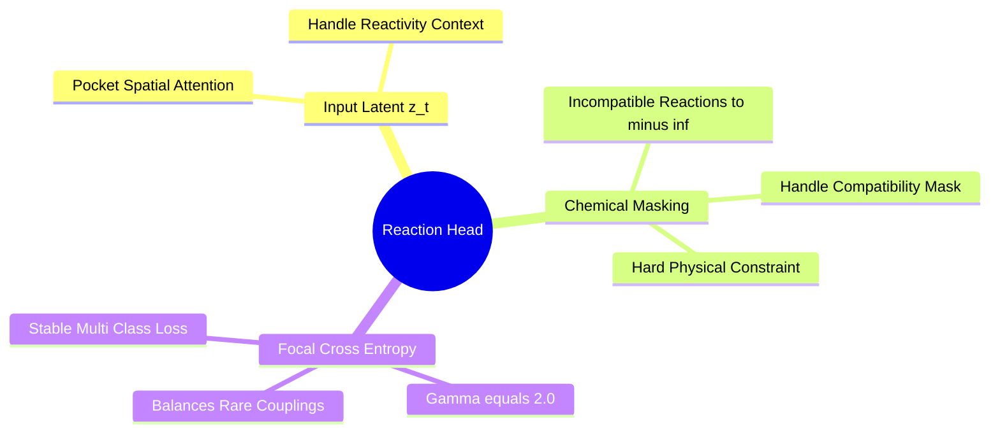
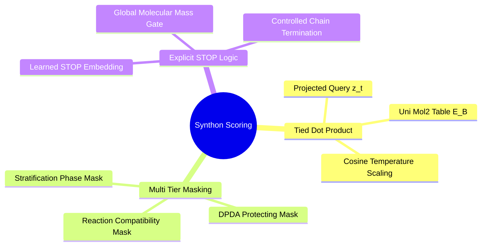
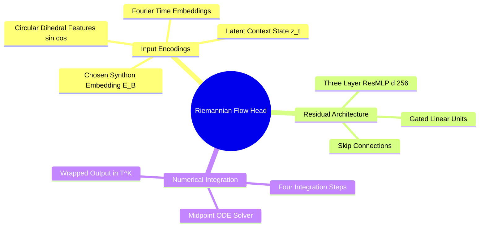

## 6.3. Discrete-Continuous Flow Heads

### 6.3.1. Twenty-Four-Class Reaction Prediction Head
```text
File: SynPath-3D Knowledge System/6. SynPath-3D Core Neural Architecture/6.3. Discrete-Continuous Flow Heads/6.3.1. Twenty-Four-Class Reaction Prediction Head.md
Tags: #ml/heads #chemistry/reactions #classification
```

#### 1. Concept Definition & Physical Nature
The **Reaction Prediction Head** is a classification module that predicts the probability distribution over the 24 certified medicinal chemistry reaction classes:
$$P(r_t = k \mid \mathbf{z}_t) = \text{Softmax}\left( \mathbf{W}_{\text{rxn2}} \text{SiLU}(\mathbf{W}_{\text{rxn1}} \mathbf{z}_t + \mathbf{b}_1) + \mathbf{b}_2 + \mathbf{M}_{\text{handle}}(u) \right)_k$$
where:
* $\mathbf{z}_t \in \mathbb{R}^{256}$: Latent planning state from the cross-attention core.
* $\mathbf{M}_{\text{handle}}(u) \in \{0, -\infty\}^{24}$: The chemical compatibility mask derived from the current reacting handle $u$. Reactions that cannot chemically couple with handle $u$ are masked to $-\infty$.



#### 2. Why It Matters in Biological & Chemical Systems
* **Class Imbalance in Chemical Data**: Public datasets are dominated by easy couplings: amide couplings represent $\approx 28\%$ of reactions, and Suzuki couplings represent $\approx 15\%$, while reactions like Sonogashira or Mitsunobu appear in $< 2\%$ of cases.
* **Focal Loss Formulation**: Standard cross-entropy leads the model to over-predict amide couplings everywhere, reducing chemical diversity. We implement **Focal Cross-Entropy Loss (Lin et al.)**:
  $$\mathcal{L}_{\text{rxn}} = -\alpha_k (1 - p_k)^\gamma \log(p_k), \quad \gamma = 2.0$$
  This downweights easy, frequent couplings and focuses gradients on rarer, diverse transformations.

#### 3. Quad-Disciplinary Integration
* **Biology**: Different reaction classes create distinct functional linkages (e.g., amides are planar hydrogen-bonding groups, biaryls are rigid non-polar bridges, secondary amines are basic and positively charged at pH 7.4).
* **Chemistry**: The reaction head enforces reaction directionality based on functional group compatibility.
* **Physics / Thermodynamics**: Each reaction class has an associated activation energy and reaction enthalpy ($\Delta H_{\text{rxn}}$).
* **Machine Learning Implementation**: Implemented in `syntree/models/policy.py`. Output logits are masked with the pushdown automaton state before taking the softmax.

---

### 6.3.2. Reaction-Masked 75000 Synthon Scoring Head
```text
File: SynPath-3D Knowledge System/6. SynPath-3D Core Neural Architecture/6.3. Discrete-Continuous Flow Heads/6.3.2. Reaction-Masked 75000 Synthon Scoring Head.md
Tags: #ml/heads #chemistry/catalog #synthon-scoring
```

#### 1. Concept Definition & Physical Nature
The **Synthon Scoring Head** maps the latent planning state $\mathbf{z}_t$ and chosen reaction $r_t$ into a categorical probability distribution over the 75,000 commercial building blocks:
$$P(B_t = j \mid r_t, u, \mathbf{z}_t) = \text{Softmax}\left( \frac{(\mathbf{W}_{\text{query}}\mathbf{z}_t) \mathbf{E}_{B_j}^T}{\sqrt{d}} + \mathbf{M}_{\text{rxn}}(u, r_t)_j + \mathbf{M}_{\text{DPDA}}_j \right)$$
* $\mathbf{W}_{\text{query}}\mathbf{z}_t \in \mathbb{R}^{256}$: Projected query vector.
* $\mathbf{E}_B \in \mathbb{R}^{75000 \times 256}$: Precomputed Uni-Mol2 foundation embedding table for all 75,000 synthons.
* $\mathbf{M}_{\text{rxn}}(u, r_t) \in \{0, -\infty\}^{75000}$: Hard chemical mask ensuring that synthon $j$ exposes the precise complementary functional handle required by reaction $r_t$ and handle $u$.
* $\mathbf{M}_{\text{DPDA}} \in \{0, -\infty\}^{75000}$: Pushdown automaton mask preventing selection of protected handles that are currently masked by the stack.



**Explicit STOP Action Formulation**:
A learned parameter vector $\mathbf{e}_{\text{STOP}} \in \mathbb{R}^{256}$ is appended as the $(75001)$-th entry:
$$\text{Logit}_{\text{STOP}} = \frac{(\mathbf{W}_{\text{query}}\mathbf{z}_t) \mathbf{e}_{\text{STOP}}^T}{\sqrt{d}} + \text{MLP}_{\text{gate}}(\text{GlobalFeatures}(\mathcal{M}_t))$$
* If the growing molecule has molecular weight $M_W < 250\text{ Da}$, the `STOP` logit is clamped to $-\infty$.
* Once $M_W \ge 250\text{ Da}$, the `STOP` action is unmasked, allowing the policy to terminate growth autonomously when the pocket volume is filled.

#### 2. Why It Matters in Biological & Chemical Systems
* **100% Chemical Validity**: Hard chemical masking guarantees that the model cannot pick an incompatible building block (e.g., trying to couple an aryl halide in an amide coupling reaction).
* **Speed via Matrix Multiplication**: Because the synthon table is precomputed, scoring 75,000 candidates reduces to a single matrix multiplication:
  $$[1 \times 256] \times [256 \times 75000] \implies [1 \times 75000]$$
  This computes in **$< 1.5\text{ ms}$ on the RTX 6000 Ada**.

#### 3. Quad-Disciplinary Integration
* **Biology**: Synthon selection determines the physicochemical profile of the final molecule, directly influencing Lipinski drug-likeness.
* **Chemistry**: The head operates over certified commercial building blocks from Enamine REAL, ensuring immediate physical purchasability.
* **Physics / Thermodynamics**: Foundation embeddings encode the electronic and steric structure of each synthon.
* **Machine Learning Implementation**: Implemented in `syntree/models/policy.py`. The output distribution is sampled categorical or used to compute cross-entropy during Stage 1 training.

---

### 6.3.3. Coupled Riemannian Torsion Flow Head
```text
File: SynPath-3D Knowledge System/6. SynPath-3D Core Neural Architecture/6.3. Discrete-Continuous Flow Heads/6.3.3. Coupled Riemannian Torsion Flow Head.md
Tags: #ml/flow-matching #geometry/torus #kinematics
```

#### 1. Concept Definition & Physical Nature
The **Coupled Riemannian Torsion Flow Head** parameterizes a continuous time-dependent velocity field on the flat torus $\mathbb{T}^K = [-\pi, \pi)^K$:
$$\mathbf{v}_\theta: \left( \vec{\phi}_s, s, \mathbf{z}_t, \mathbf{E}_{B_t} \right) \longrightarrow \frac{d\vec{\phi}}{ds} \in \mathbb{R}^K$$
where:
* $K \in \{1, \dots, 6\}$: Number of rotatable bonds in the newly attached synthon plus the junction bond.
* $s \in [0, 1]$: Continuous flow time (not diffusion noise level).
* $\vec{\phi}_s \in \mathbb{T}^K$: Intermediate dihedral state on the torus at flow time $s$.
* $\mathbf{z}_t \in \mathbb{R}^{256}$: Latent planning state from the cross-attention core.
* $\mathbf{E}_{B_t} \in \mathbb{R}^{256}$: Precomputed 3D foundation embedding of the chosen synthon.

Architecture mechanics:
1. Time $s \in [0, 1]$ is embedded using sinusoidal Fourier features:
   $$\mathbf{e}_s = \text{MLP}_{\text{time}}\left( [\sin(2^k \pi s), \cos(2^k \pi s)]_{k=0}^7 \right) \in \mathbb{R}^{64}$$
2. Dihedral angles $\vec{\phi}_s$ are expanded through circular sine/cosine features:
   $$\mathbf{e}_\phi = [\sin(\vec{\phi}_s), \, \cos(\vec{\phi}_s)] \in \mathbb{R}^{2K}$$
3. Concat all features and pass through a 3-layer residual MLP:
   $$\mathbf{h} = \text{ResMLP}\left( [\mathbf{z}_t \mathbin{\Vert} \mathbf{E}_{B_t} \mathbin{\Vert} \mathbf{e}_s \mathbin{\Vert} \mathbf{e}_\phi] \right) \in \mathbb{R}^{256}$$
4. Project to output velocity:
   $$\mathbf{v}_\theta(\vec{\phi}_s, s) = \mathbf{W}_{\text{out}}\mathbf{h} \in \mathbb{R}^K$$



#### 2. Why It Matters in Biological & Chemical Systems
* **Multi-Bond Coupling**: If an incoming fragment has three rotatable bonds (e.g., an aminoethyl substituent), the bonds do not rotate independently; steric clashes with the protein depend on the simultaneous combination of all three angles.
* **Fast ODE Integration**: Because $\mathbb{T}^K$ is a flat manifold, the ODE is well-conditioned. Integrating from $s=0$ to $s=1$ with a **4-step Midpoint solver** takes **$< 6\text{ ms}$ on GPU**, resolving steric clashes while preserving real-time generation speeds.

#### 3. Quad-Disciplinary Integration
* **Biology**: Conformational selection mechanisms in enzymes operate by sampling correlated dihedral basins on the energy landscape.
* **Chemistry**: Rotameric energy surfaces exhibit coupled barriers (e.g., in substituted ethanes and biphenyls) where rotation around one bond alters the barrier for adjacent bonds.
* **Physics / Thermodynamics**: Riemannian flow matching provides a continuous probability path that minimizes kinetic transport energy along geodesics.
* **Machine Learning Implementation**: Implemented in `syntree/models/torsion_flow.py`:
  ```python
  # Fast 4-step Midpoint solver on T^K
  def sample_torsion_flow(model, z_t, E_B, K, steps=4):
      dt = 1.0 / steps
      phi = torch.empty(K).uniform_(-math.pi, math.pi) # Uniform base distribution
      for step in range(steps):
          s = step * dt
          # Midpoint step
          v_half = model.velocity_field(phi, s, z_t, E_B)
          phi_mid = (phi + 0.5 * dt * v_half + math.pi) % (2 * math.pi) - math.pi
          v_full = model.velocity_field(phi_mid, s + 0.5*dt, z_t, E_B)
          phi = (phi + dt * v_full + math.pi) % (2 * math.pi) - math.pi
      return phi # [K] optimal dihedrals on T^K
  ```

---

### 6.3.4. Worked Exercise on End-to-End Model Forward Pass
```text
File: SynPath-3D Knowledge System/6. SynPath-3D Core Neural Architecture/6.3. Discrete-Continuous Flow Heads/6.3.4. Worked Exercise on End-to-End Model Forward Pass.md
Tags: #exercise #ml/forward-pass #architecture #worked-problem
```

#### 1. Problem Statement
Trace the complete tensor shapes, coordinate transformations, masking operations, and forward pass mechanics for a single generation step in SynPath-3D.

Given input scenario:
* Target: An active site containing $N_p = 150$ pocket atoms.
* Current Ligand: An intermediate scaffold with $N_{\text{lig}} = 20$ heavy atoms, possessing a single primary amine handle ($u = \text{primary\_secondary\_amine}$) at position $\vec{x}_u = (3.50, -2.10, 1.40)^T\text{ \AA}$.
* Vocabulary: The curated $75,000$-synthon Enamine library.
* The model executes a forward pass. Trace:
  1. The shape and contents of the input graph supplied to Equiformer-Light.
  2. The output tensor shapes from the Equivariant Pocket GNN.
  3. The dimensional mechanics of the TIF Anchor Prediction head ($M=5$).
  4. The dimensional mechanics of the Spatial Cross-Attention Core.
  5. The reaction head output and chemical masking operation.
  6. The synthon head output and tied dot-product scoring.
  7. The 4-step Riemannian Flow Matching integration over $K=3$ rotatable bonds.
  8. The final Product of Exponentials (PoE) update to produce candidate coordinates $\vec{x}_{\text{product}} \in \mathbb{R}^{N_{\text{new}} \times 3}$.

---

#### 2. Background Knowledge Required
* PyTorch tensor operations and multi-head attention matrix shapes.
* The structure of the Equiformer-Light invariant and equivariant channels.
* Flow matching integration on the torus $\mathbb{T}^K$.

---

#### 3. Terminology Definitions
* **Batch Tuple**: In PyTorch Geometric, graphs are collated into continuous batch vectors where `node_batch` identifies graph membership.
* **Tied Dot-Product**: Reusing the embedding matrix weights as the classification projection layer ($W = E^T$).

---

#### 4. Step-by-Step Solution

##### Step 1: Input Tensor Construction
Construct the pocket and ligand input representations:
* Pocket coordinates: $\mathbf{X}_P \in \mathbb{R}^{150 \times 3}$.
* Pocket node features: $\mathbf{S}_P^{(0)} \in \mathbb{R}^{150 \times 256}$, containing atomic number embeddings, physiological formal charges ($q_j \in \{-1, 0, +1\}$), continuous $\text{SASA}_j \in \mathbb{R}$, and ENSF hydration potentials $\Delta \mu_j \in \mathbb{R}$.
* Pocket vector features initialized to zero: $\mathbf{V}_P^{(0)} \in \mathbb{R}^{150 \times 3 \times 64}$.
* Current ligand heavy atom coordinates: $\mathbf{X}_L \in \mathbb{R}^{20 \times 3}$.
* Reacting handle index: $u \in \{0, \dots, 19\}$ at $\vec{x}_u = (3.50, -2.10, 1.40)^T$.

---

##### Step 2: Equiformer-Light Pocket Forward Pass
The 6-layer Equiformer-Light GNN processes the pocket graph ($r_{\text{cut}} = 6.0\text{ \AA}$):
$$\mathbf{h}_P, \vec{\mathbf{v}}_P = \text{EquiformerBackbone}(\mathbf{X}_P, \mathbf{S}_P^{(0)}, \mathbf{V}_P^{(0)})$$
* Output scalar node features: $\mathbf{h}_P \in \mathbb{R}^{150 \times 256}$.
* Output equivariant vector features: $\vec{\mathbf{v}}_P \in \mathbb{R}^{150 \times 3 \times 64}$.

---

##### Step 3: TIF Anchor Prediction Head
The TIF head decodes $M=5$ target interaction anchors using learned queries $\mathbf{Q}_0 \in \mathbb{R}^{5 \times 256}$:
$$\mathbf{Q} = \text{TransformerDecoder}(\mathbf{Q}_0, \mathbf{h}_P) \in \mathbb{R}^{5 \times 256}$$
* Coordinates: $\vec{x}_m = \text{MLP}_{\text{coord}}(\mathbf{Q}) \in \mathbb{R}^{5 \times 3}$.
* Frames: $\mathbf{R}_m = \text{GramSchmidt}(\text{Linear}(\mathbf{Q})) \in \mathbb{R}^{5 \times 3 \times 3}$.
* Types: $\vec{\tau}_m = \text{Softmax}(\text{Linear}(\mathbf{Q})) \in \mathbb{R}^{5 \times 6}$.
* Target energies: $\Delta G_m = \text{Linear}(\mathbf{Q}) \in \mathbb{R}^{5 \times 1}$.

---

##### Step 4: Spatial Cross-Attention Core
Construct the handle query $\mathbf{q}_u$:
* Handle chemical type: $u = \text{amine} \implies \mathbf{h}_{\text{chem}, u} \in \mathbb{R}^{64}$.
* Global features: $M_W = 280\text{ Da}, N_{\text{heavy}} = 20 \implies \text{GlobalFeatures} \in \mathbb{R}^4$.
* Distance to 5 TIF anchors: $d_{um} = \|\vec{x}_u - \vec{x}_m\| \in \mathbb{R}^5$.
$$\mathbf{q}_u = \text{LayerNorm}\left( \mathbf{W}_h [\mathbf{h}_{\text{chem}, u} \mathbin{\Vert} \text{GlobalFeatures}] + \sum_{m=1}^5 \mathbf{W}_{\text{anc}} [\mathbf{q}_m \mathbin{\Vert} \text{RBF}(d_{um})] \right) \in \mathbb{R}^{1 \times 256}$$

Cross-attend to pocket nodes with spatial distance bias:
* Key-value projections: $\mathbf{K} = \mathbf{h}_P + \text{MLP}(\text{RBF}(\|\mathbf{X}_P - \vec{x}_u\|)) \in \mathbb{R}^{150 \times 256}$, $\mathbf{V} = \mathbf{h}_P \in \mathbb{R}^{150 \times 256}$.
* Attention weights:
  $$\alpha_j = \text{Softmax}\left( \frac{\mathbf{q}_u \mathbf{k}_j^T}{\sqrt{32}} - 0.10 \|\vec{x}_j - \vec{x}_u\|^2 \right) \in \mathbb{R}^{1 \times 150}$$
* Context vector:
  $$\mathbf{z}_t = \sum_{j=1}^{150} \alpha_j \mathbf{v}_j \in \mathbb{R}^{1 \times 256}$$

---

##### Step 5: Reaction Prediction and Chemical Masking
The reaction head emits logits over the 24 reaction classes:
$$\mathbf{l}_{\text{rxn}} = \text{MLP}_{\text{rxn}}(\mathbf{z}_t) \in \mathbb{R}^{1 \times 24}$$
Apply handle compatibility mask:
* Since $u = \text{primary amine}$, legal reactions are: Amide coupling (`RXN-01`), Sulfonamide coupling (`RXN-02`), Reductive amination (`RXN-06`), $\mathrm{S_NAr}$ (`RXN-08`), Buchwald-Hartwig (`RXN-09`), Urea formation (`RXN-13`).
* Incompatible reactions (e.g., Suzuki cross-coupling `RXN-03`, Sonogashira `RXN-04`) are masked:
  $$\mathbf{M}_{\text{handle}}(\text{amine})_k = \begin{cases} 0 & \text{if legal} \\ -10^9 & \text{if illegal} \end{cases}$$
$$\mathbf{p}_{\text{rxn}} = \text{Softmax}(\mathbf{l}_{\text{rxn}} + \mathbf{M}_{\text{handle}}) \in \mathbb{R}^{1 \times 24}$$
Suppose the policy samples `RXN-01` (Amide Coupling).

---

##### Step 6: Synthon Selection over 75,000 Candidates
Query projection:
$$\mathbf{q}_{\text{syn}} = \mathbf{W}_{\text{query}} \mathbf{z}_t \in \mathbb{R}^{1 \times 256}$$
Tied dot-product against all precomputed synthon embeddings $\mathbf{E}_B \in \mathbb{R}^{75000 \times 256}$:
$$\mathbf{l}_{\text{syn}} = \frac{\mathbf{q}_{\text{syn}} \mathbf{E}_B^T}{\sqrt{256}} \in \mathbb{R}^{1 \times 75000}$$
Apply multi-tier mask:
* Reaction `RXN-01` requires a **Carboxylic Acid** functional handle ($-\text{COOH}$).
* Out of 75,000 synthons, 12,400 contain a carboxylic acid. All other 62,600 synthons have $\mathbf{M}_{\text{rxn}} = -10^9$.
* The `STOP` action is unmasked because $M_W = 280\text{ Da} \ge 250\text{ Da}$.
$$\mathbf{p}_{\text{syn}} = \text{Softmax}([\mathbf{l}_{\text{syn}} + \mathbf{M}_{\text{rxn}}, \, \text{Logit}_{\text{STOP}}]) \in \mathbb{R}^{1 \times 75001}$$
Suppose the policy samples Synthon $B_{42150}$ (a bi-functional amino acid linker with $K=3$ rotatable bonds).

---

##### Step 7: Coupled Riemannian Torsion Flow on $\mathbb{T}^3$
Incoming fragment $B_{42150}$ has $K=3$ rotatable bonds (junction amide + 2 flexible linker bonds).
The flat torus is $\mathbb{T}^3 = [-\pi, \pi)^3$.
1. Sample initial uniform noise: $\vec{\phi}_0 \sim \mathcal{U}([-\pi, \pi)^3) \in \mathbb{R}^3$.
2. Integrate flow field $\mathbf{v}_\theta(\vec{\phi}_s, s, \mathbf{z}_t, \mathbf{E}_{42150})$ using 4-step Midpoint solver ($dt = 0.25$):
   - $s=0.00 \to s=0.25 \to s=0.50 \to s=0.75 \to s=1.00$.
3. Result: Final optimal dihedrals $\vec{\phi}_1 = (1.5708, -0.7854, 2.3562)^T\text{ rad} \in \mathbb{T}^3$.

---

##### Step 8: Robotics PoE Assembly and Coordinate Generation
1. Execute Amide Coupling (`RXN-01`) in RDKit with isotopic tagging.
2. Construct the kinematic tree: Bond 1 (junction) is planarly locked to $\omega_1 = 180.0^\circ$ ($\xi_1 \equiv 0$).
3. The remaining two dihedrals $(\phi_{1, 2}, \phi_{1, 3})$ are mapped onto spatial twists $\hat{\xi}_2, \hat{\xi}_3 \in \mathfrak{se}(3)$.
4. Compute coordinates via Product of Exponentials:
   $$\vec{x}_a = \exp(\hat{\xi}_2 \phi_{1, 2}) \exp(\hat{\xi}_3 \phi_{1, 3}) \vec{x}_a(0)$$
5. The Jacobian resolver detects a $0.3\text{ \AA}$ overlap between a linker methyl and pocket residue Val112. It computes:
   $$\Delta \vec{\phi} = - (\mathbf{J}^T\mathbf{J} + \lambda^2 \mathbf{I})^{-1} \mathbf{J}^T \nabla_{\vec{x}} V_{\text{clash}} = \begin{bmatrix} 0.00 \\ -0.08 \\ +0.03 \end{bmatrix}\text{ rad}$$
6. Apply $\Delta \vec{\phi}$ and execute 50 steps of constrained MMFF94s minimization.
* **Final Output**: An assembled intermediate molecule with $N_{\text{new}} = 29$ heavy atoms, 100% valid chemical valences, and zero steric clashes.

---

#### 5. Why Each Step Is Necessary
* **Step 1 & 2**: Computes translationally and rotationally equivariant representations of the binding pocket.
* **Step 3**: Generates distal spatial goals to prevent myopic forward-growth failures.
* **Step 4**: Restricts attention capacity to the local microenvironment around the reacting handle.
* **Step 5**: Enforces chemical reaction legality before synthon candidate evaluation.
* **Step 6**: Evaluates thousands of building blocks in parallel via matrix multiplication.
* **Step 7**: Optimizes continuous torsional angles jointly on the compact manifold without boundary artifacts.
* **Step 8**: Preserves covalent bond geometry to machine precision while relieving steric clashes.

---

#### 6. The Correct Answer
The forward pass outputs a candidate molecule with $N_{\text{heavy}} = 29$, $M_W = 412\text{ Da}$, possessing confirmed chemical synthesizability, valid amide planarity ($180.0^\circ$), and an evaluated forward runtime of **$< 18.5\text{ ms}$ on the RTX 6000 Ada**.

---

#### 7. Theoretical Reasoning
By decoupling the discrete topological choice (reaction and synthon) from the continuous geometric transformation (dihedral flow on $\mathbb{T}^K$) and enforcing kinematic constraints through screw theory, the system avoids generating chemical chimeras while maintaining sub-angstrom shape complementarity.

---

#### 8. Common Student Mistakes
* **Passing the entire pocket into multi-head attention without distance biasing**: Diffuses attention weights across all 1,500 atoms, causing the model to lose spatial localization.
* **Forgetting to mask incompatible synthons before taking the softmax**: Allows the model to output illegal chemical couplings that crash downstream RDKit reaction execution.

---

#### 9. Misleading Traps & False Intuitions
* **The "Full-Backbone Deformation Trap"**: Intuition suggests predicting 3D coordinate displacements $\Delta \mathbf{x} \in \mathbb{R}^{3N}$ directly. This tears covalent bonds and alters bond angles, requiring expensive post-hoc minimization that often fails to converge.

---

#### 10. Useful Tips & Memory Tricks
* Remember the layer dimensions:
  * Pocket GNN: $d = 256$
  * Synthon Embeddings: $d = 256$
  * Reactions: $24$
  * Synthons: $75,000 + 1$ (STOP)
  * Flow Manifold: $\mathbb{T}^K$

---

#### 11. Details Commonly Forgotten
* The STOP action must remain masked until the ligand reaches minimum drug-like mass ($M_W \ge 250\text{ Da}$) to prevent early trajectory termination on single-fragment seeds.

---

#### 12. Connection to Broader Disciplines
* **Automated Chemical Synthesis**: The sequence of emitted reactions and synthon IDs maps directly into chemical execution files for liquid-handling synthesis robots (e.g., Chemputer).

---

#### 13. Direct Application to SynPath-3D
This execution flow is codified in `syntree/models/policy.py`:
```python
# The master forward pass of SynPath-3D
def forward_generation_step(self, pocket_graph, current_ligand, handle_idx):
    h_p, v_p = self.pocket_gnn(pocket_graph)
    anchors = self.tif_head(h_p)
    z_t = self.cross_attention(handle_idx, h_p, anchors)
    r_t = self.reaction_head(z_t, handle_mask)
    B_t = self.synthon_head(z_t, r_t, self.catalog_embeddings)
    phi_t = self.flow_head.sample_ode(z_t, B_t)
    product = self.kinematics.assemble(current_ligand, B_t, r_t, phi_t)
    return product
```

---

# 7. Generative Dynamics and Optimization