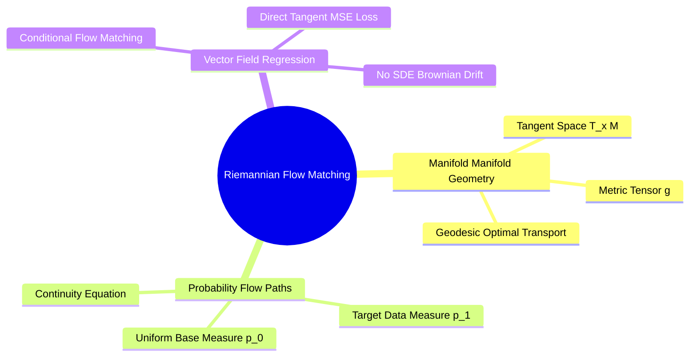
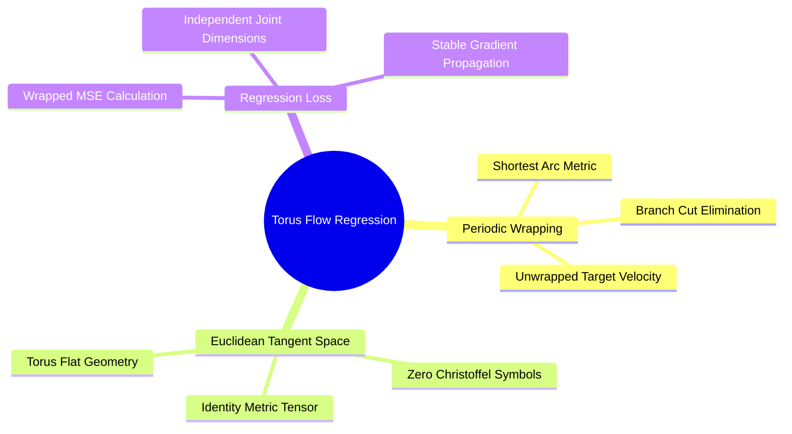
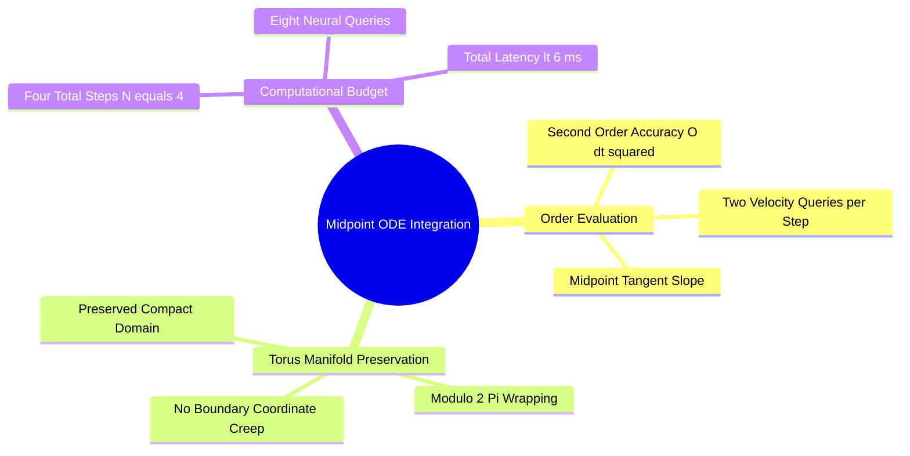

## 7.1. Riemannian Flow Matching

### 7.1.1. Continuous Normalizing Flows on Riemannian Manifolds
```text
File: SynPath-3D Knowledge System/7. Generative Dynamics and Optimization/7.1. Riemannian Flow Matching/7.1.1. Continuous Normalizing Flows on Riemannian Manifolds.md
Tags: #ml/flow-matching #math/riemannian-geometry #generative-models
```

#### 1. Concept Definition & Physical Nature
A **Continuous Normalizing Flow (CNF)** on a Riemannian manifold $(\mathcal{M}, \mathbf{g})$ is a generative model that pushes forward a simple base probability density $p_0$ (e.g., the uniform Haar measure on $\mathcal{M}$) to an unknown target data density $p_1$ via an ordinary differential equation (ODE) defined by a time-dependent vector field $\mathbf{v}_t$:
$$\frac{d\mathbf{x}}{dt} = \mathbf{v}_t(\mathbf{x}_t), \quad \mathbf{x}_0 \sim p_0, \quad \mathbf{x}_t \in \mathcal{M}, \quad \mathbf{v}_t(\mathbf{x}_t) \in T_{\mathbf{x}_t}\mathcal{M}$$
The evolution of the probability density $p_t(\mathbf{x})$ along the flow trajectory is governed by the **continuity equation on manifolds**:
$$\frac{\partial p_t(\mathbf{x})}{\partial t} + \text{div}_{\mathbf{g}}\left( p_t(\mathbf{x}) \mathbf{v}_t(\mathbf{x}) \right) = 0$$
where $\text{div}_{\mathbf{g}}$ is the Riemannian divergence operator:
$$\text{div}_{\mathbf{g}}(\mathbf{v}) = \frac{1}{\sqrt{\det \mathbf{g}}} \sum_{i} \frac{\partial}{\partial x^i} \left( \sqrt{\det \mathbf{g}} \, v^i \right)$$



**Riemannian Flow Matching (RFM)** (Lipman et al., 2023; Chen & Lipman, 2024) sidesteps the expensive numerical score-matching equations and unstable stochastic differential equations (SDEs) of diffusion models. Instead, it regresses the neural vector field $\mathbf{v}_\theta(\mathbf{x}, t)$ directly against the analytical tangent vector of a **conditional probability path** $p_t(\mathbf{x} \mid \mathbf{x}_1)$:
$$\mathcal{L}_{\text{RFM}}(\theta) = \mathbb{E}_{t \sim \mathcal{U}(0,1), \, \mathbf{x}_0 \sim p_0, \, \mathbf{x}_1 \sim p_1} \left[ \left\| \mathbf{v}_\theta(\mathbf{x}_t, t) - \frac{d}{dt}\gamma_t(\mathbf{x}_0, \mathbf{x}_1) \right\|_{\mathbf{g}}^2 \right]$$
where $\gamma_t(\mathbf{x}_0, \mathbf{x}_1)$ is the unique **geodesic curve** on $\mathcal{M}$ satisfying $\gamma_0 = \mathbf{x}_0$ and $\gamma_1 = \mathbf{x}_1$, and $\|\mathbf{w}\|_{\mathbf{g}}^2 = \mathbf{g}(\mathbf{w}, \mathbf{w})$ is the Riemannian metric norm.

#### 2. Why It Matters in Biological & Chemical Systems
* **Deterministic, Trajectory-Free Generation**: Unlike diffusion models that require 50 to 1,000 noisy Langevin steps, Flow Matching follows straight geodesic paths in probability space. It produces clean conformations in **4 to 10 integration steps**.
* **Zero Chemical Chimera Generation**: Because the flow is restricted to the manifold $\mathbb{T}^K$, the model cannot translate atoms arbitrarily in Cartesian space. Bond lengths and angles are conserved along the flow path.

#### 3. Quad-Disciplinary Integration
* **Biology**: Conformational transitions between active and inactive enzyme states proceed along minimum free-energy paths on the structural manifold.
* **Chemistry**: Reaction coordinates define the one-dimensional minimum-energy path on a multi-dimensional Born-Oppenheimer potential energy surface.
* **Physics / Thermodynamics**: Riemannian flow matching realizes optimal transport under the 2-Wasserstein metric $W_2(p_0, p_1)$, minimizing the kinetic transport energy:
  $$\mathcal{W}_2^2(p_0, p_1) = \inf_{\mathbf{v}_t} \int_0^1 \int_{\mathcal{M}} \|\mathbf{v}_t(\mathbf{x})\|_{\mathbf{g}}^2 \, p_t(\mathbf{x}) \, d\text{Vol}_{\mathbf{g}} \, dt$$
* **Machine Learning Implementation**: Implemented in `syntree/models/torsion_flow.py`.

---

### 7.1.2. Vector Field Regression on Flat Tori
```text
File: SynPath-3D Knowledge System/7. Generative Dynamics and Optimization/7.1. Riemannian Flow Matching/7.1.2. Vector Field Regression on Flat Tori.md
Tags: #ml/flow-matching #math/torus #geometry
```

#### 1. Concept Definition & Physical Nature
On the flat $K$-torus $\mathbb{T}^K = [-\pi, \pi)^K$, the metric tensor is the identity matrix $\mathbf{g}_{ij} = \delta_{ij}$, and Christoffel symbols vanish ($\Gamma^k_{ij} \equiv 0$). Consequently, the geodesic curve between two points $\vec{\phi}_0, \vec{\phi}_1 \in \mathbb{T}^K$ is a straight line evaluated under periodic boundary conditions:
$$\gamma_t(\vec{\phi}_0, \vec{\phi}_1) = \vec{\phi}_0 + t \cdot \text{wrap}(\vec{\phi}_1 - \vec{\phi}_0) \pmod{2\pi}$$
where the circular wrapping function maps angular differences to the minimum distance on the circle:
$$\text{wrap}(\Delta) = (\Delta + \pi \pmod{2\pi}) - \pi \in [-\pi, \pi)$$

The time derivative of this geodesic is constant:
$$\frac{d}{dt}\gamma_t(\vec{\phi}_0, \vec{\phi}_1) = \text{wrap}(\vec{\phi}_1 - \vec{\phi}_0) = \mathbf{u}^* \in \mathbb{R}^K$$

```text
Geodesic Interpolation on the Flat 1-Torus (Circle S¹):
               φ₁ = -170° (-2.97 rad)
                     ▲
                     │ Shortest geodesic wraps around boundary!
                     │ Length = 30° (0.52 rad)
                     ●
               φ₀ = +160° (+2.79 rad)
               
   Unwrapped Distance = |160° - (-170°)| = 330° (Incorrect!)
   Wrapped Geodesic   = wrap(-170° - 160°) = +30° (Correct!)
```



The **Torus Flow Matching Loss** is:
$$\mathcal{L}_{\text{torus}}(\theta) = \mathbb{E}_{t, \vec{\phi}_0, \vec{\phi}_1} \left[ \sum_{k=1}^K \min\left( |v_{\theta, k}(\vec{\phi}_t, t) - u_k^*|, \, 2\pi - |v_{\theta, k}(\vec{\phi}_t, t) - u_k^*| \right)^2 \right]$$

#### 2. Why It Matters in Biological & Chemical Systems
* **Elimination of Branch-Cut Discontinuities**: If a loss does not account for circular topology, an angle of $+179^\circ$ and $-179^\circ$ will generate a massive error of $358^\circ$, driving large gradient spikes through the network. The wrapped metric measures the true distance ($2^\circ$), stabilizing training.
* **Fast Sampling**: The flat geometry allows the velocity field to be integrated using standard numerical Runge-Kutta solvers, wrapping the state modulo $2\pi$ after each step without requiring manifold projections.

#### 3. Quad-Disciplinary Integration
* **Biology**: Protein conformational transitions between sub-states (e.g., open vs. closed loop states) correspond to geodesic flows across $\mathbb{T}^K$.
* **Chemistry**: Barrier crossing in rotatable bonds follows minimum-action trajectories across the multi-dimensional torsional landscape.
* **Physics / Thermodynamics**: The uniform distribution $p_0 = \mathcal{U}(\mathbb{T}^K)$ is the maximum entropy state for molecular dihedrals in the infinite-temperature limit ($T \to \infty$).
* **Machine Learning Implementation**: Implemented in `syntree/engine/losses.py`:
  ```python
  def torus_flow_loss(v_pred, phi_0, phi_1):
      # Compute wrapped target velocity
      target_v = torch.remainder(phi_1 - phi_0 + math.pi, 2 * math.pi) - math.pi
      # Wrapped difference between predicted velocity and target
      diff = torch.abs(v_pred - target_v)
      wrapped_diff = torch.minimum(diff, 2 * math.pi - diff)
      return torch.mean(wrapped_diff ** 2)
  ```

---

### 7.1.3. Numerical ODE Integration via Midpoint Solvers
```text
File: SynPath-3D Knowledge System/7. Generative Dynamics and Optimization/7.1. Riemannian Flow Matching/7.1.3. Numerical ODE Integration via Midpoint Solvers.md
Tags: #math/ode-solvers #numerical-methods #flow-matching
```

#### 1. Concept Definition & Physical Nature
To generate conformations at inference time, the continuous vector field $\mathbf{v}_\theta(\vec{\phi}, t)$ is integrated from $t=0$ to $t=1$. 

While a first-order Euler method introduces truncation errors of order $\mathcal{O}(\Delta t)$, SynPath-3D implements a **Second-Order Runge-Kutta (Midpoint) Solver on $\mathbb{T}^K$**:
$$\text{For step } n \in \{0, 1, \dots, N_{\text{steps}}-1\}, \quad \Delta t = \frac{1}{N_{\text{steps}}}, \quad t_n = n \Delta t:$$
1. Evaluate velocity at the start of the interval:
   $$\mathbf{k}_1 = \mathbf{v}_\theta\left( \vec{\phi}_n, \, t_n \right) \in \mathbb{R}^K$$
2. Compute the state at the midpoint using Euler integration:
   $$\vec{\phi}_{n + 1/2} = \text{wrap}\left( \vec{\phi}_n + \frac{\Delta t}{2} \mathbf{k}_1 \right) \in \mathbb{T}^K$$
3. Evaluate velocity at the midpoint:
   $$\mathbf{k}_2 = \mathbf{v}_\theta\left( \vec{\phi}_{n + 1/2}, \, t_n + \frac{\Delta t}{2} \right) \in \mathbb{R}^K$$
4. Update the state across the full step using the midpoint velocity:
   $$\vec{\phi}_{n+1} = \text{wrap}\left( \vec{\phi}_n + \Delta t \, \mathbf{k}_2 \right) \in \mathbb{T}^K$$
The local truncation error is $\mathcal{O}(\Delta t^3)$, and the global accumulation error is $\mathcal{O}(\Delta t^2)$.



#### 2. Why It Matters in Biological & Chemical Systems
* **Efficiency vs. Accuracy Balance**: Higher-order adaptive solvers (e.g., Dormand-Prince RK45) require 20 to 50 function evaluations, adding latency to the sampling loop.
* Because flow-matching trajectories on $\mathbb{T}^K$ are regularized toward straight lines during training, **a fixed 4-step Midpoint solver ($N_{\text{steps}} = 4$, requiring 8 neural network evaluations) achieves an angular error $< 1.5^\circ$**, keeping sampling latency under **$6\text{ ms}$ per synthon attachment**.

#### 3. Quad-Disciplinary Integration
* **Biology**: Symplectic and velocity-Verlet numerical integrators are used in molecular dynamics simulations to conserve energy over microsecond biological trajectories.
* **Chemistry**: The midpoint method accurately tracks smooth conformational changes along reaction coordinates without numerical drift.
* **Physics / Thermodynamics**: Symplectic integrators preserve phase-space volume (Liouville's theorem) in Hamiltonian systems.
* **Machine Learning Implementation**: Implemented in `syntree/models/torsion_flow.py`:
  ```python
  def integrate_midpoint_torus(flow_net, phi_init, z_context, E_B, steps=4):
      dt = 1.0 / steps
      phi = phi_init
      for i in range(steps):
          t = i * dt
          k1 = flow_net(phi, t, z_context, E_B)
          phi_mid = (phi + 0.5 * dt * k1 + math.pi) % (2 * math.pi) - math.pi
          k2 = flow_net(phi_mid, t + 0.5 * dt, z_context, E_B)
          phi = (phi + dt * k2 + math.pi) % (2 * math.pi) - math.pi
      return phi
  ```