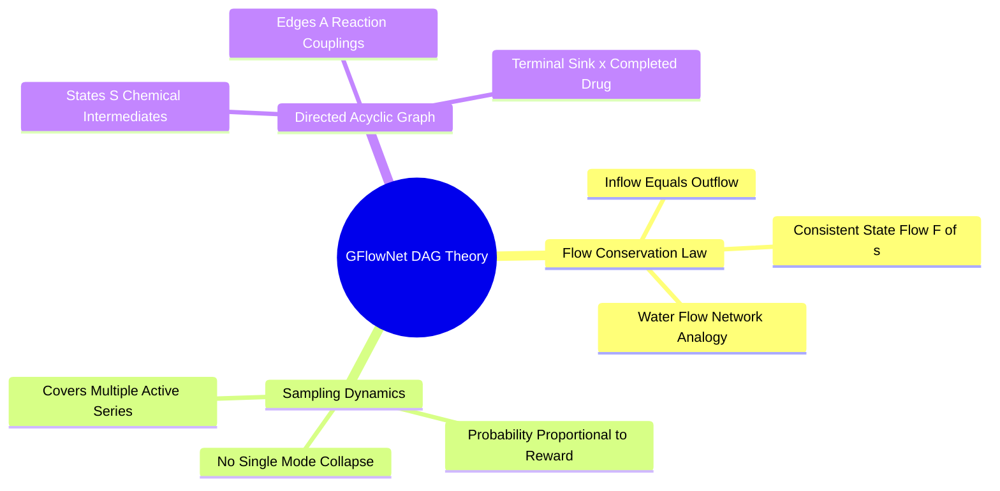
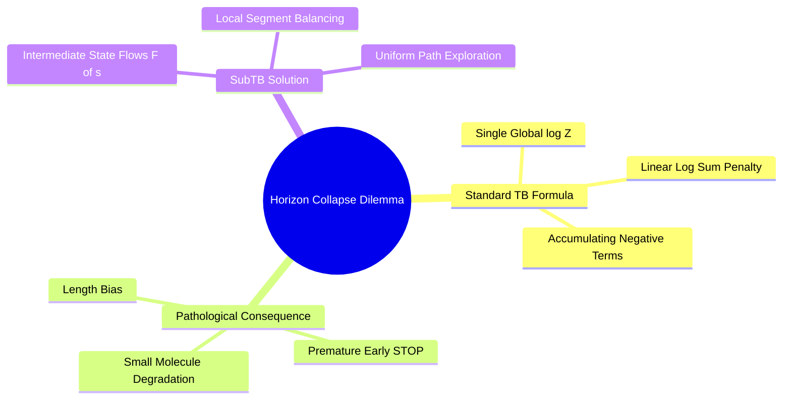
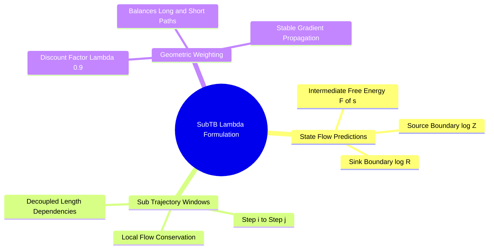

## 7.2. Trajectory-Balance GFlowNets

### 7.2.1. Generative Flow Networks on Discrete Synthesis DAGs
```text
File: SynPath-3D Knowledge System/7. Generative Dynamics and Optimization/7.2. Trajectory Balance GFlowNets/7.2.1. Generative Flow Networks on Discrete Synthesis DAGs.md
Tags: #ml/gflownet #rl/discrete-dag #thermodynamics
```

#### 1. Concept Definition & Physical Nature
A **Generative Flow Network (GFlowNet)**, introduced by Emmanuel Bengio, Yoshua Bengio, et al. (2021), is an amortized variational inference algorithm that frames discrete object generation as a continuous flow network on a Directed Acyclic Graph (DAG) $\mathcal{G} = (\mathcal{S}, \mathcal{A})$.

Unlike standard Reinforcement Learning (which aims to find the single optimal trajectory that maximizes expected reward $\max_\pi \mathbb{E}[R]$), a GFlowNet trains a stochastic policy $P_F$ to **sample discrete objects $x \in \mathcal{X}$ with probability strictly proportional to a non-negative unnormalized reward function $R(x)$**:
$$P(x) = \frac{R(x)}{Z}, \quad Z = \sum_{x' \in \mathcal{X}} R(x')$$
where $Z$ is the partition function.

```text
The GFlowNet Paradigm Shift:
Standard RL (PPO) ──► Greedy Mode Collapse    GFlowNet ──► Multi-Modal Sampling
      Reward R(x)                                 Reward R(x)
          ▲                                           ▲
          │    Single Peak Selected                   │   Peak 1    Peak 2    Peak 3
          │         ┌──┐                              │    ┌──┐      ┌──┐      ┌──┐
          │         │  │                              │    │  │      │  │      │  │
          └─────────┴──┴────────► x                   └────┴──┴──────┴──┴──────┴──┴──► x
     (Ignores remaining active series)            (Samples all series proportional to R)
```



Physical Analogy:
A GFlowNet treats state transitions as water flowing through a network of pipes. The total fluid entering the system at the source state $s_0$ is the partition function $Z$. The fluid branches at each intermediate state $s_t$ according to forward transition probabilities $P_F(s_{t+1} \mid s_t)$. At the terminal states $x$, the exiting fluid flux matches the physical reward $R(x)$.

#### 2. Why It Matters in Biological & Chemical Systems
* **Solving Mode Collapse**: Drug discovery requires discovering multiple distinct chemical series. If an algorithm finds one high-affinity scaffold and collapses onto it, the campaign fails if that scaffold later exhibits toxicity, poor solubility, or patent conflicts.
* GFlowNets sample diverse, active scaffolds: if an active site accommodates both an aminopyrimidine series ($R=100$) and a quinazoline series ($R=50$), a GFlowNet will sample the aminopyrimidine series twice as often as the quinazoline series, exploring both chemical spaces.

#### 3. Quad-Disciplinary Integration
* **Biology**: Biological evolution maintains genetic diversity across populations to survive environmental shifts, rather than selecting a single genotype.
* **Chemistry**: The equilibrium distribution of chemical species in a reaction network follows Boltzmann statistics:
  $$P(\text{Species } i) \propto \exp\left(-\frac{\Delta G_i^\circ}{k_B T}\right)$$
* **Physics / Thermodynamics**: The GFlowNet balance condition is mathematically equivalent to the Master Equation governing non-equilibrium stationary states in statistical mechanics.
* **Machine Learning Implementation**: Implemented in `syntree/engine/gflownet_align.py`. The policy network outputs forward transition probabilities $P_F(a_t \mid s_t)$ over the 24 reaction classes and 75k synthons.

---

### 7.2.2. The Variable-Length Horizon Dilemma
```text
File: SynPath-3D Knowledge System/7. Generative Dynamics and Optimization/7.2. Trajectory Balance GFlowNets/7.2.2. The Variable-Length Horizon Dilemma.md
Tags: #ml/gflownet #theory/length-bias #sub-tb
```

#### 1. Concept Definition & Physical Nature
The standard **Trajectory Balance (TB) objective** (Malkin et al., 2022) trains a GFlowNet by minimizing the squared log-ratio between forward trajectory flow and backward boundary conditions:
$$\mathcal{L}_{\text{TB}}(\tau) = \left( \log Z_\theta + \sum_{t=0}^{T-1} \log P_F(s_{t+1} \mid s_t) - \log R(x) - \sum_{t=1}^T \log P_B(s_{t-1} \mid s_t) \right)^2$$

**The Variable-Length Horizon Collapse**:
In forward molecular synthesis, trajectory length varies: a molecule can be completed in $T=1$ step (attaching a single large cap to a seed) or $T=4$ steps (attaching two linkers, a hub, and a cap).

Because every forward probability $P_F(s_{t+1} \mid s_t) < 1$, its logarithm is strictly negative: $\log P_F < 0$.
The sum of log-probabilities scales linearly with trajectory length:
$$\sum_{t=0}^{T-1} \log P_F(s_{t+1} \mid s_t) \approx - T \cdot \langle |\log P_F| \rangle$$
A 4-step trajectory accumulates four negative log-terms, while a 1-step trajectory accumulates only one:
$$\text{For } T=4: \quad \log Z - 4 \alpha \approx \log R$$
$$\text{For } T=1: \quad \log Z - 1 \alpha \approx \log R$$

```text
The Length Penalty Collapse in Standard TB:
   Trajectory A (T=1 Step):  log Z + (-3.2)            = log R  ──► High Probability
   Trajectory B (T=4 Steps): log Z + (-3.2 - 2.8 - 3.5 - 3.1) = log R  ──► Penalized!
   CONSEQUENCE: Model artificially terminates growth prematurely (MW < 200 Da).
```



Under standard TB, the global normalizer $\log Z_\theta$ cannot balance both equations simultaneously. The network resolves this tension by **penalizing longer trajectories**, terminating molecular growth prematurely (`STOP` action at $T=1$) and generating small, undersized fragments ($M_W < 200\text{ Da}$) that fail to occupy the binding cavity.

#### 2. Why It Matters in Biological & Chemical Systems
Drug molecules must achieve sufficient molecular weight ($M_W \approx 350\text{--}500\text{ Da}$) and functional complexity to fill biological binding clefts and establish potency ($K_d < 10\text{ nM}$). If an objective function inherently penalizes longer synthesis routes, the model will produce fragment-like molecules with low target affinity.

#### 3. Quad-Disciplinary Integration
* **Biology**: Natural biopolymers (proteins, DNA) use dedicated chain elongation factors to prevent premature termination during translation.
* **Chemistry**: Total synthesis planning balances step count against overall yield: convergent synthetic routes with 4 steps often provide higher practical yields than linear 2-step sequences with difficult purifications.
* **Physics / Thermodynamics**: In path integral formulations, trajectory action scales with path length; systems penalize longer paths unless compensated by potential energy gradients.
* **Machine Learning Implementation**: Addressed by replacing standard global Trajectory Balance with **Sub-Trajectory Balance ($\text{SubTB}(\lambda)$)** in [[7.2.3. Sub-Trajectory Balance SubTB Formulation]].

---

### 7.2.3. Sub-Trajectory Balance SubTB Formulation
```text
File: SynPath-3D Knowledge System/7. Generative Dynamics and Optimization/7.2. Trajectory Balance GFlowNets/7.2.3. Sub-Trajectory Balance SubTB Formulation.md
Tags: #ml/sub-tb #gflownet #optimization
```

#### 1. Concept Definition & Physical Nature
**Sub-Trajectory Balance ($\text{SubTB}(\lambda)$)** (Madan et al., 2023) resolves the variable-length horizon trap by evaluating flow consistency across all intermediate sub-trajectories $(s_i \to s_j)$ rather than relying on a single global trajectory balance from $s_0$ to $s_T$.

The policy network predicts an explicit **state flow scalar** $F_\theta(s) \in \mathbb{R}^+$ for every intermediate state $s_t$:
$$\log F_\theta(s_t) = \text{MLP}_{\text{flow}}(\mathbf{z}_t), \quad \log F_\theta(s_0) \equiv \log Z_\theta, \quad \log F(s_T) \equiv \log R(x)$$

For any sub-trajectory starting at step $i$ and ending at step $j$ ($0 \le i < j \le T$):
$$\Delta_{i, j} = \log F_\theta(s_i) + \sum_{t=i}^{j-1} \log P_F(s_{t+1} \mid s_t) - \log F_\theta(s_j) - \sum_{t=i+1}^j \log P_B(s_{t-1} \mid s_t)$$
The **$\text{SubTB}(\lambda)$ Loss** is the geometrically discounted sum of squared residuals across all sub-trajectories:
$$\mathcal{L}_{\text{SubTB}}(\tau) = \sum_{0 \le i < j \le T} \lambda^{j - i - 1} \cdot \left( \Delta_{i, j} \right)^2$$
where $\lambda \in [0, 1]$ is the discount hyperparameter (set to $\lambda = 0.90$ in SynPath-3D).



#### 2. Why It Matters in Biological & Chemical Systems
* **Elimination of the Length Penalty**: Because the flow balance is evaluated over localized segments ($j - i = 1, 2, \dots$), intermediate state flows absorb the negative log-probability accumulation:
  $$\log F_\theta(s_{t+1}) \approx \log F_\theta(s_t) + \log P_F(s_{t+1} \mid s_t)$$
* This allows 4-step trajectories to train with the same gradient stability as 1-step trajectories, enabling the model to explore complex, multi-step synthetic routes without bias toward premature termination.

#### 3. Quad-Disciplinary Integration
* **Biology**: Metabolic pathways maintain localized thermodynamic homeostasis at intermediate flux nodes, preventing pathway stalls.
* **Chemistry**: Chemical step efficiency: intermediate synthons in a convergent synthesis must have stable isolated yields before being carried forward.
* **Physics / Thermodynamics**: $\text{SubTB}(\lambda)$ is mathematically analogous to the Bellman equation for local free-energy consistency in non-equilibrium thermodynamics.
* **Machine Learning Implementation**: Implemented in `syntree/engine/gflownet_align.py`:
  ```python
  def compute_subtb_loss(log_F_states, log_PF_actions, log_reward, lam=0.90):
      # log_F_states: [T+1], with F[0] = log_Z, F[T] = log_reward
      T = len(log_PF_actions)
      loss = 0.0
      for i in range(T):
          for j in range(i + 1, T + 1):
              # Forward path sum
              sum_log_PF = torch.sum(log_PF_actions[i:j])
              # SubTB residual
              diff = log_F_states[i] + sum_log_PF - log_F_states[j]
              weight = lam ** (j - i - 1)
              loss = loss + weight * (diff ** 2)
      return loss
  ```