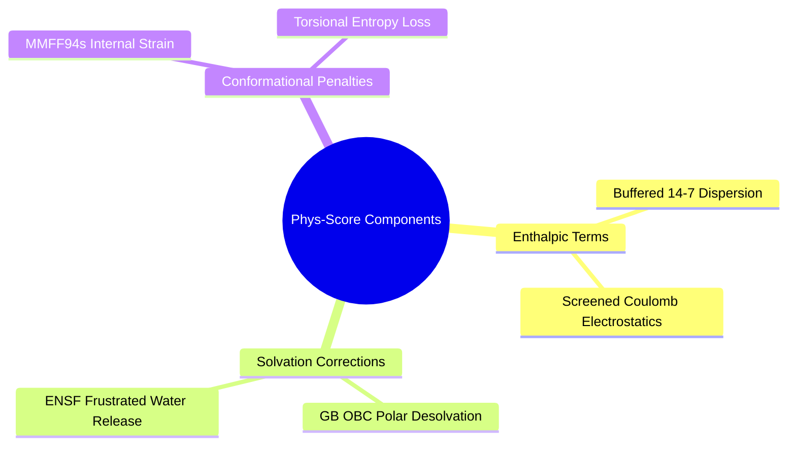
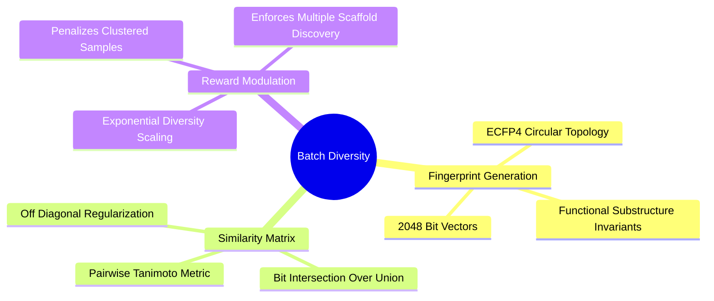
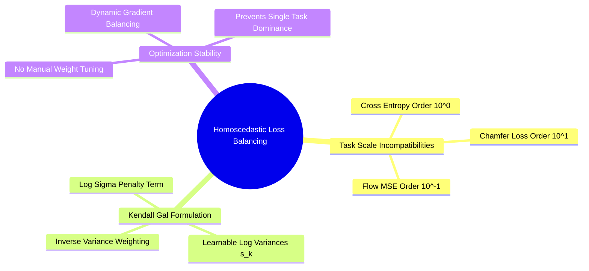

## 7.3. Multi-Objective Reward and Diversity

### 7.3.1. Differentiable Thermodynamic Phys-Score
```text
File: SynPath-3D Knowledge System/7. Generative Dynamics and Optimization/7.3. Multi-Objective Reward and Diversity/7.3.1. Differentiable Thermodynamic Phys-Score.md
Tags: #thermodynamics/phys-score #physics/free-energy #scoring-functions
```

#### 1. Concept Definition & Physical Nature
**Phys-Score** is an analytical thermodynamic scoring function that evaluates binding free energy without relying on empirical docking grid heuristics:
$$\Delta G_{\text{Phys}}(\mathcal{M}, \mathcal{P}) = \Delta H_{\text{vdW}} + \Delta H_{\text{Coulomb}} + \Delta G_{\text{desolv}} + \Delta G_{\text{water,lib}} + \Delta E_{\text{strain}} + T\Delta S_{\text{rot}}$$

Components:
1. **Van der Waals Enthalpy ($\Delta H_{\text{vdW}}$)**: Evaluated via the Buffered 14-7 Halgren potential over all ligand-protein atom pairs to model dispersion without infinite repulsive walls.
2. **Screened Coulombic Interaction ($\Delta H_{\text{Coulomb}}$)**:
   $$\Delta H_{\text{Coulomb}} = \sum_{i \in \text{lig}} \sum_{j \in \text{prot}} \frac{q_i q_j}{4\pi\varepsilon_0 \varepsilon(r_{ij}) r_{ij}}, \quad \varepsilon(r) = 4r$$
3. **Implicit Polar Desolvation ($\Delta G_{\text{desolv}}$)**: Generalized Born (GB-OBC) model evaluating the energetic penalty of desolvating polar functional groups.
4. **Water Displacement Free Energy ($\Delta G_{\text{water,lib}}$)**: Evaluated from the Neural Solvation Field:
   $$\Delta G_{\text{water,lib}} = -\sum_{a \in \text{lig}} \text{ReLU}\left( \Psi_\phi(\vec{x}_a)_{\Delta \mu} - 1.5\text{ kcal/mol} \right)$$
5. **Internal Ligand Strain ($\Delta E_{\text{strain}}$)**: Evaluated via MMFF94s relative to the unconstrained local minimum:
   $$\Delta E_{\text{strain}} = E_{\text{MMFF94}}(\text{Bound Pose}) - E_{\text{MMFF94}}(\text{Relaxed Pose})$$
6. **Rotational Entropy Cost ($T\Delta S_{\text{rot}}$)**:
   $$T\Delta S_{\text{rot}} = k_B T \sum_{k=1}^K \ln(1 + \kappa_k) \approx 0.60\text{ kcal/mol per frozen rotatable bond}$$



#### 2. Why It Matters in Biological & Chemical Systems
Empirical scoring functions (like AutoDock Vina) reward large, lipophilic molecules because they only evaluate contact surface area without accounting for polar desolvation costs or internal ligand strain. This leads models to generate heavy, insoluble compounds. 

Phys-Score models the thermodynamic trade-offs of binding, balancing contact enthalpy against desolvation and entropic penalties.

#### 3. Quad-Disciplinary Integration
* **Biology**: Drug-target residence time correlates with the ratio of interaction enthalpy to conformational strain.
* **Chemistry**: Ligand efficiency ($\text{LE} = -\Delta G / N_{\text{heavy}}$) is maintained by penalizing structural bloat.
* **Physics / Thermodynamics**: The functional reflects a complete thermodynamic cycle:
  $$\Delta G_{\text{bind}} = \Delta G_{\text{vacuum}} + \Delta G_{\text{solv}}(\text{complex}) - \left[ \Delta G_{\text{solv}}(\text{protein}) + \Delta G_{\text{solv}}(\text{ligand}) \right]$$
* **Machine Learning Implementation**: Implemented in `syntree/engine/rewards.py`. The resulting score is mapped into the GFlowNet terminal reward:
  $$R(\mathcal{M}) = \exp\left( -\frac{\Delta G_{\text{Phys}}(\mathcal{M}, \mathcal{P})}{k_B T_{\text{eff}}} \right)$$

---

### 7.3.2. Batch Tanimoto Diversity Regularization
```text
File: SynPath-3D Knowledge System/7. Generative Dynamics and Optimization/7.3. Multi-Objective Reward and Diversity/7.3.2. Batch Tanimoto Diversity Regularization.md
Tags: #ml/diversity #cheminformatics/tanimoto #exploration
```

#### 1. Concept Definition & Physical Nature
**Batch Tanimoto Diversity Regularization** is an information-theoretic reward penalty that discourages generative policies from sampling redundant chemical scaffolds within the same training batch.

For a batch $\mathcal{B} = \{\mathcal{M}_1, \mathcal{M}_2, \dots, \mathcal{M}_B\}$ of generated molecules:
1. Compute the **Morgan fingerprint (ECFP4, 2048 bits)** for each molecule:
   $$\mathbf{f}_i = \text{ECFP4}(\mathcal{M}_i) \in \{0, 1\}^{2048}$$
2. The **Tanimoto (Jaccard) similarity** between molecules $i$ and $j$ is:
   $$T(\mathbf{f}_i, \mathbf{f}_j) = \frac{|\mathbf{f}_i \cap \mathbf{f}_j|}{|\mathbf{f}_i \cup \mathbf{f}_j|} = \frac{\mathbf{f}_i \cdot \mathbf{f}_j}{\|\mathbf{f}_i\|_1 + \|\mathbf{f}_j\|_1 - \mathbf{f}_i \cdot \mathbf{f}_j} \in [0, 1]$$
3. The **Batch Diversity Score** for molecule $i$ is its average Tanimoto distance to all other molecules in the batch:
   $$R_{\text{div}}(\mathcal{M}_i \mid \mathcal{B}) = \frac{1}{|\mathcal{B}| - 1} \sum_{j \neq i, j \in \mathcal{B}} \left( 1 - T(\mathbf{f}_i, \mathbf{f}_j) \right) \in [0, 1]$$
   - $R_{\text{div}} \to 0$: Molecule $i$ is chemically identical to the rest of the batch (redundant).
   - $R_{\text{div}} \to 1$: Molecule $i$ contains distinct chemical scaffolds from the rest of the batch (diverse).



The adjusted terminal GFlowNet reward is:
$$R_{\text{final}}(\mathcal{M}_i) = R(\mathcal{M}_i) \cdot \exp\left( \beta_{\text{div}} \cdot R_{\text{div}}(\mathcal{M}_i \mid \mathcal{B}) \right)$$
where $\beta_{\text{div}} = 0.50$ sets the strength of the diversity incentive.

#### 2. Why It Matters in Biological & Chemical Systems
* **Preventing Chemotype Redundancy**: Without diversity regularization, generative models discover one high-scoring motif (e.g., an adamantyl cap in a hydrophobic subpocket) and generate 100 minor variations of it.
* By making the reward dependent on the composition of the batch, the model is rewarded for exploring distinct chemical families across the 75k synthon space.

#### 3. Quad-Disciplinary Integration
* **Biology**: Biological populations maintain phenotypic variation to buffer against environmental fluctuations.
* **Chemistry**: Medicinal chemistry campaigns manage risk by developing 3 to 4 distinct chemical series in parallel to ensure a backup if the primary series encounters metabolic liabilities.
* **Physics / Thermodynamics**: Diversity regularization functions like an entropy bonus in statistical ensembles, preventing the system from collapsing into a single energy minimum.
* **Machine Learning Implementation**: Implemented in `syntree/engine/rewards.py`. Computed using vectorized PyTorch operations on bit arrays, taking $< 2\text{ ms}$ for a batch of 64 molecules.

---

### 7.3.3. Homoscedastic Multi-Task Uncertainty Loss
```text
File: SynPath-3D Knowledge System/7. Generative Dynamics and Optimization/7.3. Multi-Objective Reward and Diversity/7.3.3. Homoscedastic Multi-Task Uncertainty Loss.md
Tags: #ml/losses #optimization #kendall-gal
```

#### 1. Concept Definition & Physical Nature
In Stage 1 supervised imitation learning, SynPath-3D trains four distinct neural heads simultaneously:
1. Anchor prediction ($\mathcal{L}_{\text{TIF}}$, regression/classification).
2. Reaction selection ($\mathcal{L}_{\text{rxn}}$, 24-class focal cross-entropy).
3. Synthon selection ($\mathcal{L}_{\text{syn}}$, 75k-class cross-entropy).
4. Torsional flow matching ($\mathcal{L}_{\text{flow}}$, wrapped MSE on $\mathbb{T}^K$).

Using static manual weights ($\mathcal{L}_{\text{total}} = \lambda_1 \mathcal{L}_1 + \dots$) leads to training instability because the losses operate on different numerical scales. If $\mathcal{L}_{\text{syn}} \approx 4.5$ and $\mathcal{L}_{\text{flow}} \approx 0.12$, gradients from synthon cross-entropy overwhelm the flow matching head, degrading geometric learning.

**Homoscedastic Task Uncertainty Weighting (Kendall, Gal, Cipolla, 2018)**:
We treat each task's loss as a negative log-likelihood under a model with task-dependent observation noise $\sigma_k^2$. 

For classification tasks (softmax likelihood):
$$\mathcal{L}(y, \mathbf{f}; \sigma) \approx \frac{1}{\sigma^2} \mathcal{L}_{\text{CE}} + \log \sigma$$
For continuous regression tasks (Gaussian likelihood):
$$\mathcal{L}(y, \mathbf{f}; \sigma) = \frac{1}{2\sigma^2} \|y - \mathbf{f}\|^2 + \log \sigma$$

Reparameterizing in terms of the log-variance $s_k = \log \sigma_k^2$ for numerical stability:
$$\mathcal{L}_{\text{multi}}(s) = \frac{1}{2} e^{-s_{\text{TIF}}} \mathcal{L}_{\text{TIF}} + e^{-s_{\text{rxn}}} \mathcal{L}_{\text{rxn}} + e^{-s_{\text{syn}}} \mathcal{L}_{\text{syn}} + \frac{1}{2} e^{-s_{\text{flow}}} \mathcal{L}_{\text{flow}} + \frac{1}{2}\sum_{k} s_k + 10^{-4} \sum_k s_k^2$$
where $s_k \in \mathbb{R}$ are learnable scalar parameters optimized by gradient descent alongside the network weights.



#### 2. Why It Matters in Biological & Chemical Systems
* **Automatic Task Balance**: If the 75k synthon selection task is noisy early in training, the network increases $s_{\text{syn}}$, downweighting that task's gradients and preventing it from destabilizing the geometric flow matching head.
* As the model learns and synthon prediction becomes more certain, $s_{\text{syn}}$ decreases, raising the gradient contribution to refine accuracy.
* **Elimination of Grid Searches**: Removes the need to tune loss weight hyperparameters across different dataset configurations.

#### 3. Quad-Disciplinary Integration
* **Biology**: Biological systems dynamically regulate protein expression across multiple metabolic pathways based on substrate availability.
* **Chemistry**: Multi-parameter optimization in drug design balances potency, selectivity, and solubility simultaneously.
* **Physics / Thermodynamics**: The log-variance formulation corresponds to Maximum Likelihood Estimation on a multivariate Gaussian distribution with a diagonal covariance matrix.
* **Machine Learning Implementation**: Implemented in `syntree/engine/losses.py`. The parameters $s_k$ are registered as PyTorch parameters in the optimizer:
  ```python
  class MultiTaskLossBalancing(nn.Module):
      def __init__(self, num_tasks=4):
          super().__init__()
          self.log_vars = nn.Parameter(torch.zeros(num_tasks))
          
      def forward(self, losses):
          total_loss = 0.0
          for k, loss in enumerate(losses):
              precision = torch.exp(-self.log_vars[k])
              total_loss += 0.5 * precision * loss + 0.5 * self.log_vars[k]
          # Regularization to prevent log_vars from drifting to infinity
          total_loss += 1e-4 * torch.sum(self.log_vars ** 2)
          return total_loss
  ```

---

### 7.3.4. Worked Exercise on SubTB Loss and GFlowNet Gradients
```text
File: SynPath-3D Knowledge System/7. Generative Dynamics and Optimization/7.3. Multi-Objective Reward and Diversity/7.3.4. Worked Exercise on SubTB Loss and GFlowNet Gradients.md
Tags: #exercise #gflownet/sub-tb #optimization #worked-problem
```

#### 1. Problem Statement
A generative policy samples a 2-step synthesis trajectory $\tau = (s_0 \to s_1 \to s_2 = \mathcal{M})$ that constructs a target kinase inhibitor:
* Step 0 $\to$ Step 1: Attaches a bi-functional linker. Forward probability: $P_F(s_1 \mid s_0) = 0.050$.
* Step 1 $\to$ Step 2: Attaches a terminal cap (`STOP`). Forward probability: $P_F(s_2 \mid s_1) = 0.200$.
* Backward probabilities: $P_B(s_0 \mid s_1) = 1.00$ and $P_B(s_1 \mid s_2) = 1.00$ (unique retrosynthetic disconnections).

The network predicts state flows:
* Source state: $\log F_\theta(s_0) \equiv \log Z_\theta = +3.50$.
* Intermediate state: $\log F_\theta(s_1) = +0.20$.
* Terminal candidate reward: The molecule achieves $\Delta G_{\text{Phys}} = -8.50\text{ kcal/mol}$ in the binding pocket. The effective temperature is $k_B T_{\text{eff}} = 2.0\text{ kcal/mol}$.
  $$\log R(\mathcal{M}) = -\frac{\Delta G_{\text{Phys}}}{k_B T_{\text{eff}}} = -\frac{-8.50}{2.00} = +4.25$$
  Boundary condition: $\log F(s_2) \equiv \log R(\mathcal{M}) = +4.25$.

Using a Sub-Trajectory Balance discount factor $\lambda = 0.90$:
1. Calculate the forward log-probabilities for both steps.
2. Formulate all valid sub-trajectories $(i \to j)$ and calculate their residuals $\Delta_{i, j}$.
3. Compute the total Sub-Trajectory Balance loss $\mathcal{L}_{\text{SubTB}}(\tau)$.
4. Compute the standard global Trajectory Balance loss $\mathcal{L}_{\text{TB}}(\tau)$ for comparison.
5. Derive the analytical gradient of $\mathcal{L}_{\text{SubTB}}$ with respect to the intermediate state flow $\log F_\theta(s_1)$. Does the loss update $\log F_\theta(s_1)$ to be larger or smaller?

---

#### 2. Background Knowledge Required
* Logarithmic arithmetic and probabilities: $\log(A \times B) = \log A + \log B$.
* The Sub-Trajectory Balance formulation: $\mathcal{L}_{\text{SubTB}} = \sum_{i < j} \lambda^{j-i-1} \Delta_{i,j}^2$.
* The relationship between binding free energy and GFlowNet reward: $\log R = -\Delta G / (k_B T)$.

---

#### 3. Terminology Definitions
* **State Flow ($\log F(s)$)**: The total volume of probability fluid passing through intermediate state $s$.
* **Sub-Trajectory Residual ($\Delta_{i, j}$)**: The mismatch between predicted inflow at state $i$ and predicted outflow at state $j$.

---

#### 4. Step-by-Step Solution

##### Step 1: Calculate the Forward Action Log-Probabilities
$$\log P_F(s_1 \mid s_0) = \ln(0.050) \approx -2.9957$$
$$\log P_F(s_2 \mid s_1) = \ln(0.200) \approx -1.6094$$
$$\log P_B \equiv 0.00 \quad \text{for all steps}$$

---

##### Step 2: Formulate All Sub-Trajectories and Compute Residuals
Trajectory length $T=2$. The states are $s_0, s_1, s_2$.
The possible pairs $(i, j)$ with $0 \le i < j \le 2$ are:
1. Pair $(0, 1)$ (Step 1 alone):
   $$\Delta_{0, 1} = \log F_\theta(s_0) + \log P_F(s_1 \mid s_0) - \log F_\theta(s_1)$$
   $$\Delta_{0, 1} = +3.50 + (-2.9957) - (+0.20)$$
   $$\Delta_{0, 1} = 3.50 - 2.9957 - 0.20 = +0.3043$$

2. Pair $(1, 2)$ (Step 2 alone):
   $$\Delta_{1, 2} = \log F_\theta(s_1) + \log P_F(s_2 \mid s_1) - \log F(s_2)$$
   $$\Delta_{1, 2} = +0.20 + (-1.6094) - (+4.25)$$
   $$\Delta_{1, 2} = 0.20 - 1.6094 - 4.25 = -5.6594$$

3. Pair $(0, 2)$ (Complete trajectory from 0 to 2):
   $$\Delta_{0, 2} = \log F_\theta(s_0) + \left[ \log P_F(s_1 \mid s_0) + \log P_F(s_2 \mid s_1) \right] - \log F(s_2)$$
   $$\Delta_{0, 2} = +3.50 + \left[ -2.9957 + (-1.6094) \right] - (+4.25)$$
   $$\Delta_{0, 2} = 3.50 - 4.6051 - 4.25 = -5.3551$$

Notice the consistency check: $\Delta_{0, 2} = \Delta_{0, 1} + \Delta_{1, 2} = +0.3043 - 5.6594 = -5.3551$. The algebra checks out.

---

##### Step 3: Compute the Sub-Trajectory Balance Loss $\mathcal{L}_{\text{SubTB}}$
Apply geometric weights with $\lambda = 0.90$:
* For length 1 sub-trajectories ($j - i = 1 \implies \lambda^{1 - 1} = \lambda^0 = 1.0$):
  $$w_{0, 1} = 1.0, \quad w_{1, 2} = 1.0$$
* For length 2 sub-trajectories ($j - i = 2 \implies \lambda^{2 - 1} = \lambda^1 = 0.90$):
  $$w_{0, 2} = 0.90$$

Compute the weighted sum of squared residuals:
$$\mathcal{L}_{\text{SubTB}} = w_{0, 1} (\Delta_{0, 1})^2 + w_{1, 2} (\Delta_{1, 2})^2 + w_{0, 2} (\Delta_{0, 2})^2$$
$$\mathcal{L}_{\text{SubTB}} = 1.0 \times (0.3043)^2 + 1.0 \times (-5.6594)^2 + 0.90 \times (-5.3551)^2$$
$$(0.3043)^2 \approx 0.0926$$
$$(-5.6594)^2 \approx 32.0288$$
$$(-5.3551)^2 \approx 28.6771 \implies 0.90 \times 28.6771 \approx 25.8094$$
$$\mathcal{L}_{\text{SubTB}} = 0.0926 + 32.0288 + 25.8094 = 57.9308$$

---

##### Step 4: Compute Standard Global Trajectory Balance Loss $\mathcal{L}_{\text{TB}}$
Standard TB only evaluates the complete trajectory $(0 \to 2)$:
$$\mathcal{L}_{\text{TB}} = (\Delta_{0, 2})^2 = (-5.3551)^2 = 28.6771$$

---

##### Step 5: Compute Gradient with respect to $\log F_\theta(s_1)$
The intermediate state flow $\log F_\theta(s_1)$ appears in two terms: $\Delta_{0, 1}$ and $\Delta_{1, 2}$.
Let $u = \log F_\theta(s_1)$.
$$\Delta_{0, 1} = C_1 - u \implies \frac{\partial \Delta_{0, 1}}{\partial u} = -1$$
$$\Delta_{1, 2} = u + C_2 \implies \frac{\partial \Delta_{1, 2}}{\partial u} = +1$$
Using the chain rule on $\mathcal{L}_{\text{SubTB}}$:
$$\frac{\partial \mathcal{L}_{\text{SubTB}}}{\partial u} = 2 w_{0, 1} \Delta_{0, 1} \frac{\partial \Delta_{0, 1}}{\partial u} + 2 w_{1, 2} \Delta_{1, 2} \frac{\partial \Delta_{1, 2}}{\partial u}$$
$$\frac{\partial \mathcal{L}_{\text{SubTB}}}{\partial u} = 2(1.0)(0.3043)(-1) + 2(1.0)(-5.6594)(+1)$$
$$\frac{\partial \mathcal{L}_{\text{SubTB}}}{\partial u} = -0.6086 - 11.3188 = -11.9274$$

Gradient update direction:
Under gradient descent, parameters update in the direction of the negative gradient:
$$\Delta u \propto - \frac{\partial \mathcal{L}}{\partial u} = -(-11.9274) = +11.9274 > 0$$

*Direction of Update*: The gradient step will **increase $\log F_\theta(s_1)$**.

---

#### 5. Why Each Step Is Necessary
* **Step 1**: Converts raw probabilities into linear log-terms.
* **Step 2**: Evaluates local flow conservation across all possible segment lengths.
* **Step 3**: Combines the residuals using geometric discounting.
* **Step 4**: Computes standard global TB to highlight the difference in supervisory signal.
* **Step 5**: Demonstrates how SubTB directly updates intermediate state representations.

---

#### 6. The Correct Answer
1. $\log P_F(s_1 \mid s_0) = -2.996$, $\log P_F(s_2 \mid s_1) = -1.609$.
2. Residuals: $\Delta_{0, 1} = +0.304$, $\Delta_{1, 2} = -5.659$, $\Delta_{0, 2} = -5.355$.
3. SubTB loss: **$\mathcal{L}_{\text{SubTB}} = 57.93$**.
4. Standard TB loss: **$\mathcal{L}_{\text{TB}} = 28.68$**.
5. Gradient: $\frac{\partial \mathcal{L}}{\partial \log F(s_1)} = -11.93$. The loss will **increase $\log F_\theta(s_1)$**.

---

#### 7. Theoretical Reasoning
The intermediate state flow $\log F_\theta(s_1) = +0.20$ was underestimated relative to the high terminal reward ($\log R = +4.25$). The SubTB gradient increases the predicted flow through $s_1$, adjusting the local flow network so that subsequent visits recognize $s_1$ as a path leading to a high-affinity molecule.

---

#### 8. Common Student Mistakes
* **Squaring before weighting**: Calculating $(\lambda \Delta)^2$ instead of $\lambda (\Delta)^2$, which squares the discount factor and downweights long-range terms too aggressively.
* **Missing the negative sign in the chain rule**: Forgetting that $\log F(s_1)$ enters $\Delta_{0, 1}$ with a negative sign (as an outflow term), which flips the sign of that gradient contribution.

---

#### 9. Misleading Traps & False Intuitions
* **The "Zero Residual Fallacy"**: Assuming that because a trajectory achieved a high reward, its loss should be zero. GFlowNet loss measures whether the *predicted probability flow matches the reward*, not just whether the reward is high.

---

#### 10. Useful Tips & Memory Tricks
* Remember flow conservation:
  $$\Delta = \text{Inflow} - \text{Outflow}$$
  $$\Delta = [\log F(s_{\text{start}}) + \sum \log P_F] - [\log F(s_{\text{end}}) + \sum \log P_B]$$

---

#### 11. Details Commonly Forgotten
* In a DAG with deterministic backward paths ($P_B \equiv 1$), all $\log P_B$ terms vanish ($0.0$), simplifying the residual to forward probabilities and state flows.

---

#### 12. Connection to Broader Disciplines
* **Operations Research**: Network flow problems use Bellman-Ford formulations to enforce capacity conservation across intermediate transshipment nodes.

---

#### 13. Direct Application to SynPath-3D
In `syntree/engine/gflownet_align.py`:
```python
# Batched PyTorch implementation of SubTB alignment
def train_subtb_step(model, optimizer, trajectory_batch, lam=0.90):
    optimizer.zero_grad()
    total_loss = 0.0
    for tau in trajectory_batch:
        log_F = model.predict_state_flows(tau.states)
        log_PF = model.get_action_log_probs(tau.states, tau.actions)
        log_R = tau.reward.log()
        log_F_full = torch.cat([log_F, log_R.unsqueeze(0)])
        loss = compute_subtb_loss(log_F_full, log_PF, log_R, lam=lam)
        total_loss += loss
    total_loss.backward()
    torch.nn.utils.clip_grad_norm_(model.parameters(), 1.0)
    optimizer.step()
```

---

# 8. Data Strategy Validation and Ablations