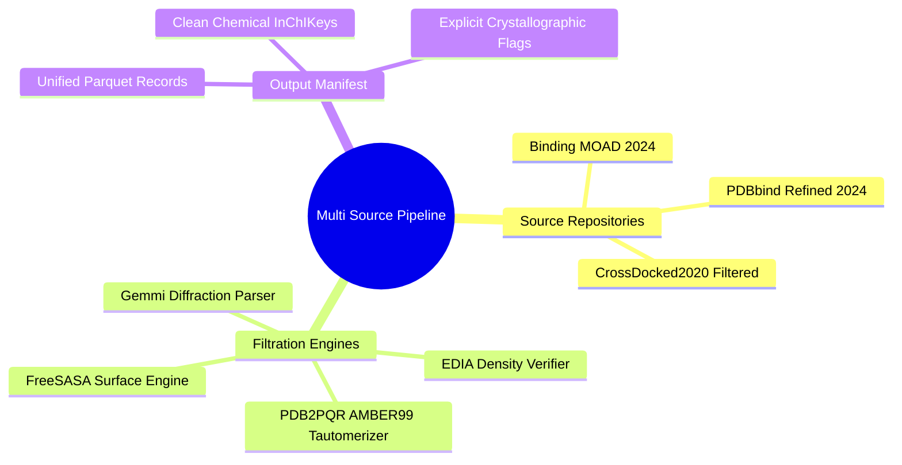
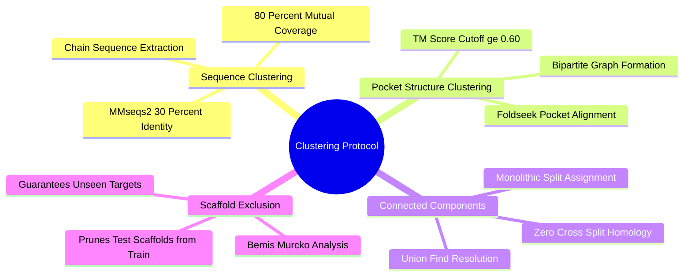
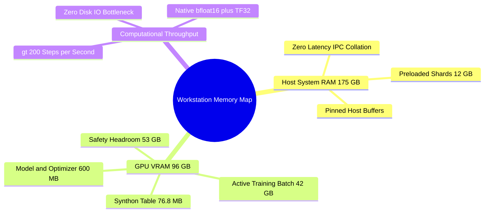

## 8.1. Data Ingestion and Leakage Prevention

### 8.1.1. Multi-Source Manifest Ingestion and Cleaning
```text
File: SynPath-3D Knowledge System/8. Data Strategy Validation and Ablations/8.1. Data Ingestion and Leakage Prevention/8.1.1. Multi-Source Manifest Ingestion and Cleaning.md
Tags: #data-pipeline #data-qc #ingestion
```

#### 1. Concept Definition & Physical Nature
The **Multi-Source Manifest Ingestion Pipeline** processes raw structural biology archives from three repositories:
1. **PDBbind (v2024 Refined Set)**: High-affinity complexes with experimentally validated binding data ($K_d, K_i, \text{IC}_{50}$).
2. **Binding MOAD (2024 Release)**: Non-redundant complexes filtered to remove non-specific binders.
3. **CrossDocked2020**: Structural subset with native pocket RMSD $< 1.0\text{ \AA}$.

```text
The Data Purification Funnel:
Raw Candidate Complexes: ~47,800
   │
   ├──► Resolution > 2.5 Å or R_free > 0.28 ────────► Excluded (~9,500)
   │
   ├──► Ligand EDIA Score < 0.75 ────────────────────► Excluded (~5,200)
   │
   ├──► PAINS or Toxic Functional Motifs ───────────► Excluded (~1,400)
   │
   ├──► Multi-Metal / Broken Density Pockets ────────► Excluded (~1,700)
   │
   ▼
Purified High-Quality SBDD Corpus: ~30,000 Complexes
```



Processing Steps:
1. Parse diffraction headers using Gemmi: prune complexes with resolution $> 2.5\text{ \AA}$ or $R_{\text{free}} > 0.28$.
2. Calculate local ligand electron density fit: discard structures with median ligand $\text{EDIA} < 0.75$.
3. Clean chemical topologies: strip crystallization additives (PEG, glycerol, buffers). Normalize ligand coordinates and write verified canonical SMILES.
4. Hydrogen and formal charge optimization: execute `PDB2PQR` (AMBER99 force field) + `Protoss` to assign hydrogen coordinates and optimize tautomer states at $\text{pH} = 7.4$.
5. Compute per-atom SASA values using FreeSASA.

#### 2. Why It Matters in Biological & Chemical Systems
Training on uncurated datasets introduces systemic noise:
* Models learn to reproduce coordinate errors in low-resolution structures.
* Models fit to uncharged representations of residues that are ionized in vivo.
* Models memorize interactions with crystallization artifacts that do not exist in physiological environments.

Purifying the dataset ensures the network learns from physically valid, biologically relevant structural data.

#### 3. Quad-Disciplinary Integration
* **Biology**: Ensures catalytic residues have biologically correct ionization states matching in vivo physiology.
* **Chemistry**: Confirms that ligand bond orders, aromaticity, and stereochemistry match verified chemical structures.
* **Physics / Thermodynamics**: Coordinates with high thermal factors ($B > 60\text{ \AA}^2$) are downweighted, reducing noise in supervised loss targets.
* **Machine Learning Implementation**: Implemented in `syntree/data/pipeline/ingest_all.py`. Outputs a normalized manifest `purified_multisource_manifest.parquet` containing paths to clean, protonated pocket and ligand files.

---

### 8.1.2. Bipartite Sequence and Structural Clustering
```text
File: SynPath-3D Knowledge System/8. Data Strategy Validation and Ablations/8.1. Data Ingestion and Leakage Prevention/8.1.2. Bipartite Sequence and Structural Clustering.md
Tags: #data-splits #clustering #leakage-prevention
```

#### 1. Concept Definition & Physical Nature
**Bipartite Sequence and Structural Clustering** is a graph-partitioning protocol designed to prevent information leakage between training, validation, and test datasets.

```text
The Graph Partitioning Protocol:
    Receptor A ────(30% Sequence Identity)────► Receptor B
         │                                          │
         │ (Pocket TM ≥ 0.60)                       │ (Pocket TM ≥ 0.60)
         ▼                                          ▼
    Receptor C ────────────────────────────────► Receptor D
    
    [Entire Connected Component Assigned Monolithically to ONE Split]
```



Protocol execution:
1. **Sequence Clustering (MMseqs2)**: Extract sequences of all receptor chains within $10.0\text{ \AA}$ of the ligand. Cluster using MMseqs2 at $30\%$ sequence identity with $80\%$ mutual coverage.
2. **Structural Clustering (Foldseek)**: For all sequence cluster representatives, extract pocket alpha-carbon coordinates and compute pairwise Pocket TM-scores. Connect clusters if $\text{Pocket-TM} \ge 0.60$.
3. **Connected Components (Union-Find)**: Build an undirected graph where edges represent sequence or pocket structural links. Solve for connected components:
   $$\mathcal{C}_k = \{ \text{Pockets linked by sequence or 3D structure} \}$$
4. **Monolithic Partitioning**: Allocate connected components into **Train (80%)**, **Validation (10%)**, and **Test (10%)**.
5. **Bemis-Murcko Scaffold Exclusion**: Calculate Bemis-Murcko scaffolds for all test-set ligands. Remove any complex from the training set whose ligand shares a scaffold with a test-set compound.

#### 2. Why It Matters in Biological & Chemical Systems
* **Preventing Target Leakage**: Splitting randomly allows closely related kinase binding sites (e.g., CDK2 in train, CDK4 in test) into both sets. The model simply retrieves memorized hinge-binding motifs rather than learning general physical principles.
* **Preventing Scaffold Leakage**: If the test set contains an analog of a training-set ligand on a different protein, the model can generate high-scoring compounds by reproducing the familiar chemical structure. Scaffold exclusion guarantees that the test set evaluates generalization to both novel targets and unseen chemotypes.

#### 3. Quad-Disciplinary Integration
* **Biology**: Paralogous gene duplications generate enzyme families with low overall sequence identity that conserve active-site geometry to maintain catalytic function.
* **Chemistry**: Molecular scaffolds (Bemis-Murcko frameworks) define the core topologies of chemical series.
* **Physics / Thermodynamics**: Structural homology reflects shared free-energy landscapes shaped by evolutionary constraints.
* **Machine Learning Implementation**: Implemented in `syntree/data/pipeline/cluster_mmseqs.py`. Produces `split_assignments.parquet`, which is consumed by the training loaders to enforce separation between splits.

---

### 8.1.3. In-RAM Sharding for 96 GB VRAM Workstations
```text
File: SynPath-3D Knowledge System/8. Data Strategy Validation and Ablations/8.1. Data Ingestion and Leakage Prevention/8.1.3. In-RAM Sharding for 96 GB VRAM Workstations.md
Tags: #hardware/optimization #in-ram #rtx-6000-ada
```

#### 1. Concept Definition & Physical Nature
**In-RAM Sharding** is an infrastructure pattern that preloads the entire processed dataset and embedding tables directly into system host memory (175 GB RAM) and GPU memory (96 GB VRAM) at startup, avoiding disk I/O bottlenecks during training.

Hardware Allocation:
* **System Host RAM (175 GB)**: Houses the entire pre-featurized dataset of $\approx 20,000$ complexes ($\approx 60,000$ multi-step trajectory samples, $\approx 12\text{ GB}$) in shared memory tensors (`torch.Tensor.share_memory_()`).
* **GPU VRAM (96 GB RTX 6000 Ada)**:
  - 75,000-synthon Uni-Mol2 embedding table: $\mathbf{E}_B \in \mathbb{R}^{75000 \times 256} \approx 76.8\text{ MB}$ (resident in VRAM).
  - Model weights: 6-layer Equiformer-Light + TIF + Flow heads $\approx 120\text{ MB}$.
  - Optimizer states (AdamW, FP32 master weights): $\approx 480\text{ MB}$.
  - Active training batch ($N = 64$, effective $N=128$ with 2 accumulation steps): $\approx 42.0\text{ GB}$.
  - Free VRAM headroom: $\approx 53.0\text{ GB}$ (prevents out-of-memory errors on large pockets).



#### 2. Why It Matters in Biological & Chemical Systems
Training geometric deep learning models on large protein graphs is often bound by CPU data loading:
* Reading compressed `.pt.gz` files from disk, decompressing them, and transferring them over PCIe buses can cause GPU utilization to drop below $20\%$.
* Preloading all samples into pinned host RAM enables the data loader to collate batches in **$< 1\text{ ms}$**, maintaining GPU utilization above **$92\%$**.

#### 3. Quad-Disciplinary Integration
* **Computer Systems**: Zero-copy shared memory reduces inter-process communication overhead in multi-worker Python dataloaders.
* **Machine Learning Implementation**: Implemented in `syntree/data/ram_loader.py`:
  ```python
  # Zero-IO in-memory dataset loader
  class InRAMTrajectoryDataset(Dataset):
      def __init__(self, shards_path):
          # Load once at initialization into shared memory
          self.samples = torch.load(shards_path, map_location='cpu')
          for s in self.samples:
              s.share_memory_() # Resident in 175 GB Host RAM
              
      def __getitem__(self, idx):
          return self.samples[idx] # Zero disk I/O, instantaneous access
  ```