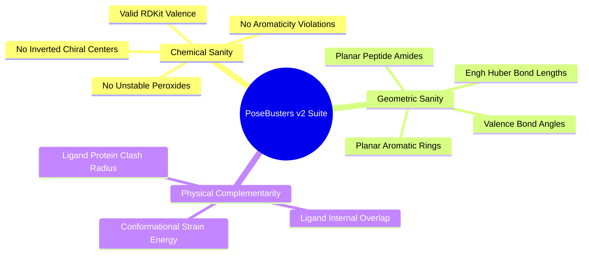
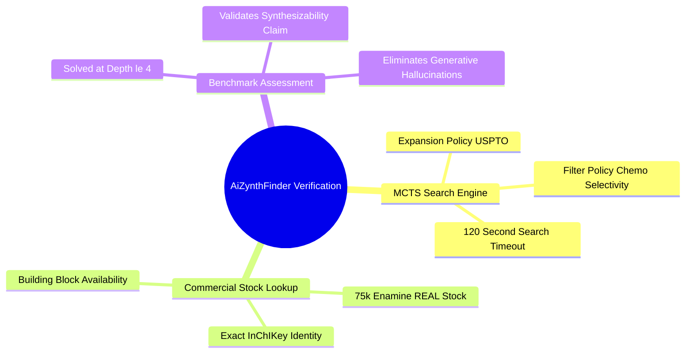
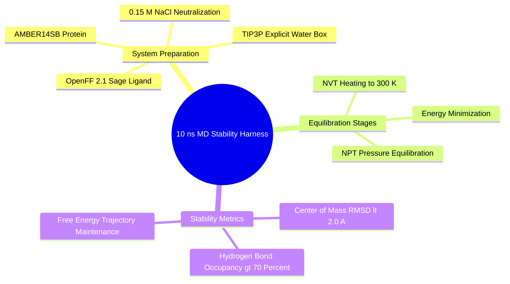

## 8.2. Comprehensive Evaluation Suite

### 8.2.1. PoseBusters v2 Physical Integrity Checks
```text
File: SynPath-3D Knowledge System/8. Data Strategy Validation and Ablations/8.2. Comprehensive Evaluation Suite/8.2.1. PoseBusters v2 Physical Integrity Checks.md
Tags: #evaluation/posebusters #physical-validity #benchmarking
```

#### 1. Concept Definition & Physical Nature
**PoseBusters v2** (Buttenschoen et al., 2024) is a standardized structural validation suite that evaluates whether computationally generated protein-ligand complexes adhere to physical and chemical laws.

It runs **18 physical and chemical checks** across three tiers:



1. **Chemical Sanity (Graph Structure)**:
   - Valid atomic valences (no pentavalent carbons, no hypervalent nitrogens).
   - No broken or non-kekulizable aromatic rings.
   - No chemically unstable functional groups (peroxides, aliphatic diazo groups).
   - Consistent protonation and overall neutral formal charge.
2. **Geometric Sanity (Intramolecular Geometry)**:
   - Covalent bond lengths within $0.08\text{ \AA}$ of Engh & Huber standard targets.
   - Valence bond angles within $10.0^\circ$ of canonical VSEPR geometries.
   - Aromatic ring planarity: root-mean-square out-of-plane deviation $< 0.10\text{ \AA}$.
   - Amide bond planarity: $\omega$ dihedral within $180^\circ \pm 15^\circ$ or $0^\circ \pm 15^\circ$.
   - Internal ligand strain energy $\Delta E_{\text{strain}} \le 3.50\text{ kcal/mol}$ relative to the nearest local gas-phase minimum.
3. **Physical Complementarity (Intermolecular Interactions)**:
   - Intersite steric clashes: ratio of atom-atom distance to the sum of van der Waals radii:
     $$\frac{d_{ij}}{r_{v, i} + r_{v, j}} \ge 0.75 \quad \forall i \in \text{ligand}, \, j \in \text{pocket}$$
   - Internal ligand clash: no two non-bonded ligand atoms approach within $0.70\text{ \AA}$ of each other.

#### 2. Why It Matters in Biological & Chemical Systems
Standard generative diffusion models frequently report strong computed docking scores while failing PoseBusters validation ($>50\%$ failure rates):
* They push atoms into steric clashes with the protein backbone to artificially increase docking score terms.
* They distort bond lengths and angles to fit narrow subpockets, generating structures that cannot exist in physical equilibrium.

PoseBusters provides a rigorous, objective benchmark for structural plausibility.

#### 3. Quad-Disciplinary Integration
* **Biology**: Protein-ligand complexes that violate physical geometry laws do not form in vitro.
* **Chemistry**: Engh and Huber bond parameters are derived from high-resolution small-molecule crystal structures in the Cambridge Structural Database (CSD).
* **Physics / Thermodynamics**: Unphysical bond stretches ($> 0.1\text{ \AA}$) represent high potential energies ($E \propto k(r - r_0)^2$), corresponding to unpopulated states on the Boltzmann landscape.
* **Machine Learning Implementation**: Integrated in `syntree/engine/evaluator.py`. Evaluates all generated poses and outputs the pass rate across all 18 checks as a primary benchmark metric.

---

### 8.2.2. AiZynthFinder Retrosynthetic Feasibility
```text
File: SynPath-3D Knowledge System/8. Data Strategy Validation and Ablations/8.2. Comprehensive Evaluation Suite/8.2.2. AiZynthFinder Retrosynthetic Feasibility.md
Tags: #evaluation/aizynthfinder #retrosynthesis #synthesizability
```

#### 1. Concept Definition & Physical Nature
**AiZynthFinder** (Genheden et al., 2020) is an open-source, policy-driven retrosynthetic planning software used in the pharmaceutical industry to evaluate whether a proposed drug candidate can be synthesized from commercial starting materials.

The algorithm uses **Monte Carlo Tree Search (MCTS)** guided by two neural networks:
1. **Expansion Policy Network**: An MLP trained on reaction databases (USPTO) that predicts which retrosynthetic reaction rule to apply to a given target molecule.
2. **Filter Policy Network**: A binary classifier that filters out predicted reactions that violate known chemo-selectivity or functional compatibility rules.
3. **Stock Verification**: At each step of the search tree, disconnected fragments are looked up in a database of commercially available chemical building blocks (the 75k Enamine REAL stock).

A molecule is classified as **retrosynthetically solved** if and only if MCTS identifies a valid synthetic route where all starting materials are present in the commercial catalog within a defined maximum search depth ($T \le 4$ steps):
$$\text{Solve Rate} = \frac{N_{\text{solved}}}{N_{\text{evaluated}}} \times 100\%$$



#### 2. Why It Matters in Biological & Chemical Systems
* **Testing the Core Hypothesis**: Diffusion models achieve $< 20\%$ solve rates because they generate novel, complex fused rings that have no synthetic literature precedent.
* Because SynPath-3D constructs molecules through forward assembly of commercial synthons using certified reaction rules, **its outputs should be retrosynthetically solved by AiZynthFinder with $\ge 95\%$ confidence**, confirming that the generated molecules can be physically synthesized.

#### 3. Quad-Disciplinary Integration
* **Biology**: Fast synthetic turnaround enables rapid design-make-test-analyze (DMTA) cycles in medicinal chemistry projects.
* **Chemistry**: Retrosynthesis deconstructs a target molecule into simpler synthons by disconnecting key strategic bonds (disconnections).
* **Physics / Thermodynamics**: Forward chemical synthesis requires that each individual step along the synthetic route has a favorable free energy of reaction ($\Delta G < 0$) or can be driven to completion via equilibrium shifts (e.g., precipitation, gas evolution).
* **Machine Learning Implementation**: Implemented in `syntree/engine/evaluator.py`. Evaluates generated candidate SMILES using a 120-second timeout per molecule.

---

### 8.2.3. Ten-Nanosecond Explicit-Solvent MD Stability Harness
```text
File: SynPath-3D Knowledge System/8. Data Strategy Validation and Ablations/8.2. Comprehensive Evaluation Suite/8.2.3. Ten Nanosecond Explicit Solvent MD Stability Harness.md
Tags: #evaluation/openmm #biophysics/molecular-dynamics #stability
```

#### 1. Concept Definition & Physical Nature
The **10 ns Explicit-Solvent MD Stability Harness** evaluates whether a computationally generated binding pose remains stable under room-temperature thermal motion in explicit water.

Static docking scores can be misleading: an algorithm can place a ligand into an artificial local minimum where static electrostatic interactions appear strong, but room-temperature thermal motion ($k_B T = 0.593\text{ kcal/mol}$) and water competition disrupt the pose within picoseconds.

Simulation Protocol:
1. **Force-Field Parameterization**: Ligand parameterized using **OpenFF 2.1 (Sage)**; receptor parameterized using **AMBER14SB**.
2. **Solvation Box**: Solvate in a periodic cubic box with TIP3P water molecules extending at least $10.0\text{ \AA}$ beyond the protein surface. Add $\text{Na}^+$ and $\text{Cl}^-$ counter-ions to achieve physiological ionic strength ($0.15\text{ M}$) and neutralize system charge.
3. **Equilibration**:
   - Energy minimization: 1,000 steps of conjugate gradient descent.
   - NVT heating: warm from $0\text{ K}$ to $300\text{ K}$ over $100\text{ ps}$ with harmonic position restraints on protein backbone and ligand heavy atoms ($k = 10.0\text{ kcal/mol}\cdot\text{\AA}^{-2}$).
   - NPT equilibration: equilibrate pressure at $1.0\text{ bar}$ using a Monte Carlo barostat for $500\text{ ps}$.
4. **Production MD (10 ns)**: Run unconstrained Langevin dynamics with a $2.0\text{ fs}$ timestep (using SHAKE to constrain bonds involving hydrogen) at $T = 300\text{ K}$ and $P = 1.0\text{ bar}$.



Evaluation Metrics:
* **Ligand Center-of-Mass RMSD**: Root-mean-square deviation of ligand heavy atoms relative to the initial predicted pose across the final $5\text{ ns}$ of simulation:
  $$\text{RMSD}(t) = \sqrt{\frac{1}{N} \sum_{a=1}^N \|\vec{x}_a(t) - \vec{x}_a(0)\|^2}$$
  A pose is considered **stable** if $\text{RMSD} < 2.00\text{ \AA}$ and exhibits no unbinding drift.
* **Key-Contact Persistence**: The fraction of simulation frames where predicted hydrogen bonds or salt bridges remain engaged ($d \le 3.50\text{ \AA}$).

#### 2. Why It Matters in Biological & Chemical Systems
True biological binders remain bound within their target cavities over nanosecond-to-millisecond timescales. 

If a generated pose drifts into bulk solvent during a $10\text{ ns}$ MD run ($\text{RMSD} > 5.0\text{ \AA}$), the static pose was an artifact of the scoring grid rather than a physical binding mode.

#### 3. Quad-Disciplinary Integration
* **Biology**: Drug-target residence time is governed by the barrier height for unbinding along the free-energy landscape.
* **Chemistry**: Stable binders maintain consistent hydrogen-bonding networks with conserved active-site residues throughout thermal fluctuations.
* **Physics / Thermodynamics**: Molecular dynamics integrates Newton's equations of motion:
  $$m_i \frac{d^2 \mathbf{r}_i}{dt^2} = -\nabla_{\mathbf{r}_i} V(\mathbf{r}) - \gamma m_i \mathbf{v}_i + \mathbf{R}_i(t)$$
* **Machine Learning Implementation**: Implemented in `syntree/engine/md_validation.py` using OpenMM. Runs in parallel across the top 20 generated candidates for each test target, completing in $< 12\text{ hours}$ on the RTX 6000 Ada.