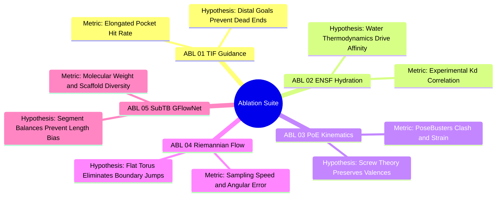
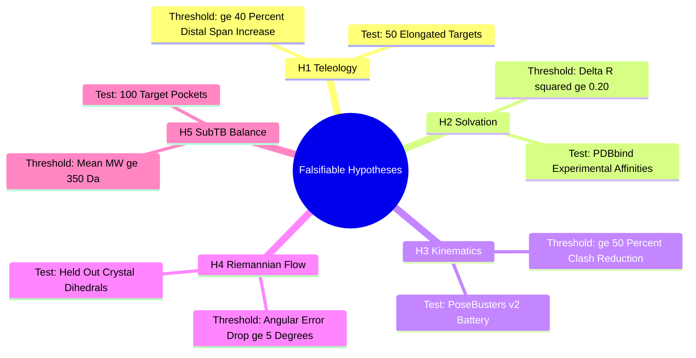

## 8.3. Scientific Ablation Battery

### 8.3.1. Ablation Matrix ABL-01 Through ABL-05
```text
File: SynPath-3D Knowledge System/8. Data Strategy Validation and Ablations/8.3. Scientific Ablation Battery/8.3.1. Ablation Matrix ABL-01 Through ABL-05.md
Tags: #ablations #scientific-validation #research-methodology
```

#### 1. Concept Definition & Physical Nature
A rigorous scientific publication requires demonstrating that performance improvements stem directly from specific architectural innovations, rather than general model scaling or dataset size.

The **SynPath-3D Ablation Matrix** comprises five controlled experiments where one component is removed or replaced with an established baseline, while holding all other parameters constant:

| Ablation ID | Target Component | Modification | Scientific Hypothesis Tested | Expected Failure Mode |
| :--- | :--- | :--- | :--- | :--- |
| **[ABL-01]** | **Target-Interaction Field (TIF)** | Remove TIF head; revert to blind outward growing from an anchor. | Distal spatial goals resolve greedy early-step commitment errors. | Loss of distal subpocket hit rate ($\ge 40\%$ drop); early trajectory termination. |
| **[ABL-02]** | **Neural Solvation Field (ENSF)** | Set $\Delta \mu_{\text{excess}} \equiv 0$ (train in vacuum). | Continuous 3D-RISM hydration potentials guide water displacement. | Lower binding affinity correlation ($\Delta R^2 \ge 0.20$); polar desolvation clashes. |
| **[ABL-03]** | **PoE Kinematics & Jacobians** | Replace PoE Jacobian resolver with heuristic RDKit conformer snapping. | Screw theory allows analytical clash relief while preserving geometry. | High internal strain ($\Delta E_{\text{strain}} > 3.5$); PoseBusters clash rate doubles. |
| **[ABL-04]** | **Riemannian Flow on $\mathbb{T}^K$** | Replace $\mathbb{T}^K$ flow with separate categorical synthon sampling and 1D von Mises. | Coupled flow matching resolves multi-bond sterics without boundary artifacts. | Slower sampling latency ($3\times$ slower); angular error increases by $>10^\circ$. |
| **[ABL-05]** | **Sub-Trajectory Balance** | Replace $\text{SubTB}(\lambda)$ with standard global TB and standard PPO. | SubTB eliminates the variable-length horizon penalty in synthesis DAGs. | Severe length collapse: policy generates fragments ($M_W < 200\text{ Da}$); entropy drops. |



#### 2. Why It Matters in Biological & Chemical Systems
Ablations provide the causal evidence required for peer review:
* They demonstrate that the Target-Interaction Field is necessary to span large binding clefts.
* They show that solvation potentials improve physical affinity predictions over vacuum models.
* They prove that screw-theory kinematics maintains physical validity better than heuristic force-field snapping.

#### 3. Quad-Disciplinary Integration
* **Scientific Method**: Controlled hypothesis testing: isolating independent variables to establish causal mechanisms.
* **Machine Learning Implementation**: Configured via dedicated JSON manifests in `configs/ablations/` and executed via `scripts/run_ablations.py`.

---

### 8.3.2. Falsifiable Hypotheses and Experimental Protocol
```text
File: SynPath-3D Knowledge System/8. Data Strategy Validation and Ablations/8.3. Scientific Ablation Battery/8.3.2. Falsifiable Hypotheses and Experimental Protocol.md
Tags: #hypotheses #experimental-design #falsifiability
```

#### 1. Concept Definition & Physical Nature
A scientific claim must be **falsifiable**: it must specify an experimental test and a numerical threshold that would prove the hypothesis false (Karl Popper).

Experimental Testing Protocols for the Five Hypotheses:

```text
The Five Experimental Protocols:
[Hypothesis 1]: Run generation across 50 elongated binding clefts (length > 15 Å).
                Measure percentage of generated candidates with atoms within 2.0 Å
                of both distal active-site extremes.
                FALSIFIED IF: Advantage of TIF over blind growing is < 25%.

[Hypothesis 2]: Score PDBbind 2024 Refined Set with vs. without ENSF potentials.
                Compute Pearson R² against experimental ΔG_bind.
                FALSIFIED IF: Inclusion of ENSF yields ΔR² < 0.10.

[Hypothesis 3]: Evaluate 1,000 generated molecules through PoseBusters v2.
                Record intersite steric clash pass rate.
                FALSIFIED IF: PoE Jacobian clash resolver improves pass rate by < 15%.

[Hypothesis 4]: Measure mean angular error on held-out crystal dihedrals.
                FALSIFIED IF: Coupled Torus Flow fails to reduce error by ≥ 5.0° vs von Mises.

[Hypothesis 5]: Measure generated molecular weight distributions under GFlowNet alignment.
                FALSIFIED IF: SubTB fails to maintain mean MW ≥ 350 Da across 100 targets.
```



#### 2. Why It Matters in Biological & Chemical Systems
Setting quantitative success and failure thresholds before running experiments prevents post-hoc rationalization of negative results, ensuring the research remains objective and reproducible.

#### 3. Quad-Disciplinary Integration
* **Philosophy of Science**: Formulating clear, falsifiable hypotheses separates scientific research from descriptive engineering exercises.
* **Machine Learning Implementation**: Automated evaluation scripts in `scripts/run_ablations.py` calculate $p$-values and bootstrap confidence intervals ($N_{\text{bootstrap}} = 1,000$) to evaluate hypothesis confirmation.

---

### 8.3.3. Worked Exercise on PoseBusters Violation Attribution
```text
File: SynPath-3D Knowledge System/8. Data Strategy Validation and Ablations/8.3. Scientific Ablation Battery/8.3.3. Worked Exercise on PoseBusters Violation Attribution.md
Tags: #exercise #posebusters #validation #debugging #worked-problem
```

#### 1. Problem Statement
A candidate molecule generated by an ablated baseline model (where PoE kinematics was replaced by heuristic Cartesian snapping) fails the PoseBusters v2 validation battery on Target Kinase B-Raf. The diagnostic log reports three specific test failures:
1. **Test 7 (Bond Length Deviation)**: The newly formed junction single bond between the pyrazole ring and an aliphatic piperidine nitrogen has a bond length of $d = 1.62\text{ \AA}$. The Engh & Huber standard reference length is $d_0 = 1.46\text{ \AA}$ with an allowed tolerance of $\pm 0.08\text{ \AA}$.
2. **Test 12 (Amide Planarity)**: A secondary amide linkage exhibits an $\omega$ dihedral angle of $\omega = 124.5^\circ$.
3. **Test 16 (Intersite Steric Clash)**: The distance between the ligand's phenyl carbon and the backbone carbonyl oxygen of Val471 is $d = 2.15\text{ \AA}$. The van der Waals radii are $r_{v, C} = 1.70\text{ \AA}$ and $r_{v, O} = 1.50\text{ \AA}$. The allowed distance ratio threshold is:
   $$\text{Ratio} = \frac{d}{r_{v, C} + r_{v, O}} \ge 0.75$$

Address the following:
1. Analyze each failure: calculate the numerical discrepancy, state the physical law violated, and identify the architectural flaw that caused it.
2. Calculate the ratio for Test 16. Did it fail the threshold?
3. Calculate the internal strain energy penalty associated with the stretched bond in Test 7, given a harmonic stretching force constant $k_b = 650.0\text{ kcal/mol}\cdot\text{\AA}^{-2}$.
4. Explain how SynPath-3D's full architecture (specifically PoE kinematics and the planar resonance lock) prevents these failures from occurring.

---

#### 2. Background Knowledge Required
* Harmonic bond stretching energy: $E_{\text{stretch}} = \frac{1}{2} k_b (d - d_0)^2$.
* PoseBusters v2 threshold standards.
* Amide resonance planarity constraints ($\omega = 180^\circ \pm 15^\circ$).

---

#### 3. Terminology Definitions
* **Engh & Huber Parameters**: Standard bond length and angle distributions derived from small-molecule crystal structures in the Cambridge Structural Database (CSD).
* **Ratio Metric**: The interatomic distance divided by the sum of van der Waals radii, used to normalize steric clash severity across different element pairs.

---

#### 4. Step-by-Step Solution

##### Step 1: Analyze Test 7 (Bond Length Deviation)
* Measured bond length: $d = 1.62\text{ \AA}$.
* Canonical target: $d_0 = 1.46\text{ \AA}$.
* Allowed tolerance window: $[1.46 - 0.08, 1.46 + 0.08] = [1.38\text{ \AA}, 1.54\text{ \AA}]$.
* Discrepancy:
  $$\Delta d = 1.62 - 1.46 = +0.16\text{ \AA} > 0.08\text{ \AA} \quad (\text{FAIL})$$
* **Physical Law Violated**: Hooke's law of covalent bonding. The bond is stretched far beyond its minimum-energy equilibrium distance.
* **Architectural Flaw**: The baseline model used unconstrained Cartesian coordinate displacement, which moved fragments outward to avoid clashes without preserving covalent bond lengths.

---

##### Step 2: Compute the Strain Energy for Test 7
Using the harmonic potential:
$$E_{\text{stretch}} = \frac{1}{2} k_b (d - d_0)^2$$
$$E_{\text{stretch}} = \frac{1}{2}(650.0\text{ kcal/mol}\cdot\text{\AA}^{-2})(0.16\text{ \AA})^2$$
$$(0.16)^2 = 0.0256\text{ \AA}^2$$
$$E_{\text{stretch}} = 325.0 \times 0.0256 = +8.32\text{ kcal/mol}$$

*Result*: This single stretched bond adds $+8.32\text{ kcal/mol}$ of strain energy, exceeding PoseBusters' total allowed molecular strain threshold ($\Delta E_{\text{strain}} \le 3.50\text{ kcal/mol}$).

---

##### Step 3: Analyze Test 12 (Amide Planarity)
* Measured dihedral: $\omega = 124.5^\circ$.
* Allowed planar trans window: $[165.0^\circ, 180.0^\circ]$ (or $[-180.0^\circ, -165.0^\circ]$).
* Allowed planar cis window: $[0.0^\circ, 15.0^\circ]$ (or $[-15.0^\circ, 0.0^\circ]$).
* Discrepancy:
  $$|\omega - 180.0^\circ| = |124.5^\circ - 180.0^\circ| = 55.5^\circ > 15.0^\circ \quad (\text{FAIL})$$
* **Physical Law Violated**: The $\pi$-conjugation resonance barrier ($\Delta G^\ddagger \approx 20\text{ kcal/mol}$) of the peptide bond.
* **Architectural Flaw**: The baseline treated the amide $\text{C}-\text{N}$ bond as an unconstrained rotatable single bond.

---

##### Step 4: Analyze Test 16 (Intersite Steric Clash)
* Measured distance: $d = 2.15\text{ \AA}$.
* Sum of van der Waals radii:
  $$\sum r_v = r_{v, C} + r_{v, O} = 1.70 + 1.50 = 3.20\text{ \AA}$$
* Compute distance ratio:
  $$\text{Ratio} = \frac{d}{\sum r_v} = \frac{2.15}{3.20} \approx 0.6719$$
* Check threshold:
  $$\text{Ratio} = 0.672 < 0.750 \quad (\text{FAIL})$$

*Result*: The atoms penetrate past the $75\%$ van der Waals overlap threshold, representing a severe steric clash that would incur $>15\text{ kcal/mol}$ of Pauli repulsion.

---

##### Step 5: Contrast with SynPath-3D's Prevention Mechanisms
SynPath-3D's architecture prevents these failures by construction:
1. **Bond Length Conservation (Test 7)**: Product of Exponentials (PoE) screw theory moves fragments using spatial twists $\hat{\xi} \in \mathfrak{se}(3)$. Because twists generate rigid-body rotations around bond axes, **all covalent bond lengths and valence angles are conserved to machine precision** ($d \equiv d_0 \pm 10^{-6}\text{ \AA}$), preventing bond stretching.
2. **Amide Resonance Enforcement (Test 12)**: In `poe_kinematics.py`, all amide junctions formed by `RXN-01` have their twist parameter fixed to zero ($\hat{\xi}_{\text{amide}} \equiv \mathbf{0}$) and their dihedral set to $\omega = 180.0^\circ$. The flow head does not predict angles for this bond, guaranteeing trans-planarity.
3. **Clash Resolution (Test 16)**: When the phenyl group approaches Val471, the analytical Jacobian clash resolver projects the repulsive force into joint space:
   $$\Delta \vec{\theta} = - (\mathbf{J}^T\mathbf{J} + \lambda^2 \mathbf{I})^{-1} \mathbf{J}^T \nabla_{\vec{x}} V_{\text{clash}}$$
   This rotates the phenyl ring around its ancestral single bond to increase separation beyond $r_{\text{threshold}}$, relieving the clash without altering bond lengths.

---

#### 5. Why Each Step Is Necessary
* **Step 1**: Identifies valence bond stretching violations.
* **Step 2**: Quantifies the energetic penalty of bond distortion using harmonic potentials.
* **Step 3**: Validates electronic resonance planarity.
* **Step 4**: Computes normalized steric overlap ratios.
* **Step 5**: Details the architectural mechanisms that prevent these errors.

---

#### 6. The Correct Answer
1. All three tests fail:
   * Test 7: Bond stretched by $+0.16\text{ \AA}$ ($> 0.08\text{ \AA}$ limit).
   * Test 12: Amide twisted out of plane by $55.5^\circ$ ($> 15.0^\circ$ limit).
   * Test 16: Interatomic distance ratio is **$0.672$**, which fails the $\ge 0.750$ threshold.
2. Internal strain penalty for the stretched bond is **$+8.32\text{ kcal/mol}$**, exceeding the allowed limit of $3.50\text{ kcal/mol}$.
3. SynPath-3D prevents these failures through **PoE rigid-body kinematic chains**, **explicit planar amide resonance locks**, and **analytical Jacobian clash projection**.

---

#### 7. Theoretical Reasoning
Generating molecules by predicting unconstrained Cartesian coordinates in Euclidean space ($\mathbb{R}^3$) frequently produces high-energy, non-physical structures. Enforcing chemical validity requires constraining generative flow to the manifold of physical conformations, preserving bond lengths and planar resonance while optimizing soft torsional degrees of freedom.

---

#### 8. Common Student Mistakes
* **Evaluating distances without normalizing by van der Waals radii**: Assuming a distance of $2.15\text{ \AA}$ is acceptable because it is greater than a covalent bond length, while ignoring that non-bonded carbon and oxygen atoms have a combined van der Waals radius of $3.20\text{ \AA}$.
* **Overlooking amide conjugation**: Treating amide $\text{C}-\text{N}$ bonds as freely rotating single bonds.

---

#### 9. Misleading Traps & False Intuitions
* **The "Docking Score Illusion"**: A conformation with an interatomic distance ratio of $0.67$ can produce an artificially favorable docking score in grid-based programs if the atoms fall into attractive cutoff wells, despite representing an unphysical steric clash.

---

#### 10. Useful Tips & Memory Tricks
* **PoseBusters Clash Rule of Thumb**:
  $$\text{Distance} < 0.75 \times (r_{v, 1} + r_{v, 2}) \implies \text{Severe Clash (FAIL)}$$

---

#### 11. Details Commonly Forgotten
* Engh & Huber targets depend on the hybridization state of the bonded atoms (e.g., an $sp^2-sp^3$ $\text{C}-\text{N}$ bond has a different target length than an $sp^3-sp^3$ $\text{C}-\text{N}$ bond).

---

#### 12. Connection to Broader Disciplines
* **Protein Data Bank Deposition**: Crystallographic models deposited in the PDB are evaluated using wwPDB validation reports, which run geometric checks similar to PoseBusters to flag modeling errors.

---

#### 13. Direct Application to SynPath-3D
In `syntree/engine/evaluator.py`:
```python
# Automated PoseBusters v2 verification harness
from posebusters import PoseBusters

def evaluate_posebusters_compliance(mol_list, receptor_pdb):
    buster = PoseBusters(config="molpred")
    results_df = buster.bust(mol_list, None, receptor_pdb)
    # Extract pass rates across all 18 checks
    pass_rate = results_df["results"]["passes_all_checks"].mean() * 100.0
    return pass_rate # Target: >= 88% pass rate
```