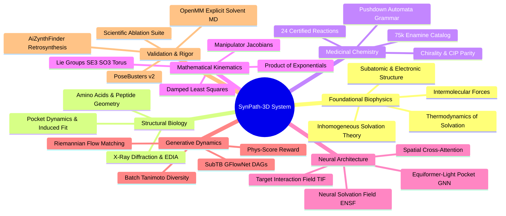

# SynPath-3D Knowledge System
## Complete Scientific & Architectural Obsidian Vault

---

### Master Map of Content (MOC)

```text
SynPath-3D Knowledge System
├── 0. Master Map of Content.md
├── 1. Foundational Physics and Physical Chemistry
│   ├── 1.1. Subatomic Physics and Chemical Bonding
│   │   ├── 1.1.1. Atomic Orbitals and Electronic Configuration.md
│   │   ├── 1.1.2. Electronegativity and Chemical Bond Types.md
│   │   └── 1.1.3. Molecular Dipoles and Polarizability.md
│   ├── 1.2. Non-Covalent Intermolecular Forces
│   │   ├── 1.2.1. Electrostatic Interactions and Salt Bridges.md
│   │   ├── 1.2.2. Hydrogen Bonding Physics and Geometry.md
│   │   ├── 1.2.3. Van der Waals Dispersion and Repulsive Walls.md
│   │   └── 1.2.4. Pi Systems and Aromatic Interactions.md
│   └── 1.3. Biological Water and Solvation Thermodynamics
│       ├── 1.3.1. Liquid Water Structure and Anomalous Thermodynamics.md
│       ├── 1.3.2. The Hydrophobic Effect and Solvation Free Energy.md
│       ├── 1.3.3. Inhomogeneous Solvation Theory and Cavity Hydration.md
│       └── 1.3.4. Worked Exercise on Cavity Water Displacement.md
├── 2. Protein Structure and Binding Pocket Biophysics
│   ├── 2.1. Amino Acid Residues and Polypeptides
│   │   ├── 2.1.1. Canonical Amino Acids and Sidechain Chemistry.md
│   │   ├── 2.1.2. Peptide Bond Resonance and Planarity.md
│   │   ├── 2.1.3. Ramachandran Angles and Secondary Structures.md
│   │   └── 2.1.4. Sidechain Rotamers and Torsional Angles.md
│   ├── 2.2. Protein Cavities and Binding Sites
│   │   ├── 2.2.1. Pocket Topography and Cryptic Cavities.md
│   │   ├── 2.2.2. Physiological Protonation and Formal Charges.md
│   │   └── 2.2.3. Apo versus Holo Induced Fit Dynamics.md
│   └── 2.3. Experimental Structural Biology
│       ├── 2.3.1. X-Ray Crystallography and Electron Density Maps.md
│       ├── 2.3.2. EDIA Scoring and Quality Control Filtration.md
│       └── 2.3.3. Worked Exercise on Electron Density and Protonation.md
├── 3. Medicinal Chemistry Stereochemistry and Synthesis
│   ├── 3.1. Hybridization and 3D Geometry
│   │   ├── 3.1.1. Orbital Hybridization and Bond Angles.md
│   │   ├── 3.1.2. Planar Resonance and Amide Isomerism.md
│   │   └── 3.1.3. Saturated Rings and Cremer-Pople Puckering.md
│   ├── 3.2. Stereochemistry and Molecular Chirality
│   │   ├── 3.2.1. Chiral Centers and CIP Stereochemical Rules.md
│   │   ├── 3.2.2. Geometric Isomers and Double Bond Invariance.md
│   │   └── 3.2.3. Biological Significance of Enantiomeric Purity.md
│   └── 3.3. Chemical Synthesis and Reaction Grammars
│       ├── 3.3.1. The Synthesizability Wall and Generative Hallucinations.md
│       ├── 3.3.2. The Stratified 75000 Enamine REAL Synthon Catalog.md
│       ├── 3.3.3. The 24 Certified Medicinal Chemistry Reaction Rules.md
│       ├── 3.3.4. Deterministic Pushdown Automata Synthesis Grammar.md
│       └── 3.3.5. Worked Exercise on Retrosynthetic Inversion and Isotopic Tracking.md
├── 4. Computational Thermodynamics and Solvation Modeling
│   ├── 4.1. Statistical Mechanics of Molecular Solvation
│   │   ├── 4.1.1. Potential of Mean Force and Distribution Functions.md
│   │   ├── 4.1.2. The Ornstein-Zernike Integral Equation.md
│   │   └── 4.1.3. Integral Equation Closures KH and PSE-3.md
│   ├── 4.2. 3D-RISM Theory and Numerical Solvers
│   │   ├── 4.2.1. Numerical Implementation of 3D-RISM via AmberTools.md
│   │   └── 4.2.2. Chemical Potential Grids and Water Frustration.md
│   └── 4.3. Equivariant Neural Solvation Field
│       ├── 4.3.1. Neural Implicit Solvation Field Distillation.md
│       ├── 4.3.2. Mathematical Formulation of the Solvation Head.md
│       └── 4.3.3. Worked Exercise on 3D-RISM Thermodynamic Integration.md
├── 5. Lie-Algebraic Geometry and Robotics Kinematics
│   ├── 5.1. Foundations of Lie Groups and Lie Algebras
│   │   ├── 5.1.1. The Special Orthogonal Group SO3 and Rotation Frames.md
│   │   ├── 5.1.2. The Special Euclidean Group SE3 and Rigid Transforms.md
│   │   └── 5.1.3. The Flat K-Torus and Torsional Manifolds.md
│   ├── 5.2. Robotics Screw Theory and Kinematics
│   │   ├── 5.2.1. Spatial Twists and Rodrigues Formula.md
│   │   ├── 5.2.2. Product of Exponentials Forward Kinematic Chains.md
│   │   └── 5.2.3. The Analytical Manipulator Jacobian.md
│   └── 5.3. Differentiable Kinematic Collision Resolution
│       ├── 5.3.1. Damped Least Squares Inverse Kinematics.md
│       ├── 5.3.2. Analytical Jacobian Projected Clash Resolution.md
│       └── 5.3.3. Worked Exercise on PoE Kinematics and Jacobian Updates.md
├── 6. SynPath-3D Core Neural Architecture
│   ├── 6.1. Equivariant Pocket Backbone
│   │   ├── 6.1.1. Six-Layer Equiformer-Light GNN Architecture.md
│   │   ├── 6.1.2. Radial Basis Encodings and Bessel Functions.md
│   │   └── 6.1.3. SASA and Solvation Node Feature Fusion.md
│   ├── 6.2. Teleological Target Interaction Field
│   │   ├── 6.2.1. The Teleological Horizon Trap in SBDD.md
│   │   ├── 6.2.2. Target Interaction Field Anchor Prediction.md
│   │   └── 6.2.3. Spatial Invariant Cross-Attention Core.md
│   └── 6.3. Discrete-Continuous Flow Heads
│       ├── 6.3.1. Twenty-Four-Class Reaction Prediction Head.md
│       ├── 6.3.2. Reaction-Masked 75000 Synthon Scoring Head.md
│       ├── 6.3.3. Coupled Riemannian Torsion Flow Head.md
│       └── 6.3.4. Worked Exercise on End-to-End Model Forward Pass.md
├── 7. Generative Dynamics and Optimization
│   ├── 7.1. Riemannian Flow Matching
│   │   ├── 7.1.1. Continuous Normalizing Flows on Riemannian Manifolds.md
│   │   ├── 7.1.2. Vector Field Regression on Flat Tori.md
│   │   └── 7.1.3. Numerical ODE Integration via Midpoint Solvers.md
│   ├── 7.2. Trajectory Balance GFlowNets
│   │   ├── 7.2.1. Generative Flow Networks on Discrete Synthesis DAGs.md
│   │   ├── 7.2.2. The Variable-Length Horizon Dilemma.md
│   │   └── 7.2.3. Sub-Trajectory Balance SubTB Formulation.md
│   └── 7.3. Multi-Objective Reward and Diversity
│       ├── 7.3.1. Differentiable Thermodynamic Phys-Score.md
│       ├── 7.3.2. Batch Tanimoto Diversity Regularization.md
│       ├── 7.3.3. Homoscedastic Multi-Task Uncertainty Loss.md
│       └── 7.3.4. Worked Exercise on SubTB Loss and GFlowNet Gradients.md
└── 8. Data Strategy Validation and Ablations
    ├── 8.1. Data Ingestion and Leakage Prevention
    │   ├── 8.1.1. Multi-Source Manifest Ingestion and Cleaning.md
    │   ├── 8.1.2. Bipartite Sequence and Structural Clustering.md
    │   └── 8.1.3. In-RAM Sharding for 96 GB VRAM Workstations.md
    ├── 8.2. Comprehensive Evaluation Suite
    │   ├── 8.2.1. PoseBusters v2 Physical Integrity Checks.md
    │   ├── 8.2.2. AiZynthFinder Retrosynthetic Feasibility.md
    │   └── 8.2.3. Ten-Nanosecond Explicit-Solvent MD Stability Harness.md
    └── 8.3. Scientific Ablation Battery
        ├── 8.3.1. Ablation Matrix ABL-01 Through ABL-05.md
        ├── 8.3.2. Falsifiable Hypotheses and Experimental Protocol.md
        └── 8.3.3. Worked Exercise on PoseBusters Violation Attribution.md
```

---

### Master Mind Map



---

# 1. Foundational Physics and Physical Chemistry