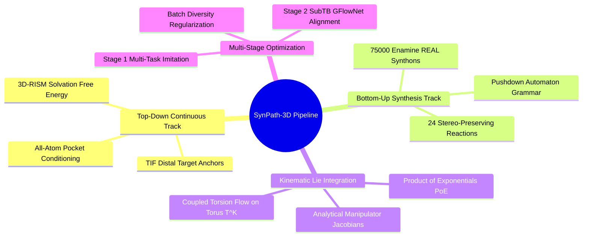

## 1.1. Overall System Architecture and Modular Decomposition
```text
File: SynPath-3D Project Engineering Vault/1. Final Model Architecture Specification/1.1. Overall System Architecture and Modular Decomposition.md
Tags: #architecture/overview #systems/modules #sbdd
```

### 1. Conceptual Framework & Theoretical Formulation
**SynPath-3D** addresses the core contradiction of structure-based drug design (SBDD): unconstrained 3D coordinate diffusion models generate molecules with strong docking scores that are synthetically impossible, while 2D forward-synthesis reaction trees guarantee synthesizability but remain blind to 3D binding pockets. 

SynPath-3D formulates molecular generation as a **Teleological (Goal-Directed) Dual-Track Generative Flow across a Lie-Kinematic Manifold**:
1. **Top-Down Continuous Track (Target-Interaction Field, TIF)**: An $\mathrm{SE}(3)$-equivariant network processes the pocket geometry and analytical water thermodynamics, predicting ideal spatial interaction anchors (hydrogen-bond vectors, water-displacement sites, salt-bridge vectors) before molecular assembly begins.
2. **Bottom-Up Discrete-Continuous Track (Dirichlet-Lie Flow Assembly)**: A discrete-continuous policy flows across the probability simplex of certified chemical reactions and catalog synthons, while simultaneously integrating coupled internal dihedrals on the flat torus $\mathbb{T}^K$.
3. **Robotics Screw-Theory Kinematics**: Conformations are evaluated via the Product of Exponentials (PoE) formulation, preserving bond lengths and valence angles to machine precision while an analytical spatial Jacobian resolves steric clashes in $< 0.5\text{ ms}$.

