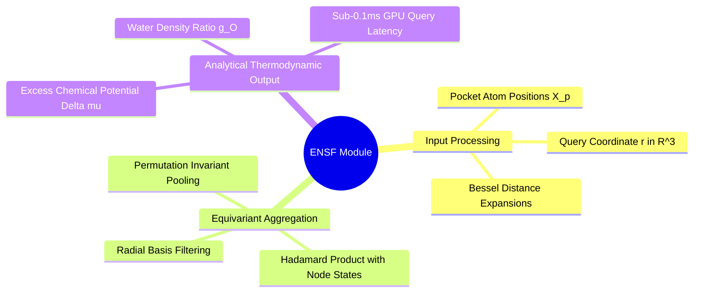

## 1.4. Equivariant Neural Solvation Field (ENSF) Module
```text
File: SynPath-3D Project Engineering Vault/1. Final Model Architecture Specification/1.4. Equivariant Neural Solvation Field (ENSF) Module.md
Tags: #architecture/ensf #solvation #neural-fields
```

### 1. Functional Specification
The **ENSF** is an SE(3)-equivariant continuous coordinate network that maps arbitrary 3D spatial queries $\vec{r} \in \mathbb{R}^3$ to the excess chemical potential of water $\Delta \mu_{\text{excess}}(\vec{r})$ and local water density ratio $g_O(\vec{r})$, without running runtime numerical solvers.



Mathematical Formulation:
$$\Psi_\phi(\vec{r} \mid \mathcal{P}) = \text{MLP}_{\text{out}}\left( \sum_{j \in \mathcal{P}, \|\vec{x}_j - \vec{r}\| \le 6.0\text{ \AA}} \text{MLP}_{\text{filter}}\left( \text{RBF}(\|\vec{x}_j - \vec{r}\|) \right) \odot \mathbf{h}_{p, j} \right) \in \mathbb{R}^2$$
* Output 0: $\Delta \mu_{\text{excess}}(\vec{r}) \in \mathbb{R}$ (values $> +1.5\text{ kcal/mol}$ mark frustrated water favorable for ligand displacement; values $< -2.0\text{ kcal/mol}$ mark structural water that must be preserved).
* Output 1: $g_O(\vec{r}) \in \mathbb{R}^+$ (water oxygen pair correlation ratio relative to bulk solvent).