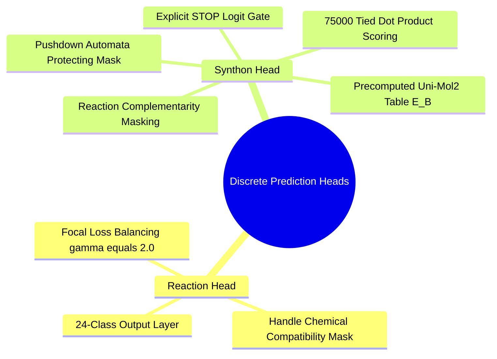

## 1.7. Discrete Heads: Reaction and Synthon Selection
```text
File: SynPath-3D Project Engineering Vault/1. Final Model Architecture Specification/1.7. Discrete Heads Reaction and Synthon Selection.md
Tags: #architecture/discrete-heads #classification #masking
```

### 1. Functional Specification
Operates on the latent planning state $\mathbf{z}_t$ to select the next chemical reaction $r_t$ and catalog building block $B_t$.



1. **24-Class Reaction Head**:
   $$\mathbf{l}_{\text{rxn}} = \mathbf{W}_{\text{rxn2}} \text{SiLU}(\mathbf{W}_{\text{rxn1}}\mathbf{z}_t + \mathbf{b}_1) + \mathbf{b}_2 \in \mathbb{R}^{24}$$
   $$P(r_t = k \mid \mathbf{z}_t) = \text{Softmax}\left( \mathbf{l}_{\text{rxn}} + \mathbf{M}_{\text{handle}}(u) \right)_k$$
   where $\mathbf{M}_{\text{handle}}(u) \in \{0, -\infty\}^{24}$ masks chemically incompatible reaction families.
2. **75,000-Class Synthon Head**:
   $$\mathbf{l}_{\text{syn}} = \frac{(\mathbf{W}_{\text{query}}\mathbf{z}_t) \mathbf{E}_B^T}{\sqrt{256}} \in \mathbb{R}^{75000}$$
   $$\text{Logit}_{\text{STOP}} = \frac{(\mathbf{W}_{\text{query}}\mathbf{z}_t) \mathbf{e}_{\text{STOP}}^T}{\sqrt{256}} + \text{MLP}_{\text{gate}}(\text{GlobalFeatures}(\mathcal{M}_t)) \in \mathbb{R}^1$$
   $$P(B_t = j \mid r_t, u, \mathbf{z}_t) = \text{Softmax}\left( [\mathbf{l}_{\text{syn}} + \mathbf{M}_{\text{rxn}}(u, r_t) + \mathbf{M}_{\text{DPDA}}, \, \text{Logit}_{\text{STOP}}] \right)_j$$
   * $\mathbf{M}_{\text{rxn}}(u, r_t) \in \{0, -\infty\}^{75000}$: Masks building blocks lacking the required complementary functional handle.
   * $\mathbf{M}_{\text{DPDA}} \in \{0, -\infty\}^{75000}$: Masks building blocks with protected handles barred by the pushdown automaton stack.
   * $\text{Logit}_{\text{STOP}}$: Clamped to $-\infty$ if $M_W < 250\text{ Da}$, preventing premature termination on single fragments.