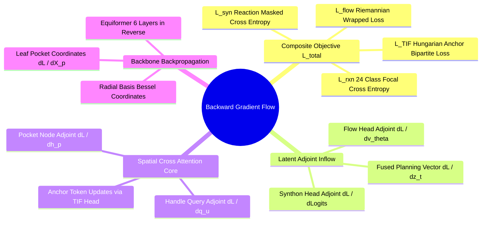

## 2.3. Inter-Module Gradient Flow and Backward Propagation Graph
```text
File: SynPath-3D Project Engineering Vault/2. Complete Tensor and Data Flow Lifecycle/2.3. Inter-Module Gradient Flow and Backward Propagation Graph.md
Tags: #autograd/gradient-graph #backward-pass #backpropagation
```

### 1. Reverse Automatic Differentiation Connectivity
Every backward step traverses the computational DAG in reverse topological order, accumulating parameter gradients:



---

# 3. Exact Multi-Task Training Objective and Loss Formulations