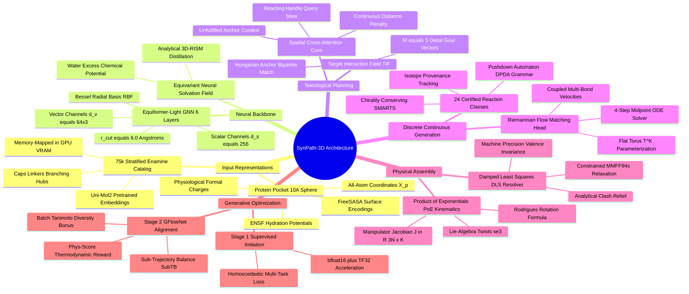

# SynPath-3D Project Engineering Vault
## The Definitive Technical Specification & System Architecture

---

### Master Systems Map of Content (MOC)

```text
SynPath-3D Project Engineering Vault
├── 0. SynPath-3D Master Map of Content.md
├── 1. Final Model Architecture Specification
│   ├── 1.1. Overall System Architecture and Modular Decomposition.md
│   ├── 1.2. Component Lifecycle: Kept, Removed, Replaced, and Redesigned.md
│   ├── 1.3. 6-Layer Equiformer-Light Pocket Backbone.md
│   ├── 1.4. Equivariant Neural Solvation Field (ENSF) Module.md
│   ├── 1.5. Target-Interaction Field (TIF) Anchor Predictor.md
│   ├── 1.6. Handle-Centered Spatial Cross-Attention Core.md
│   ├── 1.7. Discrete Heads: Reaction and Synthon Selection.md
│   ├── 1.8. Continuous Head: Coupled Torus Riemannian Flow Matching.md
│   └── 1.9. Robotics Product of Exponentials (PoE) Kinematics Engine.md
├── 2. Complete Tensor and Data Flow Lifecycle
│   ├── 2.1. End-to-End Tensor Shape and Dtype Trace.md
│   ├── 2.2. Computation and Memory Complexity Profiles.md
│   └── 2.3. Inter-Module Gradient Flow and Backward Propagation Graph.md
├── 3. Exact Multi-Task Training Objective and Loss Formulations
│   ├── 3.1. Stage-1 Multi-Task Loss with Homoscedastic Uncertainty.md
│   ├── 3.2. Stage-2 Sub-Trajectory Balance (SubTB) GFlowNet Objective.md
│   └── 3.3. Differentiable Thermodynamic Phys-Score Reward Functional.md
├── 4. Chemical Reaction and Retrosynthesis Logic
│   ├── 4.1. The 24 Certified Stereo-Preserving Reaction Grammar.md
│   ├── 4.2. Stratified 75,000 Enamine REAL Synthon Catalog.md
│   ├── 4.3. Deterministic Pushdown Automata Synthesis Grammar.md
│   └── 4.4. Isotopic Atom Provenance and Stereochemical Parity Conservation.md
├── 5. Protein Pocket and 3D Conditioning Engine
│   ├── 5.1. All-Atom Pocket Featurization with FreeSASA and Formal Charges.md
│   ├── 5.2. Analytical 3D-RISM Cavity Hydration Distillation.md
│   └── 5.3. Spatial Distance Biasing and Frame Equivariance Proofs.md
├── 6. Dataset Pipeline and Multi-Source Ingestion
│   ├── 6.1. Multi-Source Structural Biology Corpus Architecture.md
│   ├── 6.2. Ingestion Rules for PDBbind, MOAD, and CrossDocked.md
│   └── 6.3. Pre-Featurized In-RAM Sharding Infrastructure.md
├── 7. Data Acquisition and Storage Strategy
│   ├── 7.1. Raw Source Repositories, APIs, and Mirrored Storage.md
│   └── 7.2. Automated Download, Checksumming, and Verification Pipeline.md
├── 8. Data Cleaning, Quality Control, and Filtration
│   ├── 8.1. Diffraction Quality, Resolution, and R-Free Gateways.md
│   ├── 8.2. Electron Density Validation via EDIA Scoring.md
│   └── 8.3. Receptor Protonation and Tautomer Optimization via Protoss.md
├── 9. Data Splitting and Leakage Prevention Strategy
│   ├── 9.1. Bipartite Sequence and Structural Clustering Protocol.md
│   └── 9.2. Bemis-Murcko Scaffold Exclusion and Generalization Tests.md
├── 10. Dataset Statistics and Empirical Distributions
│   └── 10.1. Verified Population Metrics and Physical Chemistry Distributions.md
├── 11. Hyperparameter Manifest and Training Configuration
│   └── 11.1. Master Production Configuration and Execution Profile.md
├── 12. GPU and Hardware Optimization Strategy
│   ├── 12.1. NVIDIA RTX 6000 Ada Memory Map and VRAM Anatomy.md
│   └── 12.2. Native Bfloat16, TF32 Tensor Cores, and Memory Allocation.md
├── 13. Computational Performance and Profiling
│   ├── 13.1. Roofline Intensity and Compute versus Memory Bounds.md
│   └── 13.2. PyTorch 2.1 Compilation, Kernel Fusion, and FlashAttention.md
├── 14. Repository Software Architecture and Codebase Mapping
│   ├── 14.1. Directory Structure and Component Dependency Graph.md
│   └── 14.2. Module Specification: Inputs, Outputs, and Interfaces.md
├── 15. Orchestration Workflows: Local, Kaggle, and Cloud
│   └── 15.1. Headless Execution, Environment Setup, and Multi-Session Resumption.md
├── 16. Checkpoint Integrity and Experiment Management
│   ├── 16.1. Resilient Atomic Checkpointing and State Verification.md
│   └── 16.2. Device-Placement Safeguards and Hugging Face Hub Sync.md
├── 17. Evaluation and Benchmarking Suite
│   ├── 17.1. PoseBusters v2 Physical Integrity Protocol.md
│   ├── 17.2. AiZynthFinder Retrosynthetic Feasibility Engine.md
│   └── 17.3. 10-Nanosecond Explicit-Solvent OpenMM MD Stability Harness.md
├── 18. Scientific Ablation Battery (ABL-01 through ABL-05)
│   └── 18.1. Controlled Experimental Protocols and Falsification Criteria.md
├── 19. Architecture Decision Records (ADRs)
│   └── 19.1. Concrete Rationale for the Twelve Core System Decisions.md
├── 20. End-to-End System Blueprint and Execution Trace
│   └── 20.1. Master Structural Pipeline: From PDB to Synthesized Drug.md
├── 21. Code-to-Concept Implementation Matrix
│   └── 21.1. Direct Mapping Between Theoretical Formulations and Source Files.md
└── 22. The "Understand the Project" Foundational Mental Model
    └── 22.1. Eighteen Foundational Questions and Definitive Solutions.md
```

---

### Master Architecture Mind Map



---

# 1. Final Model Architecture Specification