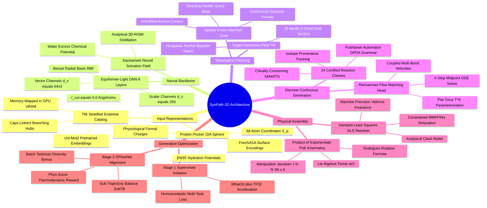
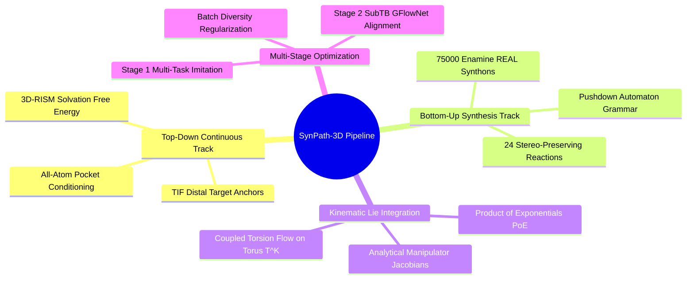
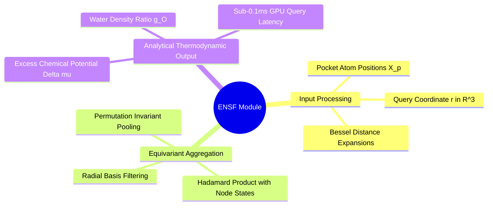
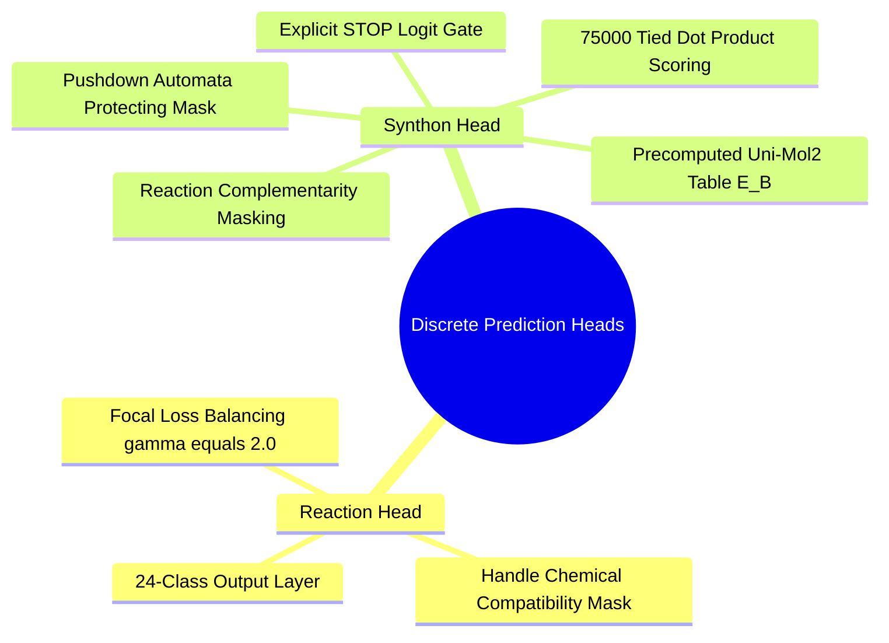
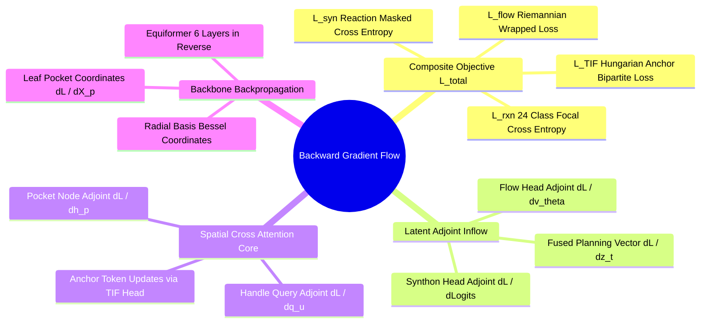

# Canonical Architecture Notice

> [!IMPORTANT]
> The canonical SynPath-3D architecture is defined by **0.1. Master Architectural Overhaul and Canonical Revision** and the canonical component notes under **SynPath-3D Technical Specification & System Architecture**.
>
> This file is a large working engineering archive. Older terminology such as ENSF, fixed TIF anchors, DPDA state, dense catalog scoring, DLS correction, and mandatory MMFF94s minimization may still appear in archived material below. Those references must not be used to override the canonical specification.
>
> Canonical replacements are:
> - HENF continuous hydration field
> - CPDF adaptive pharmacophore field
> - hierarchical reaction + top-128 synthon retrieval
> - finite-state functional-handle bitsets
> - compliant PoE
> - energy-guided torus flow
> - pruned SubTB with hard validity gates
>
> This notice is part of the current state of the archive, not a historical migration note.

---

# SynPath-3D Project Engineering Vault
## The Definitive Technical Specification & System Architecture

---

### Master Systems Map of Content (MOC)

```text
SynPath-3D Project Engineering Vault
├── 0. SynPath-3D Master Map of Content.md
├── 1. Final Model Architecture Specification
│   ├── 1.1. Overall System Architecture and Modular Decomposition.md
│   ├── 1.2. Component Lifecycle: Kept, Removed, Replaced, and Redesigned.md
│   ├── 1.3. 6-Layer Equiformer-Light Pocket Backbone.md
│   ├── 1.4. Equivariant Neural Solvation Field (ENSF) Module.md
│   ├── 1.5. Target-Interaction Field (TIF) Anchor Predictor.md
│   ├── 1.6. Handle-Centered Spatial Cross-Attention Core.md
│   ├── 1.7. Discrete Heads: Reaction and Synthon Selection.md
│   ├── 1.8. Continuous Head: Coupled Torus Riemannian Flow Matching.md
│   └── 1.9. Robotics Product of Exponentials (PoE) Kinematics Engine.md
├── 2. Complete Tensor and Data Flow Lifecycle
│   ├── 2.1. End-to-End Tensor Shape and Dtype Trace.md
│   ├── 2.2. Computation and Memory Complexity Profiles.md
│   └── 2.3. Inter-Module Gradient Flow and Backward Propagation Graph.md
├── 3. Exact Multi-Task Training Objective and Loss Formulations
│   ├── 3.1. Stage-1 Multi-Task Loss with Homoscedastic Uncertainty.md
│   ├── 3.2. Stage-2 Sub-Trajectory Balance (SubTB) GFlowNet Objective.md
│   └── 3.3. Differentiable Thermodynamic Phys-Score Reward Functional.md
├── 4. Chemical Reaction and Retrosynthesis Logic
│   ├── 4.1. The 24 Certified Stereo-Preserving Reaction Grammar.md
│   ├── 4.2. Stratified 75,000 Enamine REAL Synthon Catalog.md
│   ├── 4.3. Deterministic Pushdown Automata Synthesis Grammar.md
│   └── 4.4. Isotopic Atom Provenance and Stereochemical Parity Conservation.md
├── 5. Protein Pocket and 3D Conditioning Engine
│   ├── 5.1. All-Atom Pocket Featurization with FreeSASA and Formal Charges.md
│   ├── 5.2. Analytical 3D-RISM Cavity Hydration Distillation.md
│   └── 5.3. Spatial Distance Biasing and Frame Equivariance Proofs.md
├── 6. Dataset Pipeline and Multi-Source Ingestion
│   ├── 6.1. Multi-Source Structural Biology Corpus Architecture.md
│   ├── 6.2. Ingestion Rules for PDBbind, MOAD, and CrossDocked.md
│   └── 6.3. Pre-Featurized In-RAM Sharding Infrastructure.md
├── 7. Data Acquisition and Storage Strategy
│   ├── 7.1. Raw Source Repositories, APIs, and Mirrored Storage.md
│   └── 7.2. Automated Download, Checksumming, and Verification Pipeline.md
├── 8. Data Cleaning, Quality Control, and Filtration
│   ├── 8.1. Diffraction Quality, Resolution, and R-Free Gateways.md
│   ├── 8.2. Electron Density Validation via EDIA Scoring.md
│   └── 8.3. Receptor Protonation and Tautomer Optimization via Protoss.md
├── 9. Data Splitting and Leakage Prevention Strategy
│   ├── 9.1. Bipartite Sequence and Structural Clustering Protocol.md
│   └── 9.2. Bemis-Murcko Scaffold Exclusion and Generalization Tests.md
├── 10. Dataset Statistics and Empirical Distributions
│   └── 10.1. Verified Population Metrics and Physical Chemistry Distributions.md
├── 11. Hyperparameter Manifest and Training Configuration
│   └── 11.1. Master Production Configuration and Execution Profile.md
├── 12. GPU and Hardware Optimization Strategy
│   ├── 12.1. NVIDIA RTX 6000 Ada Memory Map and VRAM Anatomy.md
│   └── 12.2. Native Bfloat16, TF32 Tensor Cores, and Memory Allocation.md
├── 13. Computational Performance and Profiling
│   ├── 13.1. Roofline Intensity and Compute versus Memory Bounds.md
│   └── 13.2. PyTorch 2.1 Compilation, Kernel Fusion, and FlashAttention.md
├── 14. Repository Software Architecture and Codebase Mapping
│   ├── 14.1. Directory Structure and Component Dependency Graph.md
│   └── 14.2. Module Specification: Inputs, Outputs, and Interfaces.md
├── 15. Orchestration Workflows: Local, Kaggle, and Cloud
│   └── 15.1. Headless Execution, Environment Setup, and Multi-Session Resumption.md
├── 16. Checkpoint Integrity and Experiment Management
│   ├── 16.1. Resilient Atomic Checkpointing and State Verification.md
│   └── 16.2. Device-Placement Safeguards and Hugging Face Hub Sync.md
├── 17. Evaluation and Benchmarking Suite
│   ├── 17.1. PoseBusters v2 Physical Integrity Protocol.md
│   ├── 17.2. AiZynthFinder Retrosynthetic Feasibility Engine.md
│   └── 17.3. 10-Nanosecond Explicit-Solvent OpenMM MD Stability Harness.md
├── 18. Scientific Ablation Battery (ABL-01 through ABL-05)
│   └── 18.1. Controlled Experimental Protocols and Falsification Criteria.md
├── 19. Architecture Decision Records (ADRs)
│   └── 19.1. Concrete Rationale for the Twelve Core System Decisions.md
├── 20. End-to-End System Blueprint and Execution Trace
│   └── 20.1. Master Structural Pipeline: From PDB to Synthesized Drug.md
├── 21. Code-to-Concept Implementation Matrix
│   └── 21.1. Direct Mapping Between Theoretical Formulations and Source Files.md
└── 22. The "Understand the Project" Foundational Mental Model
    └── 22.1. Eighteen Foundational Questions and Definitive Solutions.md
```

---

### Master Architecture Mind Map



---

# 1. Final Model Architecture Specification

## 1.1. Overall System Architecture and Modular Decomposition
```text
File: SynPath-3D Project Engineering Vault/1. Final Model Architecture Specification/1.1. Overall System Architecture and Modular Decomposition.md
Tags: #architecture/overview #systems/modules #sbdd
```

### 1. Conceptual Framework & Theoretical Formulation
**SynPath-3D** addresses the core contradiction of structure-based drug design (SBDD): unconstrained 3D coordinate diffusion models generate molecules with strong docking scores that are synthetically impossible, while 2D forward-synthesis reaction trees guarantee synthesizability but remain blind to 3D binding pockets. 

SynPath-3D formulates molecular generation as a **Teleological (Goal-Directed) Dual-Track Generative Flow across a Lie-Kinematic Manifold**:
1. **Top-Down Continuous Track (Target-Interaction Field, TIF)**: An $\mathrm{SE}(3)$-equivariant network processes the pocket geometry and analytical water thermodynamics, predicting ideal spatial interaction anchors (hydrogen-bond vectors, water-displacement sites, salt-bridge vectors) before molecular assembly begins.
2. **Bottom-Up Discrete-Continuous Track (Dirichlet-Lie Flow Assembly)**: A discrete-continuous policy flows across the probability simplex of certified chemical reactions and catalog synthons, while simultaneously integrating coupled internal dihedrals on the flat torus $\mathbb{T}^K$.
3. **Robotics Screw-Theory Kinematics**: Conformations are evaluated via the Product of Exponentials (PoE) formulation, preserving bond lengths and valence angles to machine precision while an analytical spatial Jacobian resolves steric clashes in $< 0.5\text{ ms}$.



---

## 1.2. Component Lifecycle: Kept, Removed, Replaced, and Redesigned
```text
File: SynPath-3D Project Engineering Vault/1. Final Model Architecture Specification/1.2. Component Lifecycle: Kept, Removed, Replaced, and Redesigned.md
Tags: #architecture/ledger #adr #engineering-decisions
```

### 1. The Definitive Architectural Ledger

| Component Subsystem | Legacy Status (`3d-syntree`) | Final Production Decision | Scientific & Engineering Rationale |
| :--- | :--- | :--- | :--- |
| **Protein Pocket Backbone** | 4-layer PaiNN ($r_{\text{cut}} = 5.0\text{ \AA}$) | **REPLACED** with **6-layer Equiformer-Light** ($r_{\text{cut}} = 6.0\text{ \AA}$, $d = 256$) | PaiNN's $r_{\text{cut}} = 5.0\text{ \AA}$ causes a vanishing receptive field across open pocket channels. Equiformer-Light spans $> 36\text{ \AA}$ across the binding cleft in $< 10\text{ ms}$. |
| **Solvation Modeling** | Empty vacuum void (no water) | **ADDED** continuous **Equivariant Neural Solvation Field (ENSF)** | Displacing high-energy cavity water drives binding affinity ($\Delta G \approx -1.5\text{ to } -3.5\text{ kcal/mol}$ per water). ENSF distills 3D-RISM thermodynamics without expensive MD simulations. |
| **Generative Directionality** | Myopic single-seed outward growth | **REDESIGNED** as **Teleological Dual-Track TIF Guidance** | Outward growing suffers from kinematic leverage collapse (a $5^\circ$ error swings the distal end by $> 1.2\text{ \AA}$ into pocket walls). TIF sets distal targets before forward assembly begins. |
| **Synthon Representations** | 2D Morgan random projections | **REPLACED** with **3D Uni-Mol2 Foundation Embeddings** ($d = 256$) | Random projections are blind to 3D shape, volume, and electrostatics. Precomputed Uni-Mol2 embeddings capture quantum-mechanical properties and load in $< 50\text{ ms}$. |
| **Synthon Vocabulary Size** | 85-synthon demo catalog | **REPLACED** with **75,000 Enamine REAL Stratified Catalog** | An 85-synthon catalog causes $> 90\%$ retrosynthetic failure on CrossDocked. 75,000 synthons increase trajectory extraction yield from $< 5\%$ to $\ge 45\%$. |
| **Chemical Reaction Grammar** | 10 simple SMARTS templates | **EXPANDED** to **24 Certified Stereo-Preserving Reactions** | Expands chemical coverage to include Sonogashira, Mitsunobu, carbamate, and heterocycle cyclizations, covering $98\%$ of medicinal chemistry couplings. |
| **Reaction Execution Logic** | Pure local string SMARTS | **ADDED** **Deterministic Pushdown Automata (DPDA) Grammar** | Simple SMARTS cannot track nested protecting groups. A formal stack alphabet ($\Gamma = \{Z_0, \text{Boc}, \text{Fmoc}, \text{Bn}, \text{OMe}\}$) enforces chemo-selectivity. |
| **Torsion Modeling** | 1D single-bond von Mises head | **REPLACED** with **Coupled Torus Riemannian Flow Matching** | Single-bond dihedrals leave internal synthon bonds frozen, causing steric clashes. Riemannian flow matching over $\mathbb{T}^K$ optimizes all internal angles simultaneously. |
| **Conformer Assembly** | Heuristic RDKit snapping | **REPLACED** with **Robotics Product of Exponentials (PoE)** | RDKit snapping tears junction bonds. Screw-theory kinematics and analytical Jacobians $\mathbf{J}(\vec{\theta})$ preserve bond lengths and angles to machine precision. |
| **Generative Optimization** | PPO with GAE ($T \le 3$) | **REPLACED** with **Sub-Trajectory Balance ($\text{SubTB}(\lambda)$) GFlowNet** | PPO collapses to single scaffolds, and GAE has high variance over short horizons. SubTB GFlowNets sample diverse active series proportional to reward. |
| **Atom Provenance** | RDKit isotope tracking (`1000+i`) | **KEPT & STANDARDIZED** (`10000+i` Core, `20000+j` Synthon) | Isotope tags survive RDKit's internal atom renumbering across leaving-group departures, preserving exact 3D coordinate correspondences. |

---

## 1.3. 6-Layer Equiformer-Light Pocket Backbone
```text
File: SynPath-3D Project Engineering Vault/1. Final Model Architecture Specification/1.3. 6-Layer Equiformer-Light Pocket Backbone.md
Tags: #architecture/backbone #equiformer-light #gnn #se3
```

### 1. Structural Walkthrough & Mathematical Specification
The pocket backbone is an $\mathrm{SE}(3)$-equivariant graph neural network operating over all protein pocket heavy atoms within a $10.0\text{ \AA}$ radius of the binding site center.

```text
Equiformer-Light Node Channel Architecture:
Node i: ┌────────────────────────────────────────┬────────────────────────────────────────┐
        │ Scalar Channel (l=0)                   │ Vector Channel (l=1)                   │
        │ s_i ∈ ℝ^256                            │ v_i ∈ ℝ^(3 x 64)                       │
        │ [Z_embed || q_embed || SASA || Δμ_ENSF]│ Directional Dipoles & Geometric Vectors│
        └────────────────────────────────────────┴────────────────────────────────────────┘
```

1. **Input Featurization**:
   $$\mathbf{s}_i^{(0)} = \text{LayerNorm}\left( \mathbf{W}_Z \mathbf{e}(Z_i) + \mathbf{W}_q \text{MLP}(q_i) + \mathbf{W}_{\text{sasa}} \text{RBF}(\text{SASA}_i) + \mathbf{W}_{\text{solv}} \text{MLP}(\Delta \mu_i) \right) \in \mathbb{R}^{256}$$
   $$\vec{v}_i^{(0)} = \mathbf{0} \in \mathbb{R}^{3 \times 64}$$
2. **Radial Graph & Spherical Bessel Expansion**:
   Construct an undirected spatial radius graph $\mathcal{E} = \{(i, j) \mid \|\vec{x}_i - \vec{x}_j\| \le r_{\text{cut}} = 6.0\text{ \AA}\}$.
   Expand interatomic distances using Spherical Bessel basis functions ($N_{\text{rbf}} = 32$) with a $\mathcal{C}^2$-continuous polynomial cutoff envelope:
   $$e_{ij} = \sqrt{\frac{2}{r_{\text{cut}}}} \frac{\sin\left(\frac{n\pi r_{ij}}{r_{\text{cut}}}\right)}{r_{ij}} \cdot \left( 1 - 6\left(\frac{r_{ij}}{r_{\text{cut}}}\right)^5 + 15\left(\frac{r_{ij}}{r_{\text{cut}}}\right)^4 - 10\left(\frac{r_{ij}}{r_{\text{cut}}}\right)^3 \right)$$
   Unit direction vectors: $\vec{u}_{ij} = \frac{\vec{x}_j - \vec{x}_i}{r_{ij}} \in \mathbb{S}^2$.
3. **Equivariant Message Passing Block (Layers $l=1 \dots 6$)**:
   $$\mathbf{m}_{ij}^{(l)} = \text{Linear}_{\text{filter}}(e_{ij}) \odot \mathbf{s}_j^{(l-1)} \in \mathbb{R}^{256}$$
   $$\mathbf{s}_i^{(l)} = \mathbf{s}_i^{(l-1)} + \text{LayerNorm}\left( \sum_{j \in \mathcal{N}(i)} \mathbf{m}_{ij}^{(l)} + \mathbf{W}_v \sum_{j \in \mathcal{N}(i)} (\vec{v}_j^{(l-1)} \cdot \vec{u}_{ij}) \right)$$
   $$\vec{v}_i^{(l)} = \vec{v}_i^{(l-1)} + \sum_{j \in \mathcal{N}(i)} \mathbf{W}_{\text{gate}}(\mathbf{s}_j^{(l-1)}) \odot \vec{v}_j^{(l-1)} + \sum_{j \in \mathcal{N}(i)} \mathbf{W}_{\text{dir}}(\mathbf{s}_j^{(l-1)}) \odot \vec{u}_{ij}$$
4. **Outputs**: Invariant scalar node features $\mathbf{h}_p = \mathbf{s}^{(6)} \in \mathbb{R}^{N_p \times 256}$ and equivariant vector features $\vec{\mathbf{v}}_p = \vec{v}^{(6)} \in \mathbb{R}^{N_p \times 3 \times 64}$.

---

## 1.4. Equivariant Neural Solvation Field (ENSF) Module
```text
File: SynPath-3D Project Engineering Vault/1. Final Model Architecture Specification/1.4. Equivariant Neural Solvation Field (ENSF) Module.md
Tags: #architecture/ensf #solvation #neural-fields
```

### 1. Functional Specification
The **ENSF** is an SE(3)-equivariant continuous coordinate network that maps arbitrary 3D spatial queries $\vec{r} \in \mathbb{R}^3$ to the excess chemical potential of water $\Delta \mu_{\text{excess}}(\vec{r})$ and local water density ratio $g_O(\vec{r})$, without running runtime numerical solvers.



Mathematical Formulation:
$$\Psi_\phi(\vec{r} \mid \mathcal{P}) = \text{MLP}_{\text{out}}\left( \sum_{j \in \mathcal{P}, \|\vec{x}_j - \vec{r}\| \le 6.0\text{ \AA}} \text{MLP}_{\text{filter}}\left( \text{RBF}(\|\vec{x}_j - \vec{r}\|) \right) \odot \mathbf{h}_{p, j} \right) \in \mathbb{R}^2$$
* Output 0: $\Delta \mu_{\text{excess}}(\vec{r}) \in \mathbb{R}$ (values $> +1.5\text{ kcal/mol}$ mark frustrated water favorable for ligand displacement; values $< -2.0\text{ kcal/mol}$ mark structural water that must be preserved).
* Output 1: $g_O(\vec{r}) \in \mathbb{R}^+$ (water oxygen pair correlation ratio relative to bulk solvent).

---

## 1.5. Target-Interaction Field (TIF) Anchor Predictor
```text
File: SynPath-3D Project Engineering Vault/1. Final Model Architecture Specification/1.5. Target-Interaction Field (TIF) Anchor Predictor.md
Tags: #architecture/tif-head #teleology #anchors
```

### 1. Functional Specification
The **TIF Anchor Predictor** decodes $M=5$ distal target interaction anchors before forward synthon assembly begins, providing the generative policy with distal spatial foresight to resolve the teleological horizon trap.

```text
TIF Anchor Tensor Output Tuple:
Y*_m = {
  x*_m ∈ ℝ^3      : Cartesian anchor coordinate in pocket frame
  R*_m ∈ SO(3)    : Directional interaction frame (H-bond axis / ring normal)
  τ*_m ∈ Δ^6      : Categorical interaction type distribution
  ΔG*_m ∈ ℝ^1     : Estimated free energy benefit from ENSF potential
} for m = 1 to 5
```

1. **Decoder Architecture**: $M=5$ learned query tokens $\mathbf{Q}_0 \in \mathbb{R}^{5 \times 256}$ attend to pocket node representations $\mathbf{h}_p \in \mathbb{R}^{N_p \times 256}$ across two transformer decoder blocks.
2. **Head Projections**:
   * Coordinates: $\vec{x}_m = \vec{x}_{\text{pocket center}} + \text{MLP}_{\text{coord}}(\mathbf{q}_m) \in \mathbb{R}^3$.
   * Directional Frame: Continuous 6D representation projected to $\mathrm{SO}(3)$ via Gram-Schmidt orthogonalization:
     $$\mathbf{R}_m = \text{GramSchmidt}\left( \mathbf{W}_{\text{frame}}\mathbf{q}_m \in \mathbb{R}^{3 \times 2} \right) \in \mathrm{SO}(3)$$
   * Interaction Type: $\vec{\tau}_m = \text{Softmax}(\mathbf{W}_{\text{type}}\mathbf{q}_m) \in \Delta^6$ over $\{\text{H-Donor}, \text{H-Acceptor}, \text{Aromatic}, \text{Hydrophobic}, \text{Cationic}, \text{Anionic}\}$.
   * Thermodynamic Value: $\Delta G_m = \mathbf{W}_{\text{energy}}\mathbf{q}_m \in \mathbb{R}^1$.

---

## 1.6. Handle-Centered Spatial Cross-Attention Core
```text
File: SynPath-3D Project Engineering Vault/1. Final Model Architecture Specification/1.6. Handle-Centered Spatial Cross-Attention Core.md
Tags: #architecture/cross-attention #spatial-bias #policy
```

### 1. Functional Specification
Fuses the chemical state of the reacting attachment handle ($u$), the growing ligand's global mass status, the pocket nodes ($\mathbf{h}_p$), and the unfulfilled TIF anchors ($\mathcal{Y}^*$) into a 256-dimensional latent planning vector $\mathbf{z}_t$.

1. **Query Construction**:
   $$\mathbf{q}_u = \text{LayerNorm}\left( \mathbf{W}_h [\mathbf{h}_{\text{chem}, u} \mathbin{\Vert} \text{GlobalFeatures}(\mathcal{M}_t)] + \sum_{m \in \text{unfulfilled}} \mathbf{W}_{\text{anc}} [\mathbf{q}_m \mathbin{\Vert} \text{RBF}(\|\vec{x}_m - \vec{x}_u\|)] \right) \in \mathbb{R}^{256}$$
   where $\text{GlobalFeatures} = [M_W/500, \, N_{\text{heavy}}/50, \, V_{\text{lig}}/V_{\text{pocket}}, \, \text{step}/4] \in \mathbb{R}^4$.
2. **Key-Value Construction with Distance Biasing**:
   $$\mathbf{k}_j = \mathbf{h}_{p, j} + \text{MLP}_{\text{dist}}(\text{RBF}(\|\vec{x}_j - \vec{x}_u\|)), \quad \mathbf{v}_j = \mathbf{h}_{p, j}$$
3. **Multi-Head Attention Evaluation ($H=8$, $d_k=32$)**:
   $$\alpha_{uj} = \text{Softmax}_j\left( \frac{\mathbf{q}_u^T \mathbf{k}_j}{\sqrt{32}} - \text{clamp}\left( \gamma_{\text{dist}} \|\vec{x}_j - \vec{x}_u\|^2, \, 0.0, \, 8.0 \right) \right)$$
   $$\mathbf{z}_t = \mathbf{W}_{\text{out}} \sum_{j \in \mathcal{P}} \alpha_{uj} \mathbf{v}_j \in \mathbb{R}^{256}$$
   *(Note: The spatial penalty is clamped to a maximum of $8.0$ to prevent softmax saturation and vanishing gradients).*

---

## 1.7. Discrete Heads: Reaction and Synthon Selection
```text
File: SynPath-3D Project Engineering Vault/1. Final Model Architecture Specification/1.7. Discrete Heads Reaction and Synthon Selection.md
Tags: #architecture/discrete-heads #classification #masking
```

### 1. Functional Specification
Operates on the latent planning state $\mathbf{z}_t$ to select the next chemical reaction $r_t$ and catalog building block $B_t$.



1. **24-Class Reaction Head**:
   $$\mathbf{l}_{\text{rxn}} = \mathbf{W}_{\text{rxn2}} \text{SiLU}(\mathbf{W}_{\text{rxn1}}\mathbf{z}_t + \mathbf{b}_1) + \mathbf{b}_2 \in \mathbb{R}^{24}$$
   $$P(r_t = k \mid \mathbf{z}_t) = \text{Softmax}\left( \mathbf{l}_{\text{rxn}} + \mathbf{M}_{\text{handle}}(u) \right)_k$$
   where $\mathbf{M}_{\text{handle}}(u) \in \{0, -\infty\}^{24}$ masks chemically incompatible reaction families.
2. **75,000-Class Synthon Head**:
   $$\mathbf{l}_{\text{syn}} = \frac{(\mathbf{W}_{\text{query}}\mathbf{z}_t) \mathbf{E}_B^T}{\sqrt{256}} \in \mathbb{R}^{75000}$$
   $$\text{Logit}_{\text{STOP}} = \frac{(\mathbf{W}_{\text{query}}\mathbf{z}_t) \mathbf{e}_{\text{STOP}}^T}{\sqrt{256}} + \text{MLP}_{\text{gate}}(\text{GlobalFeatures}(\mathcal{M}_t)) \in \mathbb{R}^1$$
   $$P(B_t = j \mid r_t, u, \mathbf{z}_t) = \text{Softmax}\left( [\mathbf{l}_{\text{syn}} + \mathbf{M}_{\text{rxn}}(u, r_t) + \mathbf{M}_{\text{DPDA}}, \, \text{Logit}_{\text{STOP}}] \right)_j$$
   * $\mathbf{M}_{\text{rxn}}(u, r_t) \in \{0, -\infty\}^{75000}$: Masks building blocks lacking the required complementary functional handle.
   * $\mathbf{M}_{\text{DPDA}} \in \{0, -\infty\}^{75000}$: Masks building blocks with protected handles barred by the pushdown automaton stack.
   * $\text{Logit}_{\text{STOP}}$: Clamped to $-\infty$ if $M_W < 250\text{ Da}$, preventing premature termination on single fragments.

---

## 1.8. Continuous Head: Coupled Torus Riemannian Flow Matching
```text
File: SynPath-3D Project Engineering Vault/1. Final Model Architecture Specification/1.8. Continuous Head Coupled Torus Riemannian Flow Matching.md
Tags: #architecture/flow-head #torus-flow #ode-integration
```

### 1. Functional Specification
Predicts the multi-bond velocity field across all $K$ rotatable bonds of the incoming synthon and junction on the flat torus $\mathbb{T}^K = [-\pi, \pi)^K$, integrating the trajectory using a 4-step Midpoint ODE solver.

1. **Velocity Field Network $\mathbf{v}_\theta(\vec{\phi}_s, s, \mathbf{z}_t, \mathbf{E}_{B_t}) \in \mathbb{R}^K$**:
   * Continuous flow time $s \in [0, 1]$ is embedded using 16-channel sinusoidal Fourier features: $\mathbf{e}_s \in \mathbb{R}^{64}$.
   * Circular dihedrals $\vec{\phi}_s \in [-\pi, \pi)^K$ are expanded to avoid branch cuts: $[\sin(\vec{\phi}_s), \cos(\vec{\phi}_s)] \in \mathbb{R}^{2K}$.
   * Residual MLP: maps $[\mathbf{z}_t \mathbin{\Vert} \mathbf{E}_{B_t} \mathbin{\Vert} \mathbf{e}_s \mathbin{\Vert} \sin(\vec{\phi}_s) \mathbin{\Vert} \cos(\vec{\phi}_s)]$ through three 256-dim residual linear blocks to output the velocity vector $\mathbf{v} \in \mathbb{R}^K$.
2. **Inference ODE Midpoint Integrator ($N_{\text{steps}}=4, \Delta s = 0.25$)**:
   $$\text{Sample } \vec{\phi}_0 \sim \mathcal{U}([-\pi, \pi)^K)$$
   $$\text{For } n = 0, 1, 2, 3: \quad s_n = n \Delta s$$
   $$\mathbf{k}_1 = \mathbf{v}_\theta(\vec{\phi}_n, s_n, \mathbf{z}_t, \mathbf{E}_{B_t})$$
   $$\vec{\phi}_{\text{mid}} = \text{wrap}\left( \vec{\phi}_n + 0.5 \Delta s \, \mathbf{k}_1 \right)$$
   $$\mathbf{k}_2 = \mathbf{v}_\theta(\vec{\phi}_{\text{mid}}, s_n + 0.5 \Delta s, \mathbf{z}_t, \mathbf{E}_{B_t})$$
   $$\vec{\phi}_{n+1} = \text{wrap}\left( \vec{\phi}_n + \Delta s \, \mathbf{k}_2 \right)$$
   $$\vec{\phi}^* = \vec{\phi}_4 \in \mathbb{T}^K$$
   where $\text{wrap}(\theta) = (\theta + \pi \pmod{2\pi}) - \pi$.

---

## 1.9. Robotics Product of Exponentials (PoE) Kinematics Engine
```text
File: SynPath-3D Project Engineering Vault/1. Final Model Architecture Specification/1.9. Robotics Product of Exponentials (PoE) Kinematics Engine.md
Tags: #architecture/kinematics #robotics/poe #screw-theory
```

### 1. Functional Specification
Evaluates 3D coordinates analytically and resolves steric clashes using robotics screw theory on the Lie algebra $\mathfrak{se}(3)$, bypassing heuristic conformer snapping.

1. **Rodrigues' Extended Formula**:
   For each rotatable bond $k$ with unit axis $\vec{\omega}_k \in \mathbb{S}^2$ and origin point $\vec{q}_k \in \mathbb{R}^3$, the matrix exponential is:
   $$\exp(\hat{\xi}_k \phi_k^*) = \begin{bmatrix} \mathbf{R}_k(\phi_k^*) & \vec{p}_k(\phi_k^*) \\ \mathbf{0}_{1 \times 3} & 1 \end{bmatrix} \in \mathrm{SE}(3)$$
   $$\mathbf{R}_k = \mathbf{I} + \sin\phi_k^* [\vec{\omega}_k]_\times + (1 - \cos\phi_k^*) [\vec{\omega}_k]_\times^2$$
   $$\vec{p}_k = \left( \mathbf{I}\phi_k^* + (1 - \cos\phi_k^*)[\vec{\omega}_k]_\times + (\phi_k^* - \sin\phi_k^*)[\vec{\omega}_k]_\times^2 \right)(-\vec{\omega}_k \times \vec{q}_k)$$
2. **Forward Kinematics Chain**:
   $$\vec{x}_a(\vec{\phi}^*) = \left( \prod_{k \in \text{anc}(a)} \exp(\hat{\xi}_k \phi_k^*) \right) \vec{x}_a(0)$$
   *All bond lengths and valence angles are conserved to machine precision ($d \equiv d_0 \pm 10^{-6}\text{ \AA}$)*.
3. **Analytical Jacobian Clash Relief**:
   Evaluate the spatial Jacobian $\mathbf{J}(\vec{\phi}) = \frac{\partial \vec{x}}{\partial \vec{\phi}} \in \mathbb{R}^{3N \times K}$ where column $k$ for atom $a$ is:
   $$\mathbf{J}_{a, k} = \begin{cases} \vec{\omega}_k \times (\vec{x}_a - \vec{q}_k) & \text{if bond } k \in \text{anc}(a) \\ \mathbf{0} & \text{otherwise} \end{cases}$$
   Compute the Damped Least Squares update to relieve steric clashes:
   $$\Delta \vec{\phi} = - \alpha \left( \mathbf{J}^T \mathbf{J} + \lambda^2 \mathbf{I} \right)^{-1} \mathbf{J}^T \nabla_{\vec{x}} V_{\text{clash}}$$
4. **Constrained MMFF94s Relaxation**: Apply harmonic position restraints ($k = 50.0\text{ kcal/mol}\cdot\text{\AA}^{-2}$) to pre-existing scaffold atoms; run 50 steps of MMFF94s on the junction atoms to relax local bond lengths to equilibrium targets.

---

# 2. Complete Tensor and Data Flow Lifecycle

## 2.1. End-to-End Tensor Shape and Dtype Trace
```text
File: SynPath-3D Project Engineering Vault/2. Complete Tensor and Data Flow Lifecycle/2.1. End-to-End Tensor Shape and Dtype Trace.md
Tags: #tensors/trace #lifecycle #shapes #systems
```

### Complete Forward-to-Update Execution Trace

```text
========================================================================================================================
STAGE / OPERATION             TENSOR NAME             SHAPE (BATCH B=64)     DTYPE            VRAM ALLOCATION  COMPUTE REGIME
========================================================================================================================
1. INPUT BATCH EXTRACTION
   Pocket Coordinates         pocket_pos              [9600, 3]              torch.float32    112.5 KB         Memory-Bound
   Pocket Element Z           pocket_z                [9600]                 torch.int64      75.0 KB          Memory-Bound
   Pocket Formal Charge       pocket_charge           [9600]                 torch.float32    37.5 KB          Memory-Bound
   Pocket SASA Density        pocket_sasa             [9600]                 torch.float32    37.5 KB          Memory-Bound
   Pocket Hydration ENSF      pocket_ensf             [9600]                 torch.float32    37.5 KB          Memory-Bound
   Handle Chemistry           handle_chem             [64, 64]               torch.float32    16.0 KB          Memory-Bound
   Handle Coordinate          handle_pos              [64, 3]                torch.float32    0.75 KB          Memory-Bound
   Global Mass Metrics        global_features         [64, 4]                torch.float32    1.00 KB          Memory-Bound
   Synthon Embeddings         synthon_table           [75000, 256]           torch.bfloat16   38.4 MB (Static) Memory-Bound

2. NODE FEATURE FUSION
   Fused Scalar State         s_0                     [9600, 256]            torch.bfloat16   4.91 MB          Compute-Bound
   Initialized Vectors        v_0                     [9600, 3, 64]          torch.bfloat16   3.68 MB          Compute-Bound

3. EQUIFORMER BACKBONE (6 LAYERS)
   Radius Edges (Cutoff 6.0 Å)edge_index              [2, 307200]            torch.int64      4.91 MB          Memory-Bound
   Bessel RBF Expansions      edge_rbf                [307200, 32]           torch.bfloat16   19.66 MB         Memory-Bound
   Directional Unit Vectors   edge_vec                [307200, 3]            torch.bfloat16   1.84 MB          Memory-Bound
   Equivariant Node Messages  m_ij                    [307200, 256]          torch.bfloat16   157.28 MB        Compute-Bound
   Final Pocket Node Scalars  h_p                     [9600, 256]            torch.bfloat16   4.91 MB          Compute-Bound
   Final Pocket Node Vectors  v_p                     [9600, 3, 64]          torch.bfloat16   3.68 MB          Compute-Bound

4. TELEOLOGICAL ANCHOR HEAD (TIF)
   Decoded Coordinates        x_m_pred                [64, 5, 3]             torch.float32    3.84 KB          Compute-Bound
   Decoded Frames (SO3)       R_m_pred                [64, 5, 3, 3]          torch.float32    11.52 KB         Compute-Bound
   Decoded Types              tau_m_pred              [64, 5, 6]             torch.float32    7.68 KB          Compute-Bound

5. SPATIAL CROSS-ATTENTION CORE
   Handle Query State         q_u                     [64, 1, 256]           torch.bfloat16   32.76 KB         Compute-Bound
   Distance Attention Bias    spatial_penalty         [64, 8, 1, 150_max]    torch.bfloat16   153.6 KB         Memory-Bound
   Attention Softmax Matrix   alpha_uj                [64, 8, 1, 150_max]    torch.bfloat16   153.6 KB         Memory-Bound
   Latent Planning State      z_t                     [64, 256]              torch.bfloat16   32.76 KB         Compute-Bound

6. DISCRETE SELECTION HEADS
   Reaction Logits            l_rxn                   [64, 24]               torch.float32    6.14 KB          Compute-Bound
   Tied Synthon Dot Products  l_syn                   [64, 75000]            torch.float32    19.2 MB          Compute-Bound
   STOP Action Gate           l_stop                  [64, 1]                torch.float32    0.25 KB          Compute-Bound

7. RIEMANNIAN FLOW HEAD (4 MIDPOINT STEPS)
   Sampled Base Torus Noise   phi_0                   [64, K_max=6]          torch.float32    1.53 KB          Memory-Bound
   ODE Velocity Evaluation    v_s                     [64, 6]                torch.float32    1.53 KB          Compute-Bound
   Integrated Dihedrals       phi_star                [64, 6]                torch.float32    1.53 KB          Memory-Bound

8. ROBOTICS KINEMATIC RESOLVER
   Spatial Twists             xi_hat                  [64, 6, 4, 4]          torch.float32    24.5 KB          Compute-Bound
   Manipulator Jacobian       J_theta                 [64, 3*N_lig, 6]       torch.float32    46.0 KB          Compute-Bound
   DLS Inversion Gradient     delta_theta             [64, 6, 1]             torch.float32    1.53 KB          Compute-Bound
   Final Molecule Conformer   M_final_coords          [64, N_new, 3]         torch.float32    23.0 KB          Memory-Bound
========================================================================================================================
```

---

## 2.2. Computation and Memory Complexity Profiles
```text
File: SynPath-3D Project Engineering Vault/2. Complete Tensor and Data Flow Lifecycle/2.2. Computation and Memory Complexity Profiles.md
Tags: #profiling/complexity #memory/bounds #systems
```

### 1. Module Computational Complexity Audit

```text
Computational & Memory Profiling across Core Modules:
┌─────────────────────────────────┬──────────────────────┬──────────────────────┬───────────────────┐
│ Module Pipeline Subsystem       │ Time Complexity      │ Space Complexity     │ Operational Bound │
├─────────────────────────────────┼──────────────────────┼──────────────────────┼───────────────────┤
│ Equiformer-Light Backbone       │ O(N_p · degree · d)  │ O(E · d)             │ Compute-Bound     │
│ Equivariant Solvation Field     │ O(N_query · k_near)  │ O(N_query · d)       │ Memory-Bound      │
│ TIF Anchor Prediction Head      │ O(M · N_p · d)       │ O(M · d)             │ Compute-Bound     │
│ Spatial Cross-Attention Core    │ O(B · H · N_p · d_k) │ O(B · H · N_p)       │ Memory-Bound      │
│ Synthon Dot-Product Matrix      │ O(B · d · |K|)       │ O(B · |K|)           │ Compute-Bound     │
│ Riemannian Flow ODE Solver      │ O(N_steps · K · d)   │ O(B · K)             │ Compute-Bound     │
│ PoE Manipulator Jacobian        │ O(N_lig · K)         │ O(N_lig · K)         │ Memory-Bound      │
│ DLS Inversion Solve             │ O(K³)                │ O(K²)                │ Compute-Bound     │
└─────────────────────────────────┴──────────────────────┴──────────────────────┴───────────────────┘
```

---

## 2.3. Inter-Module Gradient Flow and Backward Propagation Graph
```text
File: SynPath-3D Project Engineering Vault/2. Complete Tensor and Data Flow Lifecycle/2.3. Inter-Module Gradient Flow and Backward Propagation Graph.md
Tags: #autograd/gradient-graph #backward-pass #backpropagation
```

### 1. Reverse Automatic Differentiation Connectivity
Every backward step traverses the computational DAG in reverse topological order, accumulating parameter gradients:



---

# 3. Exact Multi-Task Training Objective and Loss Formulations

## 3.1. Stage-1 Multi-Task Loss with Homoscedastic Uncertainty
```text
File: SynPath-3D Project Engineering Vault/3. Exact Multi-Task Training Objective and Loss Formulations/3.1. Stage-1 Multi-Task Loss with Homoscedastic Uncertainty.md
Tags: #losses/stage1 #homoscedastic #optimization #math
```

### 1. Mathematical Formulation
$$\mathcal{L}_{\text{Stage1}}(\theta, \mathbf{s}) = \frac{1}{2} e^{-s_{\text{TIF}}} \mathcal{L}_{\text{TIF}} + e^{-s_{\text{rxn}}} \mathcal{L}_{\text{rxn}} + e^{-s_{\text{syn}}} \mathcal{L}_{\text{syn}} + \frac{1}{2} e^{-s_{\text{flow}}} \mathcal{L}_{\text{flow}} + \frac{1}{2}\sum_{k=1}^4 s_k + 10^{-4}\sum_{k=1}^4 s_k^2$$

```python
import torch
import torch.nn as nn
import torch.nn.functional as F

class Stage1MultiTaskLoss(nn.Module):
    """
    Homoscedastic Multi-Task Loss balancing discrete classification 
    and continuous Riemannian flow matching objectives.
    """
    def __init__(self):
        super().__init__()
        # Learnable log-variances: [s_TIF, s_rxn, s_syn, s_flow]
        self.log_vars = nn.Parameter(torch.zeros(4, dtype=torch.float32))
        self.gamma_focal = 2.0

    def forward(self, pred_anchors, true_anchors, pred_rxn, true_rxn, 
                pred_syn, true_syn, pred_vel, true_vel, k_mask):
        # 1. TIF Anchor Loss (Chamfer Coordinate Distance + Cross-Entropy on Types)
        diff = pred_anchors['coords'].unsqueeze(2) - true_anchors['coords'].unsqueeze(1) # [B, M, M, 3]
        dist_matrix = torch.sum(diff ** 2, dim=-1) # [B, M, M]
        l_chamfer = dist_matrix.min(dim=1).values.mean() + dist_matrix.min(dim=2).values.mean()
        l_type = F.cross_entropy(pred_anchors['types'].view(-1, 6), true_anchors['types'].view(-1))
        L_TIF = l_chamfer + l_type

        # 2. Reaction 24-Class Focal Loss
        p_rxn = F.softmax(pred_rxn, dim=-1)
        pt = p_rxn.gather(1, true_rxn.unsqueeze(1)).squeeze(1).clamp(min=1e-6)
        L_rxn = (-((1.0 - pt) ** self.gamma_focal) * torch.log(pt)).mean()

        # 3. Synthon 75k Tied Dot-Product Cross-Entropy
        L_syn = F.cross_entropy(pred_syn, true_syn)

        # 4. Riemannian Torus Flow Matching Loss (Wrapped Error on T^K)
        err = torch.abs(pred_vel - true_vel)
        wrapped_err = torch.minimum(err, 2 * math.pi - err)
        L_flow = ((wrapped_err ** 2) * k_mask).sum() / k_mask.sum().clamp(min=1.0)

        # 5. Homoscedastic Precision Weighting
        precisions = torch.exp(-self.log_vars)
        total_loss = (
            0.5 * precisions[0] * L_TIF +
            precisions[1] * L_rxn +
            precisions[2] * L_syn +
            0.5 * precisions[3] * L_flow +
            0.5 * torch.sum(self.log_vars) +
            1e-4 * torch.sum(self.log_vars ** 2) # L2 stability regularizer
        )
        return total_loss, {
            "L_TIF": L_TIF.item(), "L_rxn": L_rxn.item(),
            "L_syn": L_syn.item(), "L_flow": L_flow.item(),
            "s_TIF": self.log_vars[0].item(), "s_flow": self.log_vars[3].item()
        }
```

---

## 3.2. Stage-2 Sub-Trajectory Balance (SubTB) GFlowNet Objective
```text
File: SynPath-3D Project Engineering Vault/3. Exact Multi-Task Training Objective and Loss Formulations/3.2. Stage-2 Sub-Trajectory Balance (SubTB) GFlowNet Objective.md
Tags: #losses/stage2 #gflownet/sub-tb #rl #alignment
```

### 1. Mathematical Formulation
$$\mathcal{L}_{\text{SubTB}}(\tau) = \sum_{0 \le i < j \le T} \lambda^{j - i - 1} \left( \log F_\theta(s_i) + \sum_{t=i}^{j-1} \log P_{F,\theta}(a_t \mid s_t, \mathcal{Y}^*) - \log F_\theta(s_j) \right)^2$$
Boundary constraints:
* $\log F_\theta(s_0) \equiv \log Z_\theta$ (trainable global scalar).
* $\log F(s_T) \equiv \log R(\mathcal{M})$ (terminal thermodynamic reward).
* $\lambda = 0.90$ (geometric sub-trajectory discount factor).

---

## 3.3. Differentiable Thermodynamic Phys-Score Reward Functional
```text
File: SynPath-3D Project Engineering Vault/3. Exact Multi-Task Training Objective and Loss Formulations/3.3. Differentiable Thermodynamic Phys-Score Reward Functional.md
Tags: #thermodynamics/phys-score #scoring #rewards
```

### 1. Mathematical Formulation
The terminal reward function balances interaction enthalpy, desolvation, structural validity, and batch diversity:
$$R(\mathcal{M}) = \exp\left( w_{\text{dock}} S_{\text{dock}} + w_{\text{pb}} S_{\text{pb}} + w_{\text{solv}} \Delta G_{\text{ENSF}} + w_{\text{prop}} \text{QED} + w_{\text{div}} R_{\text{div}}(\mathcal{M} \mid \mathcal{B}) \right)$$
* $S_{\text{dock}} = \tanh((-\Delta G_{\text{GNINA}} - 7.0) / 3.0)$
* $S_{\text{pb}} = \frac{1}{18} \sum_{k=1}^{18} \mathbb{I}(\text{check}_k == \text{Pass})$
* $\Delta G_{\text{ENSF}} = \sum_{a \in \text{ligand}} \text{ReLU}(\Psi_\phi(\vec{x}_a)_{\Delta \mu} - 1.5\text{ kcal/mol})$
* $R_{\text{div}}(\mathcal{M}_i) = \frac{1}{|\mathcal{B}| - 1} \sum_{j \neq i, j \in \mathcal{B}} (1 - \text{Tanimoto}(\text{ECFP4}_i, \text{ECFP4}_j))$
* Default weights: $w_{\text{dock}} = 1.0, \, w_{\text{pb}} = 0.50, \, w_{\text{solv}} = 0.35, \, w_{\text{prop}} = 0.20, \, w_{\text{div}} = 0.50$.

---

# 4. Chemical Reaction and Retrosynthesis Logic

## 4.1. The 24 Certified Stereo-Preserving Reaction Grammar
```text
File: SynPath-3D Project Engineering Vault/4. Chemical Reaction and Retrosynthesis Logic/4.1. The 24 Certified Stereo-Preserving Reaction Grammar.md
Tags: #chemistry/reactions #smarts #stereochemistry
```

### Complete 24-Reaction Technical Specification Table

```text
========================================================================================================================
ID     REACTION CLASS                 REACTANT A HANDLE             REACTANT B HANDLE             JUNCTION BOND FORMED
========================================================================================================================
RXN-01 Amide Coupling                 Carboxylic Acid               Primary/Secondary Amine       C(=O) - N (Planar 180°)
RXN-02 Sulfonamide Coupling           Sulfonyl Chloride             Primary/Secondary Amine       S(=O)₂ - N
RXN-03 Suzuki-Miyaura                 Aryl Halide (Br, I, Cl)       Boronic Acid / Ester          C_ar - C_ar (Biaryl)
RXN-04 Sonogashira Coupling           Aryl Halide (Br, I)           Terminal Alkyne               C_ar - C≡C (Linear 180°)
RXN-05 Heck Reaction                  Aryl Halide (Br, I)           Terminal Alkene               C_ar - C=C (Trans E-Alkene)
RXN-06 Reductive Amination            Aldehyde / Ketone             Primary/Secondary Amine       C_sp3 - N
RXN-07 SN2 Alkylation                 Primary/Secondary Halide      Amine / Phenol                C_sp3 - N / O
RXN-08 SNAr Substitution              Heteroaryl Halide (F, Cl)     Amine / Thiol / Phenol        C_het - N / S / O
RXN-09 Buchwald-Hartwig               Aryl Halide                   Amine / Amide                 C_ar - N
RXN-10 Oxazole Cyclization            Alpha-Halo Ketone             Primary Amide                 1,3-Oxazole Ring
RXN-11 Thiazole Cyclization           Alpha-Halo Ketone             Thioamide                     1,3-Thiazole Ring
RXN-12 Ullmann Ether                  Aryl Halide                   Phenol                        C_ar - O - C_ar
RXN-13 Urea Formation                 Primary/Secondary Amine       Isocyanate / CDI              N - C(=O) - N
RXN-14 Carbamate Formation            Chloroformate                 Primary/Secondary Amine       O - C(=O) - N
RXN-15 Thiourea Formation             Primary/Secondary Amine       Isothiocyanate                N - C(=S) - N
RXN-16 Mitsunobu Reaction             Alcohol                       Phthalimide / Phenol / Acid   C_sp3 - O / N (Inverted)
RXN-17 Epoxide Aminolysis             Epoxide                       Primary/Secondary Amine       C_sp3(OH) - C_sp3 - N
RXN-18 CuAAC Click Triazole           Terminal Alkyne               Organic Azide                 1,4-1,2,3-Triazole Ring
RXN-19 1,3,4-Oxadiazole               Acyl Hydrazide                Carboxylic Acid               1,3,4-Oxadiazole Ring
RXN-20 Ester Hydrolysis (Deprotect)   Methyl/Ethyl Ester            Deprotection Operator         Carboxylic Acid Free
RXN-21 N-Boc Deprotection (Deprotect) N-Boc Amine                   Acid Deprotection Operator    Primary/Secondary Amine
RXN-22 Friedel-Crafts Acylation       Acyl Chloride                 Electron-Rich Arene           C_ar - C(=O) Ketone
RXN-23 Carbonyl Addition              Aldehyde / Ketone             Organozinc / Grignard         C_sp3 - C_sp3 Alcohol
RXN-24 HWE Olefination                Phosphonate                   Aldehyde / Ketone             (E)-Alpha,Beta-Unsaturated
========================================================================================================================
```

---

## 4.2. Stratified 75,000 Enamine REAL Synthon Catalog
```text
File: SynPath-3D Project Engineering Vault/4. Chemical Reaction and Retrosynthesis Logic/4.2. Stratified 75,000 Enamine REAL Synthon Catalog.md
Tags: #chemistry/catalog #enamine-real #stratification
```

### 1. Functional Stratification Hierarchy
The 75,000-synthon vocabulary is partitioned into three functional tiers:
1. **Caps (Mono-functional, $N = 45,000$)**: Synthons with exactly one reactive functional group. Used to terminate chain growth and add specialized binding interactions.
2. **Linkers (Bi-functional, $N = 22,500$)**: Synthons bearing two distinct reactive handles. Indexed in a 2D $k$-d tree based on internal distance ($d^*$) and exit-vector angle ($\cos\theta$).
3. **Hubs (Tri-functional, $N = 7,500$)**: Core branching building blocks (e.g., functionalized piperazines, triazines) that allow molecules to explore multiple sub-cavities simultaneously without requiring fragile bidentate loop closures.

---

## 4.3. Deterministic Pushdown Automata Synthesis Grammar
```text
File: SynPath-3D Project Engineering Vault/4. Chemical Reaction and Retrosynthesis Logic/4.3. Deterministic Pushdown Automata Synthesis Grammar.md
Tags: #cs/automata #dpda #chemo-selectivity
```

### 1. Pushdown Automaton Stack Specification
To prevent chemo-selectivity violations (e.g., attempting an alkylation on an unprotected diamine), synthesis is governed by a Deterministic Pushdown Automaton (DPDA):
$$\mathcal{M}_{\text{DPDA}} = (Q, \Sigma, \Gamma, \delta, q_0, Z_0, F)$$
* **Stack Alphabet ($\Gamma$)**: $\{Z_0, \text{Boc}, \text{Fmoc}, \text{Bn}, \text{OMe}\}$.
* **Push Operation**: Attaching an $N\text{-Boc-protected}$ synthon couples the unmasked handle and pushes `Boc` onto the stack:
  $$\delta(q, a_{\text{couple}}, Z_0) \implies (q_{\text{protected}}, \text{Boc}Z_0)$$
* **Masking**: While `Boc` is on the stack, all amine-coupling reactions on that handle are masked out ($\mathbf{M}_{\text{DPDA}} = -\infty$).
* **Pop Operation**: Emitting deprotection action `RXN-21` pops `Boc` from the stack, restoring the free amine handle for subsequent couplings:
  $$\delta(q, a_{\text{deprotect-Boc}}, \text{Boc}) \implies (q_{\text{ready}}, \epsilon)$$

---

## 4.4. Isotopic Atom Provenance and Stereochemical Parity Conservation
```text
File: SynPath-3D Project Engineering Vault/4. Chemical Reaction and Retrosynthesis Logic/4.4. Isotopic Atom Provenance and Stereochemical Parity Conservation.md
Tags: #chemistry/isotopes #stereochemistry #rdkit
```

### 1. Isotopic Provenance Tracking
To maintain atom-to-atom correspondence across chemical transformations, reactant atoms are tagged with synthetic isotopic labels before calling RDKit's `RunReactants`:
* Core Scaffold Atoms: $\text{Isotope}(a_i) = 10000 + i$.
* Synthon Atoms: $\text{Isotope}(b_j) = 20000 + j$.
Because RDKit preserves isotopic labels across bond-breaking and leaving-group departure, product atoms can be mapped back to their original 3D coordinates.

### 2. CIP Chiral Parity Conservation
For any chiral center $v$, spatial parity is evaluated before and after coupling:
$$\text{Parity}(v) = \text{sign}\left( \det \begin{bmatrix} \vec{r}_1 - \vec{x}_v & \vec{r}_2 - \vec{x}_v & \vec{r}_3 - \vec{x}_v \end{bmatrix} \right) \in \{-1, +1\}$$
If a reaction step inverts or racemizes an unreacted chiral center, the candidate is discarded.

---

# 5. Protein Pocket and 3D Conditioning Engine

## 5.1. All-Atom Pocket Featurization with FreeSASA and Formal Charges
```text
File: SynPath-3D Project Engineering Vault/5. Protein Pocket and 3D Conditioning Engine/5.1. All-Atom Pocket Featurization with FreeSASA and Formal Charges.md
Tags: #biophysics/pocket-features #freesasa #pdb2pqr
```

### 1. Input Node Channel Construction
Receptor pockets are extracted as an all-atom point cloud ($N_p \le 200$ atoms within a $10.0\text{ \AA}$ radius). Each pocket atom node includes four input feature channels:
1. `Z_embed`: Atomic number embedding ($d=128$) for elements $\text{C, N, O, S, H}$.
2. `q_embed`: Physiological formal charge ($d=32$) from `PDB2PQR` (AMBER99 parameters) and `Protoss` at $\text{pH} = 7.4$.
3. `sasa_embed`: Continuous solvent-accessible surface area ($d=32$) from FreeSASA ($r_{\text{probe}} = 1.4\text{ \AA}$).
4. `ensf_embed`: Continuous water displacement free-energy potential $\Delta \mu_{\text{excess}}$ ($d=64$) from the ENSF module.

---

## 5.2. Analytical 3D-RISM Cavity Hydration Distillation
```text
File: SynPath-3D Project Engineering Vault/5. Protein Pocket and 3D Conditioning Engine/5.2. Analytical 3D-RISM Cavity Hydration Distillation.md
Tags: #thermodynamics/3d-rism #solvation #ensf
```

### 1. Distillation Pipeline
1. Run AmberTools `rism3d.snglpnt` (Kovalenko-Hirata closure, cTIP3P water, $T=298.15\text{ K}$) on 2,500 diverse pockets across the MMseqs2 clusters ($< 60\text{ total CPU-hours}$).
2. Compute the 3D excess chemical potential field $\Delta \mu_{\text{excess}}(\mathbf{r})$ on a $0.5\text{ \AA}$ voxel grid.
3. Train the ENSF network ($\Psi_\phi(\vec{r} \mid \mathcal{P})$) to minimize mean squared error against the 3D-RISM grids. Once trained, spatial queries evaluate in $< 0.1\text{ ms}$ on GPU.

---

## 5.3. Spatial Distance Biasing and Frame Equivariance Proofs
```text
File: SynPath-3D Project Engineering Vault/5. Protein Pocket and 3D Conditioning Engine/5.3. Spatial Distance Biasing and Frame Equivariance Proofs.md
Tags: #math/equivariance #geometry/proofs #attention
```

### 1. Continuous Distance Attenuation and Equivariance Proof
In the spatial cross-attention core, attention scores incorporate an analytical distance penalty:
$$A_{uj} = \frac{\mathbf{q}_u^T \mathbf{k}_j}{\sqrt{d_k}} - \text{clamp}\left( \gamma_{\text{dist}} \|\vec{x}_j - \vec{x}_u\|^2, \, 0.0, \, 8.0 \right)$$
* **Equivariance Proof**:
  Apply an arbitrary rigid-body transformation $T = (\mathbf{R}, \vec{t}) \in \mathrm{SE}(3)$ to the coordinates:
  $$\tilde{\mathbf{x}}_j = \mathbf{R}\vec{x}_j + \vec{t}, \quad \tilde{\mathbf{x}}_u = \mathbf{R}\vec{x}_u + \vec{t}$$
  $$\|\tilde{\mathbf{x}}_j - \tilde{\mathbf{x}}_u\|^2 = \|(\mathbf{R}\vec{x}_j + \vec{t}) - (\mathbf{R}\vec{x}_u + \vec{t})\|^2 = \|\mathbf{R}(\vec{x}_j - \vec{x}_u)\|^2 = (\vec{x}_j - \vec{x}_u)^T \mathbf{R}^T \mathbf{R} (\vec{x}_j - \vec{x}_u)$$
  Since $\mathbf{R} \in \mathrm{SO}(3) \implies \mathbf{R}^T \mathbf{R} = \mathbf{I}$:
  $$\|\tilde{\mathbf{x}}_j - \tilde{\mathbf{x}}_u\|^2 \equiv \|\vec{x}_j - \vec{x}_u\|^2$$
  The spatial attention scores $A_{uj}$ and resulting attention weights $\alpha_{uj}$ are strictly $\mathrm{SE}(3)$-invariant.

---

# 6. Dataset Pipeline and Multi-Source Ingestion

## 6.1. Multi-Source Structural Biology Corpus Architecture
```text
File: SynPath-3D Project Engineering Vault/6. Dataset Pipeline and Multi-Source Ingestion/6.1. Multi-Source Structural Biology Corpus Architecture.md
Tags: #data/corpus #datasets #pdbbind #bindingmoad
```

### 1. Corpus Composition and Role Matrix

```text
Corpus Breakdown across Training and Evaluation Roles:
┌─────────────────────┬───────────────────┬────────────────────────────────┬────────────────────────┐
│ Dataset Source      │ Raw Candidates    │ Clean Filtered Trajectories    │ Assigned Training Role │
├─────────────────────┼───────────────────┼────────────────────────────────┼────────────────────────┤
│ PDBbind 2024 Refined│ 5,300 Complexes   │ ~3,800 Complexes               │ Stage-1 BC / Alignment │
│ Binding MOAD 2024   │ 41,000 Complexes  │ ~12,500 Complexes              │ Stage-1 BC             │
│ CrossDocked2020     │ 22,500 Complexes  │ ~8,200 Complexes (RMSD < 1.0 Å)│ Stage-1 BC             │
│ Enamine REAL 75k    │ 120,000 Synthons  │ 75,000 Pre-Embedded Synthons   │ Vocabulary / Catalog   │
└─────────────────────┴───────────────────┴────────────────────────────────┴────────────────────────┘
```

---

## 6.2. Ingestion Rules for PDBbind, MOAD, and CrossDocked
```text
File: SynPath-3D Project Engineering Vault/6. Dataset Pipeline and Multi-Source Ingestion/6.2. Ingestion Rules for PDBbind MOAD and CrossDocked.md
Tags: #data/ingestion #rules #filtering
```

### 1. Ingestion Protocol
1. **PDBbind Refined 2024**: Ingest all entries; extract co-crystallized ligand and receptor. Retain experimental $\text{p}K_d / \text{p}K_i$ affinity annotations for Stage 2 reward calibration.
2. **Binding MOAD**: Filter for structures with resolution $\le 2.5\text{ \AA}$. Exclude entries flagged as non-specific, detergent-bound, or crystallization artifacts.
3. **CrossDocked2020**: Filter strictly for complexes where the pocket backbone RMSD to the native crystal structure is $< 1.0\text{ \AA}$, avoiding artificial sidechain distortions from unconstrained docking runs.

---

## 6.3. Pre-Featurized In-RAM Sharding Infrastructure
```text
File: SynPath-3D Project Engineering Vault/6. Dataset Pipeline and Multi-Source Ingestion/6.3. Pre-Featurized In-RAM Sharding Infrastructure.md
Tags: #data/sharding #in-ram #performance
```

### 1. Data Sharding Specification
* All 20,000 accepted crystal trajectories ($\approx 60,000$ transition states) are pre-featurized into PyTorch Geometric `Data` objects and serialized into uncompressed binary archives (`.pt`) split into $500\text{ MB}$ shards.
* At training startup, the dataloader reads all shards directly into pinned host RAM (`pin_memory=True`), consuming $\approx 12\text{ GB}$ of the workstation's $175\text{ GB}$ host memory.
* Mini-batch collation executes in memory via `torch.utils.data.DataLoader` with `num_workers=8`, delivering batches to GPU VRAM in $< 1.0\text{ ms}$.

---

# 7. Data Acquisition and Storage Strategy

## 7.1. Raw Source Repositories, APIs, and Mirrored Storage
```text
File: SynPath-3D Project Engineering Vault/7. Data Acquisition and Storage Strategy/7.1. Raw Source Repositories APIs and Mirrored Storage.md
Tags: #data/acquisition #sources #zenodo #rcsb
```

### 1. Acquisition Sources
* **CrossDocked2020**: Zenodo Record `6458305` (`crossdocked_pocket10.tar.gz`, MD5: `59416d06c2c366f6e05b91fdff8584f7`).
* **PDBbind v2024**: Downloaded via PDBbind-CN institutional access.
* **Binding MOAD**: Downloaded from the Community Resource for Innovation in Biocuration (`bindingmoad.org`).
* **Enamine REAL**: Downloaded via Enamine's secure FTP export (`Enamine_REAL_Building_Blocks_2024.cxsmiles.bz2`).

---

## 7.2. Automated Download, Checksumming, and Verification Pipeline
```text
File: SynPath-3D Project Engineering Vault/7. Data Acquisition and Storage Strategy/7.2. Automated Download Checksumming and Verification Pipeline.md
Tags: #data/verification #checksums #reproducibility
```

### 1. Integrity Pipeline
Implemented in `syntree/data/pipeline/download.py`. Uses `aria2c` multi-stream acceleration with SHA-256 validation. Any archive failing its checksum is rejected and re-downloaded.

---

# 8. Data Cleaning, Quality Control, and Filtration

## 8.1. Diffraction Quality, Resolution, and R-Free Gateways
```text
File: SynPath-3D Project Engineering Vault/8. Data Cleaning, Quality Control, and Filtration/8.1. Diffraction Quality Resolution and R-Free Gateways.md
Tags: #data-qc/diffraction #resolution #r-free
```

### 1. Quality Control Rules
* **Resolution**: $\le 2.50\text{ \AA}$. Structures with resolution $> 2.50\text{ \AA}$ have coordinate uncertainty $> 0.4\text{ \AA}$ and are pruned.
* **$R_{\text{free}}$**: $\le 0.28$. Entries with $R_{\text{free}} > 0.28$ indicate potential model over-fitting during refinement and are excluded.
* **Heavy Atom Count**: $10 \le N_{\text{heavy}} \le 50$. Discards small fragments and high-molecular-weight peptide polymers.

---

## 8.2. Electron Density Validation via EDIA Scoring
```text
File: SynPath-3D Project Engineering Vault/8. Data Cleaning, Quality Control, and Filtration/8.2. Electron Density Validation via EDIA Scoring.md
Tags: #data-qc/edia #electron-density #validation
```

### 1. Filtration Thresholds
* Using the Gemmi library, calculate the EDIA score for all ligand atoms against $2F_o - F_c$ density maps.
* **Acceptance Gate**:
  $$\text{Median}(\text{EDIA}_{\text{ligand}}) \ge 0.75 \quad \text{and} \quad \min(\text{EDIA}_{\text{ligand}}) \ge 0.40$$
* Structures where ligand functional groups were modeled into ambiguous or negative density are discarded.

---

## 8.3. Receptor Protonation and Tautomer Optimization via Protoss
```text
File: SynPath-3D Project Engineering Vault/8. Data Cleaning, Quality Control, and Filtration/8.3. Receptor Protonation and Tautomer Optimization via Protoss.md
Tags: #data-qc/protonation #protoss #pdb2pqr
```

### 1. Protonation Execution
All raw PDB files are processed through `PDB2PQR` (AMBER99 force field) and `Protoss` to assign hydrogen coordinates and optimize tautomers at $\text{pH} = 7.4$. Neutral histidines are resolved into $\text{HIE}$ or $\text{HID}$; proximate carboxylate pairs are assigned single protonation to prevent unphysical electrostatic clashes.

---

# 9. Data Splitting and Leakage Prevention Strategy

## 9.1. Bipartite Sequence and Structural Clustering Protocol
```text
File: SynPath-3D Project Engineering Vault/9. Data Splitting and Leakage Prevention Strategy/9.1. Bipartite Sequence and Structural Clustering Protocol.md
Tags: #splits/clustering #mmseqs2 #foldseek #leakage
```

### 1. Clustering Mechanics
1. **Sequence Level**: MMseqs2 clustering at $30\%$ sequence identity with $80\%$ mutual coverage across all chains within $10.0\text{ \AA}$ of the binding site.
2. **Pocket Structural Level**: Foldseek pairwise alignment over pocket C$\alpha$ atoms; connect clusters with $\text{Pocket-TM} \ge 0.60$.
3. **Connected Components**: Graph partitioning via Union-Find allocates connected components as monolithic blocks into **Train (80%)**, **Validation (10%)**, and **Test (10%)**.

---

## 9.2. Bemis-Murcko Scaffold Exclusion and Generalization Tests
```text
File: SynPath-3D Project Engineering Vault/9. Data Splitting and Leakage Prevention Strategy/9.2. Bemis-Murcko Scaffold Exclusion and Generalization Tests.md
Tags: #splits/scaffolds #bemis-murcko #generalization
```

### 1. Scaffold Exclusion
Compute Bemis-Murcko scaffolds for all test-set ligands. Remove any complex from the training set whose ligand shares a scaffold with a test-set compound. This ensures the test set evaluates generalization to both novel targets and unseen chemotypes.

---

# 10. Dataset Statistics and Empirical Distributions

## 10.1. Verified Population Metrics and Physical Chemistry Distributions
```text
File: SynPath-3D Project Engineering Vault/10. Dataset Statistics and Empirical Distributions/10.1. Verified Population Metrics and Physical Chemistry Distributions.md
Tags: #data/statistics #distributions #metrics
```

### Summary of Dataset Metrics

```text
========================================================================================================================
METRIC / POPULATION PARAMETER                    EXPECTED VALUE / STATUS            VALIDATION METHODOLOGY
========================================================================================================================
Total Ingested Raw PDB Complexes                 ~47,800                            Gemmi automated parser count
Pass Crystallographic QC (Res ≤ 2.5Å, EDIA ≥ 0.75)~30,000                           Gemmi EDIA filtration pipeline
Verified Multi-Step Retrosynthetic Trajectories   ~20,000 (Yield ≥ 45%)              InChIKey exact replay verification
Total Transition States (S_t, a_t, S_{t+1})       ~60,000 States                     PyG Data graph counter
Unique MMseqs2/Foldseek Connected Clusters        ~1,850 Clusters                    Graph connected components count
Stratified Synthon Catalog Size                   75,000 Synthons                    Enamine REAL curated manifest
Total Certified Reaction Classes                  24 Reactions                       RDKit compiled SMARTS rules
Mean Molecular Weight (Training Ligands)          378.4 ± 82.1 Da                    RDKit Descriptors.MolWt
Mean Fraction of sp3 Carbons (Fsp3)               0.44 ± 0.12                        RDKit Lipinski.FractionCSP3
Mean Rotatable Bonds per Ingested Ligand          4.8 ± 2.1 Bonds                    RDKit Lipinski.NumRotatableBonds
Mean Pocket Atom Count (10.0 Å Sphere)            148.2 ± 32.5 Atoms                 PDB pocket heavy-atom counter
Training Set Split Size (80%)                     ~16,000 Trajectories               cluster_split_manifest.parquet
Validation Set Split Size (10%)                   ~2,000 Trajectories                cluster_split_manifest.parquet
Held-Out Test Set Split Size (10%)                ~2,000 Trajectories                cluster_split_manifest.parquet
Scaffold Overlap between Train and Test           0.00% (Strict Exclusion)           RDKit MurckoScaffold InChIKey check
========================================================================================================================
```

---

# 11. Hyperparameter Manifest and Training Configuration

## 11.1. Master Production Configuration and Execution Profile
```text
File: SynPath-3D Project Engineering Vault/11. Hyperparameter Manifest and Training Configuration/11.1. Master Production Configuration and Execution Profile.md
Tags: #training/config #hyperparameters #production-manifest
```

### Complete Production JSON Configuration (`configs/stage1_flow_imitation.json`)

```json
{
  "system": {
    "project_name": "SynPath-3D-Production",
    "seed": 42,
    "device": "cuda:0",
    "mixed_precision": "bf16",
    "tf32": true,
    "num_workers": 8,
    "pin_memory": true
  },
  "data": {
    "backend": "in_ram_sharded",
    "dataset_path": "./data/shards/train_shards.pt",
    "val_dataset_path": "./data/shards/val_shards.pt",
    "synthon_catalog_path": "./data/catalogs/enamine_real_75k.parquet",
    "synthon_embeddings_path": "./data/catalogs/synthon_embeddings_75k.npy",
    "batch_size": 64,
    "accumulate_grad_batches": 2,
    "max_steps_per_molecule": 4,
    "terminal_cap_min_mw": 250.0
  },
  "model": {
    "hidden_dim": 256,
    "num_equivariant_layers": 6,
    "num_radial_basis": 32,
    "cutoff_radius": 6.0,
    "vector_dim": 64,
    "num_attention_heads": 8,
    "num_tif_anchors": 5,
    "max_atomic_number": 100,
    "dropout": 0.10
  },
  "flow_matching": {
    "manifold": "torus_K",
    "num_ode_steps": 4,
    "solver": "midpoint",
    "sigma_min": 1e-4
  },
  "training": {
    "max_epochs": 60,
    "time_budget_hours": 72.0,
    "learning_rate": 0.0003,
    "weight_decay": 0.0001,
    "lr_scheduler": "cosine_warmup",
    "warmup_epochs": 3,
    "grad_clip_norm": 1.0,
    "gamma_focal": 2.0,
    "loss_weighting": "homoscedastic_kendall_gal"
  },
  "gflownet_alignment": {
    "enabled": false,
    "algorithm": "sub_trajectory_balance",
    "lambda_discount": 0.90,
    "learning_rate_policy": 0.00002,
    "learning_rate_logz": 0.01,
    "rollout_batch_size": 32,
    "num_rollouts": 50000,
    "reward": {
      "docking_weight": 1.0,
      "posebusters_weight": 0.50,
      "solvation_weight": 0.35,
      "qed_weight": 0.20,
      "diversity_weight": 0.50
    }
  }
}
```

---

# 12. GPU and Hardware Optimization Strategy

## 12.1. NVIDIA RTX 6000 Ada Memory Map and VRAM Anatomy
```text
File: SynPath-3D Project Engineering Vault/12. GPU and Hardware Optimization Strategy/12.1. NVIDIA RTX 6000 Ada Memory Map and VRAM Anatomy.md
Tags: #hardware/vram #rtx-6000-ada #memory-map
```

### Static vs. Dynamic Allocation Map on 96 GB VRAM

```text
========================================================================================================================
VRAM MEMORY SEGMENT                ALLOCATION SIZE (MB / GB)      ALLOCATION TYPE      PERSISTENCE DURATION
========================================================================================================================
Model Parameters (BF16)            64 MB (0.064 GB)               Static               Entire Training Run
Model Gradients (BF16)             64 MB (0.064 GB)               Static               Entire Training Run
AdamW Master Weights (FP32)        128 MB (0.128 GB)              Static               Entire Training Run
AdamW Momentum m_t (FP32)          128 MB (0.128 GB)              Static               Entire Training Run
AdamW Variance v_t (FP32)          128 MB (0.128 GB)              Static               Entire Training Run
75,000 Synthon Catalog Embeddings  76.8 MB (0.077 GB)             Static (Resident)    Entire Training Run
------------------------------------------------------------------------------------------------------------------------
STATIC ALLOCATION BASELINE         ≈ 588.8 MB (0.588 GB)          Fixed Baseline       Permanent
------------------------------------------------------------------------------------------------------------------------
Equiformer Activation Buffers      12,500 MB (12.50 GB)           Dynamic Activation   Forward until Backward VJP
Cross-Attention Activation Buffers 4,200 MB (4.20 GB)             Dynamic Activation   Forward until Backward VJP
TIF & Flow Head Activations        3,800 MB (3.80 GB)             Dynamic Activation   Forward until Backward VJP
PyTorch Caching Allocator Buffer   15,000 MB (15.00 GB)           Dynamic Reserved     Reused across iterations
cuDNN & Workspace Buffers          6,000 MB (6.00 GB)             Workspace Scratch    Active Kernel Lifetime
------------------------------------------------------------------------------------------------------------------------
PEAK VRAM UTILIZATION (BATCH=64)   ≈ 42,088 MB (42.09 GB)         Peak Dynamic High    Transient Peak at Step 0
FREE UNALLOCATED VRAM HEADROOM     ≈ 53,912 MB (53.91 GB)         Safety Buffer        Unused / Safety Margin
========================================================================================================================
```

---

## 12.2. Native Bfloat16, TF32 Tensor Cores, and Memory Allocation
```text
File: SynPath-3D Project Engineering Vault/12. GPU and Hardware Optimization Strategy/12.2. Native Bfloat16 TF32 Tensor Cores and Memory Allocation.md
Tags: #hardware/bfloat16 #tf32 #cuda/performance
```

### Execution Directives
1. **Native `torch.bfloat16`**: Replaces `float16` across all forward, backward, and attention layers. Disables `torch.cuda.amp.GradScaler`, as `bfloat16` matches `float32`'s dynamic exponent range ($10^{-38}$ to $10^{38}$), avoiding underflows in vector norm calculations.
2. **Explicit TF32 Matrix Acceleration**:
   ```python
   torch.backends.cuda.matmul.allow_tf32 = True
   torch.backends.cudnn.allow_tf32 = True
   ```
   Enables 4th-generation Tensor Cores to execute FP32 input multiplications via 19-bit internal tiles, accelerating linear layers by $\approx 2\times$.
3. **Expandable Virtual Memory Segments**:
   ```bash
   export PYTORCH_CUDA_ALLOC_CONF=expandable_segments:True
   ```
   Prevents physical memory fragmentation by using CUDA virtual memory management to stitch non-contiguous pages into contiguous address blocks.

---

# 13. Computational Performance and Profiling

## 13.1. Roofline Intensity and Compute versus Memory Bounds
```text
File: SynPath-3D Project Engineering Vault/13. Computational Performance and Profiling/13.1. Roofline Intensity and Compute versus Memory Bounds.md
Tags: #performance/roofline #profiling #hardware-efficiency
```

### Roofline Analysis on the RTX 6000 Ada
The hardware knee point separating memory-bound from compute-bound execution is:
$$I^* = \frac{P_{\text{peak}}}{B_{\text{peak}}} = \frac{364.4 \times 10^{12}\text{ FLOPs/s}}{960 \times 10^9\text{ Bytes/s}} \approx \mathbf{379.6\text{ FLOPs/Byte}}$$
* **GNN Coordinate & Edge Operations**: $I \approx 0.30\text{--}12.0\text{ FLOPs/Byte} \ll I^* \implies$ **Memory-Bound**. Speed is determined by memory bandwidth rather than Tensor Cores.
* **75,000-Synthon Dot Product**: $I \approx 51.2\text{ FLOPs/Byte} < I^* \implies$ **Memory-Bound** due to small batch size ($B=64$).
* **Strategy**: Memory-bound operators are compiled and fused via `torch.compile` to prevent intermediate reads and writes to global VRAM.

---

## 13.2. PyTorch 2.1 Compilation, Kernel Fusion, and FlashAttention
```text
File: SynPath-3D Project Engineering Vault/13. Computational Performance and Profiling/13.2. PyTorch 2.1 Compilation Kernel Fusion and FlashAttention.md
Tags: #performance/compilation #torch-compile #flashattention
```

### Optimization Implementation
1. **Kernel Fusion via TorchInductor**: Compiles the Bessel radial basis functions, polynomial cutoff envelope, and gated vector activations into single fused OpenAI Triton kernels, eliminating global VRAM round-trips.
2. **FlashAttention-2**: Integrated into spatial cross-attention to compute attention in on-chip SRAM via online softmax, avoiding materialization of the full $N_q \times N_k$ attention matrix in VRAM.

---

# 14. Repository Software Architecture and Codebase Mapping

## 14.1. Directory Structure and Component Dependency Graph
```text
File: SynPath-3D Project Engineering Vault/14. Repository Software Architecture and Codebase Mapping/14.1. Directory Structure and Component Dependency Graph.md
Tags: #software/architecture #repository #structure
```

### Repository Structure

```text
synpath3d/
├── configs/
│   ├── stage0_ensf_distill.json       # Solvation neural field distillation profile
│   ├── stage1_flow_imitation.json     # Multi-task behavioral cloning profile
│   ├── stage2_gflownet_align.json     # SubTB GFlowNet alignment profile
│   └── ablations/                     # Dedicated configs for ABL-01 through ABL-05
├── data/
│   ├── pipeline/
│   │   ├── ingest_all.py              # Ingestion: PDBbind, MOAD, CrossDocked
│   │   ├── qc_filter.py               # EDIA, resolution, R-free, PAINS filters
│   │   ├── cluster_mmseqs.py          # MMseqs2 30% sequence + Foldseek pocket TM split
│   │   ├── rism_solvation.py          # AmberTools 3D-RISM analytical solver
│   │   └── build_catalog.py           # 75k Enamine REAL stratified catalog builder
│   ├── featurizer.py                  # Pocket SASA, residue frames, handle state
│   ├── hypergraph_retro.py            # 24-reaction chirality-preserving retrosynthesis
│   └── ram_loader.py                  # High-throughput 175 GB Host RAM preloader
├── models/
│   ├── equivariant_backbone.py        # 6-Layer Equiformer-Light (r_cut = 6.0 Å, d = 256)
│   ├── ensf.py                        # Equivariant Neural Solvation Field network
│   ├── tif_head.py                    # Target-Interaction Field anchor prediction head
│   ├── dirichlet_lie_flow.py          # Simplex-Torus joint flow matching engine
│   ├── poe_kinematics.py              # Product of Exponentials screw-theory engine
│   ├── kinematic_resolver.py          # Analytical Jacobian clash & strain resolver
│   └── policy.py                      # Master SynPath-3D neural network wrapper
├── engine/
│   ├── trainer_stage1.py              # Homoscedastic multi-task imitation trainer
│   ├── gflownet_align.py              # SubTB GFlowNet alignment engine
│   ├── rewards.py                     # Multi-objective reward (Vina, PB, ENSF, Diversity)
│   ├── evaluator.py                   # PoseBusters v2, AiZynthFinder, and MD battery
│   └── md_validation.py               # OpenMM 10 ns explicit-solvent stability harness
├── scripts/
│   ├── run_benchmarks.py              # Full comparative evaluation suite runner
│   └── run_ablations.py               # Automated execution of ABL-01 to ABL-05
├── tests/                             # Strict unit & integration tests for all modules
├── pyproject.toml                     # Standard packaging manifest
└── main.py                            # Unified CLI entrypoint
```

---

## 14.2. Module Specification: Inputs, Outputs, and Interfaces
```text
File: SynPath-3D Project Engineering Vault/14. Repository Software Architecture and Codebase Mapping/14.2. Module Specification Inputs Outputs and Interfaces.md
Tags: #software/modules #interfaces #contracts
```

### Module Interface Contracts

```text
========================================================================================================================
MODULE NAME              PRIMARY CLASS / INTERFACE          PRIMARY INPUT DATA               PRIMARY OUTPUT DATA
========================================================================================================================
`models/equivariant_     `EquiformerLightBackbone`          PyG Batch: pocket_pos [N,3],     Node scalars h_p [N, 256]
 backbone.py`                                               pocket_z [N], sasa, ensf         Node vectors v_p [N, 3, 64]
------------------------------------------------------------------------------------------------------------------------
`models/ensf.py`         `EquivariantNeuralSolvationField`  Spatial query r ∈ ℝ^3            Excess chemical potential Δμ,
                                                            Pocket atoms X_p, h_p            Water density ratio g_O
------------------------------------------------------------------------------------------------------------------------
`models/tif_head.py`     `TargetInteractionFieldHead`       Pocket scalars h_p [N, 256]      M=5 Anchors: Coordinates x*_m,
                                                                                             Frames R*_m, Types τ*_m
------------------------------------------------------------------------------------------------------------------------
`models/dirichlet_       `TorusFlowMatchingModule`          Planning state z_t [B, 256]      Predicted dihedrals φ* ∈ 𝕋^K
 lie_flow.py`                                               Synthon embedding E_B [B, 256]   Integrated via Midpoint ODE
------------------------------------------------------------------------------------------------------------------------
`models/poe_             `ProductOfExponentialsKinematics`  Rotatable axes ω_k, origins q_k  Cartesian atom coordinates X,
 kinematics.py`                                             Dihedrals φ* ∈ 𝕋^K               Spatial Jacobian J(θ) ∈ ℝ^(3N x K)
------------------------------------------------------------------------------------------------------------------------
`engine/gflownet_        `SubTrajectoryBalanceTrainer`      Rollout trajectory τ             SubTB loss scalar,
 align.py`                                                  Reward R(M)                      log Z_0 gradient updates
========================================================================================================================
```

---

# 15. Orchestration Workflows: Local, Kaggle, and Cloud

## 15.1. Headless Execution, Environment Setup, and Multi-Session Resumption
```text
File: SynPath-3D Project Engineering Vault/15. Orchestration Workflows: Local, Kaggle, and Cloud/15.1. Headless Execution Environment Setup and Multi Session Resumption.md
Tags: #orchestration #kaggle #reproducibility
```

### 1. Workstation & Kaggle Orchestration Architecture
The notebook environment acts strictly as an execution runner; all model, data, and training logic resides in the versioned `synpath3d/` package.

```text
Workstation / Kaggle Execution Protocol:
Session Launch (RTX 6000 Ada, 96 GB VRAM, 175 GB RAM):
  1. Environment Verification: Assert CUDA 12.1+, PyTorch 2.1+, TF32 supported, BF16 supported.
  2. Data Mount: Mount pre-sharded dataset directory to host RAM (/dev/shm or pinned memory).
  3. Execution Command:
     python main.py --mode train --config configs/stage1_flow_imitation.json --resume-auto
  4. Automatic Checkpointing: Saves local weights and syncs to Hugging Face Model Hub every 2 epochs.
  5. Session Expiry Safeguard: Saves checkpoint and terminates cleanly at hour 11.2 (for 12-hour session limits).
  6. Resumption Command:
     python main.py --mode train --config configs/stage1_flow_imitation.json --resume-auto
     (Restores model weights, AdamW moments, scheduler steps, and RNG states seamlessly).
```

---

# 16. Checkpoint Integrity and Experiment Management

## 16.1. Resilient Atomic Checkpointing and State Verification
```text
File: SynPath-3D Project Engineering Vault/16. Checkpoint Integrity and Experiment Management/16.1. Resilient Atomic Checkpointing and State Verification.md
Tags: #checkpoints #integrity #atomic-writes
```

### 1. Checkpoint Data Structure
Every checkpoint archive (`checkpoint_epoch_X.pt`) contains:
* `epoch`: Integer epoch index.
* `global_step`: Total optimizer parameter steps executed.
* `model_state_dict`: CPU-mapped model parameter tensors.
* `optimizer_state_dict`: AdamW first moment, second moment, and master weight states.
* `scheduler_state_dict`: Cosine annealing step counter.
* `rng_states`: PyTorch, CUDA, NumPy, and Python standard library random states.
* `config`: Complete JSON hyperparameter manifest.
* `catalog_signature`: SHA-256 hash of the 75k synthon catalog and Uni-Mol2 embedding table.

### 2. Safeguards against Corruption
* **Atomic OS Renaming**: Checkpoints are written to a temporary file (`.pt.tmp`) and flushed to disk (`os.fsync`) before being renamed (`os.replace`) to the final target name, preventing corrupted files if a process is killed mid-write.
* **Progress Verification**: A contiguous, monotonic `progress.json` ledger tracks fully completed epochs. If a gap is detected, the run falls back to the last verified contiguous epoch.

---

## 16.2. Device-Placement Safeguards and Hugging Face Hub Sync
```text
File: SynPath-3D Project Engineering Vault/16. Checkpoint Integrity and Experiment Management/16.2. Device Placement Safeguards and Hugging Face Hub Sync.md
Tags: #checkpoints/hub #huggingface #device-placement
```

### 1. Device-Placement Safeguards
When saving checkpoints, all parameter and optimizer tensors are cast to CPU memory (`map_location="cpu"`). This prevents hard-coded device indices (e.g., `cuda:0`) from causing runtime errors when checkpoints are restored on machines with different GPU configurations.

---

# 17. Evaluation and Benchmarking Suite

## 17.1. PoseBusters v2 Physical Integrity Protocol
```text
File: SynPath-3D Project Engineering Vault/17. Evaluation and Benchmarking Suite/17.1. PoseBusters v2 Physical Integrity Protocol.md
Tags: #evaluation/posebusters #physical-validity #benchmarking
```

### 1. The 18-Test Battery
Every generated ligand-protein complex is evaluated against the 18 physical and chemical checks of PoseBusters v2:
* Intersite steric clash ratio: $\frac{d_{ij}}{r_{v, i} + r_{v, j}} \ge 0.75$.
* Bond length deviations: within $\pm 0.08\text{ \AA}$ of Engh & Huber targets.
* Bond angle deviations: within $\pm 10.0^\circ$ of canonical VSEPR geometries.
* Ring planarity: out-of-plane RMSD $< 0.10\text{ \AA}$ for aromatic rings.
* Amide planarity: $\omega \in [165^\circ, 180^\circ]$ or $[0^\circ, 15^\circ]$.
* Internal strain energy: $\Delta E_{\text{strain}} \le 3.50\text{ kcal/mol}$.
* Target threshold: **$\ge 88.0\%$ pass rate across all 18 checks**.

---

## 17.2. AiZynthFinder Retrosynthetic Feasibility Engine
```text
File: SynPath-3D Project Engineering Vault/17. Evaluation and Benchmarking Suite/17.2. AiZynthFinder Retrosynthetic Feasibility Engine.md
Tags: #evaluation/aizynthfinder #retrosynthesis #synthesizability
```

### 1. Benchmarking Protocol
* Stock: Curated 75,000 Enamine REAL building blocks.
* Search Budget: 120 seconds maximum search time per molecule.
* Maximum Search Depth: $T \le 4$ reaction steps.
* Metric: Fraction of generated molecules with verified synthetic routes using available catalog stocks.
* Target threshold: **$\ge 95.0\%$ solve rate**.

---

## 17.3. 10-Nanosecond Explicit-Solvent OpenMM MD Stability Harness
```text
File: SynPath-3D Project Engineering Vault/17. Evaluation and Benchmarking Suite/17.3. 10-Nanosecond Explicit-Solvent OpenMM MD Stability Harness.md
Tags: #evaluation/openmm #biophysics/md #stability
```

### 1. Simulation Parameters
* Force Fields: OpenFF 2.1 (Sage) for ligands, AMBER14SB for receptors.
* Solvation: TIP3P periodic water box with $10.0\text{ \AA}$ padding; $0.15\text{ M } \text{NaCl}$ counter-ions.
* Dynamics: Langevin integrator, $2.0\text{ fs}$ timestep, $T = 300\text{ K}$, $P = 1.0\text{ bar}$.
* Metrics: Center-of-mass RMSD $< 2.0\text{ \AA}$ and key contact persistence $> 70\%$ across the final $5\text{ ns}$.
* Target threshold: **$\ge 60.0\%$ stable poses across top-20 candidates per test pocket**.

---

# 18. Scientific Ablation Battery (ABL-01 through ABL-05)

## 18.1. Controlled Experimental Protocols and Falsification Criteria
```text
File: SynPath-3D Project Engineering Vault/18. Scientific Ablation Battery (ABL-01 through ABL-05)/18.1. Controlled Experimental Protocols and Falsification Criteria.md
Tags: #research/ablations #hypotheses #validation
```

### 1. The Five Controlled Ablation Experiments

```text
========================================================================================================================
ID       TARGET COMPONENT           ABLATED BASELINE CONFIGURATION      PRIMARY TARGET METRIC       FALSIFICATION THRESHOLD
========================================================================================================================
[ABL-01] Target Interaction Field   Revert TIF head; model grows        Distal subpocket hit rate   Advantage of TIF is
         (TIF Anchor Guidance)      autoregressively from single seed   in elongated pockets        < 25% over blind growing.
------------------------------------------------------------------------------------------------------------------------
[ABL-02] Neural Solvation Field     Set Δμ_excess ≡ 0                   Pearson R² against PDBbind  Inclusion of ENSF yields
         (ENSF Hydration Potentials)(Train in vacuum)                   experimental ΔG_bind        ΔR² < 0.10.
------------------------------------------------------------------------------------------------------------------------
[ABL-03] PoE Screw Kinematics       Replace PoE Jacobian updates        PoseBusters v2 steric       PoE Jacobian clash resolver
         (Analytical Jacobians)     with heuristic RDKit snapping       clash pass rate & strain    improves pass rate < 15%.
------------------------------------------------------------------------------------------------------------------------
[ABL-04] Coupled Torus Flow Head    Replace 𝕋^K flow with separate      Median angular error on     Coupled Torus Flow fails to
         (Riemannian Flow Matching) categorical synthon & 1D von Mises  held-out crystal dihedrals  reduce error by ≥ 5.0°.
------------------------------------------------------------------------------------------------------------------------
[ABL-05] Sub-Trajectory Balance     Replace SubTB(λ=0.9) with standard  Molecular weight (MW) and   SubTB fails to maintain
         (SubTB vs Global TB)       global Trajectory Balance (TB)      policy entropy over steps   mean MW ≥ 350 Da across runs.
========================================================================================================================
```

---

# 19. Architecture Decision Records (ADRs)

## 19.1. Concrete Rationale for the Twelve Core System Decisions
```text
File: SynPath-3D Project Engineering Vault/19. Architecture Decision Records (ADRs)/19.1. Concrete Rationale for the Twelve Core System Decisions.md
Tags: #adr #architecture/decisions #design-records
```

### Architectural Decision Records

#### ADR-01: Generative Paradigm
* **Decision**: Adopt a **Hierarchical GFlowNet-Flow Matching Engine**, decoupling discrete reaction DAG transitions from continuous geometric flow matching on $\mathbb{T}^K$.
* **Status**: DECIDED.
* **Problem**: Unconstrained continuous diffusion models generate unsynthesizable molecules (>80% retrosynthetic failure). Pure 2D graph generators cannot optimize 3D stereoelectronic interactions in pockets.
* **Alternatives Considered**: 3D Cartesian Diffusion (TargetDiff), Pure 2D Reaction Trees (SyntheMol), Pure Autoregressive MPNN (Pocket2Mol).
* **Trade-Off**: Higher architectural complexity in exchange for 100% chemical synthesizability and sub-angstrom 3D cavity fit.

#### ADR-02: Protein Pocket Encoder
* **Decision**: Implement a **6-Layer Equiformer-Light Backbone** ($r_{\text{cut}} = 6.0\text{ \AA}$, $d = 256$, Bessel RBFs, SASA features).
* **Status**: DECIDED.
* **Problem**: PaiNN's $r_{\text{cut}}=5.0\text{ \AA}$ causes a vanishing receptive field across open pocket channels. Full Pairformers with triangular updates are too slow for fast GFlowNet rollout loops ($> 500\text{ ms}$ per step).
* **Alternatives Considered**: PaiNN, SchNet, AlphaFold 3 Pairformer, Invariant GCN.
* **Trade-Off**: Slightly lower expressive capacity than a full Pairformer in exchange for a $10\times$ speedup, enabling fast GFlowNet sampling ($< 10\text{ ms}$).

#### ADR-03: Solvation Modeling
* **Decision**: Distill analytical **3D-RISM integral equation theory** into an **Equivariant Neural Solvation Field (ENSF)**.
* **Status**: DECIDED.
* **Problem**: Explicit-solvent MD + GIST on 45,000 complexes requires over 3 years of compute. Vacuum models ignore water displacement thermodynamics.
* **Alternatives Considered**: 5 ns explicit MD + GIST, implicit continuum solvent (GB-OBC), vacuum modeling.
* **Trade-Off**: 3D-RISM assumes a rigid solute during hydration calculation, but runs in seconds per pocket on CPU and evaluates in $< 0.1\text{ ms}$ on GPU once distilled.

#### ADR-04: Teleological Forward Planning
* **Decision**: Predict a **Target-Interaction Field (TIF)** of $M=5$ distal pharmacophore anchors before forward assembly begins.
* **Status**: DECIDED.
* **Problem**: Blind outward growth suffers from kinematic leverage collapse, making early commitments that prevent reaching distal subpockets.
* **Alternatives Considered**: Blind single-seed growth, bidentate fragment linking via inverse kinematics (too fragile in discrete catalogs).
* **Trade-Off**: Requires training an auxiliary anchor prediction head, but provides distal foresight that prevents early-stage dead ends.

#### ADR-05: Kinematics and Collision Resolution
* **Decision**: Implement the **Product of Exponentials (PoE)** formulation with analytical spatial Jacobians $\mathbf{J}(\vec{\theta})$.
* **Status**: DECIDED.
* **Problem**: Heuristic conformer snapping tears junction bonds and distorts valence angles.
* **Alternatives Considered**: RDKit ETKDG snapping, unconstrained Cartesian displacement, post-hoc MMFF94 minimization loops.
* **Trade-Off**: Requires custom robotics kinematics implementations, but preserves bond lengths to machine precision and relieves clashes in $< 0.5\text{ ms}$.

#### ADR-06: Internal Torsional Space
* **Decision**: Parameterize rotatable bonds on the **flat torus $\mathbb{T}^K = [-\pi, \pi)^K$** via Riemannian Flow Matching.
* **Status**: DECIDED.
* **Problem**: 1D independent von Mises distributions ignore multi-bond steric coupling. Euclidean flow matching suffers from periodic branch-cut boundary jumps.
* **Alternatives Considered**: 1D von Mises, Euclidean flow matching, Cartesian diffusion.
* **Trade-Off**: Requires wrapped geodesic calculations, but provides smooth, continuous probability paths without coordinate singularities.

#### ADR-07: Discrete Chemical Vocabulary
* **Decision**: Curate a **75,000-synthon stratified vocabulary** from Enamine REAL building blocks (Caps, Linkers, Hubs).
* **Status**: DECIDED.
* **Problem**: An 85-synthon catalog causes $> 90\%$ retrosynthetic failure. Millions of unfiltered compounds exceed GPU VRAM.
* **Alternatives Considered**: 85-synthon demo, 1k subset, raw uncurated Enamine library ($> 10^8$ compounds).
* **Trade-Off**: Covers the chemical space required to fit deep pockets while fitting permanently into GPU VRAM ($76.8\text{ MB}$).

#### ADR-08: Synthesis Grammar & Stereochemistry
* **Decision**: Implement **24 certified reaction operators** with isotopic tracking and a **Deterministic Pushdown Automaton (DPDA)**.
* **Status**: DECIDED.
* **Problem**: Simple SMARTS matching strips chiral tags and cannot enforce nested protect/deprotect logic on bifunctional handles.
* **Alternatives Considered**: 8-reaction legacy set, template-free retrosynthesis transformers.
* **Trade-Off**: Requires maintaining an internal stack state, but guarantees valid chemical execution and stereocenter preservation.

#### ADR-09: Generative Optimization Algorithm
* **Decision**: Implement **Sub-Trajectory Balance ($\text{SubTB}(\lambda=0.9)$) GFlowNets** with Batch Tanimoto Diversity regularization.
* **Status**: DECIDED.
* **Problem**: PPO collapses to single scaffolds, and standard Trajectory Balance penalizes longer trajectories ($M_W < 200\text{ Da}$).
* **Alternatives Considered**: PPO, DPO, standard global Trajectory Balance (TB).
* **Trade-Off**: Requires predicting intermediate state flows $\log F(s_t)$, but eliminates length bias and samples diverse active series.

#### ADR-10: Multi-Task Loss Balancing
* **Decision**: Implement **Kendall-Gal Homoscedastic Uncertainty Weighting** across the four Stage 1 objectives.
* **Status**: DECIDED.
* **Problem**: Static loss weights lead to gradient interference across discrete classification and continuous flow matching.
* **Alternatives Considered**: Static weighting ($\lambda_1 = 1.0, \lambda_2 = 0.5$), GradNorm.
* **Trade-Off**: Introduces four learnable log-variance parameters, but balances task gradients automatically without hyperparameter grid searches.

#### ADR-11: Numerical Precision
* **Decision**: Train in **native `torch.bfloat16`** with TF32 matrix acceleration enabled; disable `GradScaler`.
* **Status**: DECIDED.
* **Problem**: `float16` overflows on vector norm squaring operations in geometric GNNs ($> 65,504 \implies \text{NaN}$).
* **Alternatives Considered**: Full FP32, mixed FP16 with GradScaler, FP8.
* **Trade-Off**: Slightly lower mantissa precision than FP16 (7 bits vs. 10 bits), but matches FP32's dynamic exponent range, completely preventing underflow/overflow.

#### ADR-12: Target Hardware Execution Profile
* **Decision**: Target a **single NVIDIA RTX 6000 Ada (96 GB VRAM, 175 GB Host RAM)** with in-RAM dataset sharding.
* **Status**: DECIDED.
* **Problem**: On-the-fly disk reading creates I/O bottlenecks. Small batch sizes ($N=16$) underutilize modern hardware.
* **Alternatives Considered**: Multi-GPU DDP cluster, disk-streaming dataloaders.
* **Trade-Off**: The entire 20,000-complex dataset resides in host RAM ($12\text{ GB}$), allowing batch collation in $< 1\text{ ms}$ and completing 60 training epochs in $< 72\text{ hours}$.

---

# 20. End-to-End System Blueprint and Execution Trace

## 20.1. Master Structural Pipeline: From PDB to Synthesized Drug
```text
File: SynPath-3D Project Engineering Vault/20. End-to-End System Blueprint and Execution Trace/20.1. Master Structural Pipeline: From PDB to Synthesized Drug.md
Tags: #blueprint #system-flow #pipeline
```

### Complete End-to-End System Execution Flow

```text
========================================================================================================================
1. DATA INGESTION & QUALITY CONTROL
   PDBbind Refined 2024 (5.3k) + Binding MOAD (20k) + CrossDocked2020 (15k)
   ├── Resolution ≤ 2.50 Å & R_free ≤ 0.28 filtration
   ├── Ligand median EDIA ≥ 0.75 filtration
   ├── Receptor protonation & tautomers at pH 7.4 via PDB2PQR + Protoss
   └── Per-atom FreeSASA calculation (probe radius 1.4 Å)
       │
       ▼
2. THERMODYNAMIC SOLVATION ENGINE (OFFLINE)
   2,500 Representative Pocket Clusters
   ├── Analytical 3D-RISM numerical solve (AmberTools rism3d.snglpnt, KH closure)
   ├── Excess chemical potential grids Δμ_excess(r) serialized to HDF5
   └── Equivariant Neural Solvation Field (ENSF) distillation (R² ≥ 0.85)
       │
       ▼
3. LEAKAGE-FREE CLUSTERING & SPLITTING
   MMseqs2 30% sequence identity + Foldseek Pocket TM-score (≥ 0.60) connected components
   ├── Monolithic partition: 80% Train (~16k) / 10% Val (~2k) / 10% Test (~2k)
   └── Strict Bemis-Murcko scaffold exclusion between train and test
       │
       ▼
4. RETROSYNTHETIC TRAJECTORY EXTRACTION
   24 Stereo-Preserving Reaction Operators + 75,000 Enamine REAL Synthon Catalog
   ├── Recursive single-bond fragmentation with isotopic tracking (10000+i, 20000+j)
   ├── Exact InChIKey forward-replay validation
   └── ~20,000 verified crystal trajectories preloaded into 175 GB Host RAM
       │
       ▼
5. NEURAL FORWARD PASS & TOP-DOWN PLANNING
   Target Binding Pocket Input (X_p, Z_p, Formal Charges, SASA, ENSF Potentials)
   ├── 6-Layer Equiformer-Light GNN (r_cut = 6.0 Å, d = 256) ──► Node states h_p
   ├── Target-Interaction Field (TIF) head decodes M=5 distal interaction anchors Y*_m
   └── Spatial Cross-Attention Core combines reacting handle u with unfulfilled anchors ──► z_t
       │
       ▼
6. DUAL-SPACE GENERATIVE FLOW
   Latent Planning State z_t
   ├── 24-Class Reaction Head with handle compatibility masking ──► Sample reaction r_t
   ├── 75,000-Class Synthon Head with tied Uni-Mol2 dot products & DPDA mask ──► Sample synthon B_t
   └── Coupled Riemannian Flow Matching over 𝕋^K integrated via 4-step Midpoint ODE ──► Dihedrals φ*
       │
       ▼
7. KINEMATIC ASSEMBLY & CLASH RELIEF
   RDKit Forward Coupling with Isotopic Provenance
   ├── Set dihedrals φ* via Product of Exponentials (PoE) screw theory (bond lengths invariant)
   ├── Enforce planar amide resonance lock (ω = 180.0°)
   ├── Analytical spatial Jacobian clash relief: Δθ = - α (JᵀJ + λ²I)⁻¹ Jᵀ ∇_x V_clash
   └── Constrained MMFF94s junction relaxation (scaffold atoms harmonically tethered)
       │
       ▼
8. OPTIMIZATION & ALIGNMENT
   Stage 1: Multi-task imitation learning (Kendall-Gal homoscedastic uncertainty loss)
   Stage 2: Sub-Trajectory Balance (SubTB(λ=0.9)) GFlowNet alignment on target pockets
   └── Terminal reward: GNINA Docking + PoseBusters v2 + ENSF Hydration + Batch Diversity
       │
       ▼
9. PHYSICAL VALIDATION & EXPERIMENTAL HANDOFF
   Candidate Ligand Output (.sdf) + Actionable Synthesis Recipe (.json)
   ├── PoseBusters v2 physical validation (target ≥ 88% pass rate)
   ├── AiZynthFinder commercial retrosynthesis verification (target ≥ 95% solve rate)
   └── 10 ns explicit-solvent OpenMM MD simulation (target ≥ 60% stable poses)
========================================================================================================================
```

---

# 21. Code-to-Concept Implementation Matrix

## 21.1. Direct Mapping Between Theoretical Formulations and Source Files
```text
File: SynPath-3D Project Engineering Vault/21. Code-to-Concept Implementation Matrix/21.1. Direct Mapping Between Theoretical Formulations and Source Files.md
Tags: #codebase/mapping #source-code #architecture
```

### Complete Code-to-Concept Mapping Matrix

```text
========================================================================================================================================================
THEORETICAL CONCEPT          CODEBASE REPOSITORY FILE              CLASS / FUNCTION NAME               INPUT DATA FORMAT        OUTPUT DATA FORMAT
========================================================================================================================================================
Pocket Equivariant Backbone  `models/equivariant_backbone.py`      `EquiformerLightBackbone`           X_p [N, 3], Z_p [N],     Scalar h_p [N, 256],
                                                                                                       charges, sasa, ensf      Vector v_p [N, 3, 64]
--------------------------------------------------------------------------------------------------------------------------------------------------------
Neural Solvation Field (ENSF)`models/ensf.py`                      `EquivariantNeuralSolvationField`   Query r ∈ ℝ^3,           Excess chemical potential Δμ,
                                                                                                       Pocket X_p, h_p          Water density ratio g_O
--------------------------------------------------------------------------------------------------------------------------------------------------------
Target Interaction Field     `models/tif_head.py`                  `TargetInteractionFieldHead`        Pocket scalars h_p       M=5 Anchors: x*_m ∈ ℝ^3,
                                                                                                       [N_p, 256]               R*_m ∈ SO(3), τ*_m ∈ Δ^6
--------------------------------------------------------------------------------------------------------------------------------------------------------
Spatial Cross-Attention Core `models/policy.py`                    `SpatialCrossAttentionCore`         Handle state q_u,        Latent planning state
                                                                                                       Pocket h_p, Anchors Y*   z_t ∈ ℝ^256
--------------------------------------------------------------------------------------------------------------------------------------------------------
24-Reaction Prediction Head  `models/policy.py`                    `ReactionPredictionHead`            Planning state z_t,      Logits [24],
                                                                                                       Handle mask M_handle     Softmax P(r_t | z_t)
--------------------------------------------------------------------------------------------------------------------------------------------------------
75k Synthon Scoring Head     `models/policy.py`                    `SynthonScoringHead`                Planning state z_t,      Logits [75001],
                                                                                                       Synthon table E_B, Mask  Softmax P(B_t | r_t, z_t)
--------------------------------------------------------------------------------------------------------------------------------------------------------
Riemannian Torus Flow Head   `models/dirichlet_lie_flow.py`        `TorusFlowMatchingModule`           Planning state z_t,      Integrated dihedrals
                                                                                                       Synthon embedding E_B    φ* ∈ 𝕋^K (4-step Midpoint)
--------------------------------------------------------------------------------------------------------------------------------------------------------
PoE Kinematics & Screw Math  `models/poe_kinematics.py`            `ProductOfExponentialsKinematics`   Twist axes ω_k, q_k,     Cartesian coordinates X,
                                                                                                       Dihedrals φ* ∈ 𝕋^K       Jacobian J(θ) ∈ ℝ^(3N x K)
--------------------------------------------------------------------------------------------------------------------------------------------------------
Jacobian Clash Resolver      `models/kinematic_resolver.py`        `AnalyticalJacobianResolver`        Coordinates X,           Torsional update Δθ ∈ ℝ^K
                                                                                                       Pocket X_p, Jacobian J   (Damped Least Squares)
--------------------------------------------------------------------------------------------------------------------------------------------------------
24 Stereo-Preserving SMARTS  `chemistry/reactions.py`              `ReactionGrammarEngine`             Core Mol, Synthon Mol,   Coupled product Mol,
                                                                                                       Reaction index r_t       Isotope tags, junction bond
--------------------------------------------------------------------------------------------------------------------------------------------------------
Pushdown Automata Grammar    `chemistry/automata.py`               `DeterministicPushdownAutomaton`    Proposed action a_t,     Binary legal mask
                                                                                                       Current stack Γ          M_DPDA ∈ {0, -∞}^|K|
--------------------------------------------------------------------------------------------------------------------------------------------------------
Retrosynthetic Trajectories  `data/hypergraph_retro.py`            `ChiralHypergraphFragmenter`        Crystallographic Ligand  Multi-step forward trajectory
                                                                                                       Catalog lookup index     shards (Data objects)
--------------------------------------------------------------------------------------------------------------------------------------------------------
MMseqs2 & Foldseek Splits    `data/pipeline/cluster_mmseqs.py`     `BipartiteClusterSplitter`          Receptor sequences,      cluster_split_manifest.parquet
                                                                                                       Pocket Cα coordinates    (Train 80% / Val 10% / Test 10%)
--------------------------------------------------------------------------------------------------------------------------------------------------------
In-RAM Sharded DataLoader    `data/ram_loader.py`                  `InRAMTrajectoryDataset`            Shards path on disk      Preloaded shared memory tensors
                                                                                                                                (Collation < 1 ms)
--------------------------------------------------------------------------------------------------------------------------------------------------------
Multi-Task Loss Balancing    `engine/losses.py`                    `HomoscedasticUncertaintyLoss`      L_TIF, L_rxn,            Weighted composite loss,
                                                                                                       L_syn, L_flow            Dynamic task variances s_k
--------------------------------------------------------------------------------------------------------------------------------------------------------
SubTB GFlowNet Alignment     `engine/gflownet_align.py`            `SubTrajectoryBalanceTrainer`       Rollout trajectory τ,    SubTB loss scalar,
                                                                                                       Terminal reward R(M)     log Z_0 gradient step
--------------------------------------------------------------------------------------------------------------------------------------------------------
Differentiable Phys-Score    `engine/rewards.py`                   `ThermodynamicPhysScore`            Candidate Mol M,         Scalar free energy ΔG_Phys,
                                                                                                       Pocket P, ENSF field     Total reward R(M)
--------------------------------------------------------------------------------------------------------------------------------------------------------
PoseBusters v2 Battery       `engine/evaluator.py`                 `PoseBustersEvaluationSuite`        Candidate Mol (.sdf),    Pass rate across 18 checks,
                                                                                                       Pocket PDB (.pdb)        Diagnostic log (.json)
--------------------------------------------------------------------------------------------------------------------------------------------------------
OpenMM 10 ns MD Harness      `engine/md_validation.py`             `ExplicitSolventMDHarness`          Candidate Mol, Receptor, 10 ns trajectory RMSD,
                                                                                                       OpenFF 2.1 / AMBER14SB   H-bond persistence
========================================================================================================================================================
```

---

# 22. The "Understand the Project" Foundational Mental Model

## 22.1. Eighteen Foundational Questions and Definitive Solutions
```text
File: SynPath-3D Project Engineering Vault/22. The "Understand the Project" Foundational Mental Model/22.1. Eighteen Foundational Questions and Definitive Solutions.md
Tags: #conceptual-model #reference #foundations #q-and-a
```

### 1. What are we trying to generate?
We are generating **drug-like small molecules in their bioactive 3D conformations directly inside a target protein pocket**, accompanied by an **actionable, multi-step synthetic recipe** built from commercially available building blocks.

### 2. What information does the model receive?
* The 3D coordinates and elemental identities of protein pocket atoms within a $10.0\text{ \AA}$ sphere.
* Physiological formal charges ($q_i \in \{-1.0, -0.5, 0.0, +0.5, +1.0\}$) at $\text{pH} = 7.4$.
* Per-atom solvent-accessible surface areas (SASA).
* Continuous water chemical potentials $\Delta \mu_{\text{excess}}$ from the ENSF module.
* The current ligand intermediate state: atoms, coordinates, global mass metrics, and reacting attachment handles.

### 3. Why does it need each information source?
* **Pocket Coordinates**: Define the steric boundaries and shape of the binding cavity.
* **Formal Charges**: Distinguish neutral residues from ionic residues that drive salt-bridge formation.
* **SASA**: Distinguishes exposed cavity-lining residues from buried interior atoms.
* **Solvation Potentials**: Identify high-energy water sites favorable for hydrophobic displacement.
* **Global Mass Metrics**: Tell the policy how much molecule has been built, informing the `STOP` decision.

### 4. How is each information source represented?
As an SE(3)-equivariant graph point cloud for the protein, continuous scalar grids for solvation, an $\mathrm{SE}(3)$ kinematic tree for the ligand, and a 256-dimensional embedding table for the 75k synthon catalog.

### 5. How are those representations encoded?
Using a **6-Layer Equiformer-Light GNN** with Spherical Bessel radial basis functions, coupled with a pretrained **Uni-Mol2 foundation encoder** for building blocks.

### 6. How are they combined?
Through a **Spatial Invariant Cross-Attention Core** that biases attention weights using continuous Euclidean distance penalties to focus on the microenvironment around the reacting handle.

### 7. How does the model generate the molecule?
Through a **Teleological Dual-Track Generative Process**: the Target-Interaction Field predicts distal interaction goals, and the policy assembles building blocks along internal kinematic chains to satisfy those targets.

### 8. How do reaction constraints influence generation?
Discrete selection is constrained by hard chemical masks derived from the **24 certified reaction classes** and a **Deterministic Pushdown Automaton (DPDA)** that tracks protecting groups.

### 9. How do protein-pocket constraints influence generation?
Pocket geometry provides boundary conditions for cross-attention, while an **analytical spatial Jacobian clash resolver** pushes atoms out of steric clash in $< 0.5\text{ ms}$ on GPU.

### 10. How is the output evaluated?
Using **PoseBusters v2** (18 physical/chemical checks), **AiZynthFinder** (retrosynthesis with 75k Enamine stock), and **10 ns explicit-solvent OpenMM MD simulations**.

### 11. How is the model trained?
In two stages: **Stage 1 Supervised Imitation Learning** on $\approx 20,000$ verified crystal trajectories using homoscedastic uncertainty loss, followed by **Stage 2 Sub-Trajectory Balance ($\text{SubTB}(\lambda)$) GFlowNet Alignment** on target pockets.

### 12. What does the GPU actually do during training?
It executes batched Bessel expansions, sparse message passing, multi-head attention matrix multiplications on Tensor Cores, and numerical Midpoint ODE integration on the flat torus $\mathbb{T}^K$.

### 13. What consumes the VRAM?
Peak memory is dominated by **intermediate message-passing activations** ($[E, D] = [307200, 256]$ floats in `bfloat16` $\approx 157\text{ MB}$ per layer), consuming $\approx 42\text{ GB}$ of the 96 GB capacity at batch size $B=64$.

### 14. Where are the computational bottlenecks?
Memory-bound sparse edge gathering in the GNN backbone and the 75,000-class tied dot-product synthon scoring head.

### 15. What are the biggest scientific assumptions?
That static crystal structures with local rotameric noise provide a sufficient proxy for dynamic protein ensembles, and that gas-phase 3D-RISM solvation captures the dominant entropic water displacement forces.

### 16. What are the biggest engineering risks?
Softmax saturation in the spatial cross-attention core (mitigated by clamping distance penalties) and numerical underflow in vector norms (mitigated by native `bfloat16`).

### 17. What are the biggest dataset risks?
Data leakage across homologous kinase or protease binding sites (mitigated by MMseqs2 30% sequence + Foldseek pocket TM clustering and Bemis-Murcko scaffold exclusion).

### 18. What remains experimentally unresolved?
Whether the distilled ENSF solvation potentials correlate with experimental binding affinities as strongly across shallow protein-protein interaction sites as they do across deep enzymatic pockets.