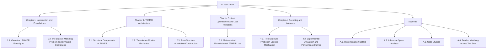

# 0. Vault Index — TAMER

> **Course Name:** Handwritten Mathematical Expression Recognition (HMER)
> **Model Studied:** TAMER (Tree-Aware Transformer)
> **Source Paper:** *TAMER: Tree-Aware Transformer for Handwritten Mathematical Expression Recognition* (Zhu et al., AAAI 2025; arXiv:2408.08578v2, 11 Dec 2024)
> **Code Repository:** https://github.com/qingzhenduyu/TAMER/

This Obsidian vault is a self-contained, exhaustive study companion for the TAMER paper. Every concept is explained from first principles, with no skipped steps and no implicit assumptions. Each note is structured so that you can read it once and walk away with a complete mental model — no external lookups required.

---

## Vault Structure at a Glance



---

## Course Outline

### Handwritten Mathematical Expression Recognition (HMER)

```
Handwritten Mathematical Expression Recognition (HMER) : {
    Chapter 1: Introduction and Foundations
        - 1.1. Overview of HMER Paradigms
        - 1.2. The Bracket Matching Problem and Syntactic Challenges

    Chapter 2: TAMER Architecture
        - 2.1. Structural Components of TAMER
        - 2.2. Tree-Aware Module Mechanics
        - 2.3. Tree-Structure Annotation Construction

    Chapter 3: Joint Optimization and Loss Functions
        - 3.1. Mathematical Formulation of TAMER Loss

    Chapter 4: Decoding and Inference
        - 4.1. Tree Structure Prediction Scoring Mechanism
        - 4.2. Experimental Evaluation and Performance Metrics
}
```

---

## How to Read This Vault

If you are new to HMER, read the notes in strict numerical order. Each chapter assumes you have absorbed the previous one. If you are returning to revise a specific idea, jump straight to that note — every note begins with a **Background Prerequisites** callout that tells you which earlier sections you should already be comfortable with, plus a **Quick Recall** block you can re-read in 30 seconds.

Throughout the vault you will find five recurring callout types:

-  **Background Prerequisites** — concepts you should already know.
-  **Tip / Insight** — non-obvious intuition that makes the math click.
-  **Common Pitfall** — mistakes students frequently make and how to avoid them.
-  **Reminder** — a fact that is easy to forget but absolutely required.
-  **From the Paper** — a direct paraphrase or numerical result from the TAMER paper.

---

## Navigation Table

| Note | Title | Key Idea |
| :--- | :--- | :--- |
| [[1.1. Overview of HMER Paradigms]] | Sequence vs. Tree vs. Hybrid decoding | Why TAMER is needed at all |
| [[1.2. The Bracket Matching Problem and Syntactic Challenges]] | Long-range bracket mismatch | The exact failure mode TAMER fixes |
| [[2.1. Structural Components of TAMER]] | Encoder, decoder, TAM, positional encodings | The full TAMER blueprint |
| [[2.2. Tree-Aware Module Mechanics]] | $X \to X' \to X^c, X^p \to M \to S$ | The heart of the paper |
| [[2.3. Tree-Structure Annotation Construction]] | Index-based tree tuples | How the supervision signal is built |
| [[3.1. Mathematical Formulation of TAMER Loss]] | $L = L_{\text{seq}} + L_{\text{struct}}$ | Joint optimization |
| [[4.1. Tree Structure Prediction Scoring Mechanism]] | Composite beam search score | Inference-time structural filter |
| [[4.2. Experimental Evaluation and Performance Metrics]] | CROHME / HME100K + ablations | Empirical evidence |
| [[A.1. Implementation Details]] | Hyperparameters, optimizers | Reproducibility |
| [[A.2. Inference Speed Analysis]] | Params, GFLOPs, FPS | Cost of structural modeling |
| [[A.3. Case Studies]] | CoMER vs. TAMER outputs | Visual wins |
| [[A.4. Bracket Matching Across Test Sets]] | Bracket accuracy curves | Why TAMER wins on syntax |

---

## Key Numbers to Memorize

These are the headline results that show up again and again across the paper. Memorize them once and you will be able to follow every later argument without checking back.

| Quantity | Value | Where it comes from |
| :--- | :--- | :--- |
| CROHME 2014 training set size | 8,836 expressions | CROHME benchmark |
| CROHME 2014 / 2016 / 2019 test set sizes | 986 / 1,147 / 1,199 expressions | CROHME benchmark |
| HME100K train / test sizes | 74,502 / 24,607 images | HME100K dataset |
| TAMER ExpRate (CROHME 2014) | 61.23 % | Table 1 |
| TAMER ExpRate (CROHME 2016) | 60.26 % | Table 1 |
| TAMER ExpRate (CROHME 2019) | 61.97 % | Table 1 |
| TAMER improvement over CoMER (avg) | ≈ +3.0 % ExpRate | Table 1 |
| $d_{\text{model}}$ | 256 | Appendix |
| Attention heads $h$ | 8 | Appendix |
| Feed-forward dim $d_{ff}$ | 1024 | Appendix |
| Decoder layers | 3 | Appendix |
| DenseNet growth rate $k$ | 24 | Appendix |
| DenseNet reduction $\theta$ | 0.5 | Appendix |
| Dropout (encoder / decoder) | 0.2 / 0.3 | Appendix |
| Beam search composite score | $S_{\text{seq}}(y) + S_{\text{struct}}(y)$ | §Tree Structure Prediction Scoring |
| Total loss | $L = L_{\text{seq}} + L_{\text{struct}}$ | Eq. 8 |

---

## One-Paragraph Summary of TAMER

TAMER is a Transformer-based Handwritten Mathematical Expression Recognition model that retains the **efficient parallel training** of sequence decoders (it is built on top of CoMER and outputs a standard $\LaTeX$ sequence) while introducing a **Tree-Aware Module (TAM)** that runs in parallel with the decoder and learns, for every pair of tokens $(i, j)$ in the predicted sequence, the probability that token $i$ is the child of token $j$ in the underlying expression tree. The TAM is trained jointly with the sequence decoder through a summed loss $L = L_{\text{seq}} + L_{\text{struct}}$, so the decoder's hidden representations are regularized to be tree-coherent. At inference time, beam search is modified so that each candidate sequence is scored not only by its sequence log-probability but also by its average tree-confidence score, producing a composite score that filters out candidates with structurally invalid layouts (most importantly, unmatched curly braces). The result is a model that matches or beats every prior method on CROHME 2014/2016/2019 while keeping bracket-matching accuracy above 92 % even on the most structurally complex expressions — a regime where the baseline CoMER collapses to 77 %.

---

## Glossary of Acronyms (Alphabetical)

| Acronym | Expansion | One-line meaning |
| :--- | :--- | :--- |
| ARM | Attention Refinement Module | CoMER's coverage-attention add-on |
| BTTR | Bidirectional Trained Transformer | First Transformer decoder for HMER |
| CAN | Counting-Aware Network | Auxiliary counting-task HMER model |
| CoMER | Coverage Modeling Transformer | TAMER's direct baseline |
| CROHME | Competition on Recognition of Online Handwritten Mathematical Expressions | Standard HMER benchmark |
| ExpRate | Expression Recognition Rate | Percent of expressions exactly correct |
| HME100K | Handwritten Math Expression 100K | Large-scale real-world HMER dataset |
| HMER | Handwritten Mathematical Expression Recognition | The whole task |
| ICAL | Implicit Character-Aided Learning | Auxiliary-character HMER model |
| InkML | Ink Markup Language | XML format for storing pen strokes |
| MOC | Map of Content | Obsidian term for an index note |
| NAMER | Non-Autoregressive Modeling for HMER | Parallel decoder model |
| PAL | Paired Adversarial Learning | HMER with printed/handwritten pairs |
| SAN | Syntax-Aware Network | Tree-traversal HMER model |
| TAM | Tree-Aware Module | TAMER's structural prediction head |
| TAMER | Tree-Aware Transformer | The model this vault is about |
| TDv2 | Tree Decoder v2 | Improved tree decoder |
| WAP | Watch, Attend, and Parse | First deep HMER model |

---

## Tags Used in This Vault

#moc #hmer #tamer #transformer #tree-aware #latex #sequence-decoding #tree-decoding #crohme #hme100k #loss-function #beam-search #densenet #coverage-attention #positional-encoding #ablation
