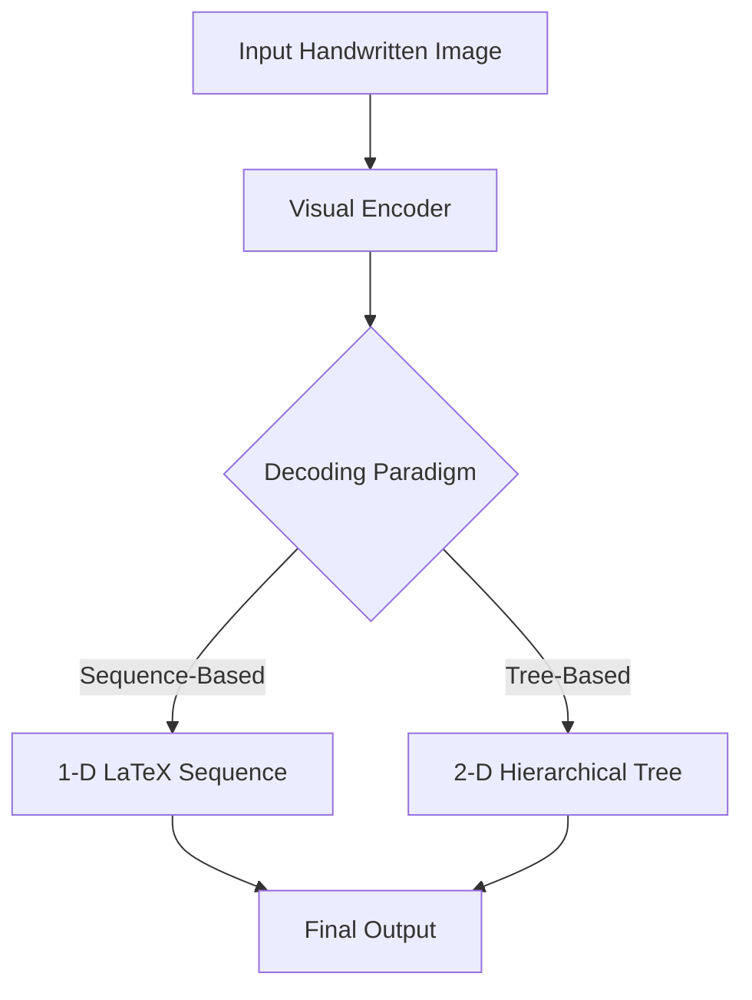
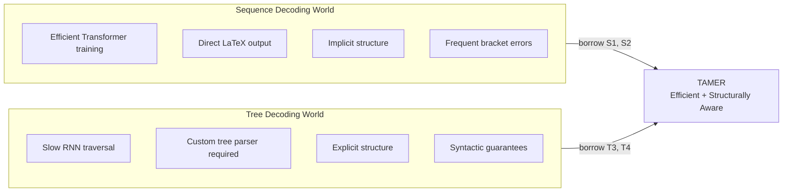

# 1.1. Overview of HMER Paradigms

> [!info] Quick Recall
> HMER has **two classical decoding paradigms**: (1) **sequence-based**, which produces a 1-D $\LaTeX$ string with curly braces as structural control tokens; (2) **tree-based**, which produces parent–child relationship tuples $(p, c, r)$. Each is strong where the other is weak. **TAMER is the hybrid**: it keeps the $\LaTeX$ output of sequence decoding but adds a parallel tree-prediction head so the model is structurally aware without giving up Transformer parallelism.

---

##  Background Prerequisites

Before reading this note, make sure you are comfortable with the following:

1. **What OCR is.** Optical Character Recognition is the task of converting an image of text into machine-readable text. Standard OCR pipelines (Tesseract, CRNN-CTC, Transformer OCR) assume text is laid out in a 1-D left-to-right line. HMER breaks this assumption.
2. **Sequence-to-sequence models.** An encoder maps an input image (or sentence) to a sequence of feature vectors; a decoder autoregressively generates an output sequence one token at a time, conditioning each new token on everything generated so far.
3. **Transformers.** Vaswani et al. (2017). Self-attention, multi-head attention, positional encoding, layer normalization. If any of these are fuzzy, re-read "Attention Is All You Need" before continuing — every architectural decision in TAMER only makes sense once Transformers are second nature.
4. **$\LaTeX$ basics.** You should be able to mentally compile `x ^ { a + b }` into $x^{a+b}$, and recognize that `{` and `}` are **scoping tokens** that tell the typesetter where an operator's argument begins and ends.
5. **Beam search.** A decoding strategy that maintains the top-$B$ partial hypotheses at every step rather than greedily picking the single best token.

---

## 1.1.1. What Is HMER and Why Is It Hard?

### Definition

**Handwritten Mathematical Expression Recognition (HMER)** is the task of converting an image of a hand-drawn mathematical expression into a structured, machine-readable representation — typically a $\LaTeX$ string — that can be typeset, edited, or queried by downstream software.

It is a sub-field of **Optical Character Recognition (OCR)**, but a particularly nasty one. Standard OCR transcribes one-dimensional, left-to-right natural-language text. HMER transcribes **two-dimensional, hierarchical, syntactically constrained** content. A single handwritten equation can simultaneously contain:

- A baseline that reads left-to-right ($a + b$).
- A vertical fraction ($\frac{a}{b}$) whose numerator sits **above** the baseline and whose denominator sits **below**.
- Superscripts ($x^2$) and subscripts ($x_i$) that float at different heights.
- A square root ($\sqrt{\cdot}$) that visually **encloses** its argument with a vinculum.
- Summations and integrals ($\sum_{i=0}^{n}$, $\int_{0}^{\infty}$) whose limits stack **above** and **below** the operator.
- Matrices, whose entries are arranged on an invisible 2-D grid.

A successful HMER model must therefore solve **two coupled problems simultaneously**:

1. **Symbol recognition** — what character or operator is drawn at this location?
2. **Spatial-structural analysis** — what is the structural relationship between this symbol and its neighbours?

A model that recognizes every individual symbol perfectly but misreads the structure will produce a syntactically valid but semantically wrong $\LaTeX$ string. A model that captures the structure but misreads a single symbol will produce a structurally valid but typo-ridden string. Both modes of failure are common, and the TAMER paper is largely about preventing the first one.

---

## 1.1.2. The Sequence-Based Decoding Paradigm

### Core Idea

Sequence-based decoders treat HMER as an **image-to-sequence translation task**, identical in spirit to neural machine translation. The image is encoded into a 2-D feature map by a convolutional backbone (DenseNet in TAMER's case), then a decoder (RNN or Transformer) autoregressively emits a sequence of tokens in a markup language — almost always **$\LaTeX$** — that, when typeset, reproduces the original expression.

### Worked Example

Consider the handwritten expression $x^2$. Its tokenized $\LaTeX$ representation is:

$$
\text{Tokens} = [\text{"x"}, \text{"\^"}, \text{"\{"}, \text{"2"}, \text{"\}"}]
$$

The decoder emits these five tokens one at a time, left to right. There is no explicit representation of the tree structure; the structural information is **encoded indirectly** through the curly-brace scoping tokens.

### Family Tree of Sequence-Based Models

The paper partitions sequence-based HMER models into two sub-families.

#### RNN-Based Models (2017 – 2022)

| Year | Model | Contribution |
| :--- | :--- | :--- |
| 2017 | **WAP** (Watch, Attend, and Parse) | First deep neural network for HMER. Encoder–decoder with soft attention. |
| 2018 | **DenseWAP** | Replaces the VGG encoder with DenseNet, which becomes the de-facto backbone. |
| 2018 | **DenseWAP-MSA** | Multi-scale attention. |
| 2019 | **PAL** | Paired adversarial learning between handwritten and printed samples. |
| 2020 | **PAL-v2** | Extends PAL with stronger semantic-invariant features. |
| 2022 | **ABM** | Attention aggregation with bidirectional mutual learning to fix output imbalance. |
| 2022 | **CAN** (Counting-Aware Network) | Adds an auxiliary symbol-counting task, jointly optimized with sequence prediction. |

RNN decoders suffer from the well-known **long-range dependency problem** (Bengio, Frasconi, Simard, 1993): gradients vanish or explode when sequences grow long, and the hidden state has to compress arbitrarily long histories into a fixed-size vector.

#### Transformer-Based Models (2021 – present)

| Year | Model | Contribution |
| :--- | :--- | :--- |
| 2021 | **BTTR** | First Transformer decoder for HMER. Adds a bidirectional training strategy to combat output imbalance. |
| 2022 | **CoMER** | Adds the **Attention Refinement Module (ARM)** that brings coverage attention into the Transformer. This is TAMER's direct baseline. |
| 2023 | **GCN** | Adds a coarse "general category" recognition task as an auxiliary loss. |
| 2024 | **ICAL** | Implicit Character-Aided Learning. Adds an ICCM (Implicit Character Construction Module) and a fusion module. |
| 2024 | **NAMER** | Non-autoregressive HMER with a parallel graph decoder. Uses pre-trained DenseWAP. |

Transformers fix the long-range dependency problem by replacing recurrence with **global self-attention**, but they introduce a new weakness: they have no built-in inductive bias for hierarchical structure, so syntactic control tokens like `{` and `}` are treated just like any other vocabulary entry.

### Advantages of Sequence-Based Decoding

1. **Versatility and compatibility.** $\LaTeX$ is the universal standard for typesetting math. The output of a sequence decoder plugs directly into document pipelines, search engines, and NLP tools with zero glue code.
2. **Ease of implementation.** A standard image-to-sequence Transformer (the kind used in NMT) can be adapted with only minor changes.
3. **Parallel training (for Transformer-based variants).** Self-attention lets the decoder compute all positions simultaneously during training, which is the main reason Transformer-based sequence decoders have replaced RNN-based ones.

### Limitations of Sequence-Based Decoding

1. **Structural blindness.** The model has no explicit notion that `{` and `}` form a pair, that `\frac{}{}` takes two arguments, or that `^{}` defines a superscript scope. All of this structure must be **learned implicitly** from the statistics of the training data.
2. **Sensitivity to dataset size.** On small benchmarks like CROHME (8,836 training expressions), the model simply does not see enough bracket-nesting patterns to learn the balancing rules reliably. The result is frequent **unmatched-brace** errors.
3. **No syntactic guarantee.** Even at inference time, nothing stops the decoder from emitting `x ^ { a + b` and stopping, producing invalid $\LaTeX$.

---

## 1.1.3. The Tree-Structure-Based Decoding Paradigm

### Core Idea

Tree-structure-based decoders represent a mathematical expression as a **directed tree** in which:

- **Nodes** are symbols (or operators).
- **Edges** are **spatial-structural relationships** between symbols.

Each edge is captured by a triple:

$$
\text{Tuple} = (p, c, r)
$$

where $p$ is the parent node, $c$ is the child node, and $r \in \{\text{Above}, \text{Below}, \text{Sup}, \text{Sub}, \text{Inside}, \text{Right}, \ldots\}$ is the spatial relationship of the child relative to the parent.

### Worked Example

The expression $x^2$ becomes a single triple:

$$
(x, 2, \text{Sup})
$$

read as: "the symbol `2` is the **superscript** child of the symbol `x`." No curly braces appear at all — the structure is encoded directly in the tree, not indirectly through scoping tokens.

### Family Tree of Tree-Based Models

| Year | Model | Contribution |
| :--- | :--- | :--- |
| 2020 | **DenseWAP-TD** (Zhang et al., ICML 2020) | First tree-based decoder. Replaces the GRU sequence decoder with a 2-D tree decoder. Also defines the index-based tree annotation that TAMER later adopts. |
| 2022 | **TDv2** | Optimizes tree decoding: multiple tree-conversion strategies, simplified decoding procedure. |
| 2022 | **SAN** (Syntax-Aware Network) | Converts $\LaTeX$ into a parsing tree and uses syntactic rules to formulate prediction as tree traversal. Adds a Syntax-Aware Attention Module. |

### Advantages of Tree-Based Decoding

1. **Explicit structural modeling.** The grammar of mathematical expressions is **baked into the decoding target**. The model literally cannot emit a fraction without specifying numerator and denominator children.
2. **Guaranteed structural consistency.** Because the output is a tree, the generation process can restrict transitions to only those that produce a valid tree. This **theoretically eliminates** syntactic errors such as unmatched braces or unterminated square roots.

### Limitations of Tree-Based Decoding

1. **Computational inefficiency.** Most tree-based decoders rely on **recurrent** tree-traversal (Tree-RNN, Tree-GRU). Each node's hidden state is computed from its parent's, forcing sequential processing and forfeiting the parallelism that makes Transformers so fast on GPUs.
2. **Target-formulation complexity.** Converting between $\LaTeX$ strings and tree tuples is fiddly and error-prone. Different papers use different relationship vocabularies, which makes direct comparison difficult.
3. **Suboptimal practical performance.** Despite their theoretical superiority, tree decoders in practice **underperform** modern Transformer-based sequence decoders on standard ExpRate. The reasons are mostly engineering: tree decoders cannot reuse pre-trained language-model weights, and they cannot benefit from the years of optimization that have gone into Transformer libraries.
4. **Incompatibility with $\LaTeX$ pipelines.** The output is a tree, not a $\LaTeX$ string. Downstream systems that expect $\LaTeX$ need a custom parser.

---

## 1.1.4. Comparison Matrix: Paradigms

The table below is the single most important reference in this section. Every claim TAMER makes about itself can be traced back to one of these rows.

| Feature | Sequence-Based Decoding | Tree-Based Decoding | **TAMER (Proposed)** |
| :--- | :--- | :--- | :--- |
| **Output Format** | $\LaTeX$ Sequence | Tree-tuples / Graph | $\LaTeX$ Sequence + Tree Struct |
| **Training Efficiency** | High (Transformer parallelization) | Low (sequential RNN-based traversal) | High (Transformer parallelization) |
| **Structural Awareness** | Implicit (learned via language modeling) | Explicit (embedded in tree representation) | Explicit (via Tree-Aware Module) |
| **Syntactic Correctness** | Low (prone to unmatched braces `{}`) | High (strictly constrained by tree syntax) | High (guaranteed by joint scoring) |
| **Versatility** | High (standard NLP pipeline compatibility) | Low (requires custom tree parsers) | High (outputs standard $\LaTeX$) |
| **Practical ExpRate** | High (best in class when trained well) | Lower in practice | **Highest reported** |

> [!tip] How to read this table
> Read each row as a design dimension. Sequence decoding wins on **training efficiency** and **versatility**; tree decoding wins on **structural awareness** and **syntactic correctness**. TAMER is the **intersection**: it inherits the winning cells from both rows and pays for it with a small (≈ 30 %) drop in inference speed (see [[A.2. Inference Speed Analysis]]).

---

## 1.1.5. The Conceptual Gap That TAMER Fills

The key insight is that the **two paradigms are not actually incompatible**. What has historically kept them apart is the choice of decoder: tree-based work has used RNNs, which forbids Transformer parallelism. TAMER's move is to keep the Transformer sequence decoder untouched (and therefore keep all its parallelism and $\LaTeX$ output) and to **add** a parallel tree-prediction head — the Tree-Aware Module — that consumes the decoder's hidden features and outputs a relationship score matrix. The module trains jointly with the decoder through a summed loss, and at inference time its scores are added to beam search scores. The whole machinery is **orthogonal to the decoder**, which is why TAMER's contributions are described as "drop-in" improvements.

---

## 1.1.6. Two Key Concepts You Must Internalize

### Concept A: Autoregressive Decoding

Both sequence decoding and TAMER are **autoregressive**: at step $t$, the decoder conditions on all previously generated tokens $y_{<t}$ to produce $y_t$. This is in contrast to **non-autoregressive** models like NAMER, which emit all tokens in parallel and then refine them.

> [!warning] Common Pitfall
> "Autoregressive" means **conditional on past outputs at inference time**, not "trained with recurrence". A Transformer decoder is autoregressive even though it has no recurrence — the autoregression comes from the causal mask in self-attention and the teacher-forcing offset during training. The training is parallel; the **inference** is sequential.

### Concept B: Joint Multi-Task Optimization

TAMER is trained with a single combined loss:

$$
L = L_{\text{seq}} + L_{\text{struct}}
$$

This is **multi-task learning** in the simplest possible form: equal weighting, summed gradients, shared backbone. The shared backbone (the Transformer decoder) is forced to produce hidden features that simultaneously (a) predict the next token and (b) predict the parent of every token. The second task acts as a **regularizer** on the first: features that ignore structure will be penalized by $L_{\text{struct}}$.

> [!tip] Why equal weighting works here
> In many multi-task setups you have to tune the loss weights carefully. TAMER uses **equal weights (1:1)** and gets away with it because both losses are cross-entropy over comparable scales: $L_{\text{seq}}$ is over a vocabulary of a few hundred tokens, $L_{\text{struct}}$ is over a sequence length of typically 20–80 tokens. They are roughly the same magnitude, so no weighting is needed.

---

## 1.1.7. Tips, Pitfalls, and Reminders

> [!tip] Tip — Read the comparison table as a design contract
> When a paper proposes a new HMER model, scan the comparison matrix above and ask: which cells of the matrix does this paper try to win? If a model wins only on training efficiency, it is a sequence decoder. If it wins only on syntactic correctness, it is a tree decoder. If it claims to win on both, it is doing something TAMER-like.

> [!warning] Pitfall — Confusing "structural" with "syntactic"
> **Structural** means: the model understands the spatial relationships between symbols (parent-child, superscript, subscript, fraction-top, etc.). **Syntactic** means: the output obeys the grammar of the target language (every `{` has a matching `}`). The two are correlated but not identical. A tree-based model can be structural but still emit syntactically invalid output if its grammar allows invalid transitions. A sequence-based model can be syntactically correct on simple expressions while being structurally confused on complex ones.

> [!reminder] Reminder — TAMER's baseline is CoMER
> Throughout the paper, every comparison is against **CoMER** (Zhao and Gao, ECCV 2022). CoMER is a Transformer-based sequence decoder with a Coverage Attention mechanism. When the paper says "baseline", it means CoMER. When it says "+2.85 % ExpRate", it means "+2.85 % ExpRate over CoMER".

> [!reminder] Reminder — Why curly braces?
> In $\LaTeX$, `{` and `}` are **grouping** operators. They tell the typesetter "treat everything inside as a single argument for whatever operator came before". For superscripts and subscripts this matters because `x^ab` typesets as $x^a b$ (only `a` is the superscript), while `x^{ab}` typesets as $x^{ab}$ (both characters are the superscript). Every multi-character scope in $\LaTeX$ therefore introduces a pair of braces, and every pair is a chance for the model to forget to close one.

> [!tip] Tip — The "long-range dependency mismatch" is the key phrase
> When you read HMER papers, watch for this phrase. It refers to the fact that the **opening brace** and the **closing brace** of a deeply nested scope may be separated by dozens of tokens, and a sequence decoder has to remember to close the brace across that whole distance. This is the exact failure mode TAMER targets.

---

## 1.1.8. Suggested Reading Order

If you are reading the paper itself, the most efficient order is:

1. Abstract + Introduction (sets up the problem).
2. **§Related Work** (gives you the model family trees above).
3. **§Tree-structure Annotation Construction** (the data side — small but crucial).
4. **§Model Architecture** (the TAMER blueprint).
5. **§Tree-aware Module** (the core contribution).
6. **§Loss Function** (joint optimization).
7. **§Tree Structure Prediction Scoring Mechanism** (inference).
8. **§Experiments** + **§Ablation Study**.

This vault follows roughly that order, except we interleave the math with worked numerical examples so you can verify each step.

---

## 1.1.9. Next Note

Continue to [[1.2. The Bracket Matching Problem and Syntactic Challenges]] — we will drill into the exact failure mode (unmatched curly braces) that motivates every architectural choice in TAMER.

---

## 1.1.10. Self-Check Questions

Before moving on, try to answer these without looking back:

1. Why is HMER harder than standard OCR? Name at least three structural features of math expressions that break the 1-D assumption.
2. What are the two classical decoding paradigms, and what does each one output?
3. Give one advantage and one limitation of each paradigm.
4. Why are RNN-based tree decoders slow to train?
5. What does "joint optimization" mean in TAMER, and what is the loss formula?
6. Why is CoMER the natural choice of baseline for TAMER?
7. In the comparison matrix above, which cells does TAMER borrow from sequence decoding and which from tree decoding?
8. What is the long-range dependency mismatch problem, in one sentence?

If you can answer all eight confidently, you are ready for the next note.

---

## References

- Zhu, J.; Zhao, W.; Li, Y.; Hu, X.; Gao, L. *TAMER: Tree-Aware Transformer for Handwritten Mathematical Expression Recognition*. AAAI 2025. arXiv:2408.08578v2.
- Vaswani, A. et al. *Attention Is All You Need*. NeurIPS 2017.
- Zhao, W.; Gao, L. *CoMER: Modeling Coverage for Transformer-Based HMER*. ECCV 2022.
- Zhao, W. et al. *BTTR: Handwritten Mathematical Expression Recognition with Bidirectionally Trained Transformer*. ICDAR 2021.
- Zhang, J. et al. *A Tree-Structured Decoder for Image-to-Markup Generation*. ICML 2020.
- Bengio, Y.; Frasconi, P.; Simard, P. *The problem of learning long-term dependencies in recurrent networks*. IEEE ICNN 1993.
