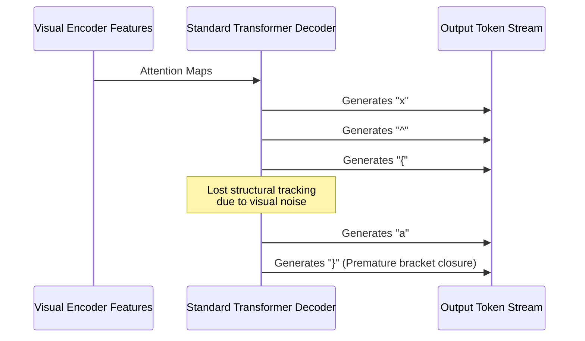
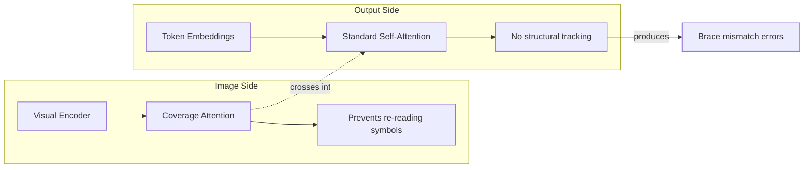
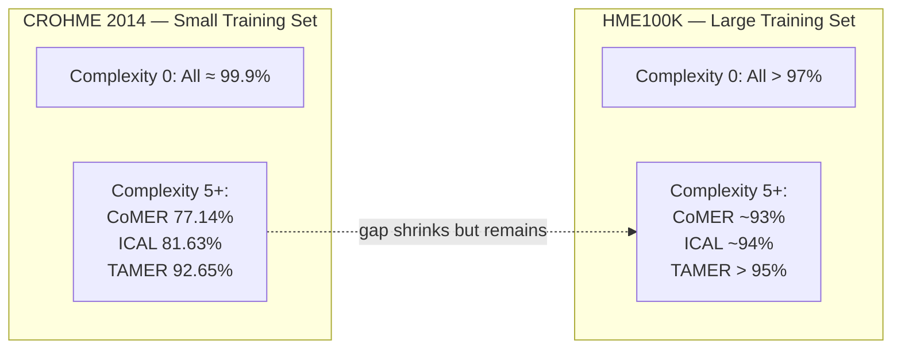

# 1.2. The Bracket Matching Problem and Syntactic Challenges

> [!info] Quick Recall
> Sequence decoders emit $\LaTeX$ tokens one at a time, and the **opening brace `{` and closing brace `}`** form pairs that can be arbitrarily far apart. Nothing in the architecture forces them to balance. On small datasets like CROHME (8,836 training samples), the model fails to learn bracket balancing reliably — the failure gets worse the more deeply nested the expression is. This is the **long-range dependency mismatch problem**, and it is the single most important motivation for TAMER.

---

##  Background Prerequisites

Before reading this note, you should be comfortable with:

1. The contents of [[1.1. Overview of HMER Paradigms]] — especially the comparison matrix and the section on sequence-based decoding.
2. The role of `{` and `}` in $\LaTeX$ as **scoping** tokens.
3. The basics of autoregressive decoding with Transformers (causal mask, teacher forcing).
4. The concept of an **inductive bias** — a built-in architectural assumption that helps the model generalize.

---

## 1.2.1. The Mechanism of $\LaTeX$ Syntax Errors

### Why Braces Exist in $\LaTeX$

In $\LaTeX$, the curly braces `{` and `}` are **grouping operators**. They tell the typesetter "treat everything inside this pair as a single argument to the preceding operator". This is essential because most $\LaTeX$ operators (superscript `^`, subscript `_`, `\frac`, `\sqrt`, `\sum`, `\int`) take exactly one or two arguments, and without braces the operator would only grab the very next single character.

Consider the expression $x^{a+b}$. Its $\LaTeX$ representation is:

```text
x ^ { a + b }
```

Without braces, `x ^ a + b` would typeset as $x^a + b$ — the `^` operator grabs only the `a`, and `+ b` ends up back on the baseline. The braces define the **visual and logical scope** of the superscript operator `^`.

### What "Bracket Matching" Means

A $\LaTeX$ string is **syntactically valid** if and only if every `{` has a matching `}` somewhere later in the string, the pairs are properly nested, and no `}` appears before its matching `{`. A decoder that emits:

```text
Valid LaTeX:     x ^ { a + b }
Invalid LaTeX:   x ^ { a + b
Invalid LaTeX:   x ^ a + b }
Invalid LaTeX:   x ^ { a + { b }
```

has produced output that **cannot be typeset at all**. The renderer will throw an error and the expression is lost.

### The Token Independence Problem

Standard sequence decoders treat `{` and `}` as **two independent vocabulary entries**. The decoder emits them just like any other token, with no built-in mechanism that says "you opened a brace three steps ago, you must close it before this expression ends." The only signal the model has is statistical: during training it saw that `{ ... }` pairs tend to appear together, and it learned to predict `}` after seeing the contents of a brace pair.

This statistical signal is fragile. As structural complexity increases, the **distance** between an opening brace and its matching closing brace grows, and the decoder's confidence that it should emit `}` drops. Eventually the decoder simply forgets — and an unmatched brace is born.



> [!warning] Common Pitfall — "Brace matching is easy"
> It is tempting to think brace matching is trivial — after all, a simple counter solves it. But the decoder does not have access to a counter; it only has a hidden state vector. For the decoder to behave like a counter, the hidden state must encode the open-brace count **exactly**, and that encoding must survive across all the attention hops and layer norms the decoder applies. It is possible, but it is not what the decoder is trained to do directly — so it learns it imperfectly.

---

## 1.2.2. The Long-Range Dependency Mismatch Problem

### Definition

The **Long-Range Dependency Mismatch Problem** is the specific failure mode in which a sequence decoder, generating a $\LaTeX$ string token by token, loses track of an **open structural scope** (e.g., an unclosed `{`) over a long intervening span of tokens and either:

- Closes the wrong brace, producing a structurally invalid $\LaTeX$ string.
- Skips a closing brace entirely, producing an unterminated scope.
- Inserts an extra, spurious brace, breaking the balance.

The problem is called a "**mismatch**" because the model's natural sequence-decoding objective (predict the next token given the past) does not align with the structural objective (keep braces balanced over long spans). The two objectives are not in conflict, but neither are they identical, and the model has no architectural bias toward the structural one.

### Why Distance Matters

Consider these two valid $\LaTeX$ strings:

```text
Shallow:  x ^ { 2 }
Deep:     \frac { 1 } { \sqrt { x ^ { 2 } + y ^ { 2 } } }
```

In the shallow case, the opening `{` at position 2 is closed by the `}` at position 4 — a span of two tokens. In the deep case, the **outermost** opening `{` (right after `\frac`) is closed by the **last** `}` — a span of more than a dozen tokens. A Transformer's self-attention can in principle bridge this distance, but in practice the attention weights are diluted across many candidate positions, and the decoder often picks the wrong one.

### Why This Is Worse on Small Datasets

The severity of bracket-mismatch errors is **inversely proportional** to the scale of the training dataset:

| Dataset | Train Size | Bracket-Mismatch Rate (CoMER, complexity ≥ 5) |
| :--- | :--- | :--- |
| HME100K | 74,502 | < 7 % |
| CROHME 2014 | 8,836 | ≈ 23 % |

On HME100K, the decoder sees enough deeply nested expressions to learn the statistics of brace balancing implicitly. On CROHME — the standard benchmark for HMER — the dataset is so small that complex nesting patterns appear only a handful of times in training, and the model fails to generalize.

> [!tip] Tip — Read the dataset size before reading any HMER result
> Whenever you read an HMER result, the **first** thing to check is the dataset. A 70 % ExpRate on CROHME is impressive. A 70 % ExpRate on HME100K is mediocre. The same model architecture can look brilliant or average depending on the dataset's size and structural complexity distribution.

---

## 1.2.3. Architectural Causes of Failure in Baseline Models

### CoMER and BTTR: No Structural Inductive Bias

Both **CoMER** (TAMER's baseline) and **BTTR** (CoMER's predecessor) employ standard Transformer decoders. The decoder's self-attention computes pairwise semantic alignments across all positions in the output sequence, but it does so **uniformly** — `{` and `}` are attended to just like `x`, `y`, `+`, or `\frac`. There is no architectural signal that says "these two tokens form a structural pair."

### Coverage Attention Helps, but Only Locally

CoMER's headline contribution is the **Attention Refinement Module (ARM)**, which adds a coverage-attention mechanism to the Transformer decoder. Coverage attention tracks how much visual attention has been paid to each region of the input image, and it discourages the model from re-attending to already-transcribed symbols.

Coverage attention is excellent at preventing **under-coverage** (missing a symbol) and **over-coverage** (re-reading the same symbol twice), but it operates on the **image side** of the model. It does nothing to help on the **output side**, where brace balancing lives. The brace-mismatch problem is therefore orthogonal to what coverage attention was designed to fix, and CoMER inherits it from BTTR essentially unchanged.



### Why Vanilla Transformers Struggle

Three architectural facts combine to produce the failure:

1. **No explicit memory of structural state.** The decoder hidden state is a continuous vector; nothing in the architecture guarantees that the integer "number of currently open braces" is represented faithfully.
2. **Softmax over vocabulary is myopic.** At each step, the decoder picks the locally most-probable token. If `}` happens to be slightly less probable than `\sqrt` at step 50, the decoder will emit `\sqrt` — even if emitting `}` would have closed a scope opened 30 steps earlier.
3. **No counter-like inductive bias.** LSTMs and GRUs can be trained to implement counters, but Transformers have no built-in recurrence. Counters have to be **emulated** by self-attention, which is harder to learn reliably.

> [!reminder] Reminder — TAMER does NOT modify the decoder
> The whole point of TAMER is to fix the bracket-mismatch problem **without** modifying the Transformer decoder. The decoder is unchanged from CoMER. What TAMER adds is a **parallel** tree-prediction head that, during training, forces the decoder's hidden features to be tree-coherent, and during inference, scores beam-search candidates by their structural validity. This is why TAMER is described as a "drop-in" improvement.

---

## 1.2.4. Quantifying the Failure: Bracket-Matching Accuracy

The TAMER paper measures bracket-matching accuracy directly on the CROHME 2014 test set, stratified by **structural complexity** (defined formally in [[4.2. Experimental Evaluation and Performance Metrics]]). The structural complexity of an expression is the maximum number of branching nodes (nodes with more than one child) along any path in its expression tree.

| Complexity | CoMER Baseline | ICAL | TAMER |
| :--- | :--- | :--- | :--- |
| 0 | ≈ 99.9 % | ≈ 99.9 % | ≈ 99.8 % |
| 3 | 93.54 % | (intermediate) | 99.08 % |
| 5+ | **77.14 %** | **81.63 %** | **92.65 %** |

Two observations stand out:

1. **All three models are near-perfect on simple expressions.** When there is nothing to nest, there is nothing to mismatch. The bracket problem only emerges as complexity grows.
2. **TAMER degrades gracefully; the others collapse.** Between complexity 0 and complexity 5+, CoMER loses roughly 23 percentage points of bracket accuracy. TAMER loses about 7. The slope of the curve, not the absolute value, is the headline.

### Bracket Matching on HME100K

On the much larger HME100K dataset, all three models do substantially better because the training set is large enough for the statistical learning of bracket balancing to work:

| Complexity (HME100K) | CoMER | ICAL | TAMER |
| :--- | :--- | :--- | :--- |
| Low | > 97 % | > 97 % | > 98 % |
| High | ≈ 93 % | ≈ 94 % | > 95 % |

The gap shrinks but does not disappear. TAMER still wins, which suggests that the structural inductive bias is useful even when the dataset is large enough to implicitly teach bracket balancing.



---

## 1.2.5. Three Worked Examples of Bracket Failures

To make the failure mode concrete, here are three illustrative cases (paraphrased from the paper's case studies).

### Example A — Spurious Nested Fraction

The ground truth is a single fraction containing a square root in its numerator:

$$
\frac{\sqrt{a+b}}{c}
$$

CoMER's prediction accidentally produces a **nested fraction inside the square root** and an unmatched brace:

```text
Ground truth:  \frac { \sqrt { a + b } } { c }
CoMER output:  \frac { \sqrt { \frac { a + b } { c }   ← (missing closing brace)
```

The model has confused the fraction bar of the outer `\frac` with an inner fraction, and in the confusion it forgets to close the brace opened by `\sqrt`. TAMER correctly predicts the original structure because its Tree-Aware Module assigns a low structural-confidence score to the spurious-nested-fraction hypothesis during beam search.

### Example B — Missing Left Brace

The ground truth is an integral of a fraction:

$$
\int \frac{1}{x} \, dx
$$

CoMER emits:

```text
Ground truth:  \int { \frac { 1 } { x } } d x
CoMER output:  \int  \frac { 1 } { x } } d x
```

It drops the **opening** brace after `\int`, leaving an unmatched closing `}` later. This is a textbook long-range dependency mismatch: the model "knew" it should emit a `}` somewhere, but it had lost track of where the corresponding `{` was.

### Example C — Misidentified Complex Fraction

The ground truth is a deeply nested fraction under a square root. CoMER produces an output that is "roughly right" character-by-character but completely wrong structurally — a square root where there should be a fraction, and an extra brace where there should be none. TAMER gets it right because the Tree-Aware Module forces the parent-child relationships to be coherent before allowing a candidate to win beam search.

---

## 1.2.6. Why Naive Fixes Do Not Work

A natural question: if brace matching is "just" a counter problem, why not post-process the decoder's output to enforce balance? Several reasons:

1. **Post-processing cannot recover missing information.** If the decoder never emitted `}`, no amount of post-processing can know where it should have gone. The decoder's hidden state at the right position is gone — the only signal we have is the token stream itself.
2. **Post-processing breaks the probability model.** If we modify the output, the model's confidence score no longer reflects the true probability of the (modified) output. This makes downstream usage (confidence-based filtering, active learning, ensemble methods) unreliable.
3. **Post-processing is brittle.** Hand-written rules for "insert the missing brace here" work for trivial cases but fail on the deeply nested expressions where the problem is worst.

The principled fix is to **bake structural awareness into the model itself**, so that the decoder's hidden features encode structural state and the inference procedure respects it. That is exactly what TAMER does.

---

## 1.2.7. Connection to TAMER's Three Contributions

The TAMER paper makes three explicit contributions, and each one is a direct response to a specific failure mode discussed above:

| Failure Mode | TAMER's Response |
| :--- | :--- |
| Decoder hidden state does not encode structural state | **(1) Tree-Aware Module (TAM)** — a parallel head that learns parent–child relationships and forces the shared decoder features to be structurally meaningful. |
| Beam search has no notion of structural validity | **(2) Tree Structure Prediction Scoring Mechanism** — adds a structural confidence score to each beam-search candidate, so candidates with invalid structures are filtered out. |
| Empirical proof that the above works | **(3) Experiments on CROHME 2014/2016/2019** — TAMER achieves 61.23 / 60.26 / 61.97 % ExpRate and maintains > 92 % bracket accuracy even at the highest structural complexity. |

> [!tip] Tip — Read every architectural decision as a response to bracket matching
> If you internalize one thing from this note, let it be this: **every architectural decision in TAMER is a response to the bracket-matching problem**. The TAM exists because the decoder alone cannot track structure. The joint loss exists because the TAM needs to be trained. The tree-scoring mechanism exists because the trained TAM's scores need to be used during inference. Once you see this causal chain, the rest of the paper reads itself.

---

## 1.2.8. Tips, Pitfalls, and Reminders

> [!tip] Tip — The "scope depth" mental model
> When debugging an HMER model, mentally walk through the predicted $\LaTeX$ and maintain a stack of open scopes. Every `{` pushes onto the stack; every `}` pops. If at any point the stack contains braces that the ground truth does not (or vice versa), you have found a bracket mismatch. This simple stack walk is what the model cannot do internally — and it is exactly what TAMER's tree prediction approximates.

> [!warning] Pitfall — Confusing "matched brackets" with "correct expression"
> A $\LaTeX$ string can have **perfectly balanced** brackets and still be the **wrong expression** (e.g., it predicted `x ^ { 2 }` when the truth was `x ^ { 3 }`). Bracket matching is a **necessary** condition for a correct expression, not a **sufficient** one. TAMER improves bracket matching accuracy as a side effect of improving structural understanding — the actual goal is higher ExpRate.

> [!reminder] Reminder — CROHME is small, HME100K is large
> CROHME 2014 train: 8,836 expressions. HME100K train: 74,502 expressions. Whenever you see a paper claim that "the model achieves X on CROHME but Y on HME100K", the gap between X and Y is largely explained by this ~8.4× difference in training data scale.

> [!reminder] Reminder — CoMER is the baseline; ICAL is the competitor
> CoMER (2022) is TAMER's **direct baseline** — TAMER is built on top of CoMER's codebase. ICAL (2024) is TAMER's **main competitor** — a contemporaneous model that also adds an auxiliary head to CoMER but does so differently (Implicit Character Construction Module). When the paper reports bracket-matching accuracy, it compares against both.

> [!tip] Tip — The complexity metric counts branching, not depth
> The "structural complexity" metric used in the paper is **the maximum number of nodes with more than one child along any root-to-leaf path**. It is not the same as tree depth. A linear chain `a + b + c + d + e` has depth 5 but complexity 0 (no node has more than one child). A single `\frac{a}{b}` has complexity 1 (the `\frac` node has two children). Keep this distinction clear when reading the complexity-stratified results.

---

## 1.2.9. Self-Check Questions

1. In one sentence, what is the long-range dependency mismatch problem?
2. Why does coverage attention (CoMER's contribution) not fix the bracket-mismatch problem?
3. Why is bracket matching worse on CROHME than on HME100K?
4. At structural complexity 5+, what is CoMER's bracket-matching accuracy on CROHME 2014, and what is TAMER's?
5. Why is post-processing the decoder's output a bad fix for bracket mismatches?
6. Map each of TAMER's three contributions to the specific failure mode it addresses.
7. What is the difference between "structural correctness" and "syntactic correctness"?
8. Why does the structural complexity metric count branching nodes rather than tree depth?

---

## 1.2.10. Next Note

Continue to [[2.1. Structural Components of TAMER]] — we now move from "what is the problem" to "what is the architecture", walking through each of TAMER's four components in detail.

---

## References

- Zhu, J. et al. *TAMER: Tree-Aware Transformer for Handwritten Mathematical Expression Recognition*. AAAI 2025. arXiv:2408.08578v2. Figure 1, Table 3, and §Case Study.
- Zhao, W.; Gao, L. *CoMER: Modeling Coverage for Transformer-Based HMER*. ECCV 2022.
- Zhu, J.; Gao, L.; Zhao, W. *ICAL: Implicit Character-Aided Learning for Enhanced HMER*. arXiv:2405.09032, 2024.
- Bengio, Y.; Frasconi, P.; Simard, P. *The problem of learning long-term dependencies in recurrent networks*. IEEE ICNN 1993.
