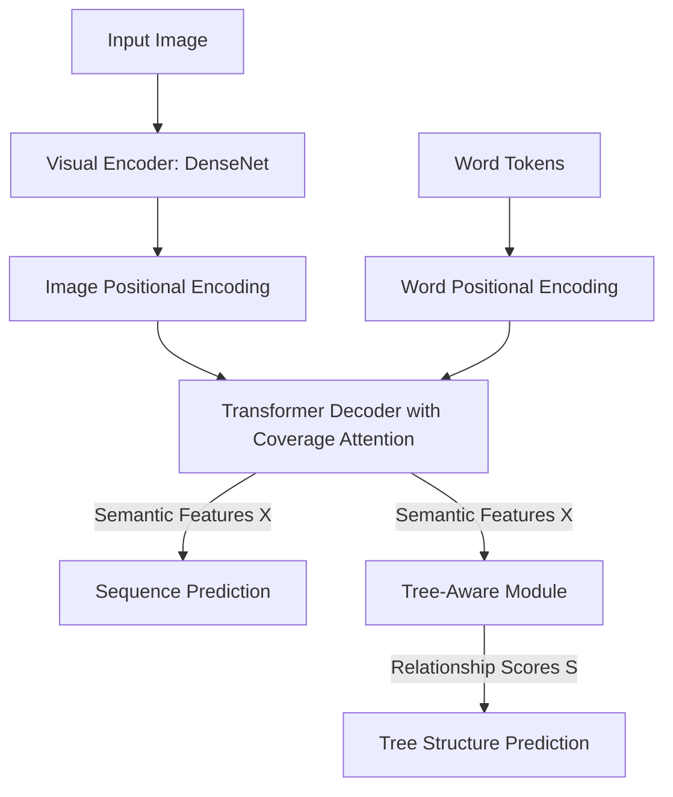
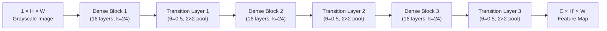
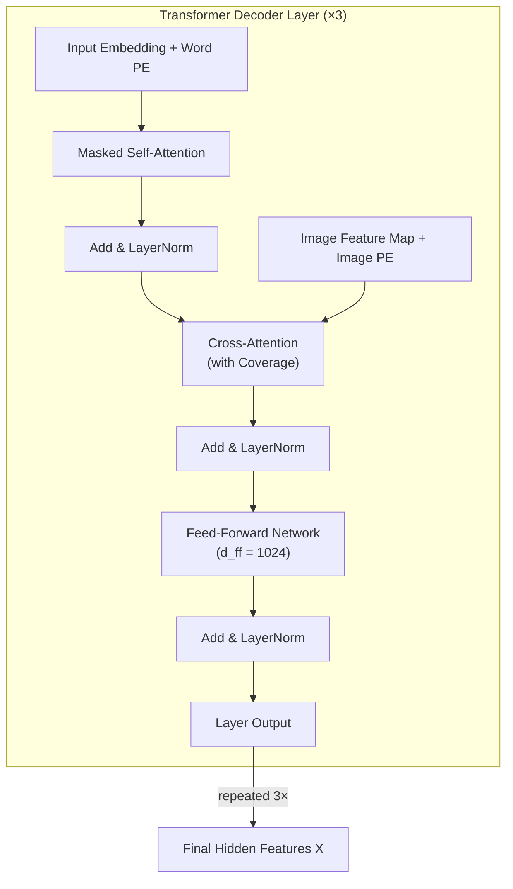
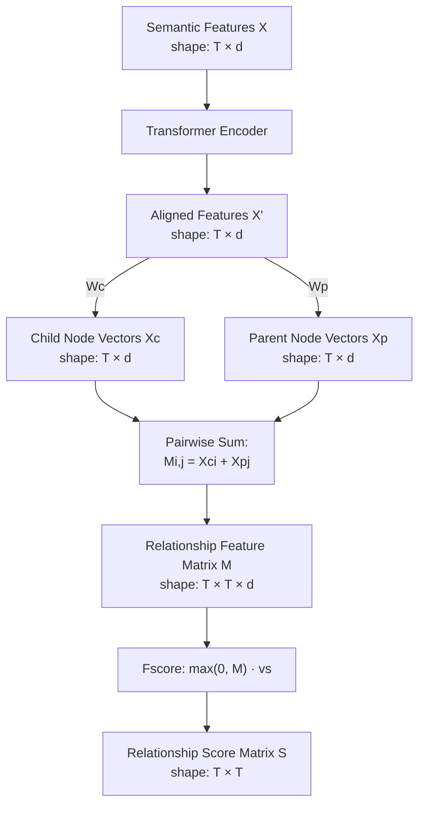
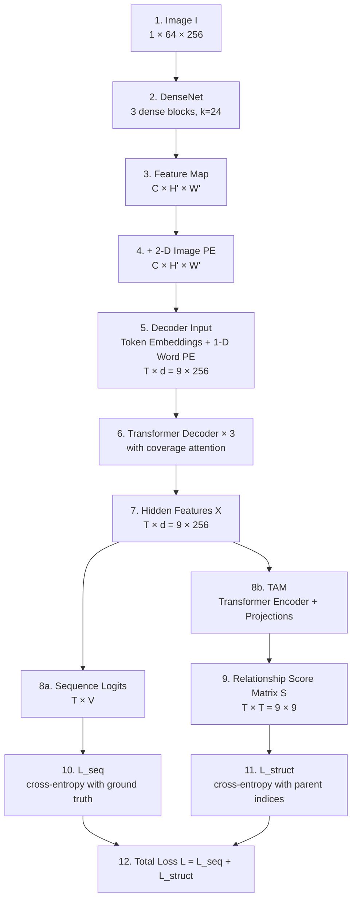

# 2.1. Structural Components of TAMER

> [!info] Quick Recall
> TAMER has **four components**: (1) a **DenseNet-121 visual encoder** that turns the input image into a 2-D feature map; (2) **sinusoidal positional encodings** (one 2-D for the image, one 1-D for the words); (3) a **Transformer decoder with coverage attention** (lifted directly from CoMER) that autoregressively emits $\LaTeX$ tokens; and (4) the **Tree-Aware Module (TAM)**, the only new piece, which consumes the decoder's hidden features and outputs a parent–child relationship matrix. The first three are unchanged from CoMER; the fourth is the paper's contribution.

---

##  Background Prerequisites

Before reading this note, you should be comfortable with:

1. The motivation for TAMER from [[1.1. Overview of HMER Paradigms]] and [[1.2. The Bracket Matching Problem and Syntactic Challenges]].
2. DenseNet's dense connectivity pattern (Huang et al., CVPR 2017).
3. Sinusoidal positional encodings as defined in "Attention Is All You Need" (Vaswani et al., NeurIPS 2017).
4. The Transformer decoder block: masked self-attention, encoder–decoder cross-attention, position-wise feed-forward.
5. Coverage attention as introduced in CoMER (Zhao and Gao, ECCV 2022).

---

## 2.1.1. The Four Components at a Glance

TAMER's architecture is summarized in Figure 2 of the paper. The pipeline is end-to-end differentiable and trained jointly. Below is the same information as a Mermaid diagram.

The four blocks, in order:

| # | Component | Input | Output | Source |
| :--- | :--- | :--- | :--- | :--- |
| 1 | Visual Encoder (DenseNet) | $1 \times H \times W$ grayscale image | $C \times H' \times W'$ feature map | Huang et al. 2017 |
| 2 | Image + Word Positional Encodings | feature map + token embeddings | positionally-tagged features | Vaswani et al. 2017 |
| 3 | Transformer Decoder w/ Coverage | positionally-tagged features + embeddings | sequence logits **and** hidden features $X$ | Zhao and Gao 2022 (CoMER) |
| 4 | Tree-Aware Module (TAM) | hidden features $X$ | relationship score matrix $S$ | **TAMER (this paper)** |

Components 1–3 are **identical** to CoMER. Component 4 is **new**. This decomposition matters because it tells you exactly what TAMER buys you and what it inherits. It inherits CoMER's training efficiency, parallelism, and coverage attention; it adds structural awareness.

---

## 2.1.2. Component 1 — Visual Encoder (DenseNet)

### Why DenseNet?

The visual encoder's job is to convert a raw grayscale image of a handwritten expression into a high-level feature map that the decoder can attend to. The de-facto backbone for HMER since DenseWAP (2018) has been **DenseNet**, and TAMER follows this convention.

DenseNet (Densely Connected Convolutional Networks) was introduced by Huang et al. at CVPR 2017. Its defining feature is **dense connectivity**: within each dense block, every layer receives the feature maps of **all** preceding layers as input. This creates a direct path from every layer to every later layer, with several beneficial consequences:

- **Gradient flow.** Gradients can propagate from the loss directly to early layers without passing through intermediate transformations. This mitigates the vanishing-gradient problem in deep networks.
- **Feature reuse.** Each layer has access to features extracted by all previous layers, encouraging the network to learn complementary representations rather than redundant ones.
- **Parameter efficiency.** Because layers operate on concatenated features rather than summed features, DenseNet can match the accuracy of much deeper ResNets with fewer parameters.

### DenseNet-121 Configuration in TAMER

The specific configuration used in TAMER (and inherited from CoMER) is:

| Hyperparameter | Value | Meaning |
| :--- | :--- | :--- |
| Number of dense blocks | 3 | Each block is a stack of bottleneck layers. |
| Bottleneck layers per block | 16 | Each bottleneck layer is `BN-ReLU-Conv(1×1) → BN-ReLU-Conv(3×3)`. |
| Growth rate $k$ | 24 | Number of new channels added by each layer in a dense block. |
| Transition reduction $\theta$ | 0.5 | Compression factor applied to channel count at each transition layer. |
| Dropout rate (within dense blocks) | $p = 0.2$ | Random dropout to prevent overfitting on small datasets. |

> [!tip] Tip — What the growth rate controls
> The growth rate $k$ is the **number of new feature maps** each layer in a dense block contributes to the concatenation. If a dense block has $L$ layers and the input has $k_0$ channels, the output has $k_0 + L \cdot k$ channels. A larger $k$ means each layer can contribute more information but also increases memory and compute. The value $k = 24$ is a sweet spot for HMER — large enough to capture the diversity of mathematical symbols, small enough to train on a single GPU.

> [!tip] Tip — What the transition reduction does
> Between dense blocks, DenseNet inserts **transition layers** that perform $1 \times 1$ convolution followed by $2 \times 2$ average pooling. The transition layer's $1 \times 1$ conv has $\theta \cdot k_{\text{in}}$ output channels, where $\theta \in (0, 1]$ is the compression factor. With $\theta = 0.5$, the transition layer **halves** the channel count. This keeps the model's memory footprint manageable as the feature maps accumulate through dense blocks.

### Output of the Visual Encoder

Let $I \in \mathbb{R}^{1 \times H \times W}$ be the input grayscale image. DenseNet produces a feature map:

$$
F_{\text{img}} \in \mathbb{R}^{C \times H' \times W'}
$$

where $C$ is the final channel count (determined by $k$ and the number of layers), and $H' \ll H$, $W' \ll W$ are the downsampled spatial dimensions. This feature map is the input to the positional-encoding step.

### Why Dropout 0.2?

The CROHME training set has only 8,836 expressions. Without regularization, DenseNet would happily memorize writing styles, leading to poor test-time generalization. A dropout rate of $p = 0.2$ inside the dense blocks provides light regularization without crippling the network's representational capacity. The decoder uses an even higher dropout ($p = 0.3$), reflecting the fact that the decoder is the more parameter-heavy component.

---

## 2.1.3. Component 2 — Positional Encodings

### Why Positional Encodings Are Needed

Both the Transformer encoder and the Transformer decoder are **permutation-equivariant** by default: their self-attention mechanism treats input positions as an unordered set. To restore positional information, Transformers add a **positional encoding** vector to each input embedding. TAMER uses **sinusoidal positional encodings** exactly as in the original Transformer paper.

### Image Positional Encoding (2-D)

The DenseNet output is a 2-D feature map. Each feature cell at spatial coordinates $(h, w)$ needs to be tagged with its position so the decoder knows **where** in the image each feature came from. TAMER uses a 2-D extension of sinusoidal positional encoding: it computes a $d/2$-dimensional sinusoidal encoding for the row coordinate $h$ and another $d/2$-dimensional encoding for the column coordinate $w$, then concatenates them to form a $d$-dimensional vector.

The standard sinusoidal formula (Vaswani et al. 2017) is:

$$
\text{PE}_{(\text{pos}, 2i)} = \sin\left(\frac{\text{pos}}{10000^{2i/d_{\text{pe}}}}\right)
$$

$$
\text{PE}_{(\text{pos}, 2i+1)} = \cos\left(\frac{\text{pos}}{10000^{2i/d_{\text{pe}}}}\right)
$$

where $d_{\text{pe}} = d/2$ for each axis (so the concatenated 2-D encoding has dimension $d$). Here:

- $\text{pos}$ is the integer position along one axis (row $h$ or column $w$).
- $i \in \{0, 1, \ldots, d_{\text{pe}}/2 - 1\}$ is the dimension index.
- $d_{\text{pe}}$ is the per-axis encoding dimension.

This encoding is **added directly** to the visual feature map before it is fed into the decoder's cross-attention.

### Word Positional Encoding (1-D)

For the autoregressive target tokens, TAMER uses standard 1-D sinusoidal positional encodings added to the word embedding vectors. Each token at sequence position $t$ gets a positional vector $\text{PE}(t) \in \mathbb{R}^d$ added to its embedding.

### Why Sinusoidal and Not Learned?

Sinusoidal positional encodings have two advantages over learned positional embeddings in the HMER setting:

1. **No additional parameters.** This matters because CROHME is small and parameter efficiency is at a premium.
2. **Extrapolation to longer sequences.** Sinusoidal encodings are well-defined for arbitrarily large $\text{pos}$, so the model can in principle decode sequences longer than anything seen during training. Learned embeddings do not extrapolate.

> [!reminder] Reminder — $d = d_{\text{model}} = 256$
> Throughout TAMER, the model dimension is $d = d_{\text{model}} = 256$. Every embedding, every positional encoding, every hidden feature vector in the decoder has dimension 256. Keep this number in mind — it shows up in every dimension-checking exercise in the next sections.

---

## 2.1.4. Component 3 — Transformer Decoder with Coverage Attention

### Architecture Overview

TAMER's decoder is **identical** to CoMER's. It is a 3-layer Transformer decoder with coverage attention. Each layer has three sub-blocks:

1. **Masked self-attention** — the decoder attends to its own previously generated outputs (causal mask prevents looking into the future).
2. **Encoder–decoder cross-attention** — the decoder attends to the DenseNet feature map, with coverage attention overlaid.
3. **Position-wise feed-forward network** — two linear layers with a ReLU in between.

### Hyperparameter Values

| Hyperparameter | Value |
| :--- | :--- |
| Number of decoder layers | 3 |
| Model dimension $d_{\text{model}}$ | 256 |
| Number of attention heads $h$ | 8 |
| Feed-forward dimension $d_{ff}$ | 1024 |
| Dropout rate (decoder) | $p = 0.3$ |

Each head has dimension $d_{\text{model}} / h = 256 / 8 = 32$. The feed-forward network first projects from 256 to 1024, applies ReLU, then projects back from 1024 to 256.

### Coverage Attention — What and Why

The key innovation of CoMER over vanilla Transformer decoders is the **Attention Refinement Module (ARM)**, which brings coverage attention into the Transformer. Coverage attention was originally introduced in the RNN-based WAP model and addresses two failure modes:

- **Under-coverage** — the decoder fails to attend to some region of the image, leading to a missing symbol in the output.
- **Over-coverage** — the decoder attends to the same image region multiple times, leading to repeated symbols in the output.

The coverage mechanism maintains a **coverage vector** that accumulates historical attention weights across all previous decoding steps. At each step, the current attention is regularized so that:

1. Regions already heavily attended to are **less likely** to be attended to again (penalizing over-coverage).
2. The current attention must explain the next symbol to be emitted, so previously under-attended regions get a chance (mitigating under-coverage).

> [!tip] Tip — Coverage attention operates on the image side
> It is critical to remember that coverage attention is about the **image** — it tracks which pixels have been "looked at". It does **not** track anything about the **output** tokens, which is why it cannot help with bracket matching. The bracket-mismatch problem lives entirely on the output side, and that is why TAMER's Tree-Aware Module is needed.

### Output of the Decoder

The decoder produces two outputs at each step $t$:

1. **Logits** $\hat{y}_t = \text{softmax}(X_t W_o + b_o) \in \mathbb{R}^V$ — a probability distribution over the vocabulary $V$, used for sequence prediction.
2. **Hidden feature** $X_t \in \mathbb{R}^d$ — the final layer's hidden state at position $t$, used as input to the Tree-Aware Module.

Stacking all $T$ positions, we get the **semantic feature matrix**:

$$
X \in \mathbb{R}^{T \times d}
$$

This matrix is the input to the Tree-Aware Module.

---

## 2.1.5. Component 4 — Tree-Aware Module (TAM)

### Role of the TAM

The TAM is the only architectural innovation in TAMER. Its role is to take the decoder's hidden features $X$ and produce a **relationship score matrix** $S$ that quantifies, for every pair of tokens $(i, j)$, the probability that token $i$ is the **child** of token $j$ in the underlying expression tree.

### Why a Transformer Encoder?

The decoder's hidden features $X$ are **causal** — token $i$'s feature only depends on tokens $1, \ldots, i$. For parent–child relationship prediction, we want each token to be able to "see" tokens **after** it as well, because a parent (e.g., a fraction operator) might appear later in the $\LaTeX$ string than its children (e.g., the numerator and denominator symbols). The TAM therefore runs $X$ through a small **Transformer Encoder** to produce **bidirectional** features $X'$ that allow every token to attend to every other token.

### Mathematical Sketch (full details in [[2.2. Tree-Aware Module Mechanics]])

$$
X' = \text{TransformerEncoder}(X)
$$

$$
X^c = X' W_c, \qquad X^p = X' W_p
$$

$$
M_{i,j} = X^c_i + X^p_j
$$

$$
S = F_{\text{score}}(M) = \max(0, M) v_s
$$

where $W_c, W_p \in \mathbb{R}^{d \times d}$ are learnable projection matrices and $v_s \in \mathbb{R}^d$ is a learnable scoring vector.

### Output of the TAM

The TAM produces:

$$
S \in \mathbb{R}^{T \times T}
$$

where $S_{i,j}$ is the **score** that token $i$ is the child of token $j$. Higher scores indicate stronger predicted parent–child relationships.

### Two Uses of $S$

1. **During training** — $S$ is compared against ground-truth parent annotations via cross-entropy, contributing the structural loss $L_{\text{struct}}$ (see [[3.1. Mathematical Formulation of TAMER Loss]]).
2. **During inference** — $S$ is used to compute a structural confidence score for each beam-search candidate, which is added to the sequence log-probability (see [[4.1. Tree Structure Prediction Scoring Mechanism]]).

---

## 2.1.6. End-to-End Data Flow

Let's trace a single forward pass through TAMER, end to end. We will use a batch size of $B = 1$ and a target sequence of length $T = 9$ (the running example from the paper: `3 ^ { 2 } - 1 = 8`).

### Dimensional Trace

| Stage | Tensor | Shape |
| :--- | :--- | :--- |
| Input image | $I$ | $1 \times 64 \times 256$ |
| DenseNet output | $F_{\text{img}}$ | $C \times H' \times W'$ |
| After 2-D image PE | $F_{\text{img}} + \text{PE}_{\text{img}}$ | $C \times H' \times W'$ |
| Decoder token embeddings | $E$ | $T \times d = 9 \times 256$ |
| After 1-D word PE | $E + \text{PE}_{\text{word}}$ | $T \times d = 9 \times 256$ |
| Decoder hidden features | $X$ | $T \times d = 9 \times 256$ |
| Sequence logits | $\hat{y}$ | $T \times V = 9 \times V$ |
| TAM-aligned features | $X'$ | $T \times d = 9 \times 256$ |
| Child projection | $X^c$ | $T \times d = 9 \times 256$ |
| Parent projection | $X^p$ | $T \times d = 9 \times 256$ |
| Relationship feature tensor | $M$ | $T \times T \times d = 9 \times 9 \times 256$ |
| Relationship score matrix | $S$ | $T \times T = 9 \times 9$ |

> [!tip] Tip — Always check tensor shapes
> The single most useful debugging skill when reading deep-learning papers is to track tensor shapes through every operation. If you can fill in this table without looking, you understand the architecture. If you cannot, go back and re-read the section that produced the tensor you are unsure about.

---

## 2.1.7. Tips, Pitfalls, and Reminders

> [!tip] Tip — Three of the four components are off-the-shelf
> When you read the TAMER paper for the first time, it is easy to be overwhelmed by the architecture diagram. Step back and notice: three of the four components (DenseNet, sinusoidal PE, Transformer decoder with coverage) are **directly inherited from CoMER**. The only new piece is the Tree-Aware Module. If you understand CoMER, you already understand 75 % of TAMER.

> [!warning] Pitfall — Confusing the TAM's Transformer Encoder with the main Transformer
> TAMER has **two** Transformer modules: the main **Transformer Decoder** (component 3) and a small **Transformer Encoder** inside the TAM (component 4). They are not the same. The decoder is autoregressive (causal mask, 3 layers, $d=256$); the TAM's encoder is bidirectional (no mask) and operates on the decoder's output. Do not conflate them.

> [!reminder] Reminder — Hyperparameter summary
> Encoder: DenseNet with 3 dense blocks × 16 bottleneck layers, $k=24$, $\theta=0.5$, dropout 0.2. Decoder: 3-layer Transformer, $d_{\text{model}}=256$, $h=8$, $d_{ff}=1024$, dropout 0.3. Both positional encodings: sinusoidal.

> [!reminder] Reminder — Coverage attention is on the image side
> CoMER's coverage attention tracks which image regions have been attended to. It does **not** track output-side structure. Bracket matching lives on the output side. Therefore coverage attention alone cannot fix bracket mismatches — this is the gap TAMER fills.

> [!tip] Tip — Read the data flow diagram as a debugging checklist
> If your TAMER reimplementation has a bug, walk the data flow diagram from Section 2.1.6 top-to-bottom. At each arrow, check the tensor shape. Most bugs manifest as a shape mismatch at one of these arrows.

> [!warning] Pitfall — The TAM does not modify the decoder
> A common mistake is to assume that because the TAM uses the decoder's features $X$, the TAM somehow "feeds back" into the decoder. It does not — at least not within a single forward pass. The TAM consumes $X$ and produces $S$. The only way the TAM influences the decoder is **through the loss**: $L_{\text{struct}}$ backpropagates through $S$, through the TAM, and into $X$, which means the decoder's weights are updated to produce features that are also good for tree prediction. The influence is via gradient, not via forward-pass feedback.

---

## 2.1.8. Self-Check Questions

1. Name TAMER's four components. Which one is new?
2. What are the four DenseNet hyperparameters used in TAMER, and what does each control?
3. Why does TAMER use sinusoidal positional encodings instead of learned ones?
4. What is the dimension of the decoder's hidden features $X$ for a sequence of length 12?
5. Why is coverage attention unable to fix bracket-mismatch errors?
6. The TAM contains a Transformer Encoder. Why is it an encoder and not a decoder?
7. What are the two outputs of the decoder that are used downstream?
8. What is the dimension of the relationship score matrix $S$ for a sequence of length 12?

---

## 2.1.9. Next Note

Continue to [[2.2. Tree-Aware Module Mechanics]] — we now zoom into component 4 and walk through every mathematical operation in the TAM, with full dimension tracking.

---

## References

- Zhu, J. et al. *TAMER: Tree-Aware Transformer for HMER*. AAAI 2025. arXiv:2408.08578v2. §Model Architecture, Figure 2.
- Huang, G. et al. *Densely Connected Convolutional Networks*. CVPR 2017.
- Vaswani, A. et al. *Attention Is All You Need*. NeurIPS 2017.
- Zhao, W.; Gao, L. *CoMER: Modeling Coverage for Transformer-Based HMER*. ECCV 2022.
- Zhang, J.; Du, J.; Dai, L. *DenseWAP: Multi-scale attention with dense encoder for HMER*. ICPR 2018.
