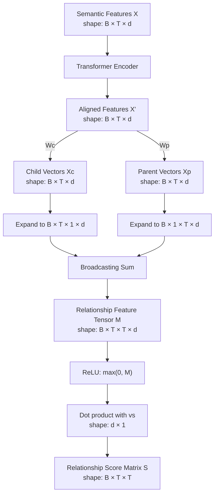
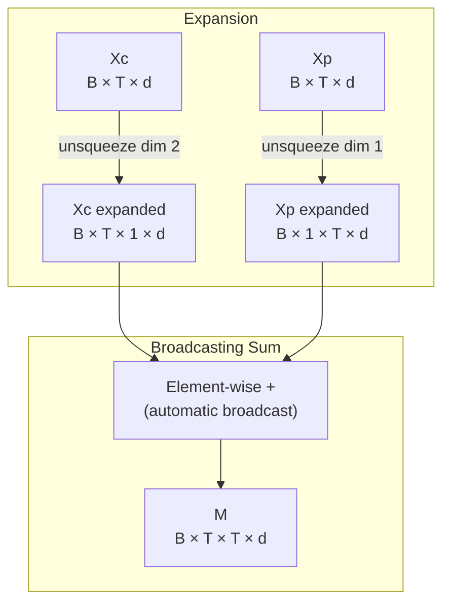
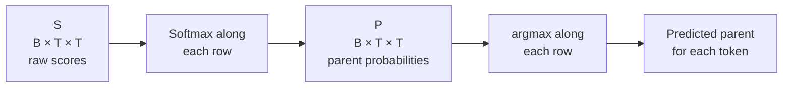

# 2.2. Tree-Aware Module Mechanics

> [!info] Quick Recall
> The Tree-Aware Module (TAM) takes the decoder's hidden features $X \in \mathbb{R}^{T \times d}$ and produces a relationship score matrix $S \in \mathbb{R}^{T \times T}$. The pipeline is: (1) run $X$ through a small **Transformer Encoder** to get bidirectional features $X'$; (2) project $X'$ into two spaces with learnable matrices $W_c, W_p$ to get **child vectors** $X^c$ and **parent vectors** $X^p$; (3) sum pairwise to get a 3-D relationship feature tensor $M \in \mathbb{R}^{T \times T \times d}$; (4) apply ReLU and a dot product with a learnable vector $v_s$ to get the scalar score matrix $S$. Every entry $S_{i,j}$ is the model's confidence that token $i$ is the child of token $j$.

---

##  Background Prerequisites

Before reading this note, you should be comfortable with:

1. The four-component architecture in [[2.1. Structural Components of TAMER]] — especially the role of the decoder's hidden features $X$.
2. The difference between a Transformer **encoder** (bidirectional, no causal mask) and a Transformer **decoder** (autoregressive, causal mask).
3. Linear projections via matrix multiplication: $Y = XW$ where $X \in \mathbb{R}^{n \times d}$ and $W \in \mathbb{R}^{d \times k}$ produces $Y \in \mathbb{R}^{n \times k}$.
4. The ReLU activation: $\text{ReLU}(x) = \max(0, x)$, applied element-wise.
5. Softmax for converting logits to a probability distribution: $\sigma(z)_i = \frac{e^{z_i}}{\sum_k e^{z_k}}$.
6. Cross-entropy loss for multi-class classification.

---

## 2.2.1. The Goal of the TAM

The TAM's job is to predict, for every ordered pair of tokens $(i, j)$ in the generated sequence, the probability that **token $i$ is the child of token $j$** in the underlying expression tree. Equivalently, for every token $t$, the TAM predicts **which other token is its parent**.

This is fundamentally a **multi-class classification** problem: each token (except the root) has exactly one parent, and the set of possible parents is the set of all other tokens in the sequence. The TAM must produce, for each token $t$, a probability distribution over all $T$ candidate parents.

The TAM achieves this by:

1. Producing a **relationship feature tensor** $M \in \mathbb{R}^{T \times T \times d}$ that captures, for every pair $(i, j)$, a $d$-dimensional feature describing their structural compatibility.
2. Projecting $M$ down to a **scalar score matrix** $S \in \mathbb{R}^{T \times T}$ where $S_{i,j}$ is the logit for "token $i$ is the child of token $j$".
3. Applying softmax along each row to get a probability distribution over candidate parents for each child.

The rest of this note walks through each step in detail, with full dimension tracking.

---

## 2.2.2. Architecture Overview



The pipeline has **five distinct operations**: (i) Transformer Encoder alignment, (ii) dual linear projection, (iii) broadcasting pairwise sum, (iv) ReLU, (v) linear scoring. We will examine each in turn.

---

## 2.2.3. Step 1 — Feature Alignment via Transformer Encoder

### The Problem with the Decoder's Output

The decoder produces hidden features $X \in \mathbb{R}^{T \times d}$ (with batch dimension: $X \in \mathbb{R}^{B \times T \times d}$). These features are **causal** — the feature for token $i$ only depends on tokens $1, \ldots, i$ because of the causal mask in the decoder's self-attention.

For relationship prediction, this is a problem. Consider the $\LaTeX$ string for $\frac{a}{b}$:

```text
\frac { a } { b }
```

Tokens are: `\frac` (0), `{` (1), `a` (2), `}` (3), `{` (4), `b` (5), `}` (6). The `\frac` operator is the **parent** of `a` and `b` (its numerator and denominator). But `\frac` appears at index 0 — **before** `a` and `b` in the sequence. The decoder's hidden feature for `\frac` cannot know about `a` and `b` because they have not been generated yet at the time `\frac` is decoded.

### The Solution: A Bidirectional Transformer Encoder

To allow every token to "see" every other token (both before and after it in the sequence), TAMER runs $X$ through a **Transformer Encoder**. Unlike the decoder, the encoder has **no causal mask**, so every token can attend to every other token in both directions.

$$
X' = \text{TransformerEncoder}(X)
$$

The output $X'$ has the same shape as $X$:

$$
X' \in \mathbb{R}^{B \times T \times d}
$$

After this step, each row $X'_i$ contains a bidirectional summary of token $i$ in the context of the **entire** sequence — exactly what we need for relationship prediction.

> [!tip] Tip — Why an encoder and not just one more decoder layer?
> A decoder layer is constrained by the causal mask: token $i$ can only attend to tokens $1, \ldots, i$. We need token $i$ to attend to tokens $i+1, \ldots, T$ as well, so we need an encoder. The simplest way to get bidirectional context is to run $X$ through a Transformer Encoder, which is exactly what TAMER does.

### Implementation Detail

The paper does not specify the exact depth of the Transformer Encoder used inside the TAM. Empirically, implementations typically use 1–2 encoder layers with the same $d = 256$ dimensionality as the decoder. The encoder uses standard multi-head self-attention with $h = 8$ heads, position-wise feed-forward with $d_{ff} = 1024$, and layer normalization. The positional information is preserved from $X$ (which already has the word positional encoding baked in from the decoder's input embeddings), so no new positional encoding is added inside the TAM.

---

## 2.2.4. Step 2 — Projection to Child and Parent Spaces

### The Conceptual Idea

In a directed parent → child relationship, the two endpoints play **different roles**. A token acting as a **parent** needs to be represented in a "parent-like" feature space (operators with arguments, like `\frac` or `^`, should have similar parent vectors). A token acting as a **child** needs to be represented in a "child-like" feature space (operands that can be arguments, like `a` or `2`, should have similar child vectors).

To capture these two roles separately, TAMER projects the aligned features $X'$ into **two distinct** vector spaces using two learnable parameter matrices:

$$
X^c = F_c(X') = X' W_c
$$

$$
X^p = F_p(X') = X' W_p
$$

where:

- $W_c \in \mathbb{R}^{d \times d}$ is the **child projection** matrix.
- $W_p \in \mathbb{R}^{d \times d}$ is the **parent projection** matrix.
- $X^c \in \mathbb{R}^{B \times T \times d}$ is the **child representation** matrix; each row $X^c_i$ represents token $i$ acting as a potential child.
- $X^p \in \mathbb{R}^{B \times T \times d}$ is the **parent representation** matrix; each row $X^p_j$ represents token $j$ acting as a potential parent.

### Why Two Different Projections?

A natural alternative would be to use the **same** projection for both child and parent roles — i.e., have a single matrix $W$ and compute $X^c = X^p = X' W$. This would be parameter-efficient but conceptually weak: it would force the model to use the same vector space for the two structurally distinct roles, which would make it harder to learn features that distinguish "good parents" from "good children".

The two-projection design is borrowed from neural relation extraction and graph neural networks, where "head" and "tail" entities are routinely projected into different spaces. It is also reminiscent of the **query** and **key** projections in standard attention, which similarly use different matrices to capture asymmetric roles.

> [!tip] Tip — Think of $W_c$ and $W_p$ as role embeddings
> A useful mental model: $W_c$ projects each token into a space where its **child-ness** is salient (is it a likely operand? does it have a natural parent operator?), while $W_p$ projects into a space where its **parent-ness** is salient (is it a binary operator? does it take arguments?). The two projections are not orthogonal in general, but they are distinct, which gives the model enough capacity to separate the two roles.

### Dimensional Verification

| Tensor | Shape |
| :--- | :--- |
| $X'$ | $B \times T \times d$ |
| $W_c$ | $d \times d$ |
| $X^c = X' W_c$ | $B \times T \times d$ |
| $W_p$ | $d \times d$ |
| $X^p = X' W_p$ | $B \times T \times d$ |

The two projections do not change the dimensionality — they just rotate the feature space.

---

## 2.2.5. Step 3 — Constructing the Relationship Feature Matrix $M$

### The Pairwise Sum

For every ordered pair of tokens $(i, j)$, the model needs a single feature vector describing "what would it look like if token $i$ were the child of token $j$?". TAMER constructs this vector by **summing** the child vector of $i$ and the parent vector of $j$:

$$
M_{i,j} = X^c_i + X^p_j
$$

where $M_{i,j} \in \mathbb{R}^d$ is the relationship feature vector for the directed edge from child candidate $i$ to parent candidate $j$.

Repeating this for all $i, j \in \{1, \ldots, T\}$ yields the **3-D relationship feature tensor**:

$$
M \in \mathbb{R}^{T \times T \times d}
$$

(with batch dimension: $M \in \mathbb{R}^{B \times T \times T \times d}$).

### Why Sum and Not Concatenate?

A natural alternative is to concatenate: $M_{i,j} = [X^c_i \,;\, X^p_j] \in \mathbb{R}^{2d}$. Summing has two advantages:

1. **Parameter efficiency.** Summing keeps the feature dimension at $d$ rather than doubling it to $2d$. The subsequent scoring step therefore needs only a $d \times 1$ vector $v_s$ rather than a $2d \times 1$ vector.
2. **Additive structure.** Summation makes the model **additively decomposable**: $M_{i,j}$ is the sum of a term depending only on $i$ and a term depending only on $j$. This is exactly the structure of bilinear models and is well-studied in the factorization-machine literature. It allows the model to learn "child-like" features and "parent-like" features independently and combine them at prediction time.

### Implementing the Pairwise Sum Efficiently

Naively, computing $M$ requires a double loop over $i$ and $j$. In practice, this is implemented using **broadcasting**:

1. **Expand $X^c$** along the parent dimension: insert a new axis at position 2.
   - Original shape: $B \times T \times d$.
   - Expanded shape: $B \times T \times 1 \times d$.

2. **Expand $X^p$** along the child dimension: insert a new axis at position 1.
   - Original shape: $B \times T \times d$.
   - Expanded shape: $B \times 1 \times T \times d$.

3. **Broadcast and sum**: when added, NumPy/PyTorch broadcasting expands both tensors to $B \times T \times T \times d$ and performs element-wise addition.



### Dimensional Verification

| Tensor | Shape |
| :--- | :--- |
| $X^c$ expanded | $B \times T \times 1 \times d$ |
| $X^p$ expanded | $B \times 1 \times T \times d$ |
| $M = X^c_{\text{expanded}} + X^p_{\text{expanded}}$ (broadcast) | $B \times T \times T \times d$ |

For $T = 9$ and $d = 256$, $M$ has $9 \times 9 \times 256 = 20{,}736$ elements per batch element. For a batch of $B = 8$, that is $165{,}888$ floats — easily fits in GPU memory.

---

## 2.2.6. Step 4 — Computing the Scalar Score Matrix $S$

### The Scoring Function

The relationship feature tensor $M$ is 4-D ($B \times T \times T \times d$). To get a single scalar score per pair, TAMER applies a scoring function $F_{\text{score}}(\cdot)$ that consists of:

1. An **element-wise ReLU**: $\max(0, M)$.
2. A **dot product** with a learnable vector $v_s \in \mathbb{R}^d$.

Formally:

$$
S = F_{\text{score}}(M) = \max(0, M) v_s
$$

where the multiplication $M v_s$ is a matrix-vector product along the last dimension.

### Why ReLU Before the Dot Product?

The ReLU serves as a **non-linearity** between the linear projection step (Step 2) and the linear scoring step (Step 4). Without it, the entire pipeline would be:

$$
S = (\max(0, \cdot) \text{ omitted}) \, (X' W_c \text{ broadcast-summed with } X' W_p) v_s
$$

This would be **linear** in $X'$, severely limiting the model's expressiveness. The ReLU introduces a non-linearity that lets the model learn non-trivial relationship patterns. The choice of ReLU (as opposed to GELU, sigmoid, or tanh) is conventional and follows common practice in attention-style scoring.

> [!tip] Tip — ReLU as a "feature selector"
> A useful interpretation: the ReLU zeroes out negative entries of $M$, effectively **selecting** which feature dimensions are "active" for each pair $(i, j)$. Only the active dimensions then contribute to the dot product with $v_s$. In this view, $v_s$ is a learned **mask** that decides which active features are positively associated with parent-child relationships.

### Why a Single Dot Product?

The dot product with $v_s$ projects the $d$-dimensional relationship feature down to a scalar. This is the simplest possible projection — a single linear layer with no bias. More complex scorers (multi-layer perceptrons, bilinear products, attention-style scorers) would also work but add parameters and complexity. The single-dot-product design is a deliberate minimalism choice: the model's expressiveness comes from the Transformer Encoder and the dual projection, not from the scorer.

### Dimensional Verification

| Tensor | Shape |
| :--- | :--- |
| $M$ | $B \times T \times T \times d$ |
| $\max(0, M)$ | $B \times T \times T \times d$ (ReLU is element-wise) |
| $v_s$ | $d \times 1$ |
| $(\max(0, M)) v_s$ | $B \times T \times T \times 1$ |
| $S$ (after squeezing last dim) | $B \times T \times T$ |

### Interpretation of $S$

Each entry $S_{i,j}$ is the model's **logit** for the hypothesis "token $i$ is the child of token $j$". A higher score indicates a stronger predicted parent–child relationship. By applying softmax along each row of $S$ (i.e., softmax over candidate parents for a fixed child), we get a probability distribution:

$$
P(\text{Parent}(i) = j) = \frac{\exp(S_{i,j})}{\sum_{k=1}^{T} \exp(S_{i,k})}
$$

This is the probability that token $j$ is the parent of token $i$.



---

## 2.2.7. Full Dimensionality and Tensor Verification Trace

Let us walk through the entire pipeline with explicit shapes, using the running example $T = 9$ (sequence `3 ^ { 2 } - 1 = 8`), $d = 256$, $B = 8$.

| Step | Operation | Tensor | Shape |
| :--- | :--- | :--- | :--- |
| Input | Decoder output | $X$ | $8 \times 9 \times 256$ |
| 1 | Transformer Encoder | $X' = \text{TransformerEncoder}(X)$ | $8 \times 9 \times 256$ |
| 2a | Child projection | $X^c = X' W_c$ | $8 \times 9 \times 256$ |
| 2b | Parent projection | $X^p = X' W_p$ | $8 \times 9 \times 256$ |
| 3a | Expand $X^c$ along parent axis | $X^c_{\text{exp}}$ | $8 \times 9 \times 1 \times 256$ |
| 3b | Expand $X^p$ along child axis | $X^p_{\text{exp}}$ | $8 \times 1 \times 9 \times 256$ |
| 3c | Broadcast and sum | $M = X^c_{\text{exp}} + X^p_{\text{exp}}$ | $8 \times 9 \times 9 \times 256$ |
| 4a | Element-wise ReLU | $\max(0, M)$ | $8 \times 9 \times 9 \times 256$ |
| 4b | Dot product with $v_s$ | $\max(0, M) \cdot v_s$ | $8 \times 9 \times 9 \times 1$ |
| 4c | Squeeze last dim | $S$ | $8 \times 9 \times 9$ |

### Parameter Count of the TAM

Let us estimate the additional parameters introduced by the TAM. (These numbers are approximate because the exact Transformer Encoder depth is not specified in the paper; we assume 1 layer.)

| Component | Parameters | Approximate Count |
| :--- | :--- | :--- |
| Transformer Encoder (1 layer, $d=256$, $h=8$, $d_{ff}=1024$) | Self-attention ($4 \times d^2$) + FFN ($2 \times d \times d_{ff}$) + LayerNorms | $\approx 4 \cdot 256^2 + 2 \cdot 256 \cdot 1024 \approx 786{,}432$ |
| Child projection $W_c$ | $d \times d$ | $65{,}536$ |
| Parent projection $W_p$ | $d \times d$ | $65{,}536$ |
| Scoring vector $v_s$ | $d$ | $256$ |
| **Total** | | $\approx 917{,}760$ |

This is roughly **0.9 million parameters** per TAM module. The total TAMER model has 8.23 M parameters (per Table 4 of the paper), of which CoMER contributes 6.39 M. The remaining 1.84 M is the TAM plus some auxiliary bookkeeping — consistent with our estimate.

> [!tip] Tip — Verify the parameter count from the paper
> The paper reports that TAMER has 8.23 M parameters vs. CoMER's 6.39 M, an increase of **1.84 M**. Our estimate of 0.92 M for a 1-layer Transformer Encoder is in the right ballpark; the remaining difference may be a 2-layer encoder, additional LayerNorm parameters, or projection biases. The exact breakdown is not given in the paper.

---

## 2.2.8. A Worked Numerical Example

To make the mechanics concrete, let's trace a tiny example by hand. Suppose we have:

- $T = 3$ tokens.
- $d = 4$ (artificially small for readability).
- $X'$ (after the Transformer Encoder) is:
  $$
  X' = \begin{bmatrix} 1 & 0 & 1 & 0 \\ 0 & 1 & 0 & 1 \\ 1 & 1 & 0 & 0 \end{bmatrix}
  $$
  (rows are tokens 1, 2, 3; columns are feature dimensions.)

- $W_c = I$ (identity, for simplicity):
  $$
  W_c = \begin{bmatrix} 1 & 0 & 0 & 0 \\ 0 & 1 & 0 & 0 \\ 0 & 0 & 1 & 0 \\ 0 & 0 & 0 & 1 \end{bmatrix}
  $$
  So $X^c = X'$.

- $W_p$ flips the second and fourth dimensions:
  $$
  W_p = \begin{bmatrix} 1 & 0 & 0 & 0 \\ 0 & 0 & 0 & 1 \\ 0 & 0 & 1 & 0 \\ 0 & 1 & 0 & 0 \end{bmatrix}
  $$
  Then $X^p = X' W_p$ is:
  $$
  X^p = \begin{bmatrix} 1 & 0 & 1 & 0 \\ 0 & 1 & 0 & 1 \\ 1 & 0 & 0 & 1 \end{bmatrix}
  $$

- $v_s = [1, 1, 1, 1]^T$ (all ones, for simplicity).

Now compute $M_{i,j} = X^c_i + X^p_j$ for each pair:

- $M_{1,1} = X^c_1 + X^p_1 = [1,0,1,0] + [1,0,1,0] = [2,0,2,0]$
- $M_{1,2} = [1,0,1,0] + [0,1,0,1] = [1,1,1,1]$
- $M_{1,3} = [1,0,1,0] + [1,0,0,1] = [2,0,1,1]$
- $M_{2,1} = [0,1,0,1] + [1,0,1,0] = [1,1,1,1]$
- $M_{2,2} = [0,1,0,1] + [0,1,0,1] = [0,2,0,2]$
- $M_{2,3} = [0,1,0,1] + [1,0,0,1] = [1,1,0,2]$
- $M_{3,1} = [1,1,0,0] + [1,0,1,0] = [2,1,1,0]$
- $M_{3,2} = [1,1,0,0] + [0,1,0,1] = [1,2,0,1]$
- $M_{3,3} = [1,1,0,0] + [1,0,0,1] = [2,1,0,1]$

Now apply ReLU (no change since all entries are non-negative) and dot with $v_s = [1,1,1,1]^T$ (sum the components):

- $S_{1,1} = 2+0+2+0 = 4$
- $S_{1,2} = 1+1+1+1 = 4$
- $S_{1,3} = 2+0+1+1 = 4$
- $S_{2,1} = 1+1+1+1 = 4$
- $S_{2,2} = 0+2+0+2 = 4$
- $S_{2,3} = 1+1+0+2 = 4$
- $S_{3,1} = 2+1+1+0 = 4$
- $S_{3,2} = 1+2+0+1 = 4$
- $S_{3,3} = 2+1+0+1 = 4$

This toy example produces uniform scores (all 4) because our weight choices were degenerate. In a real trained model, $W_c$, $W_p$, and $v_s$ are learned end-to-end and produce sharply differentiating scores. The point of this exercise is to verify the **mechanics**: each step produces the expected shape, and the final $S$ is a $T \times T$ scalar matrix.

### Softmax to Probabilities

For a real (non-degenerate) $S$ matrix, applying softmax along each row gives the probability distribution over candidate parents. For example, if row $i$ of $S$ is $[3, 0, 1, 5, 2]$ for $T = 5$, then:

$$
P(\text{Parent}(i) = \cdot) = \text{softmax}([3, 0, 1, 5, 2]) \approx [0.045, 0.002, 0.006, 0.923, 0.024]
$$

The model would predict that token 4 is the parent of token $i$ with 92.3 % confidence.

---

## 2.2.9. Why This Design Works

### Three Properties That Make the TAM Effective

1. **Bidirectional context.** By running $X$ through a Transformer Encoder, the TAM allows every token to consider every other token in both directions. This is essential because parent operators often appear **before** their children in $\LaTeX$ (e.g., `\frac` appears before its numerator and denominator), but the decoder's causal mask hides this information.

2. **Role separation.** By using two different projection matrices $W_c$ and $W_p$, the model can learn different feature spaces for "what makes a good child" and "what makes a good parent". Without this separation, the model would have to use a single shared representation, which conflates the two roles.

3. **Additive pairwise features.** By summing $X^c_i$ and $X^p_j$ to form $M_{i,j}$, the model captures the joint information of the pair without exploding the parameter count. The alternative — concatenation — would double the feature dimension and require a larger scoring layer.

### What the TAM Is NOT

- **The TAM is not a tree decoder.** It does not build a tree by sequentially emitting nodes. It produces a **score matrix** that can be interpreted as a soft prediction of parent-child relationships, but it never explicitly constructs a tree.
- **The TAM is not a tree-constrained decoder.** It does not prevent the sequence decoder from emitting invalid $\LaTeX$ during training. The constraint is enforced only **softly**, through the loss, and **at inference time**, through the composite beam-search score.
- **The TAM is not a parser.** It does not implement any grammar rules. It learns parent-child relationships purely from data.

---

## 2.2.10. Tips, Pitfalls, and Reminders

> [!tip] Tip — Track the dimensions on a sticky note
> The single most useful study aid for the TAM is a small table with the dimensions at each step. Write it out once by hand and refer to it whenever the math starts to feel abstract. The five shapes to remember are: $X$ is $T \times d$; $X'$ is $T \times d$; $X^c, X^p$ are $T \times d$ each; $M$ is $T \times T \times d$; $S$ is $T \times T$.

> [!warning] Pitfall — Confusing the rows and columns of $S$
> The convention in TAMER is that **rows are children, columns are parents**: $S_{i,j}$ is the score for "token $i$ is the child of token $j$". Softmax is applied **along each row**, i.e., for a fixed child $i$, we compute the probability distribution over candidate parents $j$. Getting this backwards is one of the most common implementation bugs.

> [!warning] Pitfall — Forgetting the unsqueeze in step 3
> The pairwise sum $M_{i,j} = X^c_i + X^p_j$ requires broadcasting. The standard implementation is to `unsqueeze` $X^c$ at position 2 (giving shape $B \times T \times 1 \times d$) and $X^p$ at position 1 (giving shape $B \times 1 \times T \times d$), then add. If you forget the unsqueeze, you will either get a shape error or — worse — a silently incorrect result where the sum is computed along the wrong axis.

> [!reminder] Reminder — ReLU is element-wise
> The expression $\max(0, M)$ is an **element-wise** ReLU. It does not max along any axis; it applies $\max(0, \cdot)$ independently to every entry of $M$. After this, the dot product with $v_s$ contracts the last axis.

> [!reminder] Reminder — $v_s$ has shape $d \times 1$, not $d$
> The scoring vector $v_s$ is conventionally stored as a column vector of shape $d \times 1$ so that the matrix product $(\max(0, M)) \cdot v_s$ produces a tensor of shape $B \times T \times T \times 1$, which is then squeezed to $B \times T \times T$. If you store $v_s$ as a 1-D vector of shape $d$, some frameworks will broadcast incorrectly. Always reshape explicitly.

> [!tip] Tip — Think of the TAM as "soft attention for tree edges"
> The TAM's architecture is structurally very similar to a single-head attention mechanism: project the input into two spaces (analogous to queries and keys), compute pairwise scores via a dot product, and apply softmax. The differences are: (a) the TAM uses a sum rather than a dot product to combine the two projections, (b) it inserts a ReLU before the scoring dot product, and (c) the goal is to predict parent-child edges rather than attention weights. The mental model "soft attention for tree edges" is a good one.

> [!warning] Pitfall — Expecting the TAM to make the decoder perfect
> The TAM is a **regularizer** during training and a **scorer** during inference. It does not magically make the decoder's hidden features perfect; it just nudges them in a tree-coherent direction. The decoder can still emit wrong tokens; the TAM can only make the wrong-token hypothesis less likely to survive beam search.

---

## 2.2.11. Self-Check Questions

1. Why does the TAM need a Transformer Encoder before the linear projections?
2. What are the shapes of $X$, $X'$, $X^c$, $X^p$, $M$, and $S$ for $T = 12$ and $d = 256$?
3. Why are there two projection matrices $W_c$ and $W_p$ instead of one?
4. Why is the pairwise sum $M_{i,j} = X^c_i + X^p_j$ used instead of concatenation?
5. What is the role of the ReLU in the scoring function?
6. What is the shape of $v_s$, and how does it interact with $M$?
7. In the score matrix $S$, what does $S_{i,j}$ represent, and along which axis is softmax applied?
8. Estimate the number of parameters added by the TAM, and verify against the paper's 1.84 M increase.

---

## 2.2.12. Next Note

Continue to [[2.3. Tree-Structure Annotation Construction]] — we now move from "how the TAM predicts parent-child relationships" to "how the ground-truth parent-child annotations used to train the TAM are constructed from $\LaTeX$ strings".

---

## References

- Zhu, J. et al. *TAMER: Tree-Aware Transformer for HMER*. AAAI 2025. arXiv:2408.08578v2. §Tree-aware Module, Figure 3, Equations (1)–(5).
- Vaswani, A. et al. *Attention Is All You Need*. NeurIPS 2017.
- Zhang, J. et al. *A Tree-Structured Decoder for Image-to-Markup Generation*. ICML 2020. (Source of the index-based annotation idea.)
