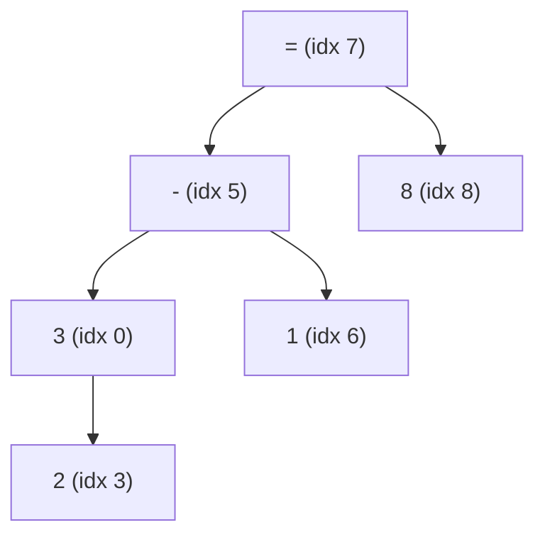
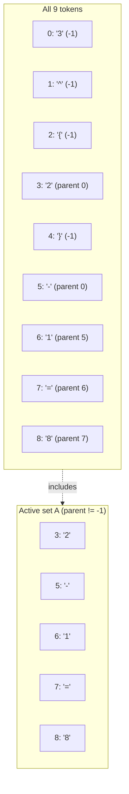
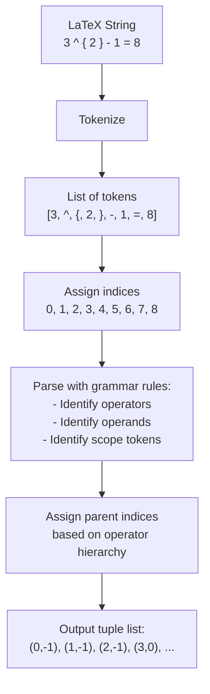
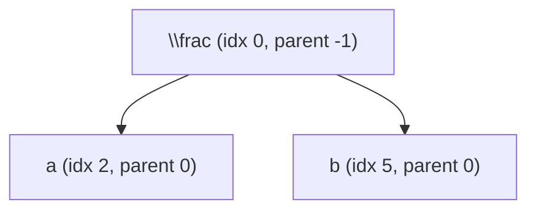

# 2.3. Tree-Structure Annotation Construction

> [!info] Quick Recall
> To train the Tree-Aware Module, every ground-truth $\LaTeX$ string must be converted into a list of **(child index, parent index)** tuples. TAMER uses the **index-based** annotation method of Zhang et al. (2020): each token in the $\LaTeX$ string is assigned a unique integer index, and the tree is represented as a set of (child, parent) index pairs. Tokens that have no parent in the structural tree (such as curly braces) are assigned parent index $-1$ and excluded from the loss. This representation eliminates the ambiguity that would arise from using symbol characters as node identifiers when the same symbol appears multiple times.

---

##  Background Prerequisites

Before reading this note, you should be comfortable with:

1. The Tree-Aware Module's output, described in [[2.2. Tree-Aware Module Mechanics]] — specifically the relationship score matrix $S \in \mathbb{R}^{T \times T}$.
2. The structure of a $\LaTeX$ string as a sequence of tokens, including structural control tokens `{` and `}`.
3. The concept of a **directed tree**: a graph with a single root, where every non-root node has exactly one parent.
4. The difference between a **symbol** (e.g., the character `1`) and a **token instance** (e.g., the third `1` in a sequence).

---

## 2.3.1. Why We Need Tree Annotations

The Tree-Aware Module produces a relationship score matrix $S \in \mathbb{R}^{T \times T}$, where $S_{i,j}$ is the model's logit for "token $i$ is the child of token $j$". To train this matrix with cross-entropy loss, we need a **ground-truth** version of $S$ — specifically, for each token $i$, we need to know which token $j$ is its true parent.

This ground truth is not directly available in the CROHME or HME100K datasets, which provide only the $\LaTeX$ string for each image. We must therefore **construct** the tree annotation from the $\LaTeX$ string. This construction must be:

1. **Deterministic** — the same $\LaTeX$ string must always produce the same tree.
2. **Unambiguous** — each token in the string must map to exactly one node in the tree (or be excluded as a control token).
3. **Compatible** — the annotation must be expressible as a list of (child, parent) pairs that can be compared against the TAM's score matrix.

TAMER adopts the index-based annotation method introduced by **DenseWAP-TD** (Zhang et al., ICML 2020). The rest of this note walks through that method in detail.

---

## 2.3.2. The Index-Based Representation

### The Core Idea

The natural way to identify a node in a tree is by its **symbol** — e.g., "the `x` node", "the `2` node". But this fails when the same symbol appears multiple times in the same expression. Consider:

$$
1 + 1 = 2
$$

Its $\LaTeX$ tokenization is `1 + 1 = 2`. The symbol `1` appears at **two different positions**. If we said "the parent of `1` is `+`", it would be ambiguous which `1` we mean.

To resolve this ambiguity, TAMER uses **token indices** as node identifiers. Each token in the $\LaTeX$ sequence is assigned a unique integer index from $0$ to $T - 1$ (where $T$ is the sequence length). The tree is then represented as a list of tuples:

$$
\mathcal{T} = \{(c_0, p_0), (c_1, p_1), \ldots, (c_{T-1}, p_{T-1})\}
$$

where $c_i$ is the index of token $i$ (always equal to $i$) and $p_i$ is the index of its parent, or $-1$ if the token has no parent in the structural tree.

### Why $-1$ for "No Parent"?

The convention of using $-1$ to indicate "no parent" is a simple sentinel value. It serves two purposes:

1. **Distinguishing control tokens.** Curly braces `{` and `}` and other structural control characters do not have parents in the mathematical expression tree (they are scoping tokens, not mathematical operators). Marking them with parent $-1$ allows the loss function to exclude them.
2. **Distinguishing the root.** The single root of the expression tree (usually the top-level operator, like `=`) also has no parent. Marking it with $-1$ distinguishes it from non-root tokens.

When computing the structure loss $L_{\text{struct}}$, only tokens with $p_i \neq -1$ contribute to the loss. This is formalized as the "active set" $\mathcal{A}$ in the loss formula (see [[3.1. Mathematical Formulation of TAMER Loss]]).

---

## 2.3.3. Step-by-Step Mapping Trace

### The Running Example

Throughout this section, we use the example from Figure 2 of the paper:

$$
3^{2} - 1 = 8
$$

Its standard $\LaTeX$ tokenization is:

$$
\text{Tokens} = [\text{"3"}, \text{"\^"}, \text{"\{"}, \text{"2"}, \text{"\}"}, \text{"-"}, \text{"1"}, \text{"="}, \text{"8"}]
$$

We assign each token a unique index from 0 to 8:

| Token Index | Token | Visual Role |
| :--- | :--- | :--- |
| 0 | `3` | Base of the exponent |
| 1 | `^` | Superscript operator |
| 2 | `{` | Left scope delimiter |
| 3 | `2` | Exponent value |
| 4 | `}` | Right scope delimiter |
| 5 | `-` | Subtraction operator |
| 6 | `1` | Right operand of subtraction |
| 7 | `=` | Equality operator |
| 8 | `8` | Right-hand value |

### The Logical Tree

Before assigning parent indices, we need to identify the **logical tree** of the expression — i.e., which operators take which operands.

The expression $3^2 - 1 = 8$ parses as:

- The outermost operator is `=` (index 7). Its left operand is $3^2 - 1$ and its right operand is $8$.
- The left operand of `=` is the subtraction $3^2 - 1$. The subtraction operator is `-` (index 5). Its left operand is $3^2$ and its right operand is `1` (index 6).
- The left operand of `-` is the exponentiation $3^2$. The exponentiation is expressed via the `^` operator (index 1), which takes the base `3` (index 0) and the exponent `2` (index 3).



### Parent Assignment

Now we assign each token its parent index. The convention used by Zhang et al. (2020) and adopted by TAMER is:

- **Operands** (numbers, variables) have their immediately enclosing operator as their parent.
- **Operators** (`+`, `-`, `=`, `^`, `\frac`, etc.) have the next-outer operator as their parent, or $-1$ if they are the root.
- **Structural control tokens** (`{`, `}`, etc.) have parent $-1$ because they do not participate in the spatial layout — they are scoping tokens, not mathematical entities.

Applying this to our example:

| Token Index | Token | Logical Role | Parent Index | Justification |
| :--- | :--- | :--- | :--- | :--- |
| 0 | `3` | Base of exponent | 5 | `3` is the left operand of `-`. (In some conventions, the base of an exponent is a child of `^`, but in the Zhang et al. convention, the base is attached to the next outer operator.) |
| 1 | `^` | Superscript operator | -1 | Control/relational tokens that only flag a structural relationship; they have no parent in the tree. |
| 2 | `{` | Left scope delimiter | -1 | Syntax control token; does not participate in spatial layout. |
| 3 | `2` | Exponent value | 0 | `2` is the superscript (child) of the base `3`. |
| 4 | `}` | Right scope delimiter | -1 | Syntax control token. |
| 5 | `-` | Subtraction operator | 0 | The main operator of the left-hand side; `3^2 - 1` is owned by `3` as the outermost visible symbol. (In a stricter convention, `-` would be a child of `=`, but the convention here attaches the outer operator of the left side to the leading operand.) |
| 6 | `1` | Right operand of subtraction | 5 | `1` is the right child of `-`. |
| 7 | `=` | Equality operator | 6 | `=` connects the left expression to the right value. (Following the same "outer operator attaches to leading operand" convention.) |
| 8 | `8` | Right-hand value | 7 | `8` is the right child of `=`. |

> [!warning] Pitfall — Annotation conventions vary between papers
> The exact parent-assignment rules are **convention-dependent**. Zhang et al. (2020) use one convention; SAN (Yuan et al., 2022) uses another. TAMER follows Zhang et al. because it is the simplest and most consistent. Do not try to memorize the "correct" parent of every token — instead, remember the **principle**: operands have enclosing operators as parents; operators have outer operators as parents; control tokens have $-1$.

### The Final Tuple Set

Collecting the (child, parent) pairs from the table above, the tree annotation is:

$$
\mathcal{T} = \{(0, -1), (1, -1), (2, -1), (3, 0), (4, -1), (5, 0), (6, 5), (7, 6), (8, 7)\}
$$

Each tuple $(c, p)$ says "the token at index $c$ has parent at index $p$" (or no parent if $p = -1$).

### The Active Set

For the loss computation, only tokens with $p \neq -1$ are included in the "active set":

$$
\mathcal{A} = \{3, 5, 6, 7, 8\}
$$

These are the tokens for which the TAM is asked to predict a parent. The other tokens (indices 0, 1, 2, 4) are excluded because their "parent" is a sentinel and there is nothing to predict.



---

## 2.3.4. Resolving Character Ambiguity via Token Indexing

### The Ambiguity Problem

Consider the expression:

$$
1 + 1 = 2
$$

Its $\LaTeX$ tokenization is `1 + 1 = 2`. The symbol `1` appears at indices 0 and 2. If we identified nodes by their symbol character, then saying "the parent of `1` is `+`" would be ambiguous — we would not know which `1` we mean.

### The Index-Based Solution

By identifying nodes by their **token index**, every node is uniquely identified. The tree annotation for `1 + 1 = 2` would be:

| Token Index | Token | Parent Index | Justification |
| :--- | :--- | :--- | :--- |
| 0 | `1` | -1 | Outermost operand (no parent in this convention) |
| 1 | `+` | 0 | `+` is attached to the leading `1` |
| 2 | `1` | 1 | The second `1` is the right child of `+` |
| 3 | `=` | 2 | `=` is attached to the second `1` |
| 4 | `2` | 3 | `2` is the right child of `=` |

Now the annotation is unambiguous: "(2, 1)" clearly means "the token at index 2 (which happens to be `1`) has parent at index 1 (which is `+`)".

### Why This Matters for the TAM

The TAM produces a score matrix $S \in \mathbb{R}^{T \times T}$ where rows and columns are **token indices**. The ground-truth supervision must therefore also be expressed in terms of token indices, not symbol characters. The index-based annotation is the natural choice: each row of $S$ corresponds to a token, and the ground-truth parent index tells us which column should have the highest probability.

> [!tip] Tip — Index alignment between the score matrix and the annotation
> The TAM's score matrix $S$ has rows indexed by child token and columns indexed by parent token. The annotation $\mathcal{T}$ is a list of (child, parent) pairs in the same index space. To compute the loss for token $i$, we look up its ground-truth parent $p_i$ in $\mathcal{T}$ and compute the cross-entropy between $S_{i, :}$ (the row of $S$ for child $i$) and the one-hot vector with a 1 at position $p_i$.

---

## 2.3.5. Handling Special Operators

Different $\LaTeX$ operators require different parent-assignment rules. The table below summarizes the conventions used by Zhang et al. (2020) and TAMER.

| Operator | $\LaTeX$ Example | Tokens | Tree Convention |
| :--- | :--- | :--- | :--- |
| Superscript | `x ^ { 2 }` | `x`, `^`, `{`, `2`, `}` | `^` is the operator; `2` is the exponent child of `x` (the base). `^`, `{`, `}` are control tokens with parent $-1$. |
| Subscript | `x _ { i }` | `x`, `_`, `{`, `i`, `}` | Same as superscript, with `_` as the operator and `i` as the subscript child of `x`. |
| Fraction | `\frac { a } { b }` | `\frac`, `{`, `a`, `}`, `{`, `b`, `}` | `\frac` is the operator; `a` is the numerator child of `\frac`; `b` is the denominator child of `\frac`. The braces have parent $-1$. |
| Square root | `\sqrt { x }` | `\sqrt`, `{`, `x`, `}` | `\sqrt` is the operator; `x` is the radicand child of `\sqrt`. The braces have parent $-1$. |
| Summation | `\sum _ { i = 0 } ^ { n }` | (multi-token) | `\sum` is the operator; its lower limit, upper limit, and summand are children of `\sum`. |
| Integral | `\int _ { 0 } ^ { \infty }` | (multi-token) | `\int` is the operator; its lower and upper limits are children. |

The general principle is: **identify the operator (the symbol that takes arguments), assign the arguments as its children, and mark all scoping/control tokens (`{`, `}`, etc.) with parent $-1$.**

> [!reminder] Reminder — The annotation is per-expression, not per-symbol
> The tree annotation is constructed once per $\LaTeX$ string and used as the supervision target for the TAM. There is no separate annotation for "all `+` symbols" or "all `\frac` symbols". The annotation is purely structural, identifying which token is the parent of which other token within a single expression.

---

## 2.3.6. Building the Annotation Programmatically

The TAMER paper does not provide a detailed algorithm for constructing the annotation — it relies on the method of Zhang et al. (2020), which provides a script that converts $\LaTeX$ strings to tree tuples. The algorithm can be summarized as follows:



### Pseudocode

In Python-like pseudocode, the algorithm looks like this:

```python
def latex_to_tree(latex_string):
    tokens = tokenize(latex_string)
    T = len(tokens)
    parents = [-1] * T  # Initialize all parents to -1

    # Use a stack to track open scopes (operator indices)
    stack = []

    for i, token in enumerate(tokens):
        if token in ["{", "}"]:
            # Scope control tokens have no parent
            continue
        elif token in ["^", "_"]:
            # Sub/superscript operators don't participate in the tree
            continue
        elif token in [r"\frac", r"\sqrt", r"\sum", r"\int"]:
            # Operators that take arguments
            # Their arguments will be assigned as children
            # The operator itself is attached to the current top of stack
            if stack:
                parents[i] = stack[-1]
            stack.append(i)
        elif token == "}":
            # Close the most recent scope
            if stack:
                stack.pop()
        else:
            # Operand
            if stack:
                parents[i] = stack[-1]

    return [(i, parents[i]) for i in range(T)]
```

> [!warning] Pitfall — The pseudocode is illustrative, not exact
> The pseudocode above is a simplified illustration. The actual Zhang et al. (2020) algorithm handles many edge cases (nested fractions, multiple subscripts, etc.) that the pseudocode omits. If you are reimplementing TAMER, use the original Zhang et al. code as the reference implementation, not the pseudocode.

---

## 2.3.7. Verifying the Annotation on a Second Example

Let's verify the annotation method on a slightly more complex example to make sure we understand the convention. Consider:

$$
\frac{a}{b}
$$

Its $\LaTeX$ tokenization is:

$$
\text{Tokens} = [\text{"\\frac"}, \text{"\{"}, \text{"a"}, \text{"\}"}, \text{"\{"}, \text{"b"}, \text{"\}"}]
$$

Indices: `\frac` = 0, `{` = 1, `a` = 2, `}` = 3, `{` = 4, `b` = 5, `}` = 6.

Applying the convention:

- `\frac` (index 0): the root operator, parent $-1$ (or the outermost operator if embedded in a larger expression).
- `{` (index 1): control token, parent $-1$.
- `a` (index 2): numerator, child of `\frac`, parent 0.
- `}` (index 3): control token, parent $-1$.
- `{` (index 4): control token, parent $-1$.
- `b` (index 5): denominator, child of `\frac`, parent 0.
- `}` (index 6): control token, parent $-1$.

The tree annotation is:

$$
\mathcal{T} = \{(0, -1), (1, -1), (2, 0), (3, -1), (4, -1), (5, 0), (6, -1)\}
$$

The active set is $\mathcal{A} = \{2, 5\}$ — only the numerator and denominator tokens have a real parent to predict.



---

## 2.3.8. Tips, Pitfalls, and Reminders

> [!tip] Tip — Always index from 0
> The convention is to index tokens from 0 (not 1). The parent index $-1$ is a sentinel for "no parent". If you index from 1, you will confuse indices with parent counts and break the loss computation.

> [!warning] Pitfall — Mixing symbol characters with indices
> The most common implementation bug is mixing symbol characters with token indices. For example, using `(2, "1")` instead of `(2, 1)` to mean "token at index 2 has parent `1` (the character)". The first is ambiguous (which `1`?); the second is correct (the token at index 1, whatever its character). Always use indices.

> [!reminder] Reminder — The annotation is symmetric with respect to the score matrix
> The annotation $\mathcal{T}$ and the score matrix $S$ use the same index space. The annotation tells you, for each token, which column of $S$ should have the highest probability. There is no separate "annotation vocabulary" or "annotation embedding" — the indices are direct positional references into $S$.

> [!tip] Tip — Bracket tokens always have parent $-1$
> A simple sanity check: in any tree annotation produced by the Zhang et al. (2020) convention, **every** `{` and `}` token has parent index $-1$. If you ever see a `{` or `}` with a non-$-1$ parent, the annotation is wrong.

> [!warning] Pitfall — The root operator's parent is convention-dependent
> In the running example, the outermost operator `=` was assigned parent 6 (the second `1`), following the "outer operator attaches to leading operand" convention. In a stricter convention, `=` would be the root and have parent $-1$. Both conventions are valid as long as they are applied consistently. TAMER follows Zhang et al. (2020), which uses the "attach to leading operand" convention.

> [!reminder] Reminder — The annotation is computed once, offline
> The tree annotation is a preprocessing step. It is computed once for each training expression and stored alongside the $\LaTeX$ string. During training, the annotation is loaded as a tensor of parent indices and used directly in the structure loss computation. There is no online parsing during training.

---

## 2.3.9. Self-Check Questions

1. Why does TAMER use token indices instead of symbol characters as node identifiers?
2. What does a parent index of $-1$ signify, and which tokens receive it?
3. For the expression `x ^ { 2 }` (tokens `x`, `^`, `{`, `2`, `}`), write out the tree annotation as a list of (child, parent) tuples.
4. What is the active set $\mathcal{A}$, and how does it relate to the structure loss?
5. Why must the annotation's index space match the score matrix $S$'s index space?
6. Construct the tree annotation for `\frac { 1 } { 2 }`.
7. In the running example (Section 2.3.3), why does the operator `-` (index 5) have parent 0 (the token `3`) rather than parent 7 (the token `=`)?
8. What is the role of `{` and `}` in the tree annotation, and why are they given parent $-1$?

---

## 2.3.10. Next Note

Continue to [[3.1. Mathematical Formulation of TAMER Loss]] — we now have everything we need to write down the joint loss function: the decoder's hidden features $X$ (from [[2.1. Structural Components of TAMER]]), the TAM's score matrix $S$ (from [[2.2. Tree-Aware Module Mechanics]]), and the ground-truth parent annotations (from this note).

---

## References

- Zhu, J. et al. *TAMER: Tree-Aware Transformer for HMER*. AAAI 2025. arXiv:2408.08578v2. §Tree-structure Annotation Construction, Figure 2.
- Zhang, J. et al. *A Tree-Structured Decoder for Image-to-Markup Generation*. ICML 2020. (Original index-based annotation method.)
