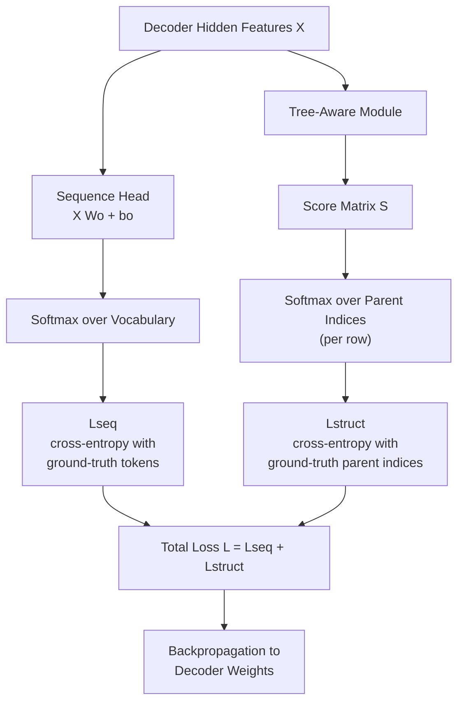
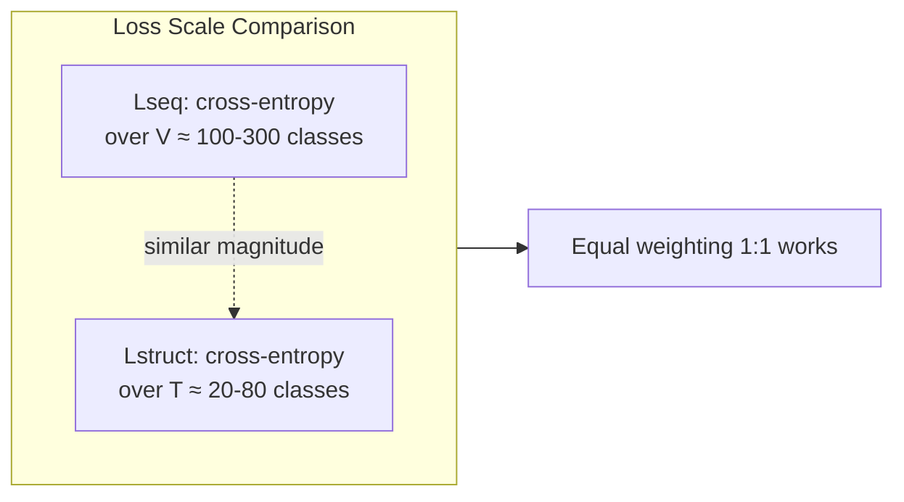
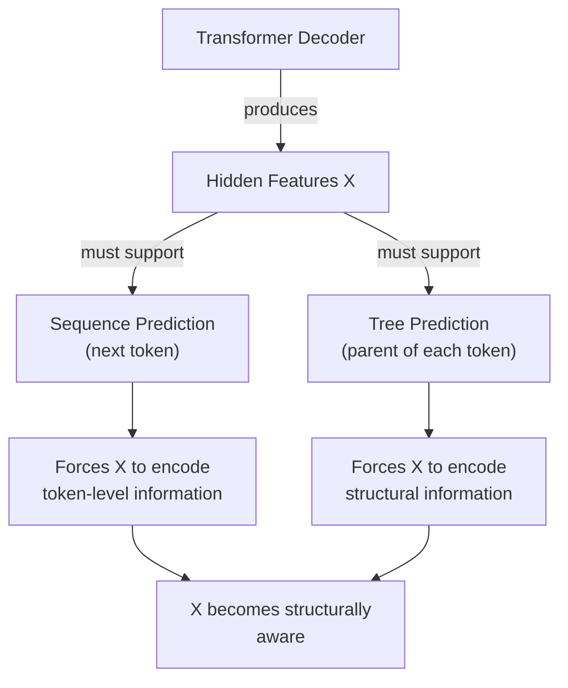
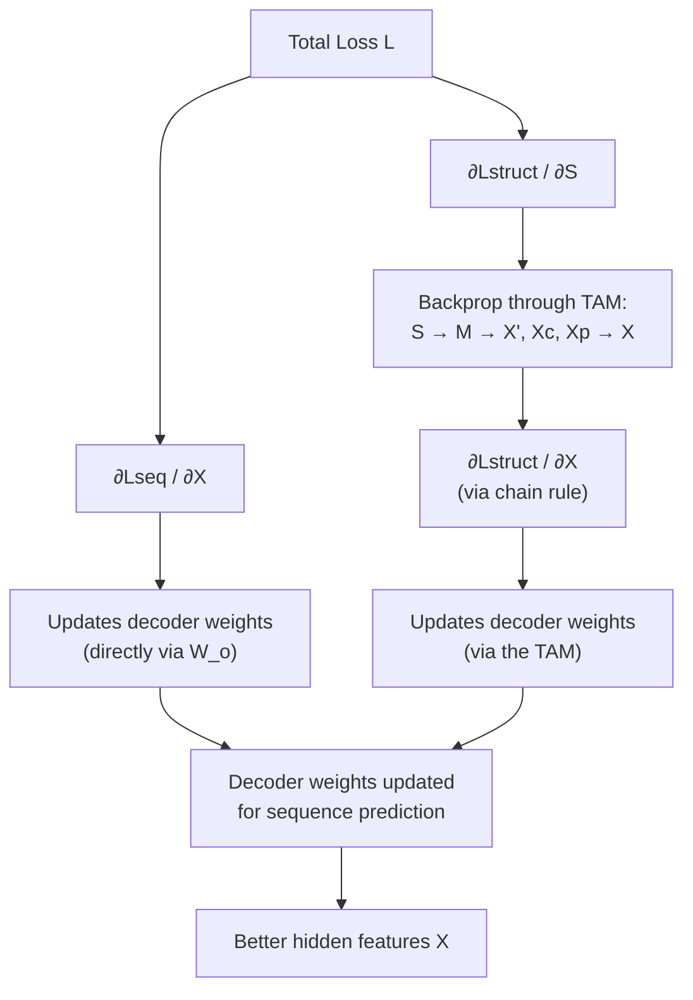

# 3.1. Mathematical Formulation of TAMER Loss

> [!info] Quick Recall
> TAMER is trained end-to-end with a single combined loss: $L = L_{\text{seq}} + L_{\text{struct}}$. Both terms are **cross-entropy** losses. $L_{\text{seq}}$ is the standard sequence-decoding loss over the $\LaTeX$ vocabulary (one distribution per decoding step). $L_{\text{struct}}$ is a multi-class classification loss where, for each active token $t$, the model predicts which other token is its parent — softmax is applied along the row of the score matrix $S_t$, and cross-entropy is taken against the one-hot vector at the ground-truth parent index $g_t$. The two losses share the decoder's hidden features $X$, which forces $X$ to be simultaneously informative about (a) the next token and (b) the parent of every token. The structure loss acts as a regularizer on the sequence loss.

---

##  Background Prerequisites

Before reading this note, you should be comfortable with:

1. The decoder's hidden features $X$ and how they are used by both the sequence head and the Tree-Aware Module — see [[2.1. Structural Components of TAMER]] and [[2.2. Tree-Aware Module Mechanics]].
2. The relationship score matrix $S \in \mathbb{R}^{T \times T}$ produced by the TAM.
3. The ground-truth tree annotation $\mathcal{T}$ and the active set $\mathcal{A}$ — see [[2.3. Tree-Structure Annotation Construction]].
4. **Cross-entropy loss** for multi-class classification: $L = -\sum_k y_k \log \hat{y}_k$, where $y$ is a one-hot target and $\hat{y}$ is a predicted probability distribution.
5. **Softmax**: $\sigma(z)_i = \frac{e^{z_i}}{\sum_k e^{z_k}}$.
6. The concept of **multi-task learning** and why shared representations can be regularized by auxiliary tasks.

---

## 3.1.1. The Joint Loss at a Glance

TAMER is optimized with a multi-task loss that combines sequence-based decoding and tree-structure prediction. The total loss is:

$$
L = L_{\text{seq}} + L_{\text{struct}}
$$

Both terms are cross-entropy losses. The two losses share the decoder's hidden features $X$, which means the decoder is trained to produce features that are good for **both** predicting the next token **and** predicting the parent of every token.



---

## 3.1.2. Sequence-Based Decoding Loss ($L_{\text{seq}}$)

### The Decoding Task

The sequence decoder predicts the probability of each token in the target $\LaTeX$ sequence $y = (y_1, y_2, \ldots, y_T)$ autoregressively. At each decoding step $t$, the decoder:

1. Receives the previously generated tokens $y_{<t}$ (during training, the ground-truth prefix — this is **teacher forcing**).
2. Produces a hidden feature vector $X_t \in \mathbb{R}^d$ at position $t$.
3. Projects $X_t$ to the vocabulary dimension via a linear layer: $\text{logits}_t = X_t W_o + b_o \in \mathbb{R}^V$, where $V$ is the vocabulary size and $W_o \in \mathbb{R}^{d \times V}$, $b_o \in \mathbb{R}^V$ are learnable parameters.
4. Applies softmax to get a probability distribution: $\hat{y}_t = \text{softmax}(\text{logits}_t) \in \mathbb{R}^V$.

### The Loss Formula

The sequence loss $L_{\text{seq}}$ is the standard cross-entropy loss between the predicted distribution $\hat{y}_t$ and the ground-truth one-hot vector $e_{y_t}$ (which has a 1 at position $y_t$ and 0 elsewhere):

$$
L_{\text{seq}} = - \sum_{t=1}^{T} \log P(y_t \mid y_{<t}, I) = - \sum_{t=1}^{T} \log \left( \text{softmax}(X_t W_o + b_o) \cdot e_{y_t} \right)
$$

In words: for each decoding step $t$, take the predicted probability of the correct token $y_t$, take its logarithm, negate it, and sum over all $T$ steps. The result is the negative log-likelihood of the entire ground-truth sequence under the model's autoregressive distribution.

### Dimensional Verification

| Tensor | Shape |
| :--- | :--- |
| $X$ (decoder hidden features) | $B \times T \times d$ |
| $W_o$ (output projection) | $d \times V$ |
| $b_o$ (output bias) | $V$ |
| $\text{logits} = X W_o + b_o$ | $B \times T \times V$ |
| $\hat{y} = \text{softmax}(\text{logits})$ | $B \times T \times V$ |
| Ground-truth indices $y$ | $B \times T$ |
| $L_{\text{seq}}$ (per batch) | scalar (averaged over batch and sequence) |

### Implementation in PyTorch

In PyTorch, this is one line of code:

```python
# logits: B × T × V, targets: B × T (token indices)
loss_seq = F.cross_entropy(
    logits.reshape(-1, V),
    targets.reshape(-1),
    ignore_index=PAD_IDX
)
```

The `ignore_index=PAD_IDX` argument tells PyTorch to skip padding tokens in the loss computation — important for batched training where sequences have different lengths.

> [!tip] Tip — Mean vs. sum reduction
> The formula above is written as a sum over $t$. In practice, most implementations use **mean reduction** (averaging over $T$ and over the batch) for numerical stability. The choice between sum and mean affects only the effective learning rate — the gradient direction is the same. TAMER's implementation uses mean reduction by convention.

---

## 3.1.3. Tree-Structure Prediction Loss ($L_{\text{struct}}$)

### The Structure Prediction Task

The Tree-Aware Module outputs a relationship score matrix $S \in \mathbb{R}^{T \times T}$ (with batch dimension: $B \times T \times T$). For each child token $t$, the model predicts which token $j \in \{1, \ldots, T\}$ is its parent.

Since each non-root node in a directed tree has **exactly one** parent, this is a multi-class classification problem with $T$ classes. The "classes" are the candidate parent indices, and the correct class for token $t$ is its ground-truth parent index $g_t$ (from the tree annotation $\mathcal{T}$).

### The Probability Formula

The probability that token $j$ is the parent of token $t$ is computed by applying softmax over the row $S_{t, :}$:

$$
P(\text{Parent}(t) = j) = \frac{\exp(S_{t, j})}{\sum_{k=1}^{T} \exp(S_{t, k})}
$$

This gives a probability distribution over candidate parents for each child $t$.

### The Loss Formula

The structure loss $L_{\text{struct}}$ is the cross-entropy loss between the predicted parent distribution and the ground-truth parent annotations:

$$
L_{\text{struct}} = - \sum_{t \in \mathcal{A}} \log \left( \text{softmax}(S_{t, :})_{g_t} \right)
$$

where:

- $\mathcal{A}$ is the **active set** — the set of tokens $t$ for which the ground-truth parent $g_t \neq -1$. Tokens with $g_t = -1$ (control tokens, root tokens) are excluded from the loss.
- $g_t$ is the ground-truth parent index for token $t$.
- $S_{t, :}$ is the row of the score matrix for child $t$ — a $T$-dimensional vector of logits over candidate parents.
- $\text{softmax}(S_{t, :})_{g_t}$ is the predicted probability assigned to the correct parent $g_t$.

### Dimensional Verification

| Tensor | Shape |
| :--- | :--- |
| $S$ (relationship score matrix) | $B \times T \times T$ |
| Ground-truth parent indices $g$ | $B \times T$ (with $-1$ for non-active tokens) |
| Active mask $\mathbb{1}[g_t \neq -1]$ | $B \times T$ |
| Per-token cross-entropy (before masking) | $B \times T$ |
| $L_{\text{struct}}$ (masked, averaged) | scalar |

### Implementation in PyTorch

```python
# S: B × T × T (child × parent logits)
# g: B × T (ground-truth parent indices, -1 for non-active)
# Reshape S to (B*T, T) and g to (B*T,) for cross_entropy
loss_struct = F.cross_entropy(
    S.reshape(-1, T),
    g.reshape(-1),
    ignore_index=-1
)
```

The `ignore_index=-1` argument tells PyTorch to skip tokens whose parent index is $-1$ — i.e., the control tokens and root tokens that should not contribute to the loss.

> [!tip] Tip — The "active set" is the masking
> The active set $\mathcal{A}$ is implemented as a mask: tokens with $g_t = -1$ are masked out of the loss. PyTorch's `cross_entropy` supports this directly via the `ignore_index` argument. This is much more efficient than explicitly slicing the active tokens out of $S$.

---

## 3.1.4. Total Unified Joint Loss ($L$)

### The Combined Objective

The total objective function combines both loss terms with **equal weighting**:

$$
L = L_{\text{seq}} + L_{\text{struct}}
$$

That is the entire formula. There are no tunable weights $\lambda_{\text{seq}}$ or $\lambda_{\text{struct}}$. The two losses are simply added.

### Why Equal Weighting?

In many multi-task setups, you have to tune loss weights carefully to balance the gradients flowing into the shared backbone. TAMER uses **equal weights (1:1)** and gets away with it for two reasons:

1. **Comparable scales.** Both $L_{\text{seq}}$ and $L_{\text{struct}}$ are cross-entropy losses with similar numbers of classes:
   - $L_{\text{seq}}$ has $V$ classes (the vocabulary size, typically a few hundred).
   - $L_{\text{struct}}$ has $T$ classes (the sequence length, typically 20–80).
   Both losses produce gradients of similar magnitude, so equal weighting is natural.

2. **The structural loss is auxiliary.** The primary task is sequence decoding. The structural loss is a **regularizer**: it nudges the decoder's features toward being tree-coherent, but it is not the main objective. Equal weighting turns out to be a strong enough regularizer to produce the reported ExpRate improvements without dominating the sequence loss.



### What If the Weighting Were Different?

The paper does not report experiments with different weightings. A reasonable hypothesis:

- **Over-weighting $L_{\text{struct}}$** (e.g., $L = L_{\text{seq}} + 5 L_{\text{struct}}$) would likely hurt ExpRate because the decoder would prioritize tree prediction at the expense of token prediction.
- **Under-weighting $L_{\text{struct}}$** (e.g., $L = L_{\text{seq}} + 0.1 L_{\text{struct}}$) would likely reduce the bracket-matching benefit because the regularizing effect would be too weak.
- The 1:1 weighting is a Goldilocks zone that the authors likely chose based on initial experiments, though they do not explicitly state this.

---

## 3.1.5. Rationale for Joint Optimization

### Shared Representation Learning

The semantic feature representations $X$ produced by the Transformer decoder are used for **both** tasks:

- For sequence prediction: $X$ is projected to vocabulary logits via $W_o$.
- For tree prediction: $X$ is fed into the TAM, which produces $S$.

Because the decoder's parameters are updated by gradients from **both** losses, the decoder is forced to produce features that are simultaneously:

1. **Token-predictive** — features that, when projected, give a sharp distribution over the vocabulary.
2. **Tree-coherent** — features that, when fed to the TAM, give a sharp distribution over candidate parents.

These two objectives are **complementary**: features that are good at predicting the next token are usually also good at predicting parent-child relationships (because the next token is often either a sibling, a child, or a parent of the current token in the expression tree). The structural loss therefore **amplifies** the structural information already implicit in the sequence loss, rather than fighting it.



### Implicit Regularization

The structure loss acts as a **regularizer** on the sequence loss. To see why, consider what happens when the decoder produces features that are good for sequence prediction but bad for tree prediction:

- The sequence loss is low (good predictions).
- The structure loss is high (poor parent predictions).
- The total loss is medium, and the gradient pushes the decoder to produce features that are also good for tree prediction.

This has two beneficial effects:

1. **Reduced overfitting.** Features that merely memorize the training sequence statistics will not generalize to the tree prediction task. By forcing the features to be tree-coherent, the model is biased toward features that **generalize** to unseen expressions with similar structure.
2. **Reduced bracket mismatches.** Bracket balancing is, at heart, a structural property: each opening brace has a unique closing brace, and the two form a parent-child-like pair. Features that are good at parent prediction are also good at bracket-balanced generation, because both require tracking structural state across multiple tokens.

> [!tip] Tip — Multi-task learning as implicit data augmentation
> A useful mental model: the structure loss effectively gives the model **extra supervision** on every training example. Without the structure loss, each training image provides one supervision signal (the $\LaTeX$ sequence). With the structure loss, each image provides **two** supervision signals (the sequence **and** the tree). This is a form of implicit data augmentation — the model is getting more information out of the same training data, which is especially valuable on small datasets like CROHME.

---

## 3.1.6. Gradient Flow Through the TAM

When we backpropagate the total loss $L = L_{\text{seq}} + L_{\text{struct}}$ to update the model's parameters, the gradients flow as follows:



The key insight is that the structural loss **does** update the decoder's weights, even though the TAM is a separate module. This is because $X$ — the decoder's output — is the input to the TAM, so any gradient flowing into the TAM eventually flows back into $X$ and therefore into the decoder's weights.

This is what makes the joint optimization work: the structural loss is not just training the TAM; it is **also** training the decoder (indirectly) to produce features that are useful for the TAM.

### The Chain Rule Sketch

Formally, the gradient of $L_{\text{struct}}$ with respect to $X$ is:

$$
\frac{\partial L_{\text{struct}}}{\partial X} = \frac{\partial L_{\text{struct}}}{\partial S} \cdot \frac{\partial S}{\partial M} \cdot \frac{\partial M}{\partial X'} \cdot \frac{\partial X'}{\partial X}
$$

where:

- $\frac{\partial L_{\text{struct}}}{\partial S}$ is the gradient of cross-entropy with respect to the logits $S$.
- $\frac{\partial S}{\partial M}$ is the gradient of the scoring function (ReLU + dot product).
- $\frac{\partial M}{\partial X'}$ is the gradient of the pairwise sum, which splits into contributions to $X^c$ and $X^p$.
- $\frac{\partial X'}{\partial X}$ is the gradient through the Transformer Encoder inside the TAM.

Each of these terms is well-defined and differentiable, so the entire pipeline is end-to-end trainable with standard backpropagation.

---

## 3.1.7. Worked Numerical Example

Let's compute the loss on a tiny example to make the mechanics concrete.

### Setup

- Sequence: `3 ^ { 2 }` (just the prefix of our running example).
- $T = 5$, $V = 50$ (artificially small vocabulary).
- Active set: $\mathcal{A} = \{3\}$ (only token 3 has a non-$-1$ parent in the annotation).
- Ground-truth parents: $g = [-1, -1, -1, 0, -1]$ (token 3 has parent 0).
- Suppose the model produces:
  - Sequence logits $\hat{y}_t$ such that the model assigns probability $0.8$ to the correct token at each step.
  - Structure scores $S_{3, :} = [2.0, 0.5, 0.1, 0.0, -0.5]$ (raw logits, before softmax).

### Computing $L_{\text{seq}}$

At each step $t$, the loss is $-\log P(y_t)$ where $P(y_t) = 0.8$:

$$
L_{\text{seq}} = -\sum_{t=1}^{5} \log(0.8) = -5 \cdot \log(0.8) \approx -5 \cdot (-0.223) \approx 1.116
$$

### Computing $L_{\text{struct}}$

Only token 3 is active. Its parent is 0. We need:

1. The softmax of $S_{3, :} = [2.0, 0.5, 0.1, 0.0, -0.5]$:
   $$
   \exp([2.0, 0.5, 0.1, 0.0, -0.5]) = [7.389, 1.649, 1.105, 1.000, 0.607]
   $$
   Sum $= 11.750$.
   Softmax $= [0.629, 0.140, 0.094, 0.085, 0.052]$.

2. The probability assigned to the correct parent (index 0) is $0.629$.

3. The cross-entropy loss is:
   $$
   L_{\text{struct}} = -\log(0.629) \approx 0.464
   $$

### Total Loss

$$
L = L_{\text{seq}} + L_{\text{struct}} \approx 1.116 + 0.464 = 1.580
$$

### Interpretation

- The sequence loss is larger because we sum over all 5 tokens, each contributing a small loss.
- The structure loss is smaller because only one token is active, but its individual contribution is larger (the model assigned only 62.9 % probability to the correct parent).
- During training, backpropagation will:
  - Push the sequence logits to assign higher probability to the correct tokens.
  - Push the structure scores $S_{3, 0}$ higher (relative to the other entries in row 3), so that token 0 becomes a more confident prediction for the parent of token 3.

---

## 3.1.8. Tips, Pitfalls, and Reminders

> [!tip] Tip — Write the loss in one line of code
> In PyTorch, the entire TAMER loss is just two cross-entropy calls plus an addition. The complexity is in the **architecture** (the TAM), not in the loss. If your loss code is more than 5 lines, you are probably overcomplicating it.

> [!warning] Pitfall — Forgetting to mask the structure loss
> The structure loss must mask out tokens with $g_t = -1$. If you forget to mask, you will be asking the model to predict a "parent" at index $-1$, which is out of bounds. PyTorch's `cross_entropy` will either throw an error or silently produce nonsense. Always use `ignore_index=-1` (or the equivalent for your framework).

> [!reminder] Reminder — Both losses are cross-entropy
> Despite the very different domains (vocabulary prediction vs. parent prediction), both $L_{\text{seq}}$ and $L_{\text{struct}}$ are **cross-entropy** losses. The difference is only in the number of classes and the prediction target. This is why equal weighting works — both losses have similar scales.

> [!reminder] Reminder — The structure loss updates the decoder
> Even though the TAM is a separate module, the structure loss backpropagates through the TAM and into the decoder's hidden features $X$. This is what makes the structural information "leak" into the decoder and improve its sequence predictions. If you implemented the TAM with `torch.no_grad()` or detached $X$ from the computation graph, the structure loss would only train the TAM and would have no effect on the decoder — defeating the purpose of the joint optimization.

> [!tip] Tip — The structure loss is a regularizer, not the main objective
> When reading the ablation results in [[4.2. Experimental Evaluation and Performance Metrics]], note that adding the TAM (training-time contribution) improves ExpRate from 58.38 % to 60.39 % on CROHME 2014. The improvement is real but modest — about 2 %. The structure loss is **regularizing** the sequence predictions, not replacing them. The main objective remains sequence prediction.

> [!warning] Pitfall — Mixing up the axes of $S$
> The score matrix $S$ has shape $T \times T$ where rows are children and columns are parents. To compute the structure loss, you must apply softmax **along the columns** (i.e., for each fixed child, normalize over candidate parents). In PyTorch, this means reshaping $S$ to $(B \cdot T, T)$ and calling `cross_entropy` with the parent indices as targets. If you transpose $S$ by mistake, you will be computing the loss for "which child has parent $j$" instead of "which parent does child $i$ have", and the gradients will be wrong.

> [!tip] Tip — Verify the active set is non-empty
> If the active set $\mathcal{A}$ is empty (i.e., all tokens in a batch have $g_t = -1$), the structure loss for that batch is zero. This can happen if the batch consists only of trivial expressions like `1 + 1` (where the convention assigns all tokens parent $-1$). To avoid wasting training signal, ensure your batches contain a mix of expression complexities.

---

## 3.1.9. Self-Check Questions

1. Write the formula for $L_{\text{seq}}$ in your own words. What does each symbol mean?
2. Write the formula for $L_{\text{struct}}$. What is the active set $\mathcal{A}$, and why is it needed?
3. Why does TAMER use equal weighting for the two losses?
4. How does the structure loss backpropagate into the decoder's weights?
5. In the worked numerical example (Section 3.1.7), what would $L_{\text{struct}}$ be if $S_{3, :} = [5.0, 0.0, 0.0, 0.0, 0.0]$? (Hint: it should be much smaller.)
6. Why is it important NOT to detach $X$ from the computation graph when feeding it to the TAM?
7. What happens if you forget to mask tokens with $g_t = -1$ in the structure loss?
8. In one sentence, why does the joint optimization improve ExpRate?

---

## 3.1.10. Next Note

Continue to [[4.1. Tree Structure Prediction Scoring Mechanism]] — we now move from training to inference, and see how the trained TAM is used to score beam-search candidates.

---

## References

- Zhu, J. et al. *TAMER: Tree-Aware Transformer for HMER*. AAAI 2025. arXiv:2408.08578v2. §Loss Function, Equations (6)–(8).
- Goodfellow, I.; Bengio, Y.; Courville, A. *Deep Learning*. MIT Press, 2016. Chapter 5–6 (cross-entropy and softmax).
- Ruder, S. *An Overview of Multi-Task Learning in Deep Neural Networks*. arXiv:1706.05098, 2017.
