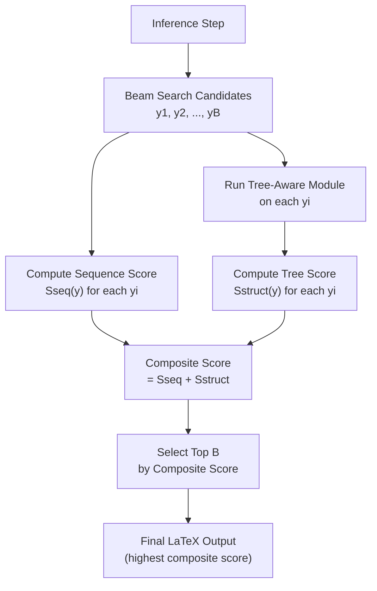
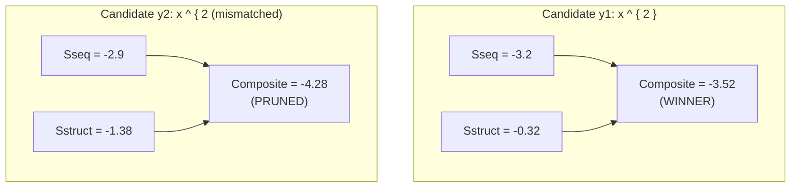

# 4.1. Tree Structure Prediction Scoring Mechanism

> [!info] Quick Recall
> At inference time, TAMER modifies beam search so that each candidate sequence $y$ is scored by a **composite score**: $S_{\text{composite}}(y) = S_{\text{seq}}(y) + S_{\text{struct}}(y)$. $S_{\text{seq}}(y)$ is the standard sum of token log-probabilities (the usual beam-search score). $S_{\text{struct}}(y)$ is the sum over active tokens of the log-probability that the TAM assigns to each token's most-likely parent. Candidates with high sequence probability but low structural coherence (e.g., mismatched brackets) are penalized and pruned from the beam. This is the inference-time counterpart of the training-time structure loss.

---

##  Background Prerequisites

Before reading this note, you should be comfortable with:

1. The TAM's relationship score matrix $S \in \mathbb{R}^{T \times T}$ — see [[2.2. Tree-Aware Module Mechanics]].
2. The joint loss formulation — see [[3.1. Mathematical Formulation of TAMER Loss]].
3. **Beam search**: at each step, the decoder maintains the top-$B$ partial hypotheses; each new step expands each hypothesis by every possible next token, scores the resulting candidates, and keeps the top-$B$.
4. **Log-probability scoring**: sequence decoders score candidates by the sum of token log-probabilities. This makes scores additive and length-comparable.
5. The bracket-mismatch problem from [[1.2. The Bracket Matching Problem and Syntactic Challenges]] — the inference mechanism we describe here is designed to fix exactly that problem.

---

## 4.1.1. The Inference-Time Problem

During training, TAMER uses the structure loss to regularize the decoder's hidden features. During inference, the trained TAM can be used in a more direct way: it can **score** each candidate sequence produced by beam search, and the score can be used to filter out candidates with structurally invalid layouts.

The motivation is clear from [[1.2. The Bracket Matching Problem and Syntactic Challenges]]: a vanilla sequence decoder often produces multiple high-probability candidates, some of which have mismatched brackets. Standard beam search selects the highest-scoring candidate by sequence log-probability alone, which may favor a syntactically invalid candidate over a slightly lower-probability but valid one. TAMER's tree scoring mechanism biases the selection toward structurally coherent candidates.



---

## 4.1.2. Detailed Algorithmic Step-by-Step

### Step 1: Candidate Generation via Beam Search

Standard autoregressive decoding is performed using beam search. At each decoding step, the model maintains a set of candidate sequences. Let $\mathcal{Y}_t = \{y^{(1)}, y^{(2)}, \ldots, y^{(B)}\}$ be the set of active candidate sequences of length $t$, where $B$ is the beam width.

For each candidate sequence $y$, its **raw sequence score** $S_{\text{seq}}(y)$ is the accumulated log-probability of its constituent tokens:

$$
S_{\text{seq}}(y) = \sum_{i=1}^{|y|} \log P(y_i \mid y_{<i}, I)
$$

where:

- $y_i$ is the $i$-th token of candidate $y$.
- $y_{<i}$ is the prefix of $y$ up to position $i - 1$.
- $I$ is the input image.
- $P(y_i \mid y_{<i}, I)$ is the model's predicted probability of token $y_i$ given the prefix and the image (i.e., the softmax output of the sequence head).

This is the standard beam-search score used in any autoregressive sequence decoder. The log-probabilities are summed (rather than multiplied, as probabilities would be) to keep numbers numerically manageable for long sequences.

### Step 2: Structural Verification via TAM

For each generated candidate sequence $y \in \mathcal{Y}_t$, its decoder hidden features $X^{(y)} \in \mathbb{R}^{|y| \times d}$ are passed through the Tree-Aware Module to produce a candidate-specific relationship score matrix $S^{(y)} \in \mathbb{R}^{|y| \times |y|}$.

For each token $i$ in the candidate sequence, the model identifies its most likely parent by finding the maximum value in the corresponding row of the score matrix:

$$
j^* = \arg\max_{j} S^{(y)}_{i, j}
$$

The **structural confidence score** $S_{\text{struct}}(y)$ for the sequence is computed as the sum of the maximum parent-connection **log-probabilities** over all active tokens:

$$
S_{\text{struct}}(y) = \sum_{i \in \mathcal{A}_y} \log \left( \frac{\exp\left(S^{(y)}_{i, j^*}\right)}{\sum_{k=1}^{|y|} \exp\left(S^{(y)}_{i, k}\right)} \right)
$$

where:

- $\mathcal{A}_y$ is the active set of tokens in candidate $y$ — i.e., the tokens that would have a non-$-1$ parent in the ground-truth annotation. **At inference time**, however, we do not have a ground-truth annotation; instead, $\mathcal{A}_y$ is typically computed by applying the same parsing rules used in [[2.3. Tree-Structure Annotation Construction]] to the candidate sequence $y$. (Control tokens like `{` and `}` are still excluded.)
- $j^* = \arg\max_j S^{(y)}_{i, j}$ is the model's most-likely parent prediction for token $i$.
- The fraction inside the log is the **softmax probability** that the model assigns to its own top-1 parent prediction. It is a measure of the model's **confidence** in its tree prediction for token $i$.

### Interpretation of $S_{\text{struct}}(y)$

$S_{\text{struct}}(y)$ is high when the model is **confident** about the parent predictions for all active tokens in $y$. It is low when the model is **uncertain** — i.e., when the top-1 parent for some token has only a small lead over the alternatives.

A sequence with mismatched brackets typically has a low $S_{\text{struct}}$ because:

1. The TAM, trained on tree-coherent sequences, is confused by the mismatched brackets and produces diffuse (low-confidence) parent predictions.
2. The active tokens whose parents are misaligned with the rest of the structure will have low top-1 probabilities.

### Step 3: Composite Selection

The final candidate selection is based on a **joint score** that combines both sequence and structural probabilities:

$$
S_{\text{composite}}(y) = S_{\text{seq}}(y) + S_{\text{struct}}(y)
$$

At each expansion step, the candidates are ranked according to $S_{\text{composite}}(y)$, and only the top $B$ candidates are retained. This joint scoring mechanism penalizes candidates with high sequence probability but structurally inconsistent layouts, helping to prevent syntax errors like unmatched brackets.

> [!tip] Tip — Why addition, not multiplication?
> The composite score uses addition because both $S_{\text{seq}}$ and $S_{\text{struct}}$ are already log-probabilities. Adding log-probabilities is equivalent to multiplying probabilities. So $S_{\text{composite}}(y) = \log P_{\text{seq}}(y) + \log P_{\text{struct}}(y) = \log \left( P_{\text{seq}}(y) \cdot P_{\text{struct}}(y) \right)$. The composite score is the log of the **product** of the sequence probability and the structural probability — i.e., the joint probability under a naive independence assumption.

---

## 4.1.3. Worked Example

To make the mechanism concrete, let's trace a tiny example. Suppose at some decoding step, the beam contains two candidate sequences of length 5:

- $y^{(1)} = $ `x ^ { 2 }` (correct, balanced brackets)
- $y^{(2)} = $ `x ^ { 2` (incorrect, missing closing brace)

Both have the same first four tokens. The sequence decoder assigns similar probabilities to both, but $y^{(2)}$ is slightly higher because the model did not need to spend probability mass on emitting `}`.

### Step 1: Sequence Scores

Suppose:

- $S_{\text{seq}}(y^{(1)}) = -3.2$
- $S_{\text{seq}}(y^{(2)}) = -2.9$

(Per-token log-probs of about $-0.64$ and $-0.58$, respectively.)

### Step 2: Structure Scores

Run the TAM on each candidate:

- For $y^{(1)}$: the model is confident about parent predictions. Each active token's top-1 parent has probability $\approx 0.85$, so $\log(0.85) \approx -0.16$. With 2 active tokens (`2` and the implicit parent), $S_{\text{struct}}(y^{(1)}) \approx 2 \times (-0.16) = -0.32$.
- For $y^{(2)}$: the model is confused because the brackets are mismatched. Each active token's top-1 parent has probability $\approx 0.50$, so $\log(0.50) \approx -0.69$. With 2 active tokens, $S_{\text{struct}}(y^{(2)}) \approx 2 \times (-0.69) = -1.38$.

### Step 3: Composite Scores

- $S_{\text{composite}}(y^{(1)}) = -3.2 + (-0.32) = -3.52$
- $S_{\text{composite}}(y^{(2)}) = -2.9 + (-1.38) = -4.28$

### Selection

The composite score favors $y^{(1)}$ over $y^{(2)}$ by a margin of $0.76$. Beam search therefore keeps $y^{(1)}$ and prunes $y^{(2)}$ — even though $y^{(2)}$ had a higher sequence probability. This is exactly the desired behavior: structural coherence has overridden raw sequence probability to prevent a bracket-mismatch error.



---

## 4.1.4. Computational Cost of Tree Scoring

Adding the tree-scoring mechanism to beam search has a non-trivial computational cost. For each candidate in the beam, the TAM must:

1. Run the Transformer Encoder on $X^{(y)}$ — $O(T^2 \cdot d)$ for self-attention.
2. Compute the dual projections $X^c, X^p$ — $O(T \cdot d^2)$.
3. Compute the pairwise sum $M$ — $O(T^2 \cdot d)$.
4. Apply ReLU and dot product to get $S$ — $O(T^2 \cdot d)$.
5. Compute the softmax and the log of the top-1 — $O(T^2)$.

For a beam of width $B$ and a sequence of length $T$, the per-step cost of tree scoring is:

$$
O\left( B \cdot T^2 \cdot d \right)
$$

This is comparable to the cost of running the decoder itself, which is why TAMER's inference speed drops from 11.13 FPS (CoMER) to 6.75 FPS (TAMER with tree scoring) — a roughly 40 % slowdown. If tree scoring is disabled, TAMER's FPS rises to 9.45, a much smaller drop. (See [[A.2. Inference Speed Analysis]] for details.)

> [!tip] Tip — The tree-scoring slowdown is at inference, not training
> The tree-scoring mechanism is only used at inference time. During training, the TAM is run once per batch (on the ground-truth sequences), not on every beam candidate. So the training cost of the TAM is modest; the inference cost is what hurts.

---

## 4.1.5. Why Tree Scoring Helps: The Theoretical View

### The Bayesian Perspective

From a Bayesian standpoint, the composite score can be interpreted as the log-posterior probability of the sequence under a generative model that factors as:

$$
P(y \mid I) = P_{\text{seq}}(y \mid I) \cdot P_{\text{struct}}(y \mid I)
$$

where $P_{\text{seq}}$ is the sequence-decoding model and $P_{\text{struct}}$ is the structural-prediction model, assumed (naively) to be conditionally independent given $I$. Under this assumption, the maximum a posteriori (MAP) estimate of $y$ is:

$$
y^* = \arg\max_y \left( \log P_{\text{seq}}(y \mid I) + \log P_{\text{struct}}(y \mid I) \right) = \arg\max_y S_{\text{composite}}(y)
$$

So the composite score is the MAP estimator under a naive Bayes-style factorization. The independence assumption is not strictly true (the sequence and structure are correlated), but it is a reasonable approximation that yields significant practical benefit.

### The Structural Validity View

A more practical interpretation: $S_{\text{struct}}(y)$ is a **structural validity score**. Sequences with valid structure (matched brackets, well-formed operator trees) tend to have high $S_{\text{struct}}$ because the TAM was trained on valid structures. Sequences with invalid structure tend to have low $S_{\text{struct}}$ because the TAM has never seen anything like them during training. By adding $S_{\text{struct}}$ to $S_{\text{seq}}$, beam search is biased toward structurally valid sequences.

### Connection to Constrained Decoding

Tree scoring is a **soft** form of constrained decoding. Hard constrained decoding would forbid the emission of tokens that lead to invalid structures (e.g., emitting `{` when no closing `}` is possible). Soft constrained decoding, as in TAMER, merely **penalizes** invalid structures through a lower score, allowing the model to recover if the sequence probability is high enough. Soft constraints are more flexible and easier to implement, at the cost of occasionally letting invalid sequences through.

---

## 4.1.6. Algorithmic Pseudocode

The full beam-search-with-tree-scoring algorithm in pseudocode:

```python
def tamer_beam_search(image, model, beam_width, max_len):
    # Initialize beam with a single empty sequence
    beam = [(tokens=[], score=0.0)]

    for step in range(max_len):
        candidates = []
        for tokens, score in beam:
            # Get decoder hidden features for this candidate
            hidden_features = model.decoder(image, tokens)
            # Get next-token probabilities
            next_token_logits = model.sequence_head(hidden_features[-1])
            next_token_probs = softmax(next_token_logits)

            for token, prob in enumerate(next_token_probs):
                if prob < MIN_PROB:
                    continue  # Skip low-probability tokens
                new_tokens = tokens + [token]
                new_seq_score = score + log(prob)
                candidates.append((new_tokens, new_seq_score))

        # For each candidate, compute the tree score
        for cand in candidates:
            hidden_features = model.decoder(image, cand.tokens)
            S = model.tam(hidden_features)  # T x T
            active = compute_active_set(cand.tokens)
            tree_score = 0
            for i in active:
                softmax_row = softmax(S[i, :])
                top1_parent = argmax(softmax_row)
                tree_score += log(softmax_row[top1_parent])
            cand.tree_score = tree_score
            cand.composite_score = cand.seq_score + tree_score

        # Keep top B by composite score
        candidates.sort(key=lambda c: c.composite_score, reverse=True)
        beam = candidates[:beam_width]

        # Check for end-of-sequence
        if all(c.tokens[-1] == EOS for c in beam):
            break

    # Return the highest-scoring sequence
    return max(beam, key=lambda c: c.composite_score).tokens
```

> [!warning] Pitfall — The pseudocode recomputes hidden features twice
> In the pseudocode above, `model.decoder` is called twice per candidate: once to get next-token probabilities and once to compute the tree score. In a real implementation, you would cache the hidden features from the first call and reuse them. The pseudocode is written for clarity, not efficiency.

---

## 4.1.7. Why Not Just Use the Tree Score Alone?

A natural question: if the tree score is so good at identifying structurally valid sequences, why not just use $S_{\text{struct}}$ as the sole beam-search score? The answer is that the tree score alone is **not** a good sequence predictor. Consider:

- The TAM is trained to predict parent-child relationships, not to predict the next token. A sequence like `1 + 1 = 2` and a sequence like `2 = 1 + 1` might have very similar tree structures and therefore similar tree scores, but only one is the correct transcription.
- The tree score says nothing about **which** tokens should appear — only about whether the tokens that do appear are structurally well-organized. Without the sequence score, the model would have no signal about token identity.

The composite score is necessary because it combines **two complementary signals**: the sequence score tells the model "what tokens to emit", and the tree score tells the model "make sure those tokens are structurally coherent". Neither alone is sufficient.

> [!tip] Tip — The tree score is a tiebreaker, not a replacement
> A useful mental model: in most cases, the sequence score is unambiguous — one candidate is clearly more probable than the others, and the tree score does not change the ranking. The tree score becomes decisive only when the sequence scores are close, which is exactly the regime where bracket mismatches tend to occur. In this view, the tree score is a **tiebreaker** that activates when the sequence decoder is uncertain.

---

## 4.1.8. Ablation Evidence: Tree Scoring Contributes ~1 % ExpRate

The TAMER paper's ablation study (Table 3) directly measures the contribution of tree scoring:

| TAM (Training Loss) | Tree Scoring (Inference) | CROHME 2014 ExpRate (%) |
| :---: | :---: | :---: |
| | | 58.38 (CoMER baseline) |
|  | | 60.39 (+2.01) |
|  |  | **61.23 (+0.84)** |

Adding the TAM (training-time contribution) improves ExpRate by 2.01 %. Adding tree scoring on top of the TAM (inference-time contribution) improves it by a further 0.84 %. The two contributions are complementary: the TAM improves the model's representations, and tree scoring exploits those improved representations at inference time.

The tree-scoring contribution is smaller than the TAM contribution because tree scoring can only **filter** candidates that the decoder produces — it cannot make the decoder produce better candidates in the first place. The TAM, by contrast, improves the decoder's representations during training, which makes the entire candidate set better.

> [!reminder] Reminder — Tree scoring is only useful if the TAM was trained
> Tree scoring requires a trained TAM to produce meaningful $S$ matrices. Without training the TAM (i.e., without $L_{\text{struct}}$), the $S$ matrix is random and tree scoring would hurt rather than help. The ablation table shows that tree scoring is only beneficial when the TAM is also trained — it is the combination that wins.

---

## 4.1.9. Tips, Pitfalls, and Reminders

> [!tip] Tip — Tree scoring is a soft constraint, not a hard one
> TAMER's tree scoring does not **forbid** invalid sequences — it merely **penalizes** them. This means a sufficiently high sequence probability can still override a low tree score and produce a bracket-mismatch error. The soft-constraint design is intentional: hard constraints can prevent the model from recovering from earlier mistakes, while soft constraints allow graceful recovery.

> [!warning] Pitfall — Computing the active set at inference time
> At inference time, there is no ground-truth annotation, so $\mathcal{A}_y$ must be computed by **parsing the candidate sequence** $y$ using the same rules as the training-time annotation construction (Section 2.3). If the parsing rules are inconsistent between training and inference, the tree score will be computed on the wrong set of tokens and the benefit will be lost. Always use the same parser for both.

> [!reminder] Reminder — The composite score uses log-probabilities
> Both $S_{\text{seq}}$ and $S_{\text{struct}}$ are sums of log-probabilities. They are therefore negative numbers, and "higher" (less negative) is better. When sorting candidates, sort in **descending** order of composite score.

> [!tip] Tip — Verify the tree score on a known-good sequence
> A simple sanity check: take a ground-truth $\LaTeX$ sequence from the validation set, run it through the trained TAM, and compute $S_{\text{struct}}$. The score should be relatively high (close to 0, since log-probabilities of confident predictions are close to 0). If the score is very negative, something is wrong with the TAM or the active-set computation.

> [!warning] Pitfall — Forgetting to apply softmax before taking the log
> The structural score formula involves $\log(\text{softmax}(S_{i, :})_{j^*})$. It is easy to accidentally compute $\log(S_{i, j^*})$ instead, which is meaningless (logits are not probabilities). Always apply softmax first, then take the log. In PyTorch, `F.log_softmax(S, dim=-1)` computes both in a numerically stable way.

> [!reminder] Reminder — Tree scoring costs about 40 % of inference speed
> Without tree scoring, TAMER runs at 9.45 FPS (vs. CoMER's 11.13 FPS — a 15 % slowdown from the larger model). With tree scoring, TAMER runs at 6.75 FPS (a 40 % slowdown from CoMER). If inference speed is critical, you can disable tree scoring at deployment time while still benefiting from the TAM's training-time regularization. See [[A.2. Inference Speed Analysis]].

---

## 4.1.10. Self-Check Questions

1. Write the formula for $S_{\text{composite}}(y)$. What are its two components?
2. Why is the composite score an addition rather than a multiplication?
3. In the worked example (Section 4.1.3), what would the composite scores be if $y^{(2)}$'s tree score were $-0.50$ instead of $-1.38$? Which candidate would win?
4. Why is the tree score alone insufficient as a beam-search score?
5. How much ExpRate does tree scoring contribute on top of the TAM, according to the ablation study?
6. What is the active set $\mathcal{A}_y$ at inference time, and how is it computed?
7. Why does tree scoring slow down inference by roughly 40 %?
8. In one sentence, what is the difference between tree scoring (inference) and the structure loss (training)?

---

## 4.1.11. Next Note

Continue to [[4.2. Experimental Evaluation and Performance Metrics]] — we now look at the full experimental picture: datasets, metrics, comparison with prior work, ablations, and structural-complexity analysis.

---

## References

- Zhu, J. et al. *TAMER: Tree-Aware Transformer for HMER*. AAAI 2025. arXiv:2408.08578v2. §Tree Structure Prediction Scoring Mechanism, §Ablation Study.
- Sutskever, I.; Vinyals, O.; Le, Q. V. *Sequence to Sequence Learning with Neural Networks*. NeurIPS 2014. (Beam search basics.)
- Graves, A. *Sequence Transduction with Recurrent Neural Networks*. ICML 2012. (Coverage and beam search.)
