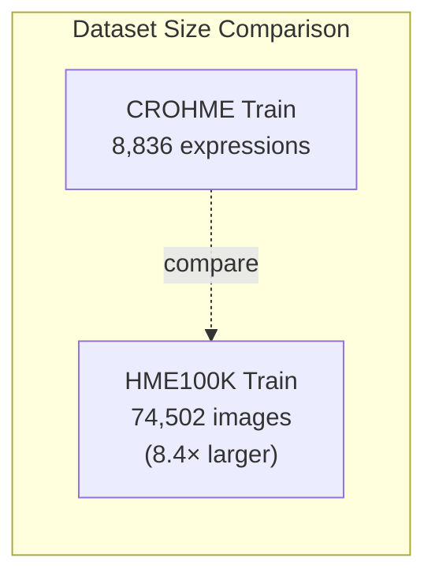
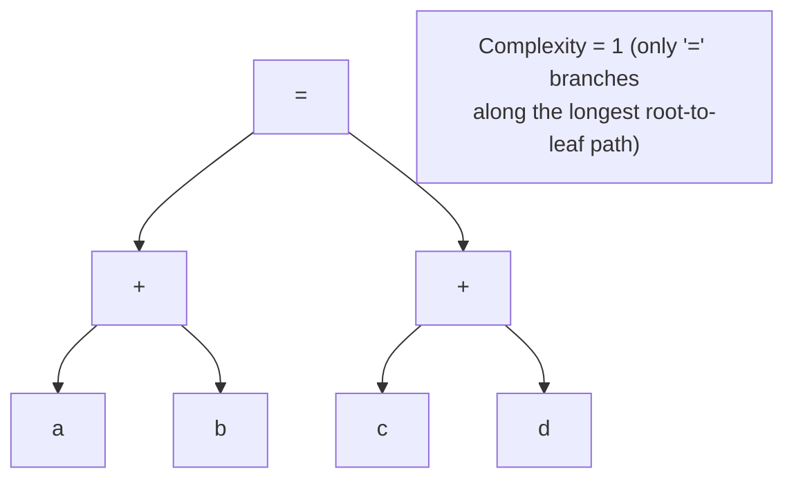
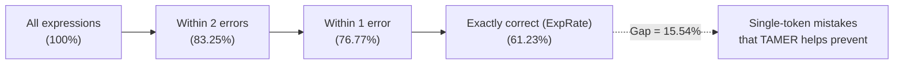
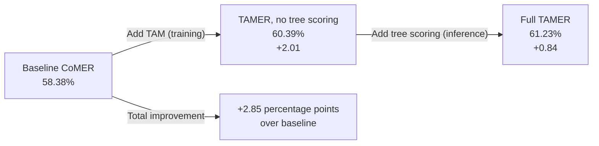
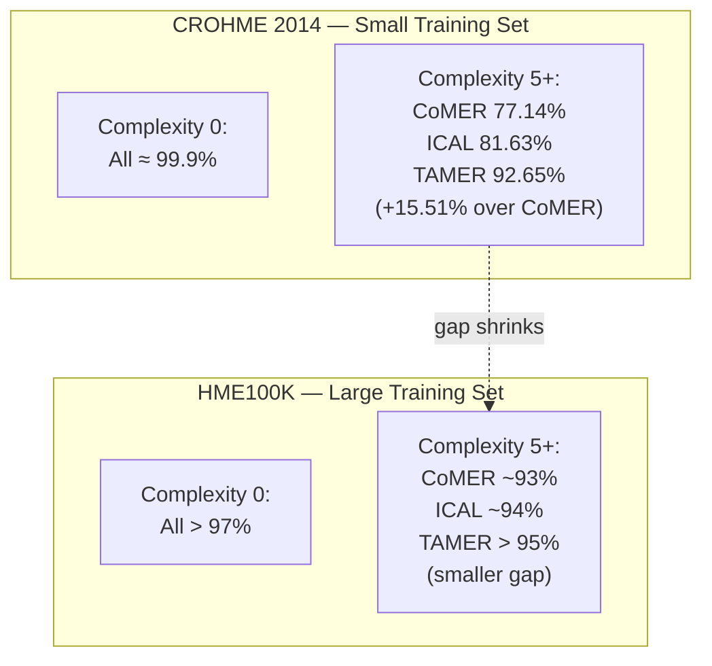
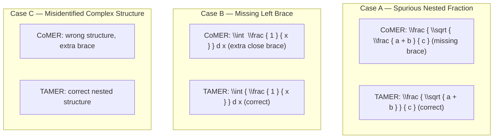

# 4.2. Experimental Evaluation and Performance Metrics

> [!info] Quick Recall
> TAMER is evaluated on three CROHME benchmarks (2014, 2016, 2019) and one large-scale real-world dataset (HME100K). It achieves state-of-the-art ExpRate of **61.23 % / 60.26 % / 61.97 %** on CROHME 2014/2016/2019, beating CoMER by **+2.85 / +3.28 / +2.85** percentage points. On HME100K, TAMER (with fusion module) reaches **69.50 %** ExpRate. The ablation study shows that the Tree-Aware Module (training) contributes ~2 % and tree scoring (inference) contributes another ~1 %. The headline structural result: at structural complexity ≥ 5, TAMER maintains **92.65 %** bracket-matching accuracy on CROHME 2014, while CoMER collapses to **77.14 %** — a 15.51 percentage-point gap.

---

##  Background Prerequisites

Before reading this note, you should be comfortable with:

1. The TAMER architecture ([[2.1. Structural Components of TAMER]], [[2.2. Tree-Aware Module Mechanics]]) and how it is trained ([[3.1. Mathematical Formulation of TAMER Loss]]).
2. The inference-time tree scoring mechanism ([[4.1. Tree Structure Prediction Scoring Mechanism]]).
3. The bracket-matching problem and why it motivates TAMER ([[1.2. The Bracket Matching Problem and Syntactic Challenges]]).
4. Basic ML benchmarking concepts: training set, test set, ExpRate, ablation study.

---

## 4.2.1. Datasets

### CROHME Benchmark

The **CROHME** dataset (Competition on Recognition of Online Handwritten Mathematical Expressions) is the standard benchmark for HMER. It originates from a series of competitions held at ICDAR/ICFHR conferences from 2011 onward. TAMER uses the 2014, 2016, and 2019 test sets.

| Split | Size (expressions) |
| :--- | :--- |
| Train | 8,836 |
| CROHME 2014 test | 986 |
| CROHME 2016 test | 1,147 |
| CROHME 2019 test | 1,199 |

**Data format**: Each handwritten expression is stored in **InkML** (Ink Markup Language), an XML format that captures the trajectory coordinates of the handwritten pen strokes. The ground truth is provided in both **MathML** and **$\LaTeX$** formats. For training and testing, the InkML trajectory information is rasterized into **grayscale bitmap images** that the DenseNet encoder consumes.

> [!tip] Tip — CROHME is small but standard
> 8,836 training expressions is **small** by modern deep-learning standards. This is precisely why bracket-mismatch errors are so severe on CROHME — the model does not see enough deeply nested structures to learn bracket balancing implicitly. TAMER's structural inductive bias is most valuable in this small-data regime.

### HME100K Benchmark

The **HME100K** dataset (Yuan et al., 2022) is a large-scale collection of real-scene handwritten mathematical expressions. It is roughly **8.4× larger** than CROHME in training set size.

| Split | Size (images) |
| :--- | :--- |
| Train | 74,502 |
| Test | 24,607 |

HME100K features diverse writing styles, complex layouts, and varying illumination conditions, making it a more realistic but harder benchmark than CROHME. The much larger training set allows the model to learn many structural patterns implicitly, so the relative benefit of explicit structural modeling (TAMER's contribution) is smaller on HME100K than on CROHME.

---

## 4.2.2. Evaluation Metrics

### Expression Recognition Rate (ExpRate)

$$
\text{ExpRate} = \frac{\text{Number of expressions exactly correctly recognized}}{\text{Total number of expressions}} \times 100\%
$$

"Exactly correctly" means the predicted $\LaTeX$ string is **identical** to the ground-truth $\LaTeX$ string after normalization (typically: removing whitespace, normalizing LaTeX command capitalization, etc.). A single-token error makes an expression "incorrect" — there is no partial credit.

ExpRate is the **primary metric** for HMER. It is what every paper reports and what every comparison is based on.

### ≤ 1 Error and ≤ 2 Errors

To give credit for "almost correct" predictions, the CROHME benchmarks define two additional metrics:

- **≤ 1 Error (↑)**: the percentage of expressions where the predicted $\LaTeX$ differs from the ground truth by **at most 1 token** (insertion, deletion, or substitution).
- **≤ 2 Errors (↑)**: the percentage of expressions where the predicted $\LaTeX$ differs from the ground truth by **at most 2 tokens**.

These metrics are useful for measuring "near-miss" predictions — cases where the model gets the structure right but makes a single character-level mistake. They are reported alongside ExpRate in most HMER papers.

> [!reminder] Reminder — Higher is better for all three metrics
> ExpRate, ≤ 1 Error, and ≤ 2 Errors are all "higher is better" metrics. The arrows (↑) in tables indicate this. Do not be confused by the word "Error" in the names — it refers to the number of tolerated errors, not the error rate.

### Bracket Matching Accuracy

In addition to the standard ExpRate family, the TAMER paper introduces a **bracket-matching accuracy** metric specifically to measure the structural validity of the model's predictions. This metric is computed as:

$$
\text{Bracket Matching Accuracy} = \frac{\text{Number of expressions with all brackets matched}}{\text{Total number of expressions}} \times 100\%
$$

This metric is reported stratified by **structural complexity** (defined below) to show how TAMER's advantage grows with expression complexity.

---

## 4.2.3. Structural Complexity Metric

### Definition

The **structural complexity** of an expression tree is defined as the **maximum number of nodes with more than one child** along any root-to-leaf path:

$$
\text{Complexity} = \max_{\text{paths}} \left( \sum_{n \in \text{path}} \mathbb{1}\left(\text{Children}(n) > 1\right) \right)
$$

In plain English: walk every root-to-leaf path in the expression's dependency tree. For each path, count the number of "branching" nodes (nodes that have more than one child). The structural complexity is the maximum such count across all paths.

### Examples

| Expression | Tree Description | Complexity |
| :--- | :--- | :--- |
| `a + 1 = b` | Linear chain — every node has at most one child | 0 |
| `x ^ { 2 }` | `^` has 1 child (`2`); `x` has 1 child (`^`) | 0 |
| `a + b = c + d` | `=` has 2 children (`+`, `+`); each `+` has 2 children | 1 (only `=` branches along the longest path) |
| `\frac { a } { b } + c` | `+` has 2 children (`\frac`, `c`); `\frac` has 2 children (`a`, `b`) | 2 (path goes through `+` then `\frac`, both branching) |
| `\frac { a ^ { 2 } } { b } + c` | Adds another level of nesting via `^` | 2 (`+`, `\frac`, but `^` only has 1 child) |
| Deeply nested fraction with exponent, subscript, and summation | Multiple branching operators stacked | 5 or higher |

### Why This Metric Matters

The structural complexity metric lets us **stratify** the test set by structural difficulty. Simple expressions (complexity 0–1) are easy for all models; the differentiator is performance on complex expressions (complexity ≥ 5). TAMER's structural inductive bias should help most in the high-complexity regime, and the experimental results confirm this.

> [!tip] Tip — Complexity is about branching, not depth
> A common mistake is to confuse structural complexity with tree depth. They are different:
> - **Tree depth** is the length of the longest root-to-leaf path.
> - **Structural complexity** is the number of **branching** nodes (nodes with > 1 child) on the longest root-to-leaf path.
>
> A linear chain `a + b + c + d + e` has depth 5 but complexity 0 (no node branches). A single `\frac{a}{b}` has depth 2 but complexity 1 (the `\frac` node branches). Keep this distinction clear when reading the complexity-stratified results.

---

## 4.2.4. Implementation Details

### Hyperparameters (Encoder)

| Hyperparameter | Value |
| :--- | :--- |
| Backbone | DenseNet |
| Number of dense blocks | 3 |
| Bottleneck layers per block | 16 |
| Growth rate $k$ | 24 |
| Transition reduction $\theta$ | 0.5 |
| Dropout rate | $p = 0.2$ |

### Hyperparameters (Decoder)

| Hyperparameter | Value |
| :--- | :--- |
| Architecture | Transformer decoder (CoMER-style) |
| Number of layers | 3 |
| Model dimension $d_{\text{model}}$ | 256 |
| Attention heads $h$ | 8 |
| Feed-forward dimension $d_{ff}$ | 1024 |
| Dropout rate | $p = 0.3$ |

### Training Configuration

| Configuration | CROHME | HME100K |
| :--- | :--- | :--- |
| Framework | PyTorch | PyTorch |
| Hardware | 4 × NVIDIA 2080Ti | 4 × NVIDIA 2080Ti |
| Optimizer | Adadelta | AdamW |
| Learning rate | 1.0 | $5 \times 10^{-4}$ |
| $\rho$ (Adadelta) | 0.9 | — |
| Weight decay | $10^{-4}$ | (default) |
| Epochs | 400 | 70 |

### Reproducibility

The TAMER paper uses **five random seeds** [7, 77, 777, 7777, 77777] for both the baseline CoMER and TAMER, and reports the **mean and standard deviation** of ExpRate across these seeds. This is a strong reproducibility practice — it ensures that the reported improvements are not artifacts of a single lucky initialization.

---

## 4.2.5. Comparison with State-of-the-Art Methods (CROHME)

The headline result of the paper is Table 1, which compares TAMER to all major prior methods on the three CROHME test sets, **without data augmentation** (to ensure fair comparison).

### Full Comparison Table (CROHME)

| Method | Type | CROHME 2014 ExpRate | CROHME 2016 ExpRate | CROHME 2019 ExpRate |
| :--- | :--- | :---: | :---: | :---: |
| WAP (2017) | RNN seq | 46.55 | 44.55 | — |
| DenseWAP (2018) | RNN seq | 50.1 | 47.5 | — |
| DenseWAP-MSA (2018) | RNN seq | 52.8 | 50.1 | 47.7 |
| TAP (2018) | RNN seq | 48.47 | 44.81 | — |
| PAL (2019) | RNN seq | 39.66 | — | — |
| PAL-v2 (2020) | RNN seq | 48.88 | 49.61 | — |
| WS-WAP (2020) | RNN seq | 53.65 | 51.96 | — |
| ABM (2022) | RNN seq | 56.85 | 52.92 | 53.96 |
| CAN-DWAP (2022) | RNN seq | 57.00 | 56.06 | 54.88 |
| CAN-ABM (2022) | RNN seq | 57.26 | 56.15 | 55.96 |
| DenseWAP-TD (2020) | Tree | 49.1 | 48.5 | 51.4 |
| TDv2 (2022) | Tree | 53.62 | 55.18 | 58.72 |
| SAN (2022) | Tree | 56.2 | 53.6 | 53.5 |
| NAMER (2024) | Non-autoregressive | 60.51 | 60.24 | 61.72 |
| BTTR (2021) | Transformer seq | 53.96 | 52.31 | 52.96 |
| GCN (2023) | Transformer seq | 60.00 | 58.94 | 61.63 |
| CoMER† (2022) | Transformer seq (baseline) | 58.38 ± 0.62 | 56.98 ± 1.41 | 59.12 ± 0.43 |
| ICAL (2024) | Transformer seq | 60.63 ± 0.61 | 58.79 ± 0.73 | 60.51 ± 0.71 |
| **TAMER** (2025) | Transformer seq + TAM | **61.23 ± 0.42** | **60.26 ± 0.78** | **61.97 ± 0.54** |

### Key Observations

1. **TAMER wins on all three CROHME test sets.** It beats every prior method, including the recent ICAL and NAMER, on ExpRate.
2. **TAMER beats CoMER by 2.85 / 3.28 / 2.85 percentage points.** This is the headline improvement of the paper.
3. **TAMER has the lowest standard deviation.** The ± 0.42 / 0.78 / 0.54 are smaller than CoMER's ± 0.62 / 1.41 / 0.43 (and roughly comparable to ICAL's). This suggests TAMER's structural regularization makes training more stable.
4. **Tree-based methods (DenseWAP-TD, TDv2, SAN) underperform Transformer-based methods.** This confirms the paper's claim that tree decoders, despite their theoretical structural advantages, lose in practice due to inefficient RNN-based training.

### ≤ 1 and ≤ 2 Error Rates (CROHME 2014)

For TAMER on CROHME 2014:

| Metric | Value |
| :--- | :--- |
| ExpRate | 61.23 % |
| ≤ 1 Error | 76.77 % |
| ≤ 2 Errors | 83.25 % |

This means 76.77 % of expressions are within one token of the ground truth, and 83.25 % are within two tokens. The gap between ExpRate and ≤ 1 Error (15.54 percentage points) represents expressions that have a **single** token-level mistake — these are the "near misses" that TAMER's structural bias helps prevent.

---

## 4.2.6. Comparison with State-of-the-Art Methods (HME100K)

| Method | ExpRate | ≤ 1 | ≤ 2 |
| :--- | :---: | :---: | :---: |
| DenseWAP (2018) | 61.85 | 70.63 | 77.14 |
| DenseWAP-TD (2020) | 62.60 | 79.05 | 85.67 |
| ABM (2022) | 65.93 | 81.16 | 87.86 |
| SAN (2022) | 67.1 | — | — |
| CAN-DWAP (2022) | 67.31 | 82.93 | 89.17 |
| CAN-ABM (2022) | 68.09 | 83.22 | 89.91 |
| NAMER (2024) | 68.52 | 83.10 | 89.30 |
| BTTR (2021) | 64.1 | — | — |
| CoMER† (2022) | 68.12 | 84.20 | 89.71 |
| ICAL (2024) | 69.06 | 85.16 | 90.61 |
| TAMER (2025) | 68.52 | 84.61 | 89.94 |
| **TAMER w/ fusion** (2025) | **69.50** | **85.48** | **90.80** |

### Key Observations

1. **TAMER alone is competitive but does not beat ICAL on HME100K.** TAMER's 68.52 % ExpRate is slightly below ICAL's 69.06 %.
2. **TAMER with the fusion module wins.** When equipped with the same Fusion Module used by ICAL (which integrates auxiliary task information during training), TAMER reaches **69.50 %**, beating ICAL by 0.44 percentage points.
3. **The relative benefit of TAMER is smaller on HME100K than on CROHME.** On CROHME, TAMER beats CoMER by ~3 percentage points; on HME100K, TAMER beats CoMER by only ~0.4 percentage points. This is consistent with the hypothesis that the structural inductive bias is most valuable when training data is scarce.

> [!tip] Tip — Read the dataset before reading the result
> Whenever you see an HMER result, the first question to ask is: "CROHME or HME100K?" The dataset size determines how much implicit structural learning the model can do, and therefore how much TAMER's explicit structural bias helps. The same model can look brilliant on CROHME and mediocre on HME100K — both observations are correct.

---

## 4.2.7. Ablation Study

The ablation study (Table 3 in the paper) systematically removes the TAM (training-time contribution) and the tree scoring (inference-time contribution) to measure each one's individual impact.

### Ablation Results (CROHME, ExpRate %)

| TAM (Training Loss) | Tree Scoring (Inference) | CROHME 2014 | CROHME 2016 | CROHME 2019 |
| :---: | :---: | :---: | :---: | :---: |
| | | 58.38 | 56.98 | 59.12 |
|  | | 60.39 (+2.01) | 59.08 (+2.10) | 61.32 (+2.20) |
|  |  | **61.23 (+0.84)** | **60.26 (+1.18)** | **61.97 (+0.65)** |

### Interpretation

1. **Adding the TAM (training-time contribution) improves ExpRate by ~2 percentage points.** This is the larger of the two contributions and confirms that the structural regularization helps the decoder produce better features.
2. **Adding tree scoring (inference-time contribution) improves ExpRate by an additional ~1 percentage point.** This is the smaller contribution but still significant, especially given that it requires no retraining — it is purely an inference-time modification.
3. **The two contributions are complementary.** Tree scoring builds on the TAM's trained representations; without the TAM, tree scoring would be using random $S$ matrices and would not help. The ablation confirms that the combination is what wins.

---

## 4.2.8. Performance Under Different Structural Complexities

This is the most important experimental result for understanding **why** TAMER works. The test set is stratified by structural complexity, and ExpRate is reported per stratum.

### ExpRate by Structural Complexity (CROHME 2014)

The paper's Figure 5 shows that TAMER consistently outperforms CoMER at every complexity level, with the gap **widening** as complexity increases. At structural complexity ≥ 5, TAMER improves ExpRate by **5.31 percentage points** over CoMER — the largest improvement at any complexity level.

### Bracket Matching Accuracy by Structural Complexity

The paper's Figure 1 (and Figure 8 in the appendix) reports bracket-matching accuracy, which is the most direct measure of TAMER's structural benefit.

**CROHME 2014:**

| Complexity | CoMER | ICAL | TAMER |
| :--- | :---: | :---: | :---: |
| 0 | ≈ 99.9 % | ≈ 99.9 % | ≈ 99.8 % |
| 3 | 93.54 % | (intermediate) | 99.08 % |
| 5+ | 77.14 % | 81.63 % | **92.65 %** |

**CROHME 2016:**

| Complexity | CoMER | ICAL | TAMER |
| :--- | :---: | :---: | :---: |
| Low | > 96 % | > 96 % | > 97 % |
| High | 85.10 % | 88.43 % | **96.86 %** |

**CROHME 2019:**

| Complexity | CoMER | ICAL | TAMER |
| :--- | :---: | :---: | :---: |
| Low | > 96 % | > 96 % | > 97 % |
| High | 85.53 % | 84.47 % | **94.74 %** |

**HME100K:**

| Complexity | CoMER | ICAL | TAMER |
| :--- | :---: | :---: | :---: |
| Low | > 96 % | > 96 % | > 97 % |
| High | ≈ 93 % | ≈ 94 % | > 95 % |

### Interpretation

1. **On simple expressions, all models are near-perfect.** When there is nothing to nest, there is nothing to mismatch. The bracket problem only emerges as complexity grows.
2. **TAMER degrades gracefully; CoMER and ICAL collapse.** Between complexity 0 and complexity 5+, CoMER loses ~23 percentage points of bracket accuracy on CROHME 2014. TAMER loses only ~7. The slope of the curve, not the absolute value, is the headline.
3. **The benefit is largest on small datasets.** On HME100K, where the training set is 8.4× larger, all models do better and the gap between TAMER and CoMER shrinks to ~2 percentage points at high complexity. This confirms that TAMER's structural inductive bias is most valuable when training data is scarce.

---

## 4.2.9. Inference Speed Analysis

Table 4 of the paper compares TAMER's inference speed against CoMER on a single NVIDIA 2080Ti GPU, using images resized to $64 \times 256$.

| Method | Params (M) | GFLOPs | FPS | ExpRate (CROHME 2014) |
| :--- | :---: | :---: | :---: | :---: |
| CoMER | 6.39 | 18.81 | 11.13 | 58.38 |
| TAMER | 8.23 | 19.79 | 6.75 | 61.23 |
| TAMER w/o tree scoring | 8.23 | 19.79 | 9.45 | 60.39 |

### Interpretation

1. **TAMER adds ~1.84 M parameters.** Most of these are in the TAM (Transformer Encoder + dual projections + scoring vector).
2. **GFLOPs increase modestly (5 %).** The TAM adds relatively little compute to the forward pass — the bulk of the compute is still in the DenseNet encoder and the Transformer decoder.
3. **FPS drops by 40 % with tree scoring.** This is the headline cost of TAMER: from 11.13 FPS to 6.75 FPS. The drop is **not** because the model is bigger (the GFLOPs barely increased), but because tree scoring must be run on every beam candidate at every step, multiplying the inference cost.
4. **Without tree scoring, FPS only drops 15 %.** If you can afford to lose the 0.84 percentage points of ExpRate that tree scoring contributes, you can disable it at inference time and get most of the speed back.

> [!tip] Tip — Choose your tradeoff at deployment time
> TAMER gives you a tradeoff knob: with tree scoring, you get the best ExpRate (61.23 %) at 6.75 FPS; without tree scoring, you get slightly lower ExpRate (60.39 %) at 9.45 FPS. For real-time applications, disable tree scoring; for batch processing, enable it. The model weights are the same — only the inference procedure changes.

---

## 4.2.10. Case Studies

The paper's Figure 7 shows three case studies comparing CoMER and TAMER on real CROHME examples. In each case, CoMER produces a structurally invalid or structurally wrong output, while TAMER produces the correct $\LaTeX$.

### Case A — Spurious Nested Fraction

- **Ground truth:** a single fraction containing a square root in its numerator.
- **CoMER:** incorrectly produces a nested fraction inside the square root and forgets to close the brace, producing invalid $\LaTeX$.
- **TAMER:** correctly identifies the original structure, properly nesting the fractions and emitting valid $\LaTeX$.

### Case B — Missing Left Brace

- **Ground truth:** an integral of a fraction.
- **CoMER:** drops the opening brace after `\int`, leaving an unmatched closing `}` later. Classic long-range dependency mismatch.
- **TAMER:** correctly interprets the integral and fraction, emitting valid $\LaTeX$.

### Case C — Misidentified Complex Structure

- **Ground truth:** a deeply nested fraction under a square root.
- **CoMER:** produces an output that is "roughly right" character-by-character but completely wrong structurally — a square root where there should be a fraction, and an extra brace where there should be none.
- **TAMER:** correctly captures the intricate parent-child relationships and produces the correct $\LaTeX$.

### What These Cases Show

All three cases demonstrate the same pattern: **CoMER's mistakes are structural, not character-level**. The model knows roughly what symbols to emit but gets the hierarchical relationships wrong. TAMER's tree-scoring mechanism catches these structural errors during beam search and prunes the offending candidates, allowing the structurally correct candidate to win.

---

## 4.2.11. Summary of Experimental Evidence

| Claim | Evidence |
| :--- | :--- |
| TAMER achieves SOTA on CROHME | Table 1: 61.23 / 60.26 / 61.97 % on 2014 / 2016 / 2019 |
| TAMER achieves SOTA on HME100K (with fusion) | Table 2: 69.50 % ExpRate |
| The TAM (training) contributes ~2 % ExpRate | Table 3: 58.38 → 60.39 % |
| Tree scoring (inference) contributes ~1 % ExpRate | Table 3: 60.39 → 61.23 % |
| TAMER's structural benefit grows with complexity | Figure 5: +5.31 % at complexity ≥ 5 |
| TAMER fixes bracket matching | Figure 1 / Figure 8: 92.65 % vs. CoMER's 77.14 % at complexity 5+ on CROHME 2014 |
| TAMER's benefit is larger on small datasets | HME100K bracket gap (~2 %) is much smaller than CROHME bracket gap (~15 %) |
| TAMER's cost is moderate | Table 4: +1.84 M params, +0.98 GFLOPs, -4.38 FPS |
| Tree scoring can be disabled at deployment | Table 4: w/o tree scoring → 9.45 FPS, 60.39 % ExpRate |

---

## 4.2.12. Tips, Pitfalls, and Reminders

> [!tip] Tip — Read the ablation before the SOTA table
> The SOTA table tells you TAMER wins. The ablation table tells you **why**. Always read the ablation first — it tells you which parts of the architecture are load-bearing and which are decorative. In TAMER, the ablation reveals that both the TAM (training) and tree scoring (inference) are load-bearing.

> [!warning] Pitfall — Comparing ExpRate across datasets
> Never compare ExpRate across datasets directly. A 70 % ExpRate on CROHME is not the same as a 70 % ExpRate on HME100K — the datasets have different difficulty distributions. Always compare within the same dataset.

> [!reminder] Reminder — All comparisons are without data augmentation
> The TAMER paper's comparisons are all **without data augmentation**, to ensure a fair comparison with prior methods whose augmentation strategies are not always disclosed. If you see TAMER's numbers cited with augmentation, they will be different (and likely higher).

> [!reminder] Reminder — Reproducibility: 5 random seeds
> The reported ExpRate numbers are **means and standard deviations over 5 random seeds** [7, 77, 777, 7777, 77777]. This is a strong reproducibility practice and means the reported improvements are unlikely to be artifacts of a single lucky initialization.

> [!tip] Tip — The structural complexity stratification is the key plot
> If you remember only one plot from the TAMER paper, make it Figure 1 (or Figure 8 in the appendix): bracket-matching accuracy vs. structural complexity. This plot is the cleanest evidence that TAMER's structural inductive bias is doing real work. The other plots (ExpRate, ablation) are consistent with the structural plot but less direct.

> [!warning] Pitfall — HME100K is not a "larger CROHME"
> HME100K is a real-world dataset with different characteristics from CROHME: more diverse writing styles, more noise, more illumination variation. Models that perform well on CROHME do not always perform well on HME100K and vice versa. The two datasets test different things — CROHME tests clean, controlled handwriting recognition; HME100K tests robustness to real-world conditions.

---

## 4.2.13. Self-Check Questions

1. What are the sizes of the CROHME train and test sets? And HME100K?
2. Define ExpRate, ≤ 1 Error, and ≤ 2 Errors. Which direction is "better" for each?
3. Define structural complexity. What is the complexity of `a + b = c`?
4. By how many percentage points does TAMER beat CoMER on each CROHME test set?
5. In the ablation study, how much does the TAM (training) contribute? How much does tree scoring (inference) contribute?
6. At structural complexity ≥ 5 on CROHME 2014, what is CoMER's bracket-matching accuracy and what is TAMER's?
7. Why is TAMER's relative benefit smaller on HME100K than on CROHME?
8. How many parameters does TAMER have, and how much slower is its inference than CoMER's?

---

## 4.2.14. Next Note

Continue to [[A.1. Implementation Details]] for the full hyperparameter reference, or jump to [[A.3. Case Studies]] for more worked inference examples.

---

## References

- Zhu, J. et al. *TAMER: Tree-Aware Transformer for HMER*. AAAI 2025. arXiv:2408.08578v2. Tables 1–4, Figures 1, 5, 7, 8.
- Mouchere, H. et al. *ICFHR 2014 CROHME*. ICFHR 2014.
- Mouchère, H. et al. *ICFHR 2016 CROHME*. ICFHR 2016.
- Mahdavi, M. et al. *ICDAR 2019 CROHME+TFD*. ICDAR 2019.
- Yuan, Y. et al. *SAN: Syntax-Aware Network for HMER*. CVPR 2022. (Origin of HME100K dataset.)
