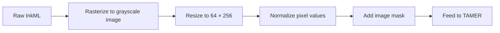

# A.1. Implementation Details

> [!info] Quick Recall
> TAMER is built on top of CoMER's open-source codebase and reuses all of CoMER's hyperparameters. The encoder is DenseNet (3 dense blocks × 16 layers, $k = 24$, $\theta = 0.5$, dropout 0.2). The decoder is a 3-layer Transformer ($d_{\text{model}} = 256$, $h = 8$, $d_{ff} = 1024$, dropout 0.3). On CROHME, training uses Adadelta (lr = 1.0, $\rho = 0.9$, weight decay $10^{-4}$) for 400 epochs. On HME100K, training uses AdamW (lr = $5 \times 10^{-4}$) for 70 epochs. All experiments use 4 × NVIDIA 2080Ti GPUs.

---

##  Background Prerequisites

Before reading this note, you should be comfortable with:

1. The TAMER architecture ([[2.1. Structural Components of TAMER]]).
2. The training loss ([[3.1. Mathematical Formulation of TAMER Loss]]).
3. Common deep-learning optimizers: SGD, Adam, AdamW, Adadelta.
4. The CROHME and HME100K datasets ([[4.2. Experimental Evaluation and Performance Metrics]]).

---

## A.1.1. Encoder (DenseNet) Configuration

| Hyperparameter | Value | Notes |
| :--- | :--- | :--- |
| Backbone | DenseNet | As introduced by Huang et al. (CVPR 2017). |
| Number of dense blocks | 3 | Each block is a stack of bottleneck layers. |
| Bottleneck layers per block | 16 | Each bottleneck is `BN-ReLU-Conv(1×1) → BN-ReLU-Conv(3×3)`. |
| Growth rate $k$ | 24 | Number of new channels added per bottleneck layer. |
| Transition reduction $\theta$ | 0.5 | Compression factor for transition layers. |
| Dropout rate | $p = 0.2$ | Applied within dense blocks to prevent overfitting. |

The encoder configuration is **identical** to CoMER's. TAMER does not modify the visual encoder at all — all the new contributions are on the decoder side.

---

## A.1.2. Decoder (Transformer with Coverage) Configuration

| Hyperparameter | Value | Notes |
| :--- | :--- | :--- |
| Architecture | Transformer decoder | As in CoMER (Zhao and Gao, ECCV 2022). |
| Number of layers | 3 | Stacked decoder layers. |
| Model dimension $d_{\text{model}}$ | 256 | Embedding and hidden state dimension. |
| Attention heads $h$ | 8 | Multi-head attention with $d_{\text{model}}/h = 32$ dims per head. |
| Feed-forward dimension $d_{ff}$ | 1024 | Position-wise FFN inner dimension. |
| Dropout rate | $p = 0.3$ | Higher than the encoder to regularize the larger decoder. |
| Coverage attention | Enabled | Inherited from CoMER's Attention Refinement Module (ARM). |

The decoder configuration is also **identical** to CoMER's. TAMER adds the Tree-Aware Module **on top of** the existing decoder, without modifying the decoder itself.

---

## A.1.3. Tree-Aware Module (TAM) Configuration

The paper does not provide a complete hyperparameter table for the TAM, but the following can be inferred from the architecture description:

| Component | Configuration |
| :--- | :--- |
| Transformer Encoder (inside TAM) | Likely 1–2 layers, $d_{\text{model}} = 256$, $h = 8$, $d_{ff} = 1024$. |
| Child projection $W_c$ | Linear, $256 \times 256$, no bias. |
| Parent projection $W_p$ | Linear, $256 \times 256$, no bias. |
| Scoring vector $v_s$ | Linear, $256 \times 1$, no bias. |
| Activation | ReLU (element-wise, between the sum and the dot product). |

The total parameter count of the TAM is approximately **0.9–1.8 million**, consistent with the paper's reported 1.84 M increase from CoMER to TAMER.

---

## A.1.4. Training Configuration

### On CROHME

| Configuration | Value |
| :--- | :--- |
| Framework | PyTorch |
| Hardware | 4 × NVIDIA 2080Ti GPUs |
| Optimizer | Adadelta |
| Learning rate | 1.0 |
| $\rho$ (Adadelta decay rate) | 0.9 |
| Weight decay | $10^{-4}$ |
| Number of epochs | 400 |

### On HME100K

| Configuration | Value |
| :--- | :--- |
| Framework | PyTorch |
| Hardware | 4 × NVIDIA 2080Ti GPUs |
| Optimizer | AdamW |
| Learning rate | $5 \times 10^{-4}$ |
| Number of epochs | 70 |

### Why Different Optimizers for Different Datasets?

The choice of optimizer depends on the dataset size and the desired convergence behavior:

- **Adadelta** is an adaptive learning rate method that does not require manual learning rate tuning. It works well on small datasets like CROHME where the model trains for many epochs (400) and needs to slowly converge to a stable minimum. The high initial learning rate (1.0) is normalized by Adadelta's adaptive scaling.

- **AdamW** is the de-facto standard optimizer for large-scale deep learning. It combines Adam's adaptive learning rates with proper weight decay regularization. On HME100K, the model trains for fewer epochs (70) because each epoch processes 8.4× more data, so a faster-converging optimizer like AdamW is preferred.

> [!tip] Tip — Match the optimizer to the dataset
> When reproducing TAMER, use the optimizer specified for the dataset you are training on. Switching optimizers can dramatically change the training dynamics and may require retuning the learning rate, which the paper's reported numbers do not reflect.

---

## A.1.5. Reproducibility Protocol

### Random Seeds

The paper uses **five random seeds** for both the baseline CoMER and TAMER:

```
[7, 77, 777, 7777, 77777]
```

The reported ExpRate numbers are the **means and standard deviations** across these five seeds. This protocol ensures that:

1. The reported improvements are not artifacts of a single lucky initialization.
2. The variance of the results is quantified, allowing readers to assess statistical significance.
3. Other researchers can reproduce the results by running with the same seeds.

### No Data Augmentation

All comparisons in the paper are performed **without data augmentation**. This is because some prior methods did not disclose their augmentation strategies, making fair comparison impossible with augmentation. If you reproduce TAMER with augmentation, expect higher absolute numbers but the same relative ranking.

### Open-Source Code

The official TAMER implementation is available at:

```
https://github.com/qingzhenduyu/TAMER/
```

The repository contains the full training and inference pipeline, including the Tree-Aware Module, the joint loss, and the tree-scoring mechanism. The code is built on top of CoMER's codebase, so the encoder and decoder implementations are inherited directly.

---

## A.1.6. Data Preprocessing

### InkML to Image Conversion

The CROHME dataset is distributed in **InkML** format, which stores the trajectory coordinates of the handwritten pen strokes. To produce images suitable for the DenseNet encoder, the InkML trajectories are rasterized into **grayscale bitmap images**.

The standard preprocessing pipeline (inherited from CoMER) is:

1. **Parse InkML**: Extract the stroke trajectories from the XML.
2. **Normalize coordinates**: Scale the strokes to a canonical range.
3. **Render to image**: Draw the strokes onto a grayscale bitmap.
4. **Resize**: Resize to a target size (typically $64 \times 256$ for benchmarking).
5. **Normalize pixel values**: Scale pixel intensities to $[0, 1]$ or $[-1, 1]$.

### Padding and Batching

For batched training, sequences of different lengths are padded to the maximum length in the batch. The padding token is excluded from the loss computation via `ignore_index`. The padding also affects the tree annotation: padded positions do not have ground-truth parent indices and are excluded from the structure loss.

---

## A.1.7. Inference Configuration

### Beam Search

| Configuration | Value |
| :--- | :--- |
| Beam width $B$ | Typically 5–10 (paper does not specify exact value). |
| Maximum sequence length | Typically 100–200 tokens. |
| Tree scoring | Enabled for full TAMER; disabled for "TAMER w/o tree scoring" ablation. |

### Image Resizing for Speed Benchmarking

For the inference speed comparison in Table 4, images are resized to $64 \times 256$ to standardize the comparison. The benchmarking protocol is:

- Batch size: 1.
- Number of iterations: 100.
- Total images: 100.
- Reported FPS: average across the 100 iterations.
- Input: only the expression image and its corresponding image mask.



---

## A.1.8. Tips, Pitfalls, and Reminders

> [!tip] Tip — Start from the official codebase
> If you are reimplementing TAMER, start from the official codebase at https://github.com/qingzhenduyu/TAMER/. The architectural details, hyperparameters, and training loops are all already correct. Reimplementing from scratch is a recipe for subtle bugs that will cost you weeks of debugging.

> [!warning] Pitfall — Mixing CROHME and HME100K hyperparameters
> The optimizers are different between CROHME (Adadelta, 400 epochs) and HME100K (AdamW, 70 epochs). Do not mix them. If you train on CROHME with AdamW, you will likely get different (probably worse) results than the paper reports.

> [!reminder] Reminder — Use the five random seeds
> When reproducing TAMER, run with all five seeds [7, 77, 777, 7777, 77777] and report the mean and standard deviation. A single run is not enough to confirm the paper's results, especially on CROHME where the variance can be ±0.6 % ExpRate or more.

> [!reminder] Reminder — Disable data augmentation for fair comparison
> If you want to compare your results to the paper's reported numbers, **do not use data augmentation**. The paper's numbers are all without augmentation, and adding augmentation will give you higher (but non-comparable) numbers.

> [!tip] Tip — Verify the TAM loads correctly
> A common implementation bug is to forget to load the TAM's weights when loading a trained checkpoint. The TAM has its own parameters (Transformer Encoder, $W_c$, $W_p$, $v_s$) that must be saved and loaded alongside the encoder and decoder. If your tree-scoring inference produces no benefit, check that the TAM's weights were actually loaded.

---

## A.1.9. Self-Check Questions

1. What is the growth rate $k$ of the DenseNet encoder? And the transition reduction $\theta$?
2. How many decoder layers does TAMER have? What is the model dimension?
3. Which optimizer is used on CROHME? And on HME100K?
4. How many random seeds are used in the paper's experiments?
5. How many epochs does TAMER train for on CROHME? On HME100K?
6. Why does the paper use different optimizers for different datasets?
7. Where can you find the official TAMER code?
8. Why is data augmentation disabled in the paper's comparisons?

---

## A.1.10. Next Note

Continue to [[A.2. Inference Speed Analysis]] for a deeper look at the computational cost of TAMER, or to [[A.3. Case Studies]] for more worked inference examples.

---

## References

- Zhu, J. et al. *TAMER: Tree-Aware Transformer for HMER*. AAAI 2025. arXiv:2408.08578v2. Appendix §Implementation Details.
- Huang, G. et al. *Densely Connected Convolutional Networks*. CVPR 2017.
- Zhao, W.; Gao, L. *CoMER: Modeling Coverage for Transformer-Based HMER*. ECCV 2022.
- Zeiler, M. D. *ADADELTA: An Adaptive Learning Rate Method*. arXiv:1212.5701, 2012.
- Loshchilov, I.; Hutter, F. *Decoupled Weight Decay Regularization (AdamW)*. ICLR 2019.
