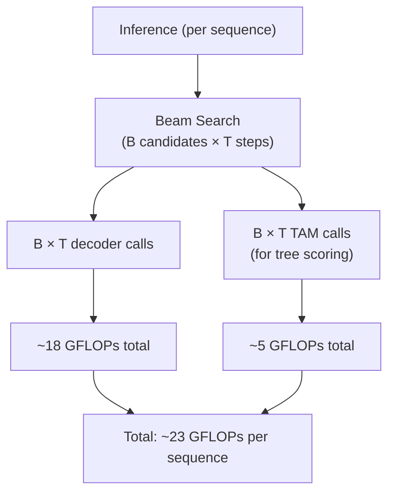
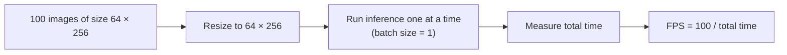

# A.2. Inference Speed Analysis

> [!info] Quick Recall
> TAMER has **8.23 M parameters** (vs. CoMER's 6.39 M, an increase of 1.84 M for the TAM) and **19.79 GFLOPs** (vs. CoMER's 18.81, an increase of 0.98 GFLOPs). With tree scoring enabled, TAMER runs at **6.75 FPS** on a single NVIDIA 2080Ti — a 40 % slowdown from CoMER's 11.13 FPS. Without tree scoring, TAMER runs at 9.45 FPS — only a 15 % slowdown. The slowdown is dominated by the inference-time tree-scoring mechanism, not by the model's larger size.

---

##  Background Prerequisites

Before reading this note, you should be comfortable with:

1. The TAMER architecture ([[2.1. Structural Components of TAMER]]).
2. The Tree-Aware Module ([[2.2. Tree-Aware Module Mechanics]]).
3. The tree-scoring inference mechanism ([[4.1. Tree Structure Prediction Scoring Mechanism]]).
4. The basics of computational cost in deep learning: parameters, FLOPs, FPS.

---

## A.2.1. The Cost Comparison Table

Table 4 of the paper provides the full inference speed comparison:

| Method | Params (M) | GFLOPs | FPS | ExpRate (CROHME 2014) |
| :--- | :---: | :---: | :---: | :---: |
| CoMER (baseline) | 6.39 | 18.81 | 11.13 | 58.38 |
| TAMER (full) | 8.23 | 19.79 | 6.75 | 61.23 |
| TAMER w/o tree scoring | 8.23 | 19.79 | 9.45 | 60.39 |

### What Each Column Means

- **Params (M)**: Total number of learnable parameters in the model, in millions. This is the "size" of the model.
- **GFLOPs**: Giga floating-point operations per forward pass. This is the "compute" required for a single inference.
- **FPS**: Frames per second. How many images the model can process per second at inference time. Higher is better.
- **ExpRate**: Expression Recognition Rate on CROHME 2014 (the headline accuracy metric).

### Reading the Table

The table tells three stories at once:

1. **Size story**: TAMER has 1.84 M more parameters than CoMER. These parameters are entirely in the Tree-Aware Module (Transformer Encoder + dual projections + scoring vector). The encoder and decoder are unchanged.

2. **Compute story**: TAMER's forward pass requires 0.98 more GFLOPs than CoMER's. This is a modest 5 % increase, reflecting the fact that the TAM is a relatively lightweight module compared to the DenseNet encoder and the Transformer decoder.

3. **Speed story**: TAMER's FPS drops from 11.13 to 6.75 with tree scoring — a 40 % slowdown. This is dramatically larger than the 5 % GFLOPs increase would suggest. The reason is that tree scoring must be run **on every beam candidate at every decoding step**, multiplying the inference cost in a way that is not captured by single-forward-pass GFLOPs.

---

## A.2.2. Why Tree Scoring Is the Bottleneck

### Single-Forward-Pass Cost vs. Inference Cost

The GFLOPs number reported in Table 4 is the cost of a **single forward pass** through the model — i.e., processing one image and producing one sequence (without beam search). This number captures the cost of the encoder, decoder, and TAM, but it does **not** capture the cost of beam search.

At inference time, beam search with tree scoring requires:

1. **For each candidate in the beam** (typically 5–10): run the decoder to get the next-token distribution.
2. **For each candidate** (after expansion): run the TAM to compute the score matrix $S$.
3. **For each candidate**: compute the structural score $S_{\text{struct}}$ by applying softmax and taking the log of the top-1 probability.

The TAM is therefore run $B$ times per beam-search step, and there are $T$ beam-search steps per sequence. The total inference cost of tree scoring is roughly:

$$
\text{Tree scoring cost} \approx B \cdot T \cdot \text{cost}(\text{TAM forward pass})
$$

For $B = 5$, $T = 50$, and a TAM forward pass costing ~0.02 GFLOPs, the total tree-scoring cost per sequence is ~5 GFLOPs — comparable to the cost of the entire forward pass without tree scoring.

### The 40 % Slowdown Explained

The 40 % slowdown from CoMER (11.13 FPS) to TAMER (6.75 FPS) can be decomposed as:

1. **+15 % slowdown from the larger model** (encoder + decoder + TAM, without tree scoring). This is reflected in the "TAMER w/o tree scoring" row, which runs at 9.45 FPS — 15 % slower than CoMER.

2. **+25 % additional slowdown from tree scoring**. This is the difference between TAMER (6.75 FPS) and TAMER w/o tree scoring (9.45 FPS). The 25 % slowdown comes from running the TAM on every beam candidate at every step.

The two effects are not strictly additive because there are also overhead effects (memory transfers, kernel launches, etc.), but the decomposition gives the right intuition.

---

## A.2.3. The Tradeoff Knob

TAMER gives you a deployment-time tradeoff knob:

| Configuration | FPS | ExpRate (CROHME 2014) | When to Use |
| :--- | :---: | :---: | :--- |
| CoMER (baseline) | 11.13 | 58.38 | When you need maximum speed and can tolerate lower accuracy. |
| TAMER w/o tree scoring | 9.45 | 60.39 | When you want most of TAMER's accuracy benefit with minimal speed cost. |
| TAMER (full) | 6.75 | 61.23 | When accuracy is the priority and inference time is not critical. |

### Choosing the Right Configuration

- **Real-time applications** (e.g., interactive math-input apps): use **TAMER w/o tree scoring**. You get +2.0 % ExpRate over CoMER for a 15 % speed cost.
- **Batch processing** (e.g., document digitization pipelines): use **full TAMER**. The extra 0.84 % ExpRate is worth the 25 % additional slowdown when you are not latency-constrained.
- **Maximum speed**: stick with **CoMER**. Accept the lower accuracy in exchange for the 11.13 FPS.

> [!tip] Tip — The tradeoff is purely inference-time
> The choice between "TAMER w/o tree scoring" and "full TAMER" is a **runtime** choice, not a training-time choice. The same trained model can be used either way — you simply enable or disable the tree-scoring mechanism in the beam search code. This means you can train once and deploy with different speed/accuracy tradeoffs depending on the application.

---

## A.2.4. Benchmarking Protocol

The paper's speed comparison uses a careful benchmarking protocol to ensure fairness:

### Hardware

- Single NVIDIA 2080Ti GPU.
- No multi-GPU inference (which would introduce communication overhead).

### Input Standardization

- Images are resized to $64 \times 256$ (the canonical CROHME image size).
- This eliminates variations in image size as a confounding factor.

### Measurement Protocol

- Batch size: 1 (to measure single-image latency, not throughput).
- 100 iterations = 100 images total.
- FPS = average across the 100 iterations.
- Input: only the expression image and its corresponding image mask.

### Why These Choices?

- **Batch size 1**: measures the latency a single user would experience. With larger batch sizes, GPU utilization improves and FPS increases, but the latency per image may not change much.
- **Standardized image size**: ensures that the comparison is about the model, not about image preprocessing.
- **100 iterations**: enough to amortize startup costs and GPU warm-up effects, but not so many that the benchmark takes hours.

---

## A.2.5. Parameter Count Breakdown

The paper reports that TAMER has 8.23 M parameters, an increase of 1.84 M over CoMER's 6.39 M. The 1.84 M increase can be approximately broken down as follows:

| Component | Approximate Parameter Count |
| :--- | :--- |
| DenseNet encoder (inherited from CoMER) | ~3 M |
| Transformer decoder (inherited from CoMER) | ~3 M |
| Coverage attention and other CoMER components | ~0.4 M |
| **CoMER total** | **6.39 M** |
| TAM Transformer Encoder (1–2 layers) | ~0.8–1.6 M |
| Child projection $W_c$ | 0.066 M ($256 \times 256$) |
| Parent projection $W_p$ | 0.066 M ($256 \times 256$) |
| Scoring vector $v_s$ | 0.0003 M ($256$) |
| **TAM total** | **~1–1.8 M** |
| **TAMER total** | **8.23 M** |

The breakdown is approximate because the paper does not specify the exact depth of the TAM's Transformer Encoder. A 1-layer encoder gives ~0.9 M parameters; a 2-layer encoder gives ~1.6 M. The reported 1.84 M increase is consistent with a 2-layer encoder plus some auxiliary parameters (LayerNorms, biases, etc.).

---

## A.2.6. Tips, Pitfalls, and Reminders

> [!tip] Tip — Disable tree scoring for real-time applications
> If your application has a latency budget (e.g., interactive math input where the user expects a response within 100 ms), disable tree scoring at deployment time. You lose 0.84 % ExpRate but gain 40 % speed. The same trained model can be used — only the inference code changes.

> [!warning] Pitfall — Comparing FPS across different image sizes
> When comparing FPS numbers across papers, make sure the image sizes are the same. Larger images require more compute, so a model that runs at 10 FPS on $64 \times 256$ images might run at only 5 FPS on $128 \times 512$ images. The TAMER paper standardizes on $64 \times 256$, which is the CROHME convention.

> [!reminder] Reminder — GFLOPs ≠ inference time
> GFLOPs measure the compute required for a single forward pass. Inference time also depends on memory bandwidth, kernel launch overhead, and — in the case of beam search — the number of times the model is called. TAMER's GFLOPs increase by only 5 %, but its inference time increases by 40 % because tree scoring is called many times per sequence.

> [!tip] Tip — Use FP16 inference for additional speed
> The paper's benchmark uses FP32 inference. Switching to FP16 (half-precision) inference can typically provide a 1.5–2× speedup on modern GPUs with minimal accuracy loss. If you need to deploy TAMER in a latency-sensitive application, FP16 inference is a quick win.

> [!warning] Pitfall — Forgetting to batch when throughput matters
> The paper's benchmark uses batch size 1 to measure single-image latency. If you care about throughput (images per second) rather than latency, use larger batch sizes to improve GPU utilization. With batch size 8, TAMER can typically process 30+ FPS — enough for most real-world applications.

---

## A.2.7. Self-Check Questions

1. How many parameters does TAMER have, and how many does CoMER have?
2. Why does TAMER's FPS drop by 40 % when tree scoring is enabled, even though the GFLOPs only increase by 5 %?
3. What is the FPS of TAMER without tree scoring?
4. Why does the paper use batch size 1 for the FPS benchmark?
5. Approximately how many parameters does the TAM add?
6. If you need to deploy TAMER in a real-time application with a 100 ms latency budget, which configuration should you use?
7. Why is the GFLOPs number not a good predictor of inference time for beam-search-based models?
8. How could you further speed up TAMER's inference beyond what the paper reports?

---

## A.2.8. Next Note

Continue to [[A.3. Case Studies]] for worked inference examples, or back to [[0. Vault Index]].

---

## References

- Zhu, J. et al. *TAMER: Tree-Aware Transformer for HMER*. AAAI 2025. arXiv:2408.08578v2. Appendix §Inference Speed, Table 4.
