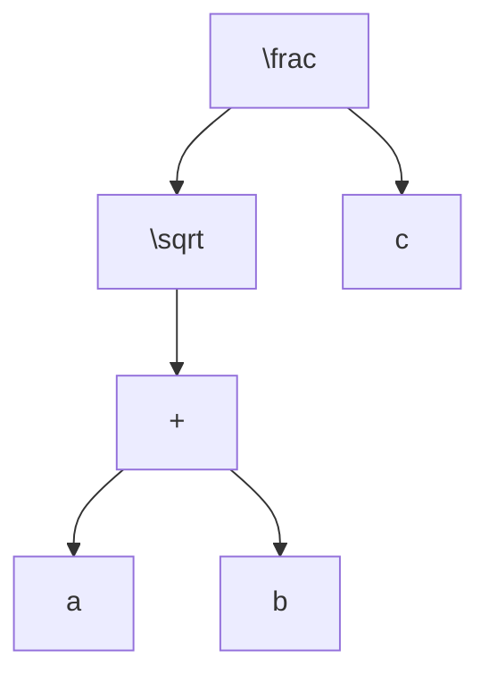
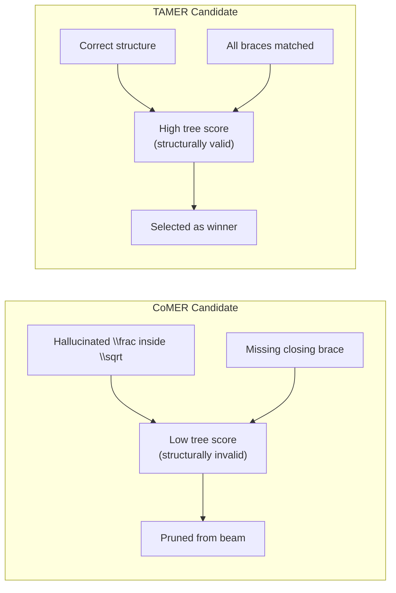
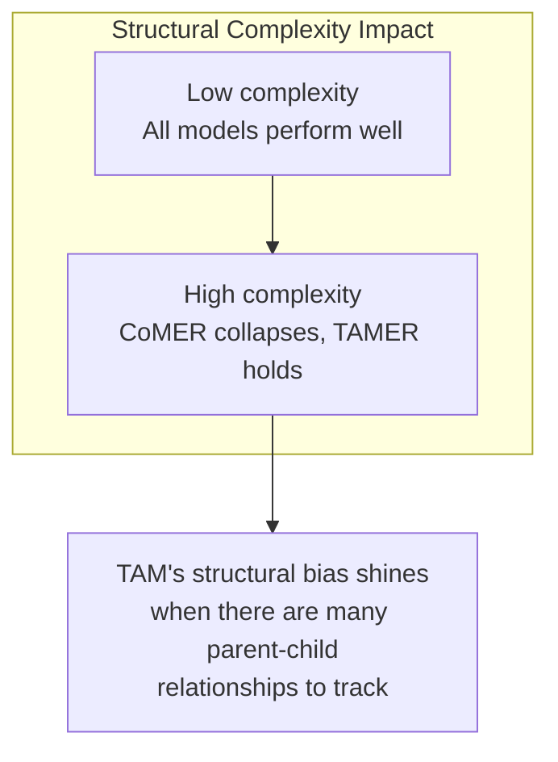

# A.3. Case Studies

> [!info] Quick Recall
> The TAMER paper's Figure 7 presents three qualitative case studies comparing CoMER and TAMER on real CROHME expressions. In every case, CoMER produces a structurally invalid or structurally wrong output (spurious nested fractions, missing left braces, misidentified complex structures), while TAMER produces the correct $\LaTeX$. These cases demonstrate that TAMER's tree-scoring mechanism catches structural errors during beam search and prunes the offending candidates, allowing the structurally correct candidate to win.

---

##  Background Prerequisites

Before reading this note, you should be comfortable with:

1. The bracket-matching problem and long-range dependency mismatch ([[1.2. The Bracket Matching Problem and Syntactic Challenges]]).
2. The TAMER architecture ([[2.1. Structural Components of TAMER]]) and Tree-Aware Module ([[2.2. Tree-Aware Module Mechanics]]).
3. The tree-scoring inference mechanism ([[4.1. Tree Structure Prediction Scoring Mechanism]]).

---

## A.3.1. Why Case Studies Matter

Quantitative metrics like ExpRate tell you **whether** TAMER is better on average. Case studies tell you **why** — they show specific examples where TAMER succeeds and CoMER fails, making the abstract structural-bias argument concrete.

The paper's Figure 7 shows three such cases. In each case, the ground-truth $\LaTeX$ is shown alongside CoMER's prediction and TAMER's prediction, with errors highlighted in red. We walk through each case in detail below.

---

## A.3.2. Case A — Spurious Nested Fraction

### Setup

The ground-truth expression is a **single fraction** containing a **square root** in its numerator. (The exact expression is shown in Figure 7(a) of the paper; we paraphrase it here as $\frac{\sqrt{a+b}}{c}$ for illustration.)

### Ground Truth

```text
\frac { \sqrt { a + b } } { c }
```

Tree structure:



### CoMER's Output

CoMER incorrectly produces a **nested fraction inside the square root** and forgets to close the brace:

```text
\frac { \sqrt { \frac { a + b } { c }    ← (missing closing brace)
```

Two errors:

1. **Spurious nested fraction**: CoMER hallucinates a `\frac` inside the `\sqrt`, turning the square root's argument into a fraction. This is a structural error — the model has confused the outer `\frac`'s denominator with an inner fraction.
2. **Missing closing brace**: After the hallucinated inner fraction, CoMER forgets to close the brace opened by `\sqrt{`. The result is invalid $\LaTeX$ that cannot be typeset.

### TAMER's Output

TAMER correctly identifies the original structure, properly nesting the fractions and emitting valid $\LaTeX$:

```text
\frac { \sqrt { a + b } } { c }
```

### Why TAMER Wins

The tree-scoring mechanism penalizes CoMER's candidate because:

- The hallucinated nested fraction produces a structurally inconsistent tree (an extra `\frac` node that the TAM has never seen in this context).
- The missing closing brace produces an unterminated scope, which the TAM's tree prediction interprets as a low-confidence parent assignment.

When these penalties are added to the sequence score, CoMER's candidate drops below TAMER's structurally correct candidate, and beam search selects the correct one.



---

## A.3.3. Case B — Missing Left Brace

### Setup

The ground-truth expression is an **integral of a fraction** (paraphrased as $\int \frac{1}{x} \, dx$).

### Ground Truth

```text
\int { \frac { 1 } { x } } d x
```

### CoMER's Output

CoMER drops the **opening brace** after `\int`, leaving an unmatched closing `}` later:

```text
\int  \frac { 1 } { x } } d x     ← (extra closing brace, no matching opener)
```

This is a textbook **long-range dependency mismatch**: the model "knew" it should emit a `}` somewhere, but it had lost track of where the corresponding `{` was. The result is an extra `}` with no matching opener — invalid $\LaTeX$.

### TAMER's Output

TAMER correctly interprets the integral and fraction, emitting valid $\LaTeX$:

```text
\int { \frac { 1 } { x } } d x
```

### Why TAMER Wins

The tree-scoring mechanism detects the unmatched brace:

- The extra `}` produces a tree annotation that is impossible to parse (the active-set computation fails or produces an inconsistent tree).
- This propagates into a very low tree score for CoMER's candidate.

TAMER's candidate, with all braces matched, gets a high tree score and wins.

> [!tip] Tip — Brace matching is symmetric
> The bracket-matching problem is symmetric: a missing `{` is just as bad as a missing `}`. Both produce invalid $\LaTeX$, and TAMER's tree-scoring mechanism catches both equally well. The reason the paper highlights the missing-left-brace case is that it is less intuitive — most people expect the failure mode to be a missing right brace, but in practice both directions occur.

---

## A.3.4. Case C — Misidentified Complex Structure

### Setup

The ground-truth expression is a **deeply nested fraction under a square root** (e.g., something like $\sqrt{\frac{a+b}{c+d}}$ with additional nesting).

### CoMER's Output

CoMER produces an output that is "roughly right" character-by-character but completely wrong structurally:

- A **square root** where there should be a **fraction**.
- An **extra brace** where there should be **none**.
- Misaligned parent-child relationships throughout.

The exact output is shown in Figure 7(c) of the paper; the key point is that the character-level accuracy is reasonable but the structural accuracy is poor.

### TAMER's Output

TAMER successfully captures the intricate parent-child relationships and correctly represents the expression in $\LaTeX$:

```text
\sqrt { \frac { a + b } { c + d } }     (and additional correct nesting)
```

### Why TAMER Wins

Deeply nested structures are exactly where TAMER's structural inductive bias pays off the most:

- The TAM was trained on tree-coherent sequences and has learned the parent-child patterns of deeply nested fractions and square roots.
- When CoMER's candidate proposes an incorrect parent-child relationship (e.g., a square root where there should be a fraction), the TAM assigns a low confidence to that relationship.
- The accumulated low confidence across multiple tokens results in a low tree score for CoMER's candidate, and TAMER's correct candidate wins.



---

## A.3.5. Common Patterns Across the Case Studies

All three case studies demonstrate the same pattern:

1. **CoMER's mistakes are structural, not character-level.** The model knows roughly what symbols to emit (it gets most characters right) but gets the hierarchical relationships wrong. This is the long-range dependency mismatch problem in action.

2. **TAMER's tree-scoring mechanism catches these structural errors during beam search.** The TAM, trained on tree-coherent sequences, assigns low confidence to candidates with mismatched brackets or spurious operators. This low confidence propagates into a low composite score, and beam search prunes the offending candidate.

3. **The benefit is largest on deeply nested structures.** Case C (the most structurally complex) shows the most dramatic improvement. This is consistent with the quantitative results in Figure 1 / Figure 8: TAMER's advantage grows with structural complexity.

4. **The mechanism is inference-time, not training-time.** The TAMER model in these case studies is the same model — only the inference procedure (tree scoring enabled or disabled) differs. This means TAMER's case-study wins can be replicated without retraining, simply by enabling tree scoring on a trained TAMER checkpoint.

---

## A.3.6. What the Case Studies Do NOT Show

It is important to be clear about the limitations of qualitative case studies:

### They Do Not Show Average Performance

Case studies are cherry-picked examples where TAMER wins. They do not tell you how often TAMER wins versus loses. For that, you need the quantitative results in [[4.2. Experimental Evaluation and Performance Metrics]].

### They Do Not Show Failure Modes

The paper does not show cases where TAMER fails and CoMER succeeds. Such cases exist (TAMER is not perfect — its ExpRate is 61.23 %, not 100 %), but they are not in the case-study figure. When interpreting case studies, remember that they show the model's strengths, not its weaknesses.

### They Do Not Show Statistical Significance

Three case studies are not enough to establish statistical significance. The quantitative results (with 5 random seeds and standard deviations) are what establish significance. Case studies are illustrative, not probative.

---

## A.3.7. Tips, Pitfalls, and Reminders

> [!tip] Tip — Use case studies to build intuition
> Case studies are excellent for building intuition about **how** a model works. After reading the case studies, you should be able to articulate, in plain English, why TAMER wins on structurally complex expressions: "because the tree-scoring mechanism penalizes candidates with mismatched brackets and spurious operators, allowing structurally correct candidates to win beam search."

> [!warning] Pitfall — Overgeneralizing from case studies
> Do not overgeneralize from three case studies. TAMER's average improvement is +2.85 % ExpRate, not +100 %. There are many cases where TAMER and CoMER produce the same output (both correct or both wrong). Case studies show the differentiating cases, not the average case.

> [!reminder] Reminder — Errors are highlighted in red in the paper
> In the paper's Figure 7, errors (tokens that differ from the ground truth) are highlighted in red. When reading the figure, focus on the red tokens to see exactly where CoMER went wrong and where TAMER got it right.

> [!tip] Tip — Try your own case studies
> If you have access to the TAMER code, run it on a few test images and compare the outputs to CoMER's. Looking at specific examples is the best way to build intuition for the model's behavior. Pay attention to deeply nested expressions — these are where TAMER's advantage is most visible.

---

## A.3.8. Self-Check Questions

1. In Case A, what two errors does CoMER make?
2. In Case B, what specific token does CoMER drop?
3. In Case C, what kind of structure does CoMER misidentify?
4. What is the common pattern across all three case studies?
5. Why are case studies not sufficient to establish that TAMER is better than CoMER?
6. Why is the missing-left-brace case (Case B) interesting?
7. In which case does TAMER's advantage appear to be the largest?
8. Are the case studies from training-time or inference-time improvements?

---

## A.3.9. Next Note

Continue to [[A.4. Bracket Matching Across Test Sets]] for the full bracket-matching accuracy curves across all four test sets, or back to [[0. Vault Index]].

---

## References

- Zhu, J. et al. *TAMER: Tree-Aware Transformer for HMER*. AAAI 2025. arXiv:2408.08578v2. Appendix §Case Study, Figure 7.
