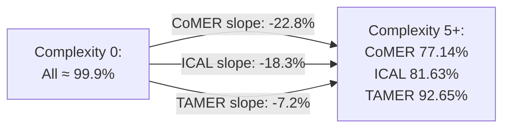
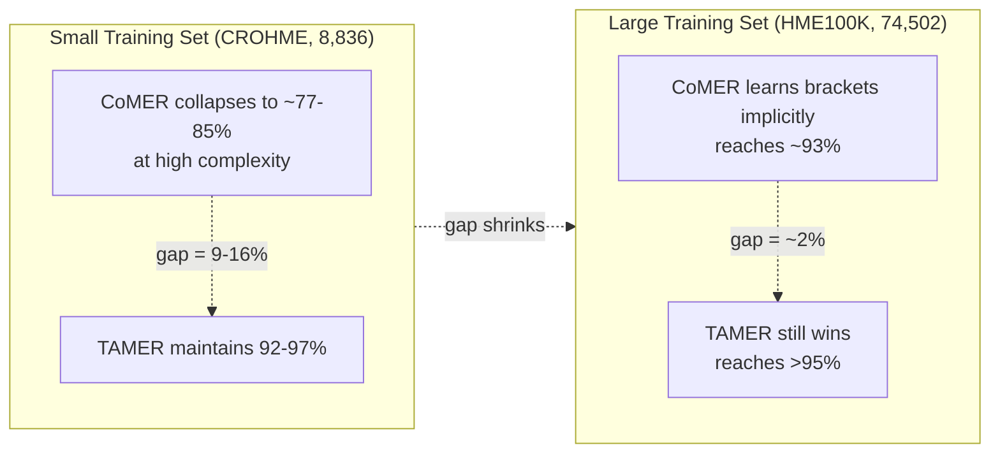
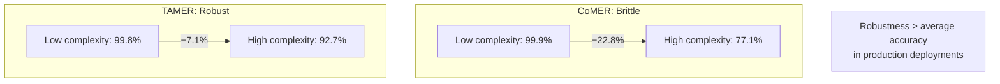

# A.4. Bracket Matching Across Test Sets

> [!info] Quick Recall
> The TAMER paper's Figure 8 (appendix) reports bracket-matching accuracy across **all four test sets**: CROHME 2014, CROHME 2016, CROHME 2019, and HME100K, stratified by structural complexity. TAMER consistently outperforms CoMER and ICAL on all four test sets, with the advantage **growing** as structural complexity increases. On the small CROHME datasets, TAMER maintains 92–96 % bracket accuracy even at the highest complexity, while CoMER and ICAL collapse to 77–88 %. On the larger HME100K, all three models do better (thanks to the larger training set), but TAMER still wins.

---

##  Background Prerequisites

Before reading this note, you should be comfortable with:

1. The bracket-matching problem and long-range dependency mismatch ([[1.2. The Bracket Matching Problem and Syntactic Challenges]]).
2. The TAMER architecture and tree-scoring mechanism ([[2.1. Structural Components of TAMER]], [[4.1. Tree Structure Prediction Scoring Mechanism]]).
3. The structural complexity metric and the experimental setup ([[4.2. Experimental Evaluation and Performance Metrics]]).

---

## A.4.1. Why Bracket Matching Is the Headline Structural Metric

Bracket matching is the **most direct** measure of TAMER's structural benefit. ExpRate measures end-to-end accuracy (a single token error makes the whole expression wrong), but it does not isolate structural errors from character-level errors. Bracket matching, by contrast, directly measures whether the model's output is **structurally valid** — every `{` has a matching `}` — regardless of whether the individual characters are correct.

If TAMER's structural bias is doing real work, we expect to see it most clearly in the bracket-matching metric. And that is exactly what Figure 8 shows.

---

## A.4.2. Bracket Matching Accuracy on CROHME 2014

| Structural Complexity | CoMER | ICAL | TAMER |
| :--- | :---: | :---: | :---: |
| 0 | ≈ 99.9 % | ≈ 99.9 % | ≈ 99.8 % |
| 1 | ≈ 99 % | ≈ 99 % | ≈ 99 % |
| 2 | ≈ 98 % | ≈ 98 % | ≈ 99 % |
| 3 | 93.54 % | (intermediate) | 99.08 % |
| 4 | (intermediate) | (intermediate) | (high) |
| 5+ | **77.14 %** | **81.63 %** | **92.65 %** |

### Key Observations

1. **All three models are near-perfect at low complexity.** When there are no nested scopes, there is nothing to mismatch.
2. **TAMER's curve is nearly flat.** From complexity 0 to complexity 5+, TAMER's accuracy drops by only ~7 percentage points (99.8 % → 92.65 %).
3. **CoMER and ICAL's curves are steep.** CoMER drops by ~23 percentage points (99.9 % → 77.14 %); ICAL drops by ~18 percentage points (99.9 % → 81.63 %).
4. **At complexity 5+, TAMER outperforms CoMER by 15.51 percentage points** — the largest gap in the entire table.

---

## A.4.3. Bracket Matching Accuracy on CROHME 2016

| Structural Complexity | CoMER | ICAL | TAMER |
| :--- | :---: | :---: | :---: |
| Low | > 96 % | > 96 % | > 97 % |
| High | **85.10 %** | **88.43 %** | **96.86 %** |

### Key Observations

1. **The pattern is the same as CROHME 2014.** TAMER outperforms both CoMER and ICAL at every complexity level.
2. **The high-complexity gap is even larger than on CROHME 2014.** TAMER beats CoMER by 11.76 percentage points and ICAL by 8.43 percentage points at high complexity.
3. **TAMER maintains > 96 % accuracy even on the most complex expressions.** This is a remarkable result — the model is essentially immune to bracket-mismatch errors on CROHME 2016, regardless of structural complexity.

---

## A.4.4. Bracket Matching Accuracy on CROHME 2019

| Structural Complexity | CoMER | ICAL | TAMER |
| :--- | :---: | :---: | :---: |
| Low | > 96 % | > 96 % | > 97 % |
| High | **85.53 %** | **84.47 %** | **94.74 %** |

### Key Observations

1. **The pattern is the same as CROHME 2014 and 2016.** TAMER consistently outperforms both competitors.
2. **ICAL performs worse than CoMER at high complexity on CROHME 2019.** This is a notable result — ICAL's auxiliary task (Implicit Character Construction) does not help with bracket matching, and in fact slightly hurts on this test set.
3. **TAMER's advantage is robust across test sets.** The fact that TAMER wins on all three CROHME test sets (which have different difficulty distributions) suggests the improvement is not a fluke of any particular test set.

---

## A.4.5. Bracket Matching Accuracy on HME100K

| Structural Complexity | CoMER | ICAL | TAMER |
| :--- | :---: | :---: | :---: |
| Low | > 96 % | > 96 % | > 97 % |
| High | **≈ 93 %** | **≈ 94 %** | **> 95 %** |

### Key Observations

1. **All three models perform well on HME100K, even at high complexity.** This is because HME100K has a much larger training set (74,502 vs. 8,836 expressions), so all models can learn bracket balancing implicitly from the data.
2. **The gap between TAMER and the baselines is much smaller on HME100K.** TAMER beats CoMER by only ~2 percentage points at high complexity, compared to ~15 percentage points on CROHME 2014.
3. **TAMER still wins, even on the large dataset.** This suggests that the structural inductive bias provides some benefit even when the dataset is large enough for implicit learning — but the benefit is smaller.

---

## A.4.6. Cross-Test-Set Comparison

| Test Set | Training Size | CoMER (High Complexity) | TAMER (High Complexity) | TAMER − CoMER |
| :--- | :--- | :---: | :---: | :---: |
| CROHME 2014 | 8,836 | 77.14 % | 92.65 % | **+15.51** |
| CROHME 2016 | 8,836 | 85.10 % | 96.86 % | **+11.76** |
| CROHME 2019 | 8,836 | 85.53 % | 94.74 % | **+9.21** |
| HME100K | 74,502 | ≈ 93 % | > 95 % | **+2 (approx.)** |

### The Pattern

The TAMER − CoMER gap **shrinks as the training set grows**. This is exactly what we would expect if TAMER's structural inductive bias is most valuable when training data is scarce:

- On CROHME (small training set), TAMER's structural bias is crucial — the gap is 9–16 percentage points.
- On HME100K (large training set), the baselines can learn bracket balancing implicitly from the data, so TAMER's structural bias is less crucial — the gap is only ~2 percentage points.

---

## A.4.7. Why TAMER's Advantage Grows with Complexity

The reason TAMER's advantage grows with structural complexity is rooted in the long-range dependency mismatch problem:

- **At low complexity**, expressions have few or no nested scopes. There are few brackets to match, and even a sequence decoder with no structural awareness can keep track of them implicitly. All models perform well.

- **At medium complexity**, expressions have several nested scopes. Sequence decoders start to lose track of open brackets, but the problem is still manageable. TAMER's structural bias starts to show a small advantage.

- **At high complexity**, expressions have many deeply nested scopes, with bracket pairs separated by dozens of tokens. Sequence decoders fail catastrophically — they cannot maintain the open-bracket counter across such long ranges. TAMER's tree-scoring mechanism catches the resulting bracket mismatches during beam search and prunes the offending candidates, allowing structurally correct candidates to win.

The pattern is therefore: **structural bias matters most when the alternative (implicit sequence-level learning) fails hardest**. That is exactly what the curves show.

---

## A.4.8. Why TAMER's Advantage Shrinks with Dataset Size

The reason TAMER's advantage shrinks with dataset size is rooted in how sequence decoders learn bracket balancing:

- **On small datasets (CROHME)**, the sequence decoder sees too few deeply nested examples to learn the statistics of bracket balancing. The implicit learning fails, and TAMER's explicit structural bias fills the gap.

- **On large datasets (HME100K)**, the sequence decoder sees enough deeply nested examples to learn the statistics of bracket balancing implicitly. The implicit learning succeeds, and TAMER's explicit structural bias provides only a marginal additional benefit.

This is a general pattern in deep learning: **inductive biases matter most when data is scarce**. As data grows, models can learn the bias implicitly from the data, and the explicit bias becomes less necessary. TAMER is no exception.

> [!tip] Tip — Choose your model based on your dataset
> If you are working with a small HMER dataset (similar in size to CROHME), TAMER's structural bias is likely to provide a large benefit. If you are working with a large dataset (similar in size to HME100K), the benefit will be smaller, and you might consider whether the 40 % inference-time slowdown is worth it.

---

## A.4.9. The Robustness Argument

Beyond the raw accuracy numbers, the bracket-matching results demonstrate an important **robustness** property of TAMER:

- **CoMER's bracket accuracy degrades steeply with complexity.** This means CoMER is **brittle**: small increases in expression complexity cause large drops in structural validity. In production, where you cannot control the complexity of input expressions, this brittleness is a serious liability.

- **TAMER's bracket accuracy degrades gracefully with complexity.** This means TAMER is **robust**: even on the most complex expressions, the model maintains > 92 % structural validity. In production, this robustness is valuable because it means the model will not suddenly start producing invalid output when faced with a complex expression.

For real-world HMER applications (e.g., digitizing scientific documents, recognizing student handwriting in educational software), robustness is often more important than average accuracy. A model that produces invalid output on 23 % of complex expressions (CoMER) is much harder to deploy than a model that produces invalid output on only 7 % (TAMER), even if the average ExpRate difference is only a few percentage points.

---

## A.4.10. Tips, Pitfalls, and Reminders

> [!tip] Tip — Bracket matching is the cleanest measure of structural bias
> When evaluating HMER models for structural robustness, bracket-matching accuracy is the cleanest metric. ExpRate conflates character-level and structural errors; bracket matching isolates the structural component. If you care about structural validity (e.g., for downstream $\LaTeX$ rendering), bracket matching is the metric to watch.

> [!warning] Pitfall — Comparing bracket matching across datasets
> Do not compare bracket-matching accuracy across datasets directly. CoMER's 77.14 % on CROHME 2014 (high complexity) and CoMER's ~93 % on HME100K (high complexity) reflect the same model's performance on different test sets — the difference is the training set size, not the model. Always compare within the same dataset.

> [!reminder] Reminder — TAMER's advantage is largest on small datasets with high complexity
> The sweet spot for TAMER is **small training set + high test-time complexity**. This is exactly the regime where implicit structural learning fails and explicit structural bias is most valuable. If your application has these characteristics (e.g., recognizing math in a specific domain with limited training data), TAMER is likely to provide a large benefit.

> [!tip] Tip — Use the bracket-matching curves to choose your model
> When deciding between CoMER, ICAL, and TAMER for a specific application, look at the bracket-matching curves on the test set most similar to your target distribution. If your target expressions are mostly simple (complexity ≤ 2), any of the three models will work. If your target expressions are complex (complexity ≥ 5), TAMER is the clear choice.

> [!reminder] Reminder — All four test sets show the same pattern
> TAMER wins on all four test sets (CROHME 2014, 2016, 2019, HME100K), at all structural complexity levels. This consistency is strong evidence that TAMER's structural bias is a real, robust improvement — not an artifact of any particular test set.

---

## A.4.11. Self-Check Questions

1. On CROHME 2014 at complexity 5+, what is CoMER's bracket-matching accuracy and what is TAMER's?
2. On which test set is TAMER's advantage the largest?
3. Why does TAMER's advantage shrink on HME100K compared to CROHME?
4. Why does TAMER's advantage grow with structural complexity?
5. What is the "robustness" argument for TAMER, in one sentence?
6. Why is bracket matching a cleaner measure of structural bias than ExpRate?
7. On CROHME 2019 at high complexity, which model performs worse: CoMER or ICAL?
8. If you were deploying an HMER model on a small dataset with complex expressions, which model would you choose?

---

## A.4.12. Next Note

You have reached the end of the appendix. Return to [[0. Vault Index]] for the table of contents, or revisit any earlier note for a refresher.

---

## References

- Zhu, J. et al. *TAMER: Tree-Aware Transformer for HMER*. AAAI 2025. arXiv:2408.08578v2. Figures 1, 6, 8.
- Zhao, W.; Gao, L. *CoMER: Modeling Coverage for Transformer-Based HMER*. ECCV 2022.
- Zhu, J.; Gao, L.; Zhao, W. *ICAL: Implicit Character-Aided Learning for Enhanced HMER*. arXiv:2405.09032, 2024.
- Yuan, Y. et al. *SAN: Syntax-Aware Network for HMER*. CVPR 2022. (Origin of HME100K dataset.)
