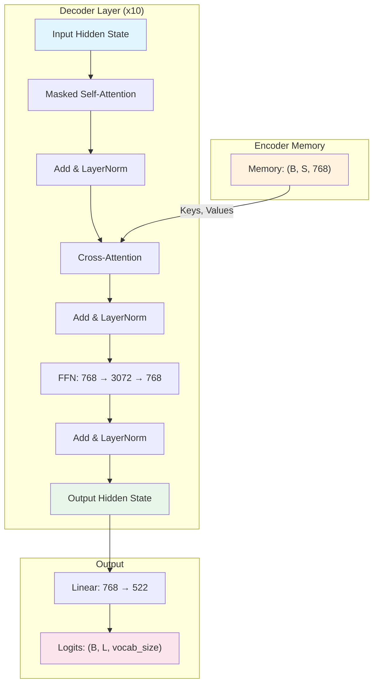
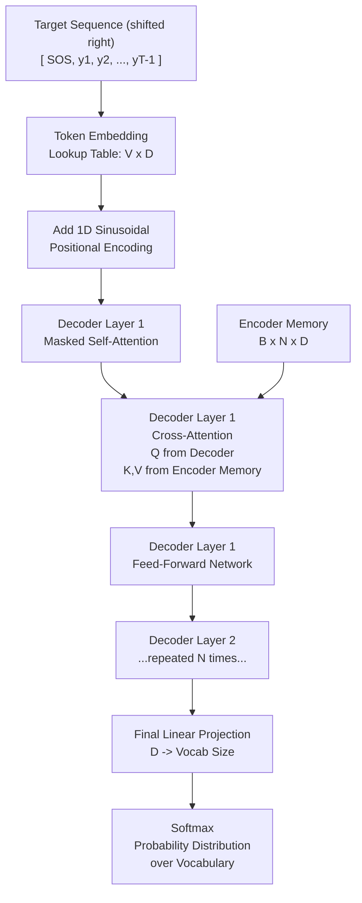

---
source_collections:
  - "TAMER 1"
  - "TAMER 2"
  - "TAMER 3"
original_paths:
  - "TAMER 2/Chapter 5 - Transformer Decoder and Sequence Generation/1. The Transformer Decoder in Detail.md"
  - "TAMER 1/Chapter 3/3.1 Transformer Decoder Fundamentals.md"
  - "TAMER 3/05_The_Decoder_Sequence_Generation/02_Section_1_Transformer_Decoder_Architecture.md"
roles_in_master:
  - "canonical"
  - "supplement"
topic: "decoder_detail"
master_chapter: "60_Transformer_Decoder_and_Sequence_Generation"
master_filename: "01_Transformer_Decoder_in_Detail.md"
n_source_files_merged: 3
merged: True
---

# 1. The Transformer Decoder in Detail

## Overview

The Transformer decoder is the generative engine of the TAMER system. While the Swin-v2 encoder is responsible for extracting rich visual features from the input image, the decoder's job is fundamentally different: it must **produce a sequence of LaTeX tokens, one at a time, conditioned on the visual representation of the image**. This is an autoregressive process — each token generated depends on all previously generated tokens and on the encoded image. The decoder bridges the gap between the visual domain (pixels and patches) and the symbolic domain (LaTeX markup), making it the most critical component for accurate formula recognition.

## The Decoder's Role in TAMER

In a standard image-to-sequence pipeline, the decoder receives two inputs:

1. **The encoder memory** — a tensor of shape `(B, S, 768)` where `B` is the batch size, `S` is the number of visual patches (spatial positions from the Swin encoder), and `768` is the feature dimension. This memory encodes everything the model "knows" about the image.
2. **The target token sequence** — during training, this is the ground-truth LaTeX sequence prefixed with an SOS (start-of-sequence) token; during inference, it is the sequence of tokens generated so far.

The decoder must learn the complex grammar and vocabulary of LaTeX, including nested structures like `\frac{...}{...}`, `\sqrt{...}`, superscripts, subscripts, and matrix environments. Each of these constructs requires the model to attend to specific regions of the image while simultaneously tracking the syntactic context established by previously emitted tokens.

## Decoder Input: SOS and the Token Sequence

Every decoding sequence begins with a special **SOS token**. This serves as the initial prompt that tells the decoder "begin generating." During training, the full input to the decoder is:

```
[SOS, token_1, token_2, ..., token_L]
```

The expected output (the prediction target) is:

```
[token_1, token_2, token_3, ..., EOS]
```

This one-position shift is the essence of autoregressive modeling: the model sees tokens up to position `t` and must predict the token at position `t+1`.

## Decoder Layer Architecture

Each of the 10 decoder layers in TAMER follows the same three-sublayer structure, with residual connections and layer normalization after each sublayer:

### Sublayer 1: Masked Self-Attention

The masked self-attention mechanism allows each position in the decoder to attend to all **previous** positions (including itself), but not to future positions. This is critical for maintaining the autoregressive property — if the model could see future tokens, it would essentially be "cheating" during training and would have no way to use that information during inference.

- **Queries, Keys, Values**: All derived from the decoder's hidden state at the current layer.
- **Causal mask**: An upper-triangular mask filled with `-inf` ensures that position `t` cannot attend to positions `t+1, t+2, ...`.
- **Output**: A contextualized representation that incorporates information from all preceding tokens.

### Sublayer 2: Cross-Attention

This is where the decoder "reads" the image. The cross-attention mechanism uses:

- **Queries** from the decoder hidden state (shape: `(B, L, 768)`)
- **Keys and Values** from the encoder memory (shape: `(B, S, 768)`)

Each decoder position computes attention weights over all `S` visual patches. This means the token being generated at position `t` can focus on the specific image regions that are most relevant for predicting the next LaTeX symbol. For example, when generating `\frac`, the model might attend to the horizontal line in the image; when generating a superscript, it might attend to a raised region.

The fact that `d_model = 768` is shared between the encoder output and the decoder means **no additional projection layer** is needed to align dimensions for cross-attention. This is a deliberate design choice that simplifies the architecture and reduces the number of learnable parameters.

### Sublayer 3: Feed-Forward Network (FFN)

After the two attention sublayers, each position passes through a position-wise feed-forward network:

```
FFN(x) = Linear_2(GELU(Linear_1(x)))
```

- `Linear_1`: projects from 768 to 3072 (a 4x expansion)
- `Linear_2`: projects from 3072 back to 768
- The GELU activation (or ReLU, depending on implementation) introduces non-linearity

The 4x expansion ratio (3072 / 768 = 4) is a standard Transformer design choice, originally from the "Attention Is All You Need" paper. This gives the FFN enough capacity to learn complex token-level transformations while keeping the residual dimension consistent at 768.

## The Output Projection

After the 10 decoder layers have processed the sequence, the final hidden state has shape `(B, L, 768)`. To convert this into a probability distribution over the vocabulary, a linear projection layer maps from 768 to the vocabulary size:

```
logits = Linear(hidden_state)  # (B, L, 768) -> (B, L, 522)
```

The `522` represents the number of tokens in the LaTeX vocabulary. These logits are then passed through a softmax function (implicitly, during cross-entropy loss computation) to produce the probability of each token at each position.

## Why 10 Layers?

The choice of 10 decoder layers balances depth with computational efficiency. Each additional layer allows the model to:

- Perform more sophisticated reasoning about LaTeX syntax
- Build deeper chains of cross-attention over the image
- Refine the hidden representations through multiple rounds of self- and cross-attention

Empirically, 10 layers provide enough capacity to model the complex, nested structure of mathematical formulas without making the model so deep that training becomes unstable or inference becomes too slow. Fewer layers (e.g., 6) might struggle with complex nested expressions; more layers (e.g., 12+) would increase training time and risk overfitting on smaller datasets.

## Multi-Head Attention: 12 Heads

With `d_model = 768` and `nhead = 12`, each attention head operates on a 64-dimensional subspace (`768 / 12 = 64`). This allows each head to specialize in different types of relationships:

- Some heads might focus on **local syntactic patterns** (e.g., matching opening and closing braces)
- Others might focus on **long-range dependencies** (e.g., connecting a `\begin{matrix}` with its `\end{matrix}`)
- In cross-attention, different heads might attend to different **spatial regions** of the image

The outputs of all 12 heads are concatenated and projected back to 768 dimensions, combining their diverse perspectives into a unified representation.

## Mermaid Diagram: Decoder Architecture



## Key Takeaways

- The decoder is a stack of 10 identical layers, each with masked self-attention, cross-attention, and FFN.
- Cross-attention is the bridge between the visual encoder and the symbolic decoder — it lets the model "look at" specific image regions while generating each token.
- The shared `d_model = 768` between encoder and decoder eliminates the need for a projection layer.
- 12 attention heads provide diverse perspectives on both the token sequence and the image.
- The output projection converts the 768-dim hidden state to a distribution over 522 LaTeX tokens.

---

## Supplementary Perspective — from TAMER 1

> **Original file:** `TAMER 1/Chapter 3/3.1 Transformer Decoder Fundamentals.md`  
> **Role in master vault:** supplement perspective from TAMER 1 — T1 supplement.  
> **Preservation policy:** full original text reproduced verbatim below; nothing omitted.

---

## 3.1 Transformer Decoder Fundamentals

The Decoder is the "voice" of the TAMER model. It takes the visual features extracted by the encoder and translates them into a sequence of LaTeX tokens.

###  The Autoregressive Process

The Decoder generates the LaTeX sequence token by token. This is an **autoregressive** process: to predict token $t$, the decoder looks at:
1.  **Image Features:** The global context from the Swin Encoder.
2.  **Previous Tokens:** All tokens generated from $0$ to $t-1$.

###  Causal Masking

To prevent the model from "cheating" during training (since we feed the whole ground truth sequence at once for efficiency), we apply a **Square Subsequent Mask**.

*   **Logic:** It is an upper-triangular matrix filled with $-\infty$. When passed through a Softmax function, $-\infty$ becomes $0$, ensuring attention only flows backward.
*   **Result:** At step $t$, the model can only "see" tokens up to step $t$.

###  Decoder Architecture

The decoder consists of multiple layers, each containing:
1.  **Self-Attention:** Allowing tokens to interact with each other (e.g., matching a `{` with a `}`).
2.  **Cross-Attention:** Allowing the decoder to "look" at specific regions of the image features.
3.  **Feed-Forward Network (FFN):** Processing the attended features into a probability distribution over the vocabulary.

 **Pro Tip:** If your model struggles with long expressions, increasing the number of decoder layers or the attention heads can help capture more complex dependencies.

---
> [!NOTE]
> **Teacher's Perspective:** Think of the Decoder like a human translator. The Encoder provides the "concepts" from the image, and the Decoder carefully chooses the "words" (LaTeX tokens) one by one, making sure the sentence (formula) flows logically.

---

## Supplementary Perspective — from TAMER 3

> **Original file:** `TAMER 3/05_The_Decoder_Sequence_Generation/02_Section_1_Transformer_Decoder_Architecture.md`  
> **Role in master vault:** supplement perspective from TAMER 3 — T3 supplement.  
> **Preservation policy:** full original text reproduced verbatim below; nothing omitted.

---

### 1. Transformer Decoder Architecture

#### The Three Attention Sub-Layers

Each Transformer Decoder layer contains three sub-layers, each followed by Layer Normalization and a residual connection.

**Sub-layer 1: Masked Self-Attention**

The decoder attends to the sequence of tokens it has already generated. The "masked" qualifier is critical: at position $t$, the attention mask prevents the decoder from attending to positions $t+1, t+2, \ldots, T$.

The mask is a matrix $M \in \mathbb{R}^{T \times T}$ where:

$$M_{ij} = \begin{cases} 0 & \text{if } j \leq i \\ -\infty & \text{if } j > i \end{cases}$$

When this is added to the attention logits before softmax:

$$\text{softmax}(Q K^T / \sqrt{d_k} + M)$$

The $-\infty$ entries become 0 after softmax (since $e^{-\infty} = 0$), effectively zeroing out all future-position attention weights. The model is physically incapable of seeing future tokens.

This preserves the autoregressive property during training: even though the entire target sequence is fed at once (for parallelism), each position can only see its own past.

**Sub-layer 2: Cross-Attention**

The decoder uses the visual features from the encoder to decide what to generate next. The query comes from the decoder's own hidden state. The key and value come from the encoder's output.

$$\text{CrossAttention}(Q_{dec}, K_{enc}, V_{enc}) = \text{softmax}\left(\frac{Q_{dec} K_{enc}^T}{\sqrt{d_k}}\right) V_{enc}$$

Interpretation: The decoder's current "thought" (query) is compared against every spatial location in the encoder's feature map (keys). High similarity means "pay attention to this image region when deciding what token to write next." The output is a weighted blend of the encoder's visual content (values), weighted by this attention.

This is exactly how a human reads math: you move your eyes to the part of the formula you are currently trying to transcribe.

**Sub-layer 3: Feed-Forward Network**

A position-wise fully connected network applied independently to each position:

$$FFN(x) = \text{ReLU}(xW_1 + b_1)W_2 + b_2$$

With dimensions: $D \to D_{ff} \to D$, where $D_{ff} = 4D$ typically (e.g., 768 → 3072 → 768).

This sub-layer provides non-linear transformation capacity. The attention mechanism is linear (weighted sum). Without the FFN, the decoder would be limited to linear recombinations of features.

---

#### Full Decoder Data Flow



---
