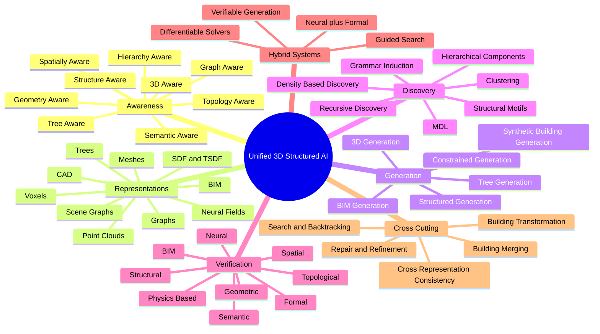
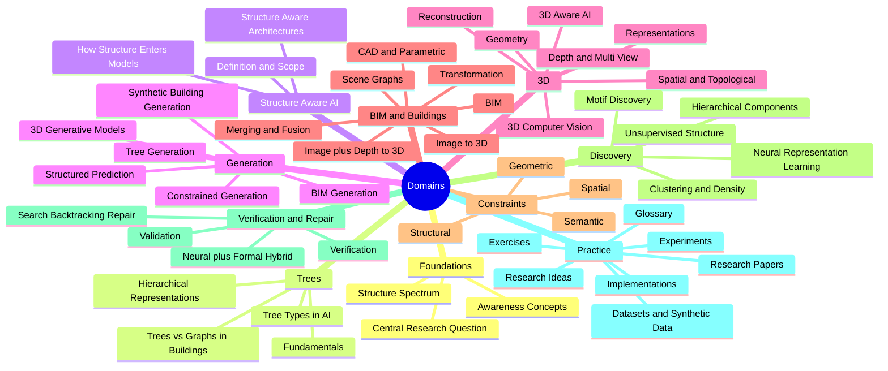

# 00. Master MOC — Unified 3D Structured AI Vault

> **Central research question**
>
> How can AI discover, understand, generate, transform, merge, and verify hierarchical, tree-aware, structure-aware, and 3D-aware representations of buildings and environments while maintaining geometric, spatial, topological, semantic, and structural consistency?

This vault treats the following domains as one interconnected research system rather than three separate subjects:

- Tree-Aware AI
- Structure-Aware AI
- 3D-Aware AI
- BIM and Building / Environment Representation
- 3D Generation, Image / Depth-to-3D, Synthetic Generation, Structural Generation
- Clustering and Unsupervised Structure Discovery
- Validation, Verification, Search, Repair, Refinement
- Neural + Formal Hybrid Systems

The deep conceptual thread running through every note is:

> **From raw observations to meaningful structured representations, then to discovered recurring structure, then to generated, transformed, and merged structures, all while keeping geometry, hierarchy, topology, semantics, spatial relationships, and BIM information synchronized.**

---

## How to Read This Vault

Read in this approximate order if you are new to the material:

1. [[01. Foundations MOC|Foundations]] — what "aware" means and the structure spectrum
2. [[02. Tree and Structure MOC|Trees and Hierarchies]] — the spine of every later concept
3. [[03. 3D AI MOC|3D-Aware AI]] — geometry, representations, vision
4. [[04. BIM MOC|BIM]] — the canonical structured 3D representation
5. [[05. Generation MOC|Generation]] — structured, tree, BIM, and synthetic generation
6. [[06. Clustering and Discovery MOC|Clustering and Discovery]] — discovering components, motifs, hierarchies
7. [[07. Verification MOC|Verification]] — validation, verification, repair
8. [[08. Research Papers MOC|Research Papers]] — paper analysis template and notes
9. [[09. Implementation MOC|Implementations]] — practical notes
10. [[10. Research Ideas MOC|Research Ideas]] — open problems and roadmap
11. [[Exercises MOC|Exercises]] — fully worked exercises

---

## Mental Map

---

## Domain Map

---

## Reading Paths

### Path A — Foundations First

[[What Is Structure Aware AI]] → [[What Is Tree Aware AI]] → [[What Is 3D Aware AI]] → [[Learning vs Representing vs Using vs Constraining Structure]] → [[Tree Terminology]] → [[Why Buildings Are Not Purely Trees]]

### Path B — Builder's Path

[[BIM Fundamentals]] → [[IFC]] → [[Building Hierarchy]] → [[Scene Graph Fundamentals]] → [[BIM Generation]] → [[BIM Validation]] → [[BIM Merging]]

### Path C — Generation Path

[[Structured Prediction]] → [[Tree Generation]] → [[Constrained Decoding]] → [[3D Generative Models]] → [[BIM Generation]] → [[Generate Validate Repair]]

### Path D — Discovery Path

[[Frequency vs Meaning]] → [[Structural Motif Discovery]] → [[Recursive Component Discovery]] → [[Grammar Induction]] → [[MDL]]

### Path E — Verification Path

[[Geometric Validation]] → [[Topological Validation]] → [[Structural Validation]] → [[BIM Validation]] → [[Formal Verification]] → [[Neural Verification]] → [[Verifiable Generation]]

---

## Tags

- #foundations #awareness #structure
- #trees #hierarchy #graph
- #3d #geometry #depth #reconstruction
- #bim #cad #scene-graph
- #generation #structured-generation #tree-generation #constrained-generation
- #discovery #clustering #motifs #mdl #grammar-induction
- #validation #verification #repair #search #backtracking
- #neural-formal-hybrid #hybrid-systems
- #consistency #merging #transformation
- #papers #implementations #experiments #research-ideas #glossary #exercises
