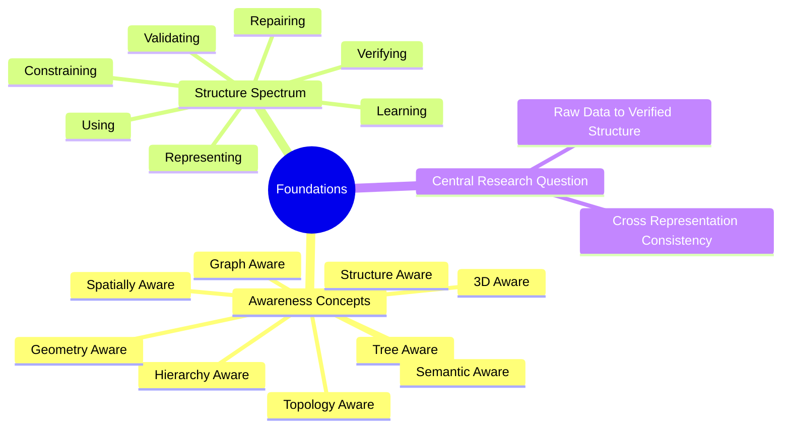

# 01. Foundations MOC

Foundations explain what "aware" means and the spectrum between learning a structure and verifying it. Every later domain refers back to these notes.

## Concept Map

## Notes

### Awareness Concepts

- [[What Is Structure Aware AI]]
- [[What Is Tree Aware AI]]
- [[What Is 3D Aware AI]]
- [[What Is Hierarchy Aware AI]]
- [[What Is Graph Aware AI]]
- [[What Is Spatially Aware AI]]
- [[What Is Geometry Aware AI]]
- [[What Is Semantic Aware AI]]
- [[What Is Topology Aware AI]]
- [[The Awareness Spectrum]]

### Structure Spectrum

- [[Learning vs Representing vs Using vs Constraining Structure]]
- [[Validating vs Verifying vs Repairing Structure]]
- [[Hard Guarantees vs Statistical Preferences]]
- [[Explicit Structure vs Implicit Structure]]

### Central Research Question

- [[Central Research Question]]
- [[Raw Data to Verified Structure Pipeline]]
- [[Cross Representation Consistency]]

## Prerequisites

None. This is the entry point.

## Related

- [[02. Tree and Structure MOC]]
- [[03. 3D AI MOC]]
- [[04. BIM MOC]]
