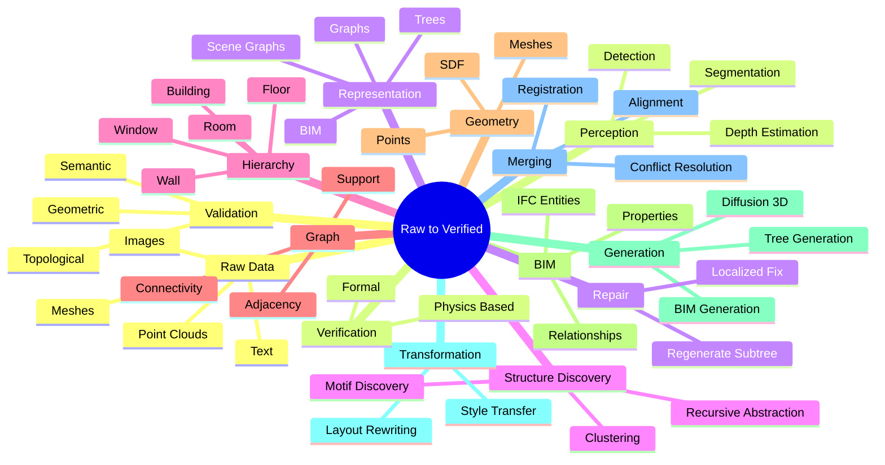

# Central Research Question

> How can AI discover, understand, generate, transform, merge, and verify hierarchical, tree-aware, structure-aware, and 3D-aware representations of buildings and environments while maintaining geometric, spatial, topological, semantic, and structural consistency?

This single question organizes the entire vault. Every note contributes to some part of it.

## Decomposition

The question has six verbs:

1. **Discover** — find recurring structure in data without manual labels. See [[06. Clustering and Discovery MOC]].
2. **Understand** — parse, encode, and reason about structure in inputs. See [[03. Structure-Aware AI]].
3. **Generate** — produce new structures (trees, graphs, BIM, scenes). See [[05. Generation MOC]].
4. **Transform** — edit existing structures while preserving invariants. See [[25. Building Transformation]].
5. **Merge** — fuse multiple representations of the same building. See [[26. Building Merging and Fusion]].
6. **Verify** — certify that outputs satisfy desired properties. See [[07. Verification MOC]].

And five consistency dimensions:

- **Geometric** — distances, angles, sizes are correct.
- **Spatial** — objects are placed where they should be.
- **Topological** — adjacency, connectivity, containment are correct.
- **Semantic** — types, attributes, roles are correct.
- **Structural** — load paths, support, stability are correct.

## The Pipeline

## Why All Six Verbs?

A system that only *generates* without *verifying* will produce plausible-but-wrong buildings. A system that only *verifies* cannot *repair*. A system that only *discovers* cannot *generate* new examples. A system that only *transforms* cannot *merge* multiple sources. A complete research programme needs all six.

## Why All Five Consistency Dimensions?

A building can be:

- geometrically valid but topologically wrong (a bedroom only reachable through a bathroom),
- topologically valid but semantically wrong (a "door" floating in mid-air),
- semantically valid but structurally wrong (a "load-bearing wall" made of paper),
- structurally valid but spatially wrong (rooms overlapping),
- spatially valid but geometrically wrong (walls not vertical, floors not horizontal).

Each dimension catches errors the others miss.

## Related Concepts

- [[Raw Data to Verified Structure Pipeline]]
- [[Cross Representation Consistency]]
- [[The Awareness Spectrum]]
- [[00. Master MOC]]
