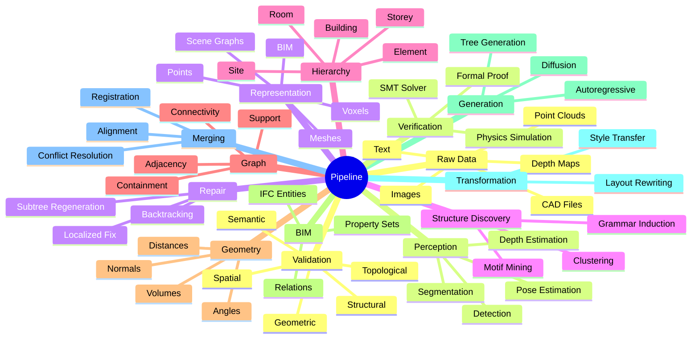

# Raw Data to Verified Structure Pipeline

Each stage consumes the output of the previous and adds new structure. Failures cascade: a bad segmentation produces a bad scene graph, which produces a bad BIM, which fails validation.

## Key Insight

The pipeline is **not** linear. Validation can feed back to perception (re-segment), to discovery (re-cluster), to generation (regenerate), or to repair (rewrite subtree). The strongest systems close this loop.

See [[Generate Validate Repair]], [[Cross Representation Consistency]].

## Related Concepts

- [[Central Research Question]]
- [[Cross Representation Consistency]]
- [[Generate Validate Repair]]
