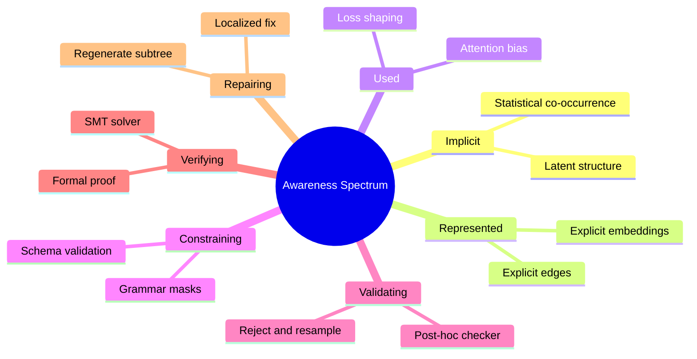

# The Awareness Spectrum

Every "X-aware" claim in a paper sits somewhere on a spectrum from *implicit statistical preference* to *formal guarantee*. This note enumerates the spectrum so you can locate any paper on it.

## The Spectrum

## Reading the Spectrum

1. **Implicit** — the model has no explicit structure; structure is *implicitly* present in the data distribution (e.g. a language model that has *learned* that `{` is usually followed by `}`).
2. **Represented** — structure is explicit in the model's inputs/outputs (embeddings, edges, masks) but does not directly constrain generation.
3. **Used** — structure influences attention, loss, or scoring, but invalid structures are still possible.
4. **Constraining** — structure actively restricts the output space (grammar mask, schema check).
5. **Validating** — an external checker tests the output and rejects invalid samples.
6. **Verifying** — a formal prover or solver certifies that the output satisfies a property.
7. **Repairing** — invalid parts are localized and rewritten, then re-verified.

## How to Locate a Paper

For any paper claiming X-awareness, ask:

- Is the structure **given** (parser, schema) or **learned** (predicted)?
- Is it **represented** explicitly (edges, masks) or **implicit** in embeddings?
- Is it **used** (loss, attention) or **constraining** (mask)?
- Is there a **validator**? A **verifier**? A **repair loop**?
- What is **guaranteed**? What is merely **probable**?

Record the answer in the paper note using the [[Paper Analysis Template]].

## Related Concepts

- [[Learning vs Representing vs Using vs Constraining Structure]]
- [[Validating vs Verifying vs Repairing Structure]]
- [[Hard Guarantees vs Statistical Preferences]]
- [[Explicit Structure vs Implicit Structure]]
