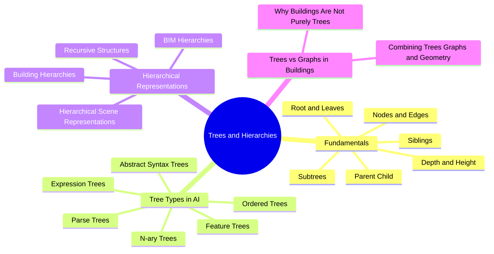

# 02. Tree and Structure MOC

Trees are the central data structure of this entire vault. They appear as parse trees in LaTeX, ASTs in code, feature trees in CAD, and spatial containments in BIM. Almost every later concept (tree generation, tree-aware decoding, tree validation, tree repair, tree clustering, motif discovery, MDL) is built on the fundamentals collected here.

## Concept Map

## Notes

- [[Tree Terminology]]
- [[Ordered Trees]]
- [[N-ary Trees]]
- [[Parse Trees]]
- [[Abstract Syntax Trees]]
- [[Expression Trees]]
- [[Feature Trees]]
- [[Hierarchical Scene Representations]]
- [[Building Hierarchies]]
- [[BIM Hierarchies]]
- [[Recursive Structures]]
- [[Why Buildings Are Not Purely Trees]]
- [[Combining Trees Graphs and Geometry]]

## Related

- [[05. Tree Generation]]
- [[03. Structure-Aware AI]]
- [[04. BIM MOC]]
