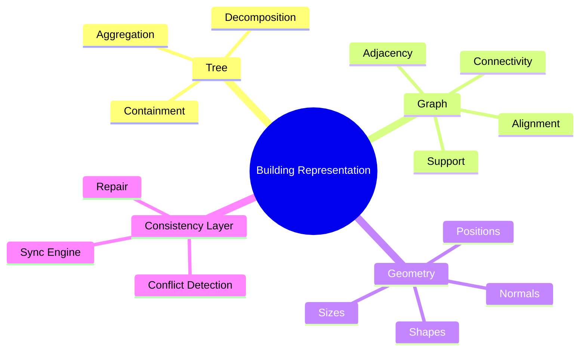

# Combining Trees, Graphs, and Geometry

> A useful building representation needs **a tree** (containment), **a graph** (adjacency, connectivity, support), and **geometry** (positions, sizes, shapes), all kept consistent.

## The Three-Representation Stack



## Roles

| Representation | Captures                                  | Used for                                  |
| -------------- | ----------------------------------------- | ----------------------------------------- |
| Tree           | Containment (parent-child spatial).       | Hierarchy, aggregation, editing.          |
| Graph          | Adjacency, connectivity, support, etc.    | Reasoning about relations, validation.    |
| Geometry       | Metric positions, sizes, shapes.          | Rendering, measurement, geometric checks. |

## How They Stay Consistent

1. **Containment check**: a wall's geometry must lie inside its parent space's geometry.
2. **Adjacency check**: if the graph says room A is adjacent to room B, their geometries must share a boundary.
3. **Support check**: if the graph says column C supports beam B, the top of C must touch the bottom of B geometrically.
4. **Door check**: a door's geometry must lie inside a wall's geometry, and the door's graph edge must connect two spaces.

If any check fails, the representations are **inconsistent**. See [[Cross Representation Consistency]].

## Architectural Pattern

A common pattern in BIM-aware AI:

```
Encoder:
  - Geometry encoder → geometry features
  - Tree encoder (RecNN or Tree Transformer) → tree features
  - Graph encoder (GNN) → relation features
  - Cross-attention fuses them

Decoder:
  - Tree decoder predicts hierarchy
  - Graph decoder predicts relations
  - Geometry decoder predicts shapes
  - Joint loss
```

See [[Structure-Aware Architectures]], [[Neural + Formal Hybrid Systems]].

## Related Concepts

- [[Why Buildings Are Not Purely Trees]]
- [[Cross Representation Consistency]]
- [[Scene Graph Fundamentals]]
- [[Building Hierarchies]]
- [[BIM Hierarchies]]
