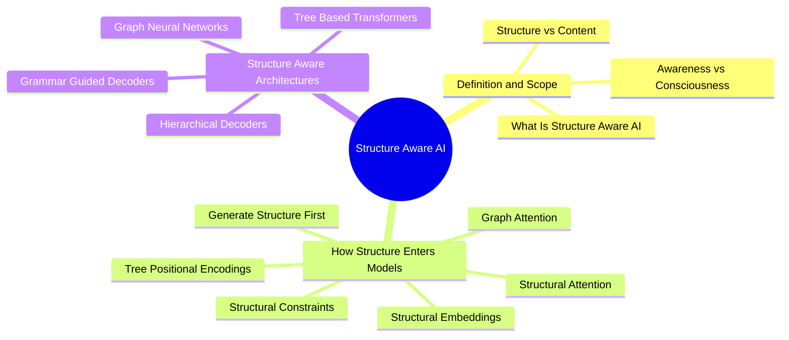

# 03. Structure-Aware AI MOC

"Structure-aware" is a design principle, not a single technique. These notes decompose what it means, how structural information enters a model, and which architectural families realize it.

## Concept Map

## Notes

- [[What Is Structure Aware AI]]
- [[Structure vs Content]]
- [[Awareness vs Consciousness]]
- [[Structural Embeddings]]
- [[Structural Attention]]
- [[Structural Constraints]]
- [[Generate Structure First]]
- [[Tree Positional Encodings]]
- [[Graph Attention]]
- [[Tree Based Transformers]]
- [[Graph Neural Networks]]
- [[Hierarchical Decoders]]
- [[Grammar Guided Decoders]]

## Related

- [[01. Foundations MOC]]
- [[04. Structured Prediction and Generation]]
- [[05. Tree Generation]]
