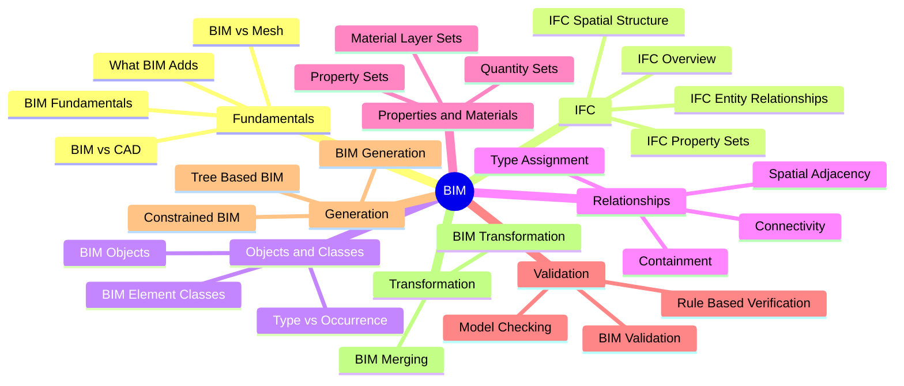

# 04. BIM MOC

BIM is treated here as a major structured-3D representation domain rather than just a file format. It is the canonical example of a representation that simultaneously encodes geometry, semantics, properties, relationships, hierarchy, spatial containment, and domain information.

## Concept Map

## Notes

- [[BIM Fundamentals]]
- [[BIM vs CAD]]
- [[BIM vs Mesh]]
- [[What BIM Adds]]
- [[IFC Overview]]
- [[IFC Entity Relationships]]
- [[IFC Spatial Structure]]
- [[IFC Property Sets]]
- [[BIM Objects]]
- [[BIM Element Classes]]
- [[Type vs Occurrence]]
- [[Containment Relationships]]
- [[Spatial Adjacency]]
- [[Connectivity Relationships]]
- [[Type Assignment]]
- [[Property Sets]]
- [[Quantity Sets]]
- [[Material Layer Sets]]
- [[BIM Validation]]
- [[Model Checking]]
- [[Rule Based Verification]]
- [[BIM Generation]]
- [[Tree Based BIM]]
- [[Constrained BIM]]
- [[BIM Transformation]]
- [[BIM Merging]]

## Related

- [[17. Building and Environment Representation]]
- [[18. BIM]]
- [[24. BIM Generation]]
- [[26. Building Merging and Fusion]]
