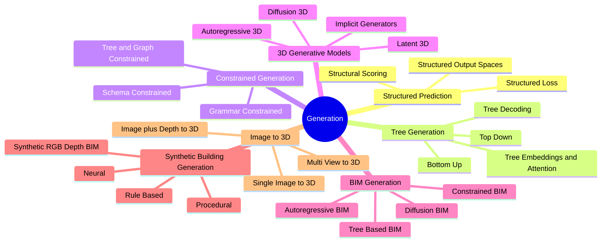

# 05. Generation MOC

Generation is the act of producing structured output. This MOC unifies structured prediction, tree generation, constrained generation, 3D generative models, BIM generation, and synthetic building generation.

## Concept Map

## Notes

See child MOCs:

- [[04. Structured Prediction and Generation MOC]]
- [[05. Tree Generation MOC]]
- [[06. Constrained Generation MOC]]
- [[16. 3D Generative Models MOC]]
- [[24. BIM Generation MOC]]
- [[23. Synthetic Building Generation MOC]]
- [[21. Image-to-3D MOC]]
- [[22. Image + Depth-to-3D MOC]]

## Related

- [[06. Constrained Generation]]
- [[07. Validation and Verification]]
- [[08. Search, Backtracking, Repair, and Refinement]]
