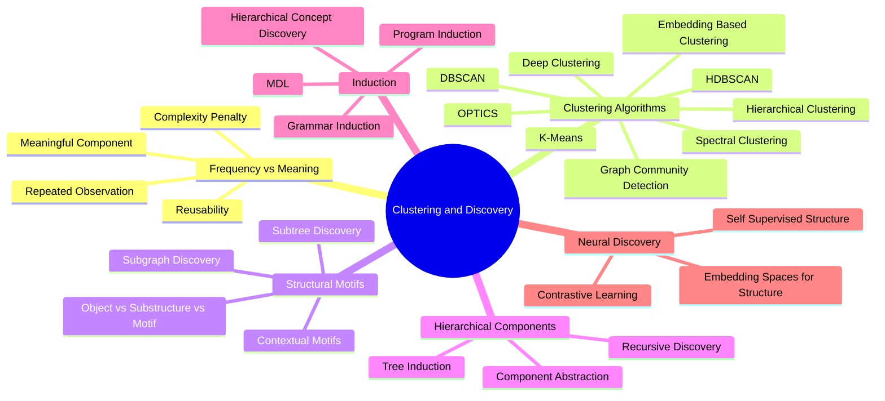

# 06. Clustering and Discovery MOC

This MOC covers unsupervised discovery of recurring structure. The core question is not "how do we cluster?" but rather **"how do we discover recurring, meaningful, reusable structural components and hierarchical motifs from unstructured data?"**

## Concept Map

## Notes

### Foundations

- [[Frequency vs Meaning]]
- [[Candidate Component Scoring]]
- [[Object vs Substructure vs Motif Clustering]]

### Classical Clustering

- [[K-Means]]
- [[DBSCAN]]
- [[HDBSCAN]]
- [[OPTICS]]
- [[Hierarchical Clustering]]
- [[Spectral Clustering]]
- [[Embedding Based Clustering]]
- [[Deep Clustering]]
- [[Graph Community Detection]]

### Structural Discovery

- [[Structural Motif Discovery]]
- [[Subtree Discovery]]
- [[Subgraph Discovery]]
- [[Contextual Motifs]]

### Recursive Discovery

- [[Recursive Component Discovery]]
- [[Component Abstraction]]
- [[Tree Induction]]

### Induction

- [[Grammar Induction]]
- [[Program Induction]]
- [[Minimum Description Length]]
- [[Hierarchical Concept Discovery]]

### Neural Discovery

- [[Contrastive Learning for Structure]]
- [[Self Supervised Structure Learning]]
- [[Embedding Spaces for Structure]]

## Related

- [[31. Unsupervised Structure Discovery]]
- [[32. Clustering and Density-Based Discovery]]
- [[33. Structural Motif Discovery]]
- [[34. Hierarchical Component Discovery]]
