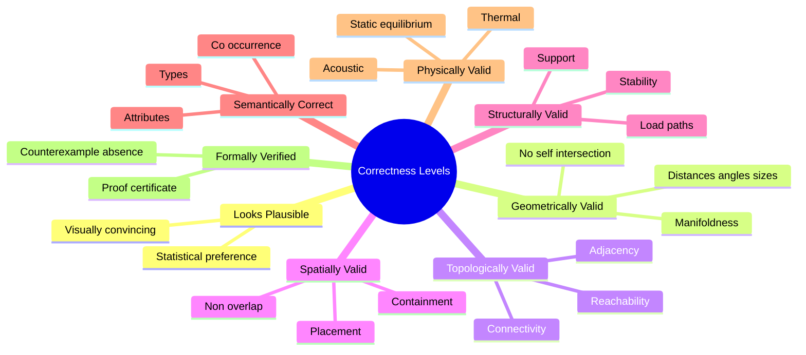

# Looks Plausible vs Is Valid

> A neural model can generate something that **looks correct** while still being **structurally or semantically wrong**.

## The Trap

A diffusion model trained on building images can produce a beautiful rendering of a building that:

- has windows floating in mid-air,
- has doors that don't connect to anything,
- has rooms with no doors,
- has walls that don't reach the floor,
- has stairs that lead nowhere.

Each of these is invisible in the rendered image but fatal in the actual building.

## Hierarchy of Correctness

Each level catches errors the previous misses.

## Implication for Generation

A generator that only optimizes "looks plausible" will produce outputs that fail every other check. A useful generator must explicitly target each level.

See [[Geometric Validation]], [[Topological Validation]], [[Structural Validation]], [[Semantic Validation]], [[Physics Based Verification]], [[Formal Verification]].

## Related Concepts

- [[Geometric Validation]]
- [[Topological Validation]]
- [[Structural Validation]]
- [[Semantic Validation]]
- [[Physics Based Verification]]
- [[Formal Verification]]
