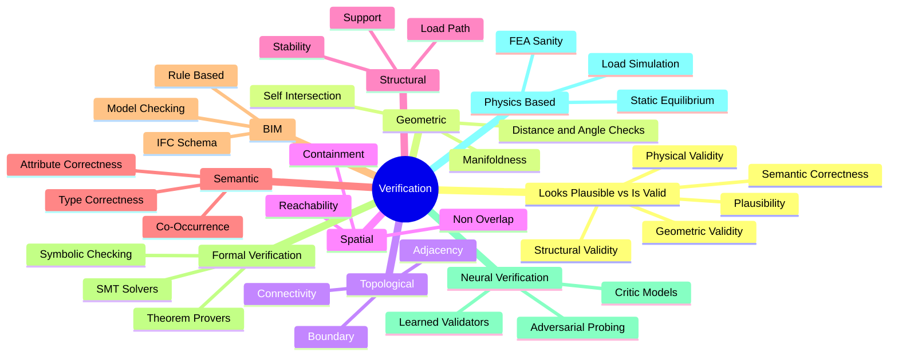

# 07. Verification MOC

The verification domain answers the question: "is the generated or discovered structure actually valid?" It separates "looks plausible" from "is correct", and covers geometric, topological, spatial, structural, semantic, BIM, formal, neural, and physics-based verification.

## Concept Map

## Notes

- [[Looks Plausible vs Is Valid]]
- [[Geometric Validation]]
- [[Topological Validation]]
- [[Spatial Validation]]
- [[Structural Validation]]
- [[Semantic Validation]]
- [[BIM Validation]]
- [[Formal Verification]]
- [[Neural Verification]]
- [[Physics Based Verification]]
- [[Hybrid Verification]]
- [[Generate Validate Repair]]
- [[Verifiable Generation]]

## Related

- [[07. Validation and Verification]]
- [[08. Search, Backtracking, Repair, and Refinement]]
- [[36. Neural + Formal Hybrid Systems]]
