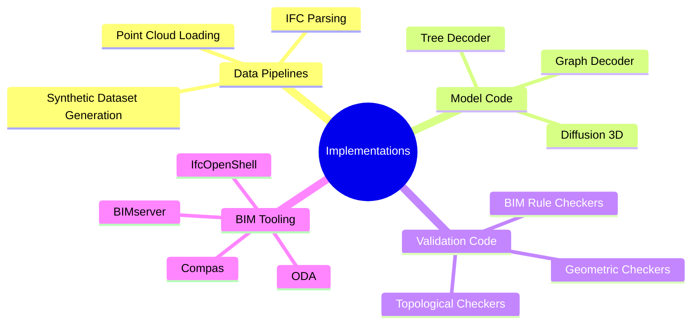

# 09. Implementation MOC

Practical notes on data pipelines, model code, validation code, and BIM tooling.

## Concept Map

## Notes

- [[IFC Parsing With IfcOpenShell]]
- [[Point Cloud Loading and Voxelization]]
- [[Synthetic Dataset Generation]]
- [[Tree Decoder Reference Implementation]]
- [[Graph Decoder Reference Implementation]]
- [[Geometric Checkers Library]]
- [[BIM Rule Checkers]]
- [[Topological Checkers]]
- [[IfcOpenShell Notes]]
- [[Compas Framework]]
