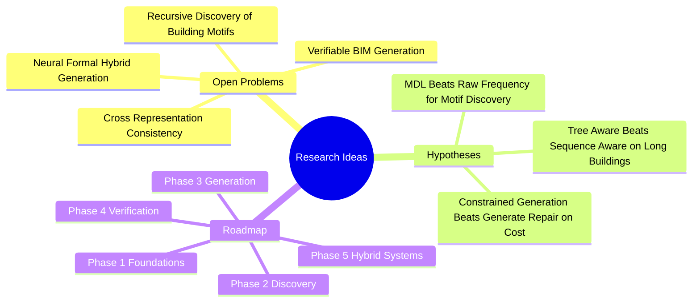

# 10. Research Ideas MOC

Open problems, hypotheses, and a long-term roadmap. These notes are speculative and meant to seed future work.

## Concept Map

## Notes

- [[Open Problem — Verifiable BIM Generation]]
- [[Open Problem — Cross Representation Consistency]]
- [[Open Problem — Recursive Discovery of Building Motifs]]
- [[Open Problem — Neural Formal Hybrid Generation]]
- [[Hypothesis — MDL Beats Raw Frequency for Motif Discovery]]
- [[Hypothesis — Tree Aware Beats Sequence Aware on Long Buildings]]
- [[Hypothesis — Constrained Generation vs Generate Repair]]
- [[Roadmap — Phased Research Plan]]
