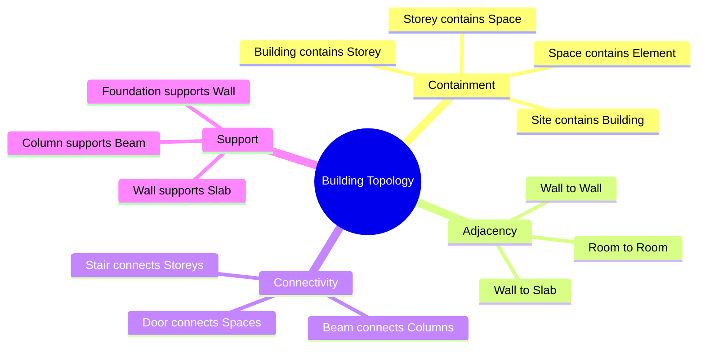

# Building Topology

> The topology of a building: connectivity, adjacency, containment, incidence — independent of metric positions.

See [[Why Buildings Are Not Purely Trees]], [[Topological Relations]], [[Adjacency and Containment]] for the canonical treatments.

## Quick Map

## Related Concepts

- [[Why Buildings Are Not Purely Trees]]
- [[Topological Relations]]
- [[Adjacency and Containment]]
- [[Topological Validation]]
