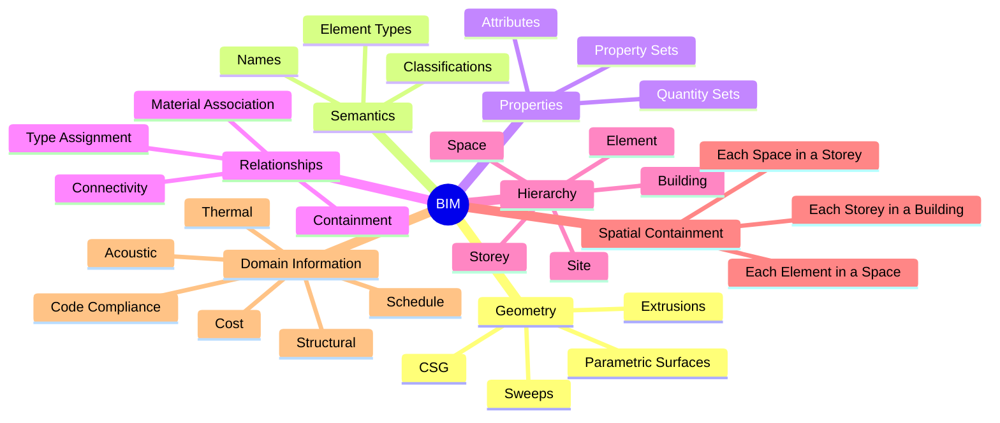

# What BIM Adds (Over Pure 3D Geometry)

> BIM = Geometry + Semantics + Properties + Relationships + Hierarchy + Spatial Containment + Domain Information.

## The Seven Pillars

## Implication for AI

A BIM-aware AI must handle all seven aspects, not just geometry. A model that only generates geometry is **not** a BIM generator.

See [[BIM Fundamentals]], [[BIM Generation]], [[BIM Validation]].

## Related Concepts

- [[BIM Fundamentals]]
- [[BIM Generation]]
- [[BIM Validation]]
