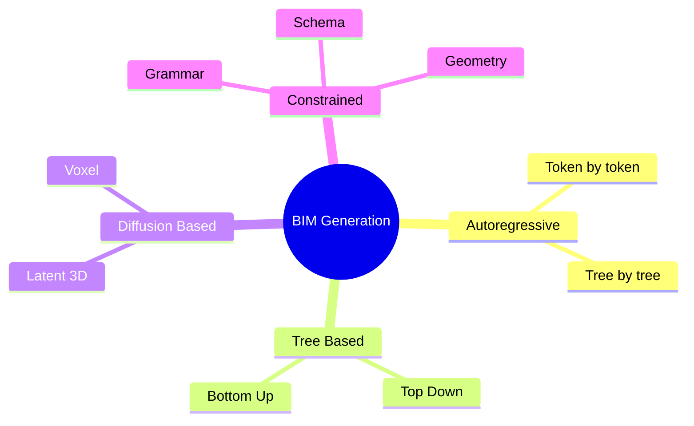

# BIM Generation Overview

See [[BIM Generation]] for the canonical note. The BIM Generation MOC lives under [[24. BIM Generation]].

## Quick Map

## Related Concepts

- [[BIM Generation]]
- [[Autoregressive BIM]]
- [[Tree Based BIM]]
- [[Diffusion BIM]]
- [[Constrained BIM]]
