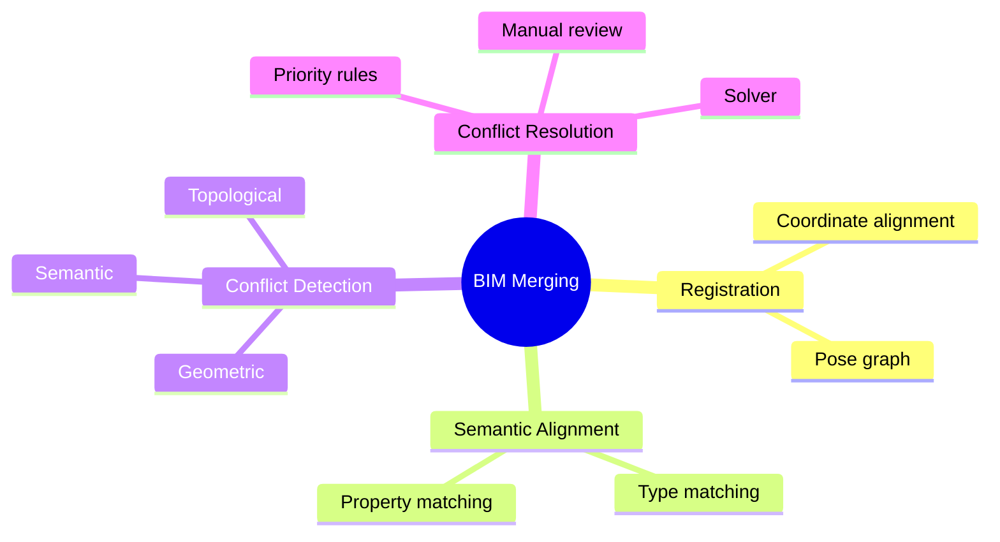

# BIM Merging Overview

See [[BIM Merging]] and [[26. Building Merging and Fusion]] for the canonical treatments.

## Quick Map

## Related Concepts

- [[BIM Merging]]
- [[26. Building Merging and Fusion]]
- [[Registration]]
- [[Conflict Detection]]
- [[Conflict Resolution]]
