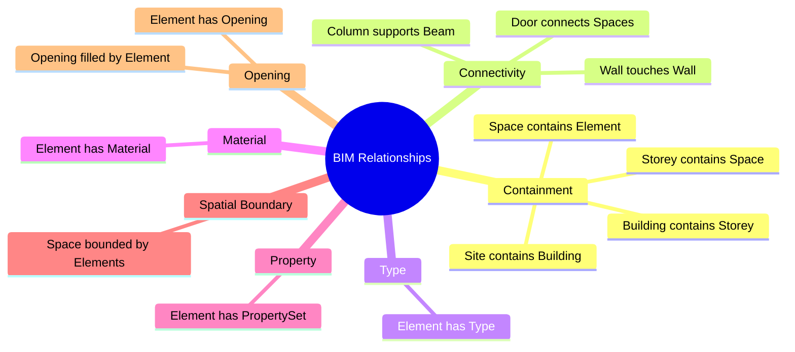

# BIM Relationships

> The graph edges of a BIM model. See [[IFC Entity Relationships]] for the full enumeration.

## Major Categories

## Why It Matters

A BIM model is a tree (containment) **plus** a graph (other relations). Tree-aware AI captures the tree; graph-aware AI captures the graph; full BIM-aware AI captures both.

See [[IFC Entity Relationships]], [[Combining Trees Graphs and Geometry]].

## Related Concepts

- [[IFC Entity Relationships]]
- [[Combining Trees Graphs and Geometry]]
- [[Containment Relationships]]
- [[Spatial Adjacency]]
