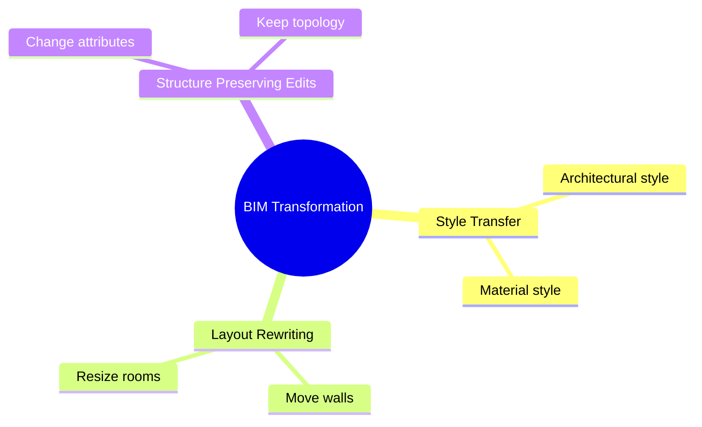

# BIM Transformation Overview

See [[25. Building Transformation]] for the dedicated folder.

## Quick Map

## Related Concepts

- [[25. Building Transformation]]
- [[Style Transfer]]
- [[Layout Rewriting]]
- [[Structure Preserving Edits]]
