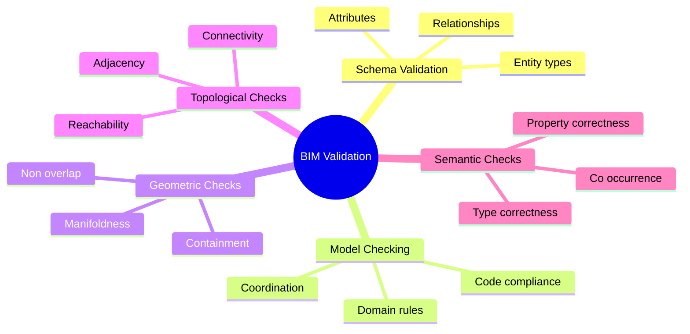

# BIM Validation Overview

See [[BIM Validation]] for the canonical note.

## Quick Map

## Related Concepts

- [[BIM Validation]]
- [[Model Checking]]
- [[Rule Based Verification]]
- [[Geometric Validation]]
- [[Topological Validation]]
